# 1 Redux 基础

## 1.1 为什么要用 Redux

JavaScript 开发的应用程序，已经变得越来越复杂了：

- 需要管理的状态更复杂；
- 服务器返回的数据、缓存中读取的数据、用户点击按钮 / 表单提交等生成的数据、UI 状态的数据。

所以，管理不断变化的 state 是非常困难的：

- 状态之间相互会存在依赖，一个变化通常会引起另一个变化；
- 我们想更好的追踪和控制 state 发生的变化：
  - 发生变化的时机、原因、结果。

然而，React 只是在视图层帮助我们解决了 DOM 的渲染过程，State 依然是我们自己来管理：

- 组件自定义 state、通过 props 在组件之间进行通信、通过在父组件存放数据进行子组件数据共享；

综上，Redux 就是一个帮助我们集中管理 state 的容器：

- Redux 是 JavaScript 的状态容器，提供了 **可预测** 的状态管理。
  - 发生变化的时机、原因、结果，都可以控制和追踪。
- Redux 体积非常小，且不仅在 React，在其他两个框架也能使用。


## 1.2 Redux 的核心理念

### 1.2.1 store 

Redux 让数据存储变得可追踪和可调试。

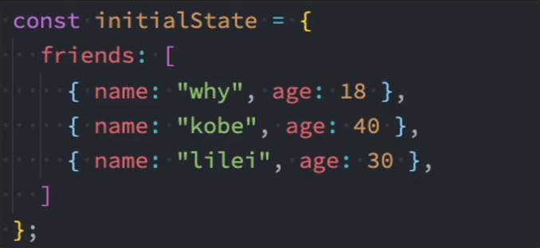

当我们对数据进行修改、删减时，Store 可保存修改时间、哪个函数进行修改的、修改前后的值是什么等等这些信息。

当整个应用程序错综复杂，出现 bug 时，可以很快跟踪到哪里发生了变化。


### 1.2.2 action

为了更好的追踪 / 预测更新记录，redux 要求我们必须通过 action 来更新数据。

- 所以数据的变化，必须通过派发（dispatch）action 来更新；
- action 是一个普通的 JavaScript 对象，用来描述这次更新的 type 和content；

比如下面就是几个更新上文 friends 的 action：

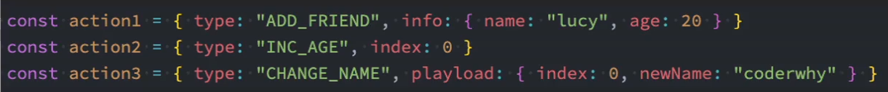

- 每个 action 是一个固定的对象。真实应用中，我们会通过函数定义（reducer），返回一个 action。
  - `type`：要操作的行为：添加、查找、修改等。
  - `info`、`index`、`playload`，操作行为需要的数据。

### 1.2.3 reducer

reducer 把 state 和 action 联系在一起。

- reducer 是一个纯函数。
- reducer 做的事情就是将传入的 state 和 action 结合起来生成一个新的 state。

`reducer(state, action)`：

- 接收原来的 state；
- 要对 state 进行的操作 action。


reducer 会：

1. 根据 action 对象中的 `type` 判断要怎么处理数据，
2. 通过 `switch` 选择对应的操作，
3. 对 state 进行操作，
4. 最后返回这个新的 state。


## 1.3 Redux 的三大原则

1. 单一数据源
   - 整个应用程序的 state 存储在一颗 object tree 中，并且这个 object tree 只存储在一个 store 中；
   - 创建多个 store 理论也可以，但是不利于数据的维护。单一数据源更方便管理 state。
2. state 是只读的
   - 修改 state 的唯一方式一通过 action。
   - 这样确保了 View 和网络请求都不能直接修改 state，只能通过 action 来描述自己想要如何修改 state；
   - 这样可以保证所以的修改都被集中化处理，都在 redux 的可监控、可管理的范围之内，并且按照严格的顺序来执行，所以不需担心 race condition（竞态）问题。

3. 使用纯函数来执行修改
   - 通过 reducer 将旧 state 和 action 联系在一起，并且返回一个新的 state；
   - 应用程序复杂度增加后，我们可以将 reducer 拆分成多个小的 reducers，分别操作不同 state tree 的一部分。
   - 所有的 reducer 都应该是纯函数，不能产生任何的副作用。


## 1.4 使用 Redux

不引入 React，在 Js 文件中使用 Redux。

基本模块：

1. 提前准备：
   - 导入 redux
   - 初始化数据
2. 定义 store
3. 定义 reducer
4. 定义actions
5. 派发 action
6. 监听变化，定义`store.subscribe()`
   - 注意位置要放在 actions 之前。


```js
//1.导入 redux（不能通过 ES6 方式导入，node 有些版本不支持 ES6）
// commonjs 一种实现 -> node.js 导入
const redux = require("redux");

//定义一个初始化数据
const initialState = {
  counter: 0,
};

//[1]reducer
// 第一次使用，state 为 undefined，会使用默认的初始值 initialState
function reducer(state = initialState, action) {
  //不要对原state进行操作，而是拷贝一份后操作，返回新state。
  switch (action.type) {
    case "INCREMENT":
      return { ...state, counter: state.counter + 1 };
    case "DECREMENT":
      return { ...state, counter: state.counter - 1 };
    case "ADD_NUMBER":
      return { ...state, counter: state.counter + action.num };
    case "SUB_NUMBER":
      return { ...state, counter: state.counter - action.num };
    default:
      return state;
  }
}

//[2]store（创建的时候需要传入一个reducer）
const store = redux.createStore(reducer); //创建一个store，用来放数据

//订阅store的修改
//只要store中的state发生变化，就会调用该函数
store.subscribe(() => {
  // 通过store.getState()获取store中存储的state
  console.log("state发生了改变,counter:", store.getState().counter);
});

//[3]acitons
//action1/2：数字加1/减1
const action1 = { type: "INCREMENT" };
const action2 = { type: "DECREMENT" };
//action3/4，数字加5/减12
const action3 = { type: "ADD_NUMBER", num: 5 };
const action4 = { type: "SUB_NUMBER", num: 12 };

//派发action, store实际会调用reducer，然后执行相应的数据操作
store.dispatch(action1);
store.dispatch(action2);
store.dispatch(action3);
store.dispatch(action4);
```


## 1.5 Redux 结构划分（node）

对上面的基础 Redux 进行结构划分：

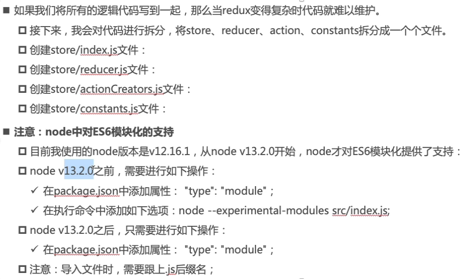


redux 的整体结构需要 4 个文件，如下：

- `store`		----------	存放 redux 结构的文件夹
  - `index.js`		----------	一共有 4 行：引入 redux、引入 reducer、创建 store、导出 store。
  - `constant.js`		----------	保存 action 操作的 **所有类型名 type**，方便查阅和修改。
  - `actionCreators.js`		----------	根据 type 定义对应的 action 函数、定义该 action 需要传递的参数。
  - `reducer.js`		----------	定义默认 state、创建 reducer。reducer 内是每个 action 的具体执行。
- `index.js`		----------	处理业务逻辑，监听数据变化，调用 `store.dispatch(someActions())`  处理数据


**Action 名称 和 type 操作类型，是一一对应关系。**

- 业务逻辑中，使用的是 Action 名称，redux 中，通过 Action 名称找到对应的 type 类型，然后执行操作。

使用 `node index.js` 就在 node 环境中使用 redux。

```js
// -------------- store 文件夹，有 4 个文件组成 redux --------------

// -------------- 1 index.js --------------
import redux from "redux";
import reducer from "./reducer.js";
const store = redux.createStore(reducer);
export default store;

// -------------- 2 constant.js --------------
export const ADD_NUMBER = "ADD_NUMBER";
export const SUB_NUMBER = "SUB_NUMBER";
export const DECREMENT = "DECREMENT";
export const INCREMENT = "INCREMENT";


// -------------- 3 actionCreators.js --------------
import { ADD_NUMBER, SUB_NUMBER, DECREMENT, INCREMENT } from "./constant.js";

export const addAction = (num) => ({
  type: ADD_NUMBER,
  num,
});

export const subAction = (num) => ({
  type: SUB_NUMBER,
  num,
});

export const deAction = () => ({
  type: DECREMENT,
});

export const inAction = () => ({
  type: INCREMENT,
});


// -------------- 4 reducer.js --------------
import { ADD_NUMBER, SUB_NUMBER, DECREMENT, INCREMENT } from "./constant.js";

const defaultState = {
  counter: 0,
};

function reducer(state = defaultState, action) {
  switch (action.type) {
    case ADD_NUMBER:
      return { ...state, counter: state.counter + action.num };
    case SUB_NUMBER:
      return { ...state, counter: state.counter - action.num };
    case DECREMENT:
      return { ...state, counter: state.counter - 1 };
    case INCREMENT:
      return { ...state, counter: state.counter + 1 };
    default:
      return state;
  }
}

export default reducer;

// -------------- index.js 使用redux--------------
import store from "./store/index.js";
import {
  addAction,
  subAction,
  inAction,
  deAction,
} from "./store/actionCreators.js";

// 监听
store.subscribe(() => {
  console.log(store.getState());
});

// 派发
store.dispatch(addAction(10));
store.dispatch(addAction(15));
store.dispatch(subAction(8));
store.dispatch(subAction(5));
store.dispatch(inAction());
store.dispatch(deAction());
```


# 2 Redux 使用（react）

## 2.1 理论

下面会将 Redux 和 React 结合。

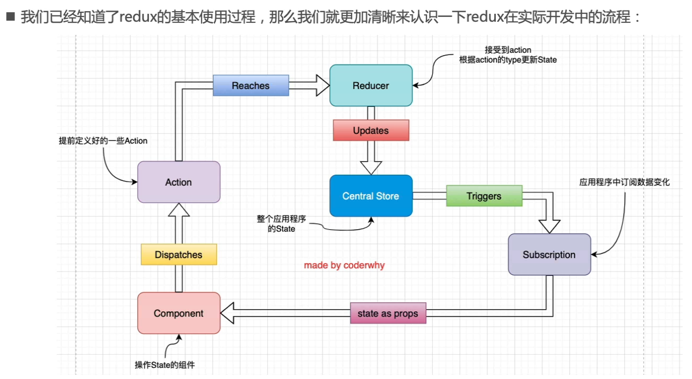

使用流程：

当我们要对某个 Component 组件的 state 进行修改时，会发生如下流程：

1. **Central Store**。
   - 从 Central Store 出发，redux 中只会定义一个 store 用来存储整个项目中的数据。

1. **Subscription**。 

   - 在这个 Component 的 `componentDidMount()` 组件加载完毕的回调中，添加 `store.subscribe()`  订阅。也就是一旦 store 中的数据发生变化，就会调用这个监听函数。

   - 当用户发生对数据修改的行为（点击按钮、输入表单等等），就会触发 `Dispatches`，Store 中的数据就会发生改变，进而我们设定的 subscribe 订阅监听就会被触发。
   - 在 Subscription 中添加 `this.setState()` ，把 store 中变化的数据，更新到这个 Component 组件中的 state 。
   - 此时 React 会更新组件的 state，并触发 `render()` 去重新渲染页面，呈现新数据。

2. **Component**。

   - 通过在组件的 `componentDidMount()` 中订阅  `this.setState()` ，就会让这个组件自身的 state 随着 store 中的 state 变化而保持最新。也就是说，store 中会保存全部需要共享的数据，组件会额外的保存一份 store 中自己需要的数据。

   - 同时在组件中的 `button` 按钮定义触发事件，一旦触发，就使用 Dispatches 派发 Action，去更新 store 中的数据。

3. **Action**。

   - Actions，是提前定义好的多种对数据的操作方法。
   - 在这里定义 Dispatch 派发时， 同时指定要执行的 action 名称以及传入对应的操作参数。

4. **Reducer**。
   - Redux 通过 Reducer 把数据修改。 
   - reducer 收到需要操作的 state 和 操作方法 action，根据 `action.type` ，对数据进行操作。最后返回一个新的 state。
   - Redux 会把这个 state 更新到自己的 store 中。
   
5. 进入一个新的循环，一旦 store 发生改变就会被订阅到，然后调用 `this.setState()` 同步更新组件的 state，最后


## 2.2 不同

第 1.5 节已经把 redux 进行了结构划分，store 文件夹中有 4 个文件，分别控制不同的模块。

与 node 环境唯一不同的是，index.js 的引入 redux 要作如下修改：

```js
// node中是:
// import redux from "redux";
// const store = redux.createStore(reducer);

import { createStore } from "redux";
import reducer from "./reducer.js";
const store = createStore(reducer);
export default store;
```


## 2.3 把相同的逻辑放到一起

比如在例子中，page 文件下的两个组件 about 和 home 中有非常多相似的代码，可以提取出来放在一个文件中。

 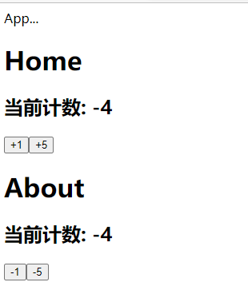

把 home 和 about 组件中，不一样的部分抽离出去，把相同的部分放到一起。

在 utils 文件中，建立一个 `connect.js` 和 `context.js` 。其中 `connect(mapStateTpProps, mapDispatchToProp)` 函数，链接着 redux  和 component，通过 props 把数据和方法传递给 about 和 home 组件。

- 依赖 staate 
- 依赖 dispatch

内容在 16.React Hooks（二）15:00 讲述。

- 高阶组件 `context` 部分没有太明白，还没听。
- `const StoreContext = React.createContext();`


综上，目前看不懂没关系，有一个封装好的库，等效 `connect`  和 `context`：`redux-react`

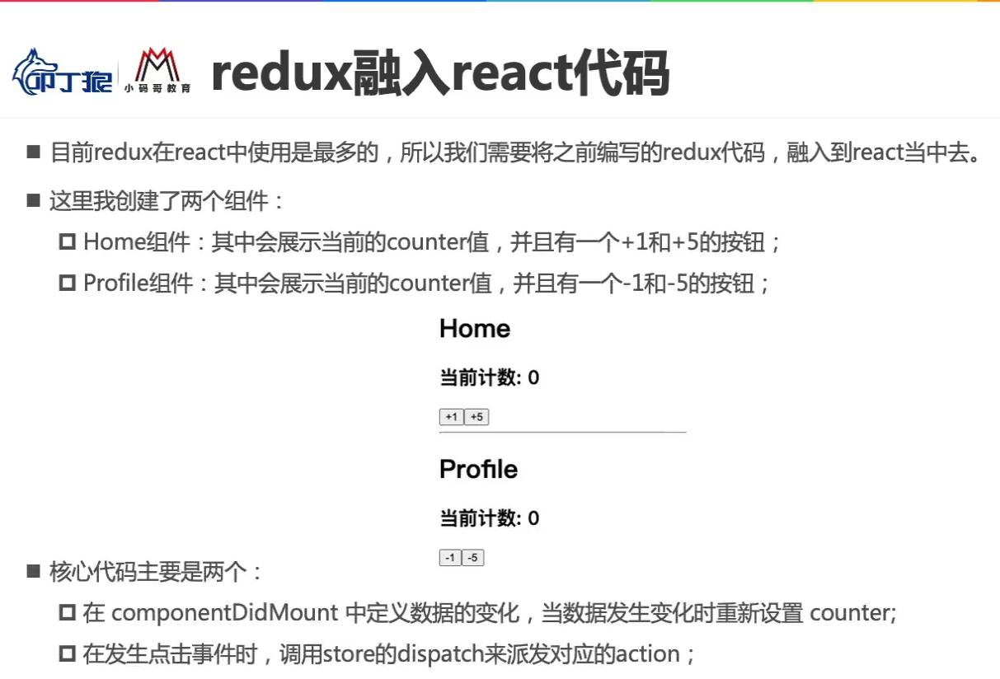


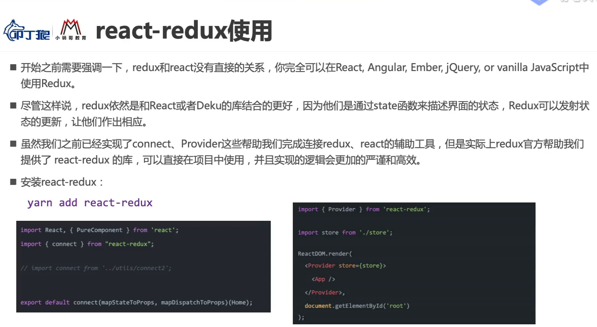


## 2.4 组件中的异步操作

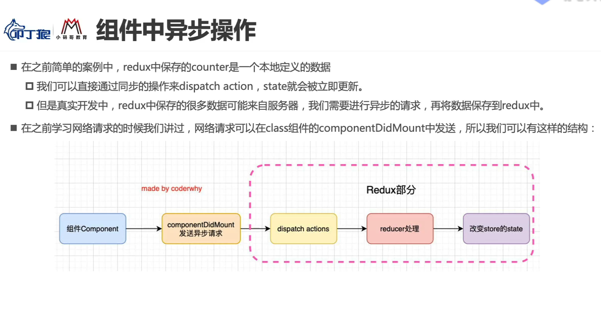

- 老师服务器的接口：http://123.207.32.32:8000/home/multidata

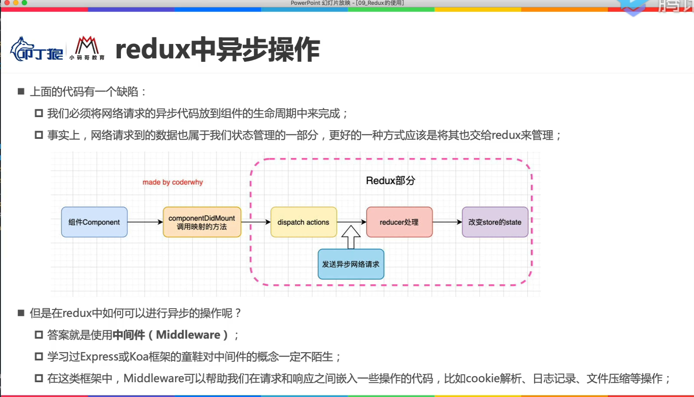


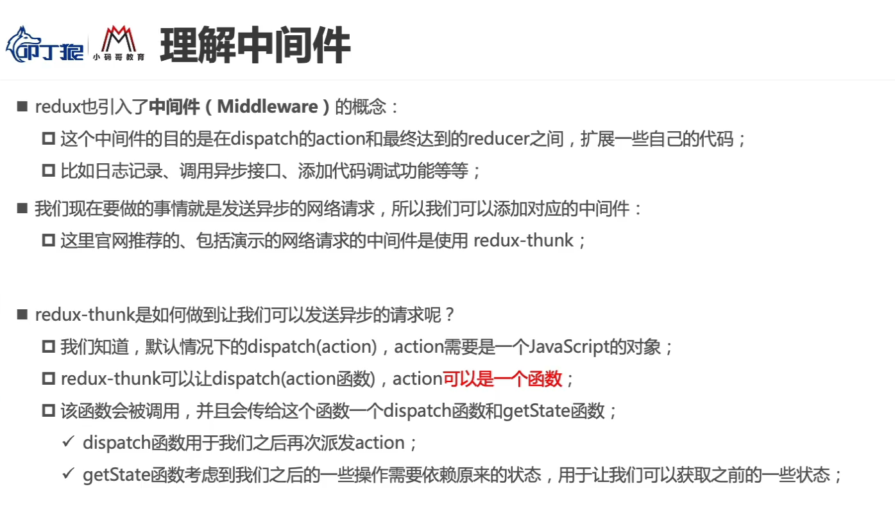

## 2.5 redux-devtools

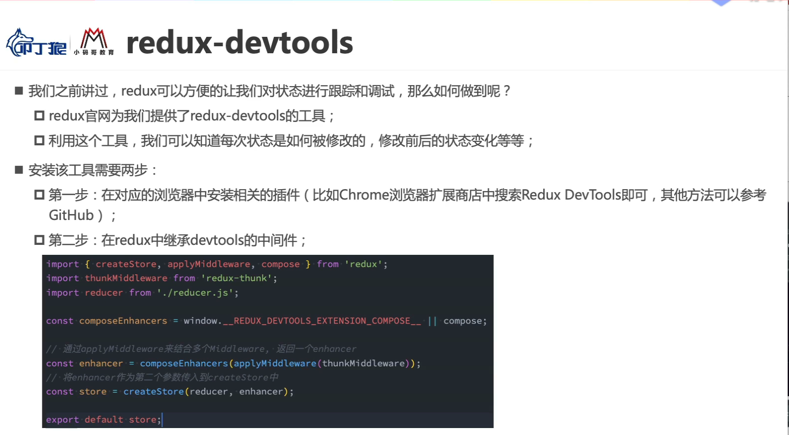

## 2.6 redux-saga 中间件

- 暂时跳过，用到的话就学


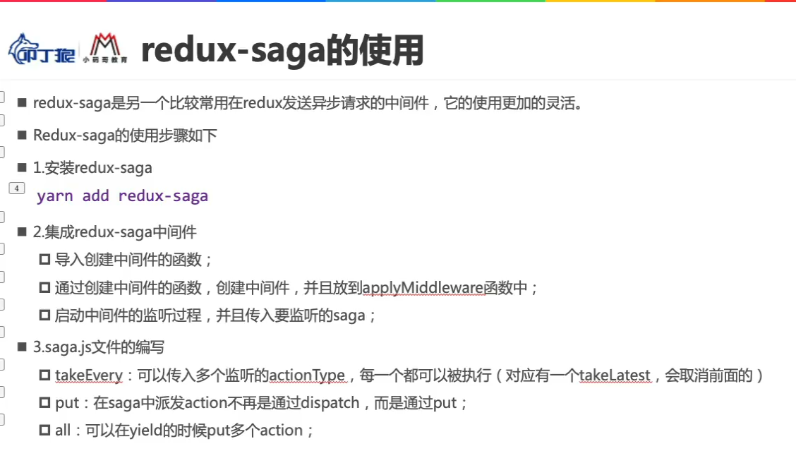

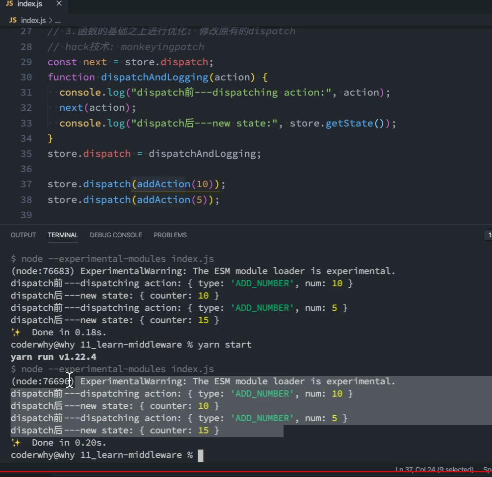


## 2.7 reducer 的拆分

### 2.7.1 为什么叫 reducer？

因为 reducer 的原型是 JavaScript 中的 `Array.prototype.reduce()` 方法：

reduce 的语法：

```js
[1,2,3,4,5].reduce((preValue, item), initialValue) => {
    // 操作
}
```

reduce 的回调方法，就被称之为一个 reducer。它具体表现是这样的：

1. 每次调用 reducer 前，都会获取一个原有的 preValue 值。
2. 需要传入 item 来修改 preValue。
3. 最后返回修改后的值。
4. 如果没有传入 preValue，还可以设置一个默认值 initialValue。


与之相比，redux 中的 reducer 是这样的：

```js
function reducer(state = defaultState, action) {
  switch (action.type) {
    case ADD_NUMBER:
      return { ...state, counter: state.counter + action.num };
    case SUB_NUMBER:
      return { ...state, counter: state.counter - action.num };
    case DECREMENT:
      return { ...state, counter: state.counter - 1 };
    case INCREMENT:
      return { ...state, counter: state.counter + 1 };
    case CHANGE_BANNERS:
      return { ...state, banners: action.banners };
    case CHANGE_RECOMMEND:
      return { ...state, recommends: action.recommends };
    default:
      return state;
  }
}
```

如果开头写成箭头函数：

```js
(state = defaultState, action) => {
    // 操作
}
```

可以看到，它和 reduce 非常的相似：

1. 每次调用 reducer 前，需要获取一个原有的值 state；
2. 需要传入 action 里面保存了对旧 state 需要删改的操作；
3. 最后返回修改后的新 state；
4. 如果没有传入 state，就会有一个默认的 defaultState 传入。


## 2.7.2 为什么要拆分 reducer

如果项目对数据的操作：

1. 条目非常多，可能有上千行，reducer 非常长；
2. 对数据的操作有明显的类别，如异步网络申请数据、本地数据、不同的组件数据等。

```js
// 拆分 counterReducer
const initialCounterState = {
  counter: 0,
};
function counterReducer(state = initialCounterState, action) {
  switch (action.type) {
    case ADD_NUMBER:
      return { ...state, counter: state.counter + action.num };
    case SUB_NUMBER:
      return { ...state, counter: state.counter - action.num };
    case DECREMENT:
      return { ...state, counter: state.counter - 1 };
    case INCREMENT:
      return { ...state, counter: state.counter + 1 };
    default:
      return state;
  }
}

// 拆分 homeReducer
const initialHomeState = {
  banners: [],
  recommends: [],
};
function homeReducer(state = initialHomeState, action) {
  switch (action.type) {
    case CHANGE_BANNERS:
      return { ...state, banners: action.banners };
    case CHANGE_RECOMMEND:
      return { ...state, recommends: action.recommends };
    default:
      return state;
  }
}

function reducer(state = {}, action) {
  return {
    counterInfo: counterReducer(state.counterInfo, action),
    homeInfo: homeReducer(state.homeInfo, action),
  };
}

export default reducer;
```

- 改变了 redux 中 state 的结构

```js
//之前的结构：
state = {
    counter: 0,
    banners: [......],
    recommders: [......],
}

//之后的结构：
state = {
    counterInfo: {
        counter： 0,
    },
    homeInfo: {
        banners: [......],
        recommders: [......],
    }
}
```

其实有一个官方的库 combinReducers 可以实现多个 reducer 的合并

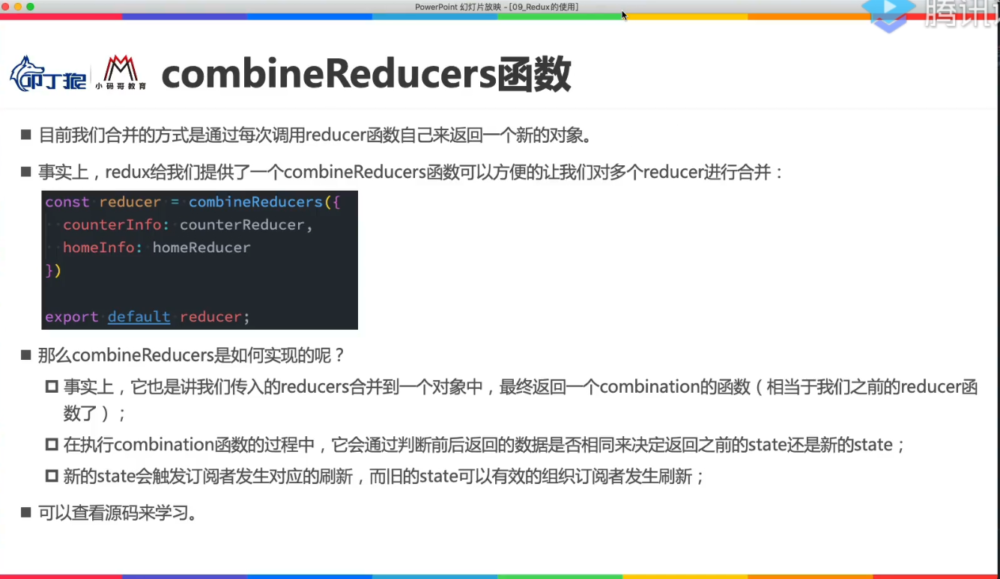


## 2.8 管理 state

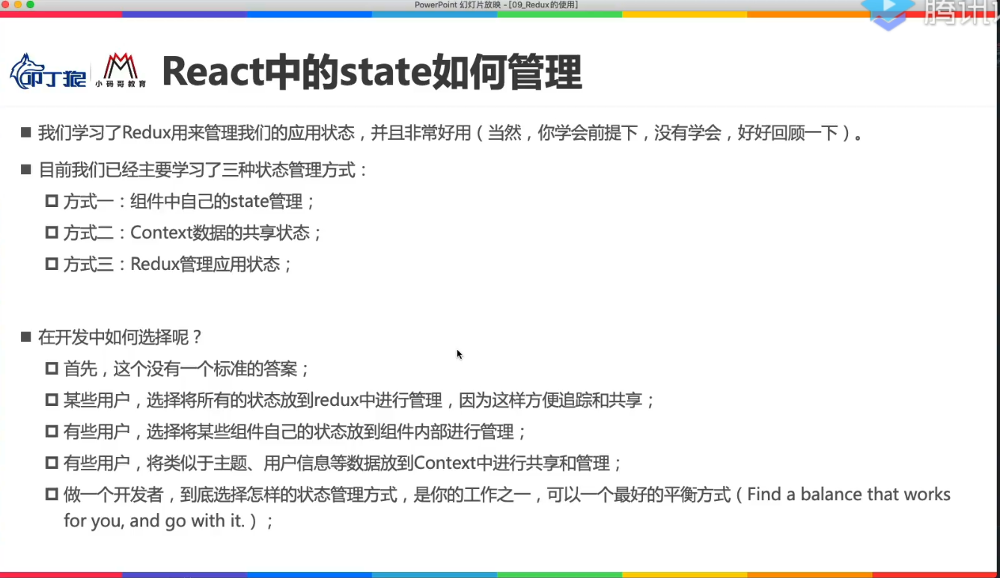


## 2.9 单向数据流

有三个理解：

1. React 官网中有提到单向数据流：
   - 只的就是通过 props 进行数据传递。一个项目中，组件是按以树的结构组织起来的。上层的组件可以通过  props 向下层组件传递数据。也就是父组件可以单向的向子组件传递数据。
2. Vue 和 React 中，每个组件内部也有一个单向数据流：
   - 一个组件从功能的实现上看，有三个模块：
     1. UI，组件最终展示的数据和界面；
     2. action，对组件中数据的操作方式，比如增删改等操作；
     3. State，组件数据保存的地方，组件的状态。
   - 所以，在 UI、action、State 之间也是按照单向数据流传递的：
     - 在 UI 页面中，用户通过交货产生了对数据的操作，触发 action；
     - React 接收到特定的 action 操作，进而对组件的 State 进行修改；
     - 组件的 State 一旦发生变化，就会触发 `render()` 重新渲染 UI ，页面发生变化。
3. Redux 中，对数据的操作也是一个单项数据流：
   - 一个 Store 从对数据的操作来看，有 3 个模块：
     1. UI，组件最终展示的数据和界面；
     2. Dispatch，组件中对数据的操作方式，比如增删改等操作；
     3. Store，组件中保存数据的地方。
        - Reducer，Store 中保存对数据操作的地方。Dispatch 触发 Reducer ，完成对数据的操作。
        - State，Store 中保存数据的地方。
     4. 所以，数据在UI、Dispatch、Store（Reducer、State）中也是一个单项数据流：
        - 用户通过 UI 界面触发事件，引发 Dispatch 派发申请对数据进行操作；
        - Dispatch 调用 Store 中的 Reducer，通过携带的 action 识别 Reducer 中对应的操作。然后修改数据；
        - 修改后的数据会更新 Store 中的 State。
        - 数据更新完毕后，会通知 React 组件，最终 `render()` 重新渲染 UI 界面。


2. 组件内部的单项数据流。

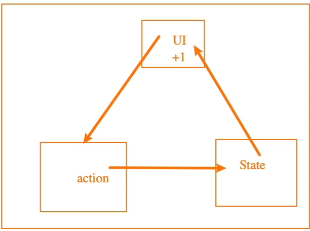


3. Redux中的单向数据流。

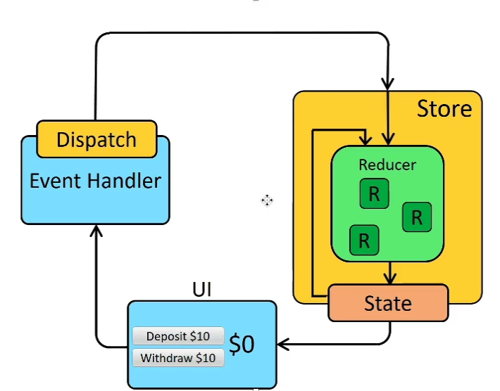


# 3 Router


路由管理不仅可以用一个长串的 `<Switch></Switch>` 管理，还可以用一个文件夹 router，利用 react-router-config 包进行管理。

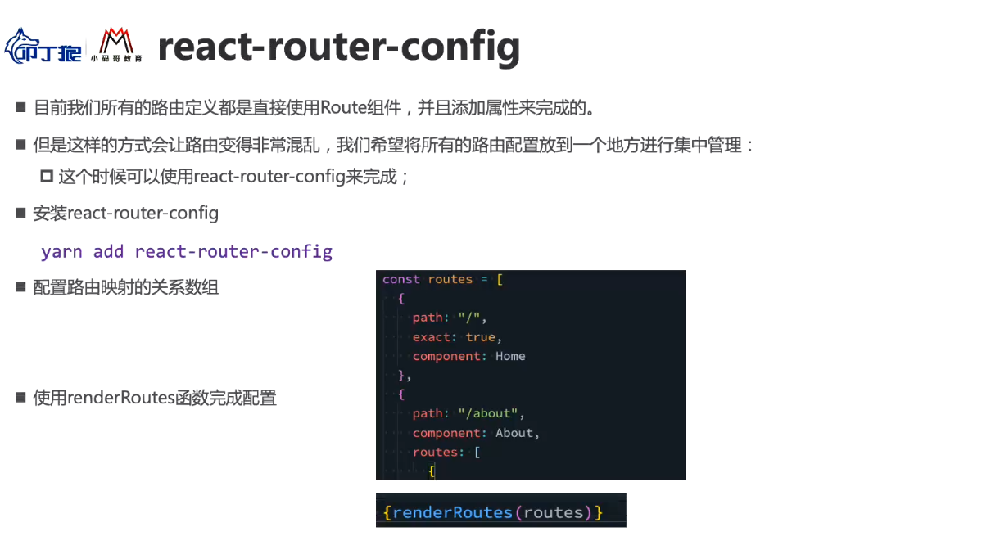


# 4 React Hooks

20.综合项目实战（四）开始讲述。

## 4.1 Hooks 的优缺点

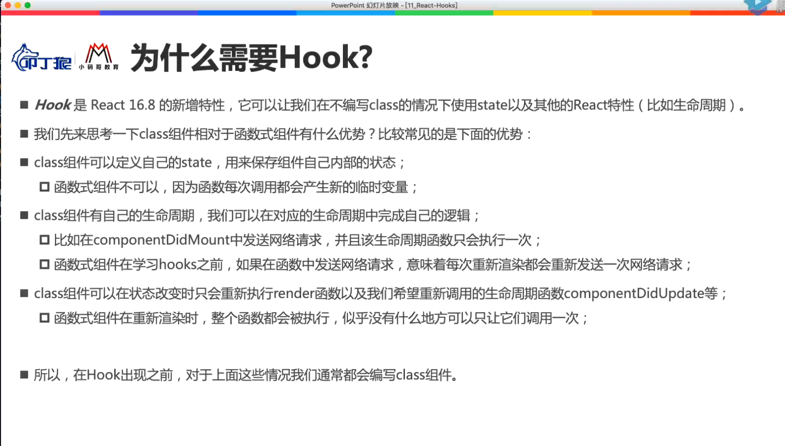

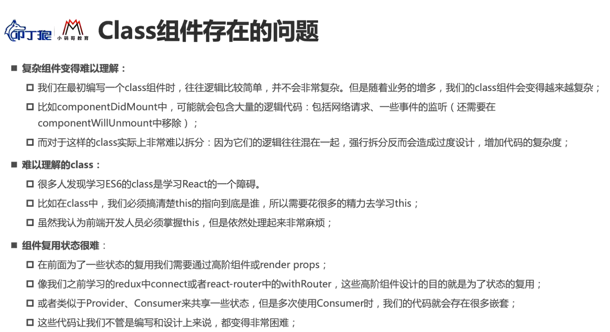

  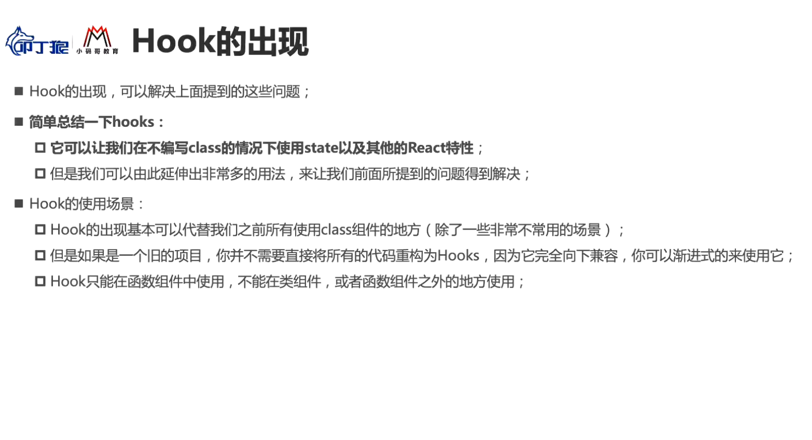

## 4.2 使用基础 hooks

### 1 State Hook

- 本身是一个函数，来自 react 包

- 有参数和返回值
  - 参数：作用是给创建出来的 state 状态一个默认值。
  - 返回：一个数组，包含两个成员：当前状态 state 对象 + 操作状态的函数

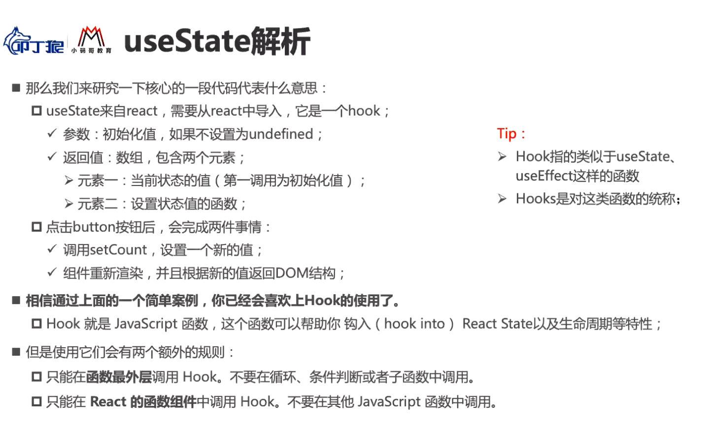

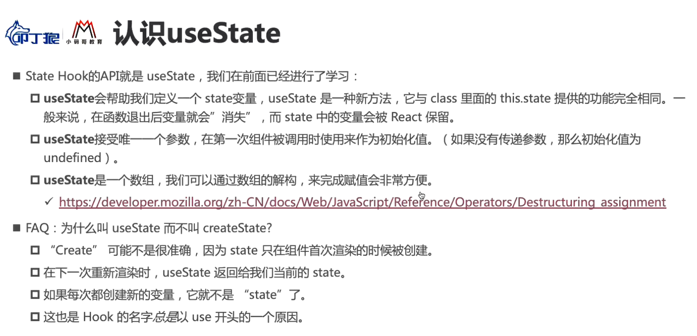

```jsx
import React, { useState } from "react";

export default function CounterHook() {
  //2 解构赋值
  const [count, setCount] = useState(0);
  return (
    <div>
      <h1>当前计数：{count}</h1>
      <button onClick={(e) => setCount(count + 1)}> +1 </button>
      <button onClick={(e) => setCount(count - 1)}> -1 </button>
    </div>
  );
}

```

上图是一个函数组件，其显示的页面如下：


当我们点击 +1 或者 -1 的时候。会重新执行一次 `function CounterHook()` 方法中的代码，也就是完全的重新执行一次函数式组件。

1. 每次调用该方法，都会通过 useState，获取当前组件的 state 状态；
2. 然后根据新的 state 值，渲染页面。
3. 该数组中的 state 会被 React 保存下来，每次调用时取出。


`setState` 函数可以有两种用法，参数：

1. 直接传入更新后的数值；
2. 传入一个方法，这个方法会携带之前的数值，进行操作后再返回新数值。

他们的区别是，如果多个 `setState` 连续使用。直接传入数值会发生合并，只有一个 `setState`起作用；而如果传入的是函数，就会全部起作用：

```jsx
//方式一，四个setCount会发生合并，最终结果只 +10
function handleBtnClick1() {
    setCount(count + 10);
    setCount(count + 10);
    setCount(count + 10);
    setCount(count + 10);
}

//方式二，四个setCount不会合并，最终结果 +40
function handleBtnClick2() {
    setCount((prevCount) => prevCount + 10);
    setCount((prevCount) => prevCount + 10);
    setCount((prevCount) => prevCount + 10);
    setCount((prevCount) => prevCount + 10);
}

<button onClick={handleBtnClick1}>+40</button>
<button onClick={handleBtnClick2}>+40</button>
```


### 2 Effect Hook


#### 2.1 基本使用

只要组件调用被重新渲染，就会触发 `useEffect` 的第一个参数：

- 第一个参数是一个回调函数。

```jsx
//在函数组件中使用 hooks
useEffect(()=>{
    console.log("订阅一些事件")
    console.log(“只要组件重新渲染就会调用这里，相当于componentDidMount+componentDidUpdate”)
    
    return ()=>{
        console.log("取消订阅事件")
        console.log("在卸载组件前，或重新渲染组件前，都会调用这里")
    }
})

//给useEffect添加了第二个参数，一个空数组
useEffect(()=>{
    console.log(“组件第一次渲染调用这里，相当于componentDidMount”)
    
    return ()=>{
        console.log("取消订阅事件")
        console.log("在卸载组件前调用这里,相当于componentWillUnmount")
    }
},[])
```

#### 2.2 多个useEffect一起使用

以前在组件 `componentDidMount` 内部会非常繁杂，有对事件监听的代码、有网络请求资源的代码、也有修改 DOM 的代码等等。

可以定义多个  `useEffect`  函数，每个 `useEffect` 都有不同的使用逻辑，它们因作用域的限制互不干扰。这样代码也更可读。

- React 会按照 `useEffect` 定义的顺序来顺序执行。  

#### 2.3 第二个参数

- `useEffect()` 第二个参数是一个数组。

  数组成员是变量，只有变量发生改变，才会执行 `useEffect()` 

- 如果传入变量 `counter` 表示这个 `useEffect` 的执行依赖 `state` 中的 `counter` 变量。该函数在第一次渲染的时候一定会执行一次，后续只有 `counter` 变量发生改变，才会执行。

- 如果传入空数组 `[]` 表示这个 `useEffect` 的执行不依赖任何变量。这就表示该函数只会在第一次渲染的时候执行一次，之后不会再执行。相当于 `componentDidMount`。


### 3 Context Hook

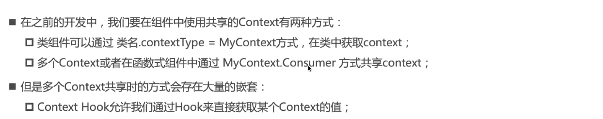

 使用 Context Hook就可以解决使用时层层嵌套的这个问题：

在外层组件中：

```jsx
// 1 引入 createContext 方法
import React, { createContext } from "react";
//...
// 2 创建并导出需要共享的 context。
export const UserContext = createContext();
export const ThemeContext = createContext();

// 3 在外层组件内，利用 <XxxxContext.Provider> 对需要共享context的多个组件进行包裹
export default function App() {
  return (
    <div>
      {/* 4. context Hook 使用 */}
      <UserContext.Provider value={{ name: "Moxy", age: 18 }}>
        <ThemeContext.Provider value={{ fontsize: "30px", color: "red" }}>
          <Father1 />
          <Father2>
              <Child1 />
          </Father2>
        </ThemeContext.Provider>
      </UserContext.Provider>
    </div>
  );
}
```

在内层的任意一个组件中，不论是 Father 还是嵌套在内部的 Child：

```jsx
// 1 引入 useContext 方法
import React, { useContext } from "react";
// 2 引入共享的两个 context
import { UserContext, ThemeContext } from "../App";

export default function ContextHook() {
// 3 获取context内的数据
  const user = useContext(UserContext);
  const theme = useContext(ThemeContext);

  console.log(user, "&", theme);
// {name: 'Moxy', age: 18} '&' {fontsize: '30px', color: 'red'}
// 正确获取了值。
    
    return <div>我是 Child 组件</div>;
}
```


## 4.3 使用扩展 hooks

### 3.1 useReducer

1. useReducer 是 useState hooks 的扩展。在逻辑相对复杂的情况下，可以用 reducer 的 switch 进行判断。
2. 如果多个组件均有一个相同的判断方式（可以用同一个 switch 判断），那么单独定义一个 reducer 纯函数，然后不同的组件 import 引入这个 reducer 即可。

使用1：在一个组件中使用 reducer：

```jsx
// 1 引入 useReducer
import React, { useReducer } from "react";

// 2 定义 reducer方法，这个方法接收两个参数：要操作的数据 state，操作的方法名称 action
function reducer(state, action) {
  switch (action.type) {
    case "increment":
      return { ...state, counter: state.counter + 1 };
    case "decrement":
      return { ...state, counter: state.counter - 1 };
    default:
      return;
  }
}

export default function Home() {
 // 3 创建一个 Reducer，输入两个参数：一个reducer方法，一个数据对象，
 // 	useReducer 会返回两个结构：
    // 		1. 存放数据的 state 对象，保存的就是 {counter:0}，
    //		2. 触发 action 的方法，dispatch，使用 dispatch 来操作 state。
  const [state, dispatch] = useReducer(reducer, { counter: 0 });

  return (
    <div>
      <h2>Home当前计数：{state.counter}</h2>
{/* 4 对state进行操作，通过调用 dispatch()方法，传入action对象，成员有操作的方法名称type。*/}
    {/*  React会拿着方法名称 action.type在reducer纯函数中重找对应的操作方法，然后更新state*/}       
      <button onClick={(e) => dispatch({ type: "increment" })}>+1</button>
      <button onClick={(e) => dispatch({ type: "decrement" })}>-1</button>
    </div>
  );
}
```


使用2：多个组件共用一个 reducer：

- 需要注意的是，这里的 `useReducer` 只是对 `useState` 的一种特殊用法。使用方式类似了 redux 中的 reducer。但是 `useReducer` 是无法共享 state 数据的，和 redux 也毫无关系。唯一可以共享的只是 `reducer` 纯函数，操作 state 的方法。

```jsx
// reducer.js
// 导出一个 reducer 纯函数
export default function reducer(state, action) {
    switch(action.type) {
        case "increment":
            return {...state, counter: state.counter + 1};
        case "decrement":
            return {...state, counter: state.counter - 1};
        default:
            return state;
    }
}


// home.js
// Home 组件等其他组件可以共用这个方法
import React, { useReducer } from "react";
// 引入 Reducer 纯函数
import reducer from './reducer'

export default function Home() {
  const [state, dispatch] = useReducer(reducer, { counter: 0 });

  return (
    <div>
      <h2>Home 当前计数：{state.counter}</h2>
      <button onClick={(e) => dispatch({ type: "increment" })}>+1</button>
      <button onClick={(e) => dispatch({ type: "decrement" })}>-1</button>
    </div>
  );
}


// about.js
// About 组件等其他组件可以共用这个方法
import React, { useReducer } from "react";
// 引入 Reducer 纯函数
import reducer from './reducer'

export default function About() {
  const [state, dispatch] = useReducer(reducer, { counter: 0 });

  return (
    <div>
      <h2>About 当前计数：{state.counter}</h2>
      <button onClick={(e) => dispatch({ type: "increment" })}>+1</button>
      <button onClick={(e) => dispatch({ type: "decrement" })}>-1</button>
    </div>
  );
}
```


### 21综合项目实战（五），看到 01：26：00


