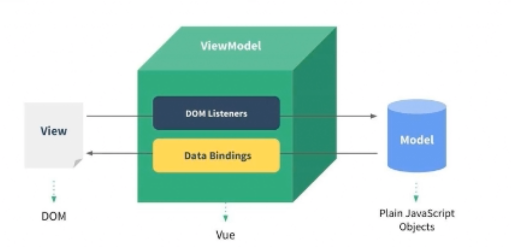

# MVVM 模型

MVC 和 MVVM 都是一种软件的体系结构（软件模式）

- MVC：View（HTML）、Controller（用js进行DOM操作，数据修改等）、Model（数据）。
- MVVM：Modle-View-ViewModel，Vue 是一个没有完全遵循 MVVM 模型的前端框架，但是整个设计受到它的启发。
  - View：DOM 结构、DOM 树。**template**。
  - ViewModel：Vuejs 将 View 和 Model 进行绑定，提供了监听、渲染等功能。
  - Model：所有我们定义的 Js 对象。**data**。




## 1 基本

创建组件

```js
// HTML ==
<div id="app"></div>

// Js ====
import {createApp} from 'vue'
import App from './App.vue'

const app = createApp(App)
app.mount('#app')
```


### 1.1 选项式 Options API

```js
// options API 的形式
export default{
	data() {},
  props: {},
  components: {},
  methods: {},
  computed: {},
  watch: {},
  created() {},
  mixins: {},
  //...
}
```

#### (1) 数据 datas


#### (2) 方法 method


#### (3) 计算属性 computed

通常用于在 HTML 中展示数据前进行统一的处理逻辑。如对所有数字添加 `¥` 符号，可定义并调用 computed。

特点 / 和 method 的主要区别：

- **自动依赖并缓存**。当状态，即函数中使用的依赖未发生改变时，会缓存并复用计算属性结果，值并不会重新计算。
- **自动调用**。在 HTML 中使用计算属性函数时，不需要括号调用，Vue 自动调用。
- 入参：
  - 一个回调函数。computed 的普遍用法，Vue 会自动调用回调函数，相当于只定义了 getter。
  - 一个对象。添加 setter、getter 属性。让 computed 可添加 setter 修改状态（数据）。但这可能导致继续触发响应式，更新 DOM。所以 getter 不应当有副作用。

```vue
<script setup>
import { reactive, computed } from 'vue'

const author = reactive({
  name: 'John Doe',
  books: [
    'Vue 2 - Advanced Guide',
    'Vue 3 - Basic Guide',
    'Vue 4 - The Mystery'
  ]
})

// 一个计算属性 ref
const countBooks = computed(() => {
	author.books.length > 0 ? 'Yes' : 'No'
})

// 一个普通方法
const calculateBooks = () => {
	author.books.length > 0 ? 'Yes' : 'No'
}
</script>

<template>
  <p>Has published books:</p>
  <span>{{ countBooks }}</span>
  <span>{{ calculateBooks() }}</span>
</template>
```


#### (4) 模版引用

通过对 HTML 元素添加 `ref` 属性，可获得一个该元素的引用。

```vue
<script setup>
import { ref, onMounted } from 'vue'

// 必须和模板里的 ref 同名
const input = ref(null)

// 组件加载后自动聚焦
onMounted(() => {
  input.value.focus()
})
</script>

<template>
  <input ref="input" />
</template>
```

- 组件尚未加载时，`input` 变量值为 null，因为此时 `<input>` 元素的引用无法获取。只有组件完全挂载后，才可获得正确引用。

- 可以通过 v-for 遍历 list，通过 ref 批量添加引用。

- 可动态绑定函数，在组件每次更新时调用，参数为该元素的引用：

  ```vue
  <input :ref="(el) => { /* 可将 el 赋值给一个数据属性或 ref 变量 */ }">
  ```


### 1.2 命令式 Composition API

Vue3 推出的 Composition API，是类似 React Hooks 的编程风格。其主要就是 `Setup()` 函数的使用。

- **Setup 函数中禁用 this**。

改进的原因：

- Options API 的缺点：对同一个数据，如counter的操作，在data中有，在computed中有，在watch中有，可能在声明周期中还有，相对分散；如果这种数据多的话，程序逻辑不易梳理。

- Composition API 的优点：对同一个数据的操作可以集中在代码块，甚至可以抽离为一个 function，如 `useCounter()`，逻辑清晰、方便调用。


`setup()` 默认会传递两个参数：props、context

- props：父组件传递来的数据会存放在 props 对象中。
- context：上下文，包含三个属性
  - attrs：所有非props的attribute，这些属性默认会发生透传。
  - slots：父组件传递来的插槽，在render函数可能会使用。
  - emit：组件内部需要发出事件时，使用这个 emit。

`setup()` 需要返回一个对象， `<template>` 内便可使用返回对象中的属性。

- **语法糖**：直接在 `<script setup>` 中定义 setup，且无需再使用 return 暴露提供给 `<template>` 的状态。


#### [`<script setup>`](https://cn.vuejs.org/api/sfc-script-setup.html#script-setup) 语法糖：

- defineProps()：定义 props 数据，该 api 无需导入。
- defineEmits()：定义 emits 方法，该 api 无需导入。
- defineExpose()：子组件将自身的部分属性通过该方法暴露出来，该 api 无需导入。
  - 父组件通过 一个 ref 指向子组件的 DOM，`ref.value.xxx` 可访问暴露的组件。


## 2 指令 Directives

在 HTML 元素标签中使用，会有各种不同的功能。


### v-html、v-text、v-pre、v-cloak

- `v-html` 网页展示 HTML 内容，而不是转化为一个 HTML 元素。
- `v-text` 语法糖：`<h2 v-text="message"></h2>` 等价于：`<h2>{{message}}</h2>`
- `v-pre`：跳过不需要编译的节点，加快编译的速度。所以其子元素会直接显示原始的Mustache标签。
- `v-cloak`：该指令会一直保持在元素上，直到关联组件实例结束编译后才自动删除。通常配合CSS 规则如 [v-cloak] { display: none } 一起用，可以隐藏未编译的 Mustache 标签直到组件实例准备完毕。


### v-bind 属性绑定

- 在元素中添加 `v-bind:***`，会动态绑定属性到元素上，可以通过一个冒号简写 `:`


具体有：

```vue
# 绑定 src、href、class、style 等等所有属性
<div v-bind:id="dynamicId"></div>

# 绑定无值的属性（布尔），渲染后该属性没有值仅有属性名
<button :disabled="isButtonDisabled">Button</button>

# 绑定自定义属性，第一个key为data变量，第二个key为'happy'字符串
<div :[nameKey]=nameValue>Button</div>
<div :happy='everyday'>Button</div>


```

绑定方式：

```vue
# js 对象绑定，会把数组展开，key/value
const objectOfAttrs = {
  id: 'container',
  class: 'wrapper'
}
<div v-bind="objectOfAttrs"></div>
<div :class="{active: isActive, title: true}"></div>

# method调用绑定，返回一个对象/数组
<div :class="getClassObj()"></div>


# 数组绑定
<div :class="['abc', className]">通过数组的形式，添加静态（单引号）和动态的class名（无引号）</div>
<div :class="['abc', className, isActive ? 'active': '']">三元运算符</div>
<div :class="['abc', className, classObj]">数组中可包含对象</div>


```


### v-on 事件监听

为元素绑定事件监听，简写`@`

- 可以添加 `.***` 作为修饰符，增加其他功能。例如 `.prevent` 让事件调用触发 `event.preventDefault()`。

```vue
# 基本使用
#完整写法: v-on:事件名="methods方法"
<button v-on:click="btn1Click">绑定函数：点击打印</button>
<div class="area" v-on:mousemove="mouseMove">绑定函数：鼠标移动</div>

# 直接绑定表达式
<button @click="counter++">绑定表达式：{{counter}}</button>

# 绑定对象，语法糖形式绑定多个事件。
<div class="area" @="{click: btn1Click, mousemove: mouseMove}"></div>

# 绑定箭头函数
<button @click="(event) => console.log(event, 'ok...', )">Submit</button>


# 参数传递
<button @click="btn1Click">默认绑定 Event 参数，不需要括号调用/button>
<button @click="btn2Click($event, 'coderwhy', 18)">额外添加其他参数，$event 固定语法：获取事件对象</button>


# v-on 修饰符，固定的快捷方法
<div @click="divClick">
  <button @click.stop="btnClick">.stop 阻止冒泡，divClick不会触发</button><p />
  <button @click="btnClick">.divClick会触发</button>
</div>

<span>松开按键就触发：</span>
<input type="text" @keyup="enterKeyup">

<span>.enter 按下Enter才触发：</span>
<input type="text" @keyup.enter="enterKeyup">
```


### v-if、v-else-if、v-else、v-show 条件渲染

- `v-if` 只有值为 true 时才会展示元素内容。
- `v-else` 必须跟在一个 `v-if` 之后，没有值，当 `v-if` 为 false 时展示元素内容。
- ``v-else-if`` 相当于 python 的 `elif。`
- `v-show` 不可和 v-else 搭配。用法和 `v-if` 一致。


要点：

- `<template>` 元素

  - v-if / else-if / else 可在 `<template>` 元素上添加。 `<template>` 最后不会渲染，而是成为一个包装器元素，子元素会遵循规则隐藏/展示。

  - `v-show` 不可在 `<template>` 元素上添加。

- 隐藏效果

  - `v-show` 会在 DOM 上保留，通过 `display: none`的效果隐藏。
  - `v-if` 会直接从 DOM 上摘除，相当于对 DOM 结构直接进行操作。

- 首次渲染

  - `v-if` 是惰性的。如果在首次渲染时值为 false，则不会做任何事。
  - `v-show` 不论元素初次是否要展示，都会渲染并保留在 DOM 树上。


### v-for 列表渲染

 `v-for` 基于一个数组 / 对象来渲染一个列表，有自己的固定语法。

- in / of 遍历。使用 in 或 of 对一个数组遍历： `v-for="item in itemsArr"`。

- key 管理。必须动态添加一个 key，以便 diff 时提升效率：`<div v-for="item in items" :key="item.id">`

- 遍历数组

  - 获取下标。可获得 value 和 index：`v-for="value, index in itemsArr"`

  - 快捷解构。可直接在 vlue 对数组进行解构：`v-for="{ name, age }, index in itemsArr"`

- 遍历对象
  - 顺序与 `Object.keys()` 相同。
  - 获取 key + index 。可获得 value、key、index：`v-for="value, key, index in itemsObject"`
- 使用范围值
  - 类似 python 对 range(10) 会进行遍历，从 1～10：` v-for="n in 10"`
- 其他特点
  - 当 `v-if` 和 `v-for` 同时存在于一个元素上的时候，`v-if` 会首先被执行。
  - 可在 `<template>` 元素上添加。


### v-model 表单输入绑定

v-model 将输入值和事件监听进行绑定。

- 输入的内容同步更新到响应式数据 text 中：

```vue
<input
  :value="text"
  @input="event => text = event.target.value">

# 简化为：
<input v-model="text">
```

- 多种输入支持：
  - 文本类型： `<input>` 和 `<textarea>` 元素会绑定 `value` 输入值并侦听和触发 `input` 事件。
  - 选择类型：`<input type="checkbox">` 和 `<input type="radio">` 会绑定 `checked` 选择值并侦听和触发 `change` 事件。
  - 列表选择：`<select>` 会绑定 `value` 值，并侦听和触发 `change` 事件。

- 修饰符
  - `.lazy`：让 input 元素的触发更新时间从 input 推迟到 change 事件。
  - `.number`：输入内容自动转化为数字。
  - `.trim`：去除用户输入内容前后的空格。


## 3 响应式 API (核心)

### ref()

`ref()` 创建一个**任意类型**的响应式数据，解决了 reactive 仅能创建引用类型的问题。

`ref()` 既可以定义简单类型，又可以定义复杂类型，使用比 reactive 更频繁。

- `.value` 访问。通过 `.value` 可访问 ref 对象的值，对该值修改，也需要通过 `.value` 修改。
- 防链接丢失。可对返回的引用重新赋值，也可将对象解构后再赋值，不会失去响应式。
- 顶层访问解包。在 `<template>`中，变量是顶层时可语法糖省略 `.value`，直接访问数据。
- 使用场景：获取元素、获取原生DOM。


reavtive 和 ref 的使用场景：

- reactive 的使用场景：
  - 多个数据之间有关系/联系。或者说聚合的数据，组织在一起有特定作用。比如一个 account 中有 username、password 等。
- ref 的使用场景：
  - 其他情况都用 ref，如：定义简单的本地数据、定义从网络中获取的数据。


### reactive()

`reactive()` **定义复杂数据**，而不是直接定义一个基本数据类型。`reactive()` 创建一个响应式对象或数组（仅引用类型）。

`reactive()` 使用频率不高，通常定义的是基本数据类型，使用 `ref()` 更频繁。

- 异步更新。响应式更新状态是异步的，在下一时机才可获得状态更新后的数据，通过 `nextTick()` 可得到 DOM 更新完的数据。
- 深层响应。即使一个对象/数组内深层的变量发生改变，DOM 也可得到响应并更新。
- Proxy代理。`reactive()` 返回的是入参对象的代理 Proxy，和原始对象并不相等。所以有下面两个特点。
- 对象有效。仅对引用类型有效（object、map、array、set），基本类型无效（7 种：string、number、boolean ... ）。
- 不可解构  / 链接丢失。如果对返回的引用重新赋值，或将返回的对象解构后再赋值（传递），都会失去响应式链接。

```vue
<!-- 使用方法 -->
<script setup>
// [0] 引入API
import { reactive } from 'vue'
  
// [1] 变量定义
const state = reactive({count: 1})
// [2] 方法定义
const increment = () => {state.count++}
</script>

<template>
  <h1>{{ state.count }}</h1>
  <button @click="increment">增加</button>
</template>
```


### readonly()

为了实现规范的单项数据流，即子组件不可修改父组件传递的数据，可使用 readonly 将父组件期望传递给子组件的数据进行包裹后再传递，子组件则无法对 readonly 包裹的数据进行修改。

- 通常会对 ref 或 reactive 定义的数据进行再次包裹，其数据不会丢失响应性。
- `readonly()` 会返回原始对象的只读代理，这个代理依然是一个 Proxy，只是该 Proxy 的 set 方法被劫持，无法修改数据。

```vue
<script setup>
	import { ref, readonly } from "vue";
  
  const info = ref("hello world");
  const reInfo = readonly(info);
</script>
```

- 流程：
  - 父组件将 reInfo 传递给子组件，并传递一个 handleReInfo 的回调函数，以供子组件修改状态；
  - 子组件无法直接对 reInfo 修改，只能调用 handleReInfo 修改状态；
  - 父组件 handleReInfo 内直接对 info 进行修改。
  - 当 info 被修改后，相应的 reInfo 也得到修改，子组件可正确获取修改后的数据。


### computed()

在对一个相应式状态进行访问前，可进行额外的数据修改。常用于对 `ref` 数据进行额外修改。有两种入参：函数、对象。

- 接受一个 getter 函数，然后返回一个 readonly 的 ref 类型对象。
  - 返回的 ref 对象通过 `.value` 访问数据，会调用 getter 函数，并返回其返回值。
- 接受一个对象，其属性 `get` 绑定一个 getter 函数；`set` 绑定一个 setter 函数，则返回的 ref 类型对象是可修改的。

```js
// 返回只读的响应式ref
const count = ref(1);
const plusOne = computed(() => count.value + 1);  // 对要访问的ref拦截，并执行额外逻辑
console.log(plusOne.value); // 2，可访问
plusOne.value++ // 错误，不可修改


// 返回可修改的响应式ref
const count = ref(1)；
const plusOne = computed({
  get: () => count.value + 1,   // getter 函数
  set: (val) => { count.value = val - 1; }  // setter 函数
});

plusOne.value = 1;  // 可修改
console.log(count.value); // 0，可访问
```


### shallowReactive()

获得一个浅层响应。

- 更多学习：https://cn.vuejs.org/api/reactivity-advanced.html#shallowreactive

```vue
<script setup>
import { reactive } from 'vue'

const state = reactive({ count: 0 })

function increment() {
  state.count++
}
</script>

<template>
  <button @click="increment">
    {{ state.count }}
  </button>
</template>
```


### shallowReadonly()

readonly 会将 ref 和 reactive 创建的数据进行深层转换，也就是说对象内部的属性也会变为只读，如果只期望浅层转换，则使用 `shallowReadonly()`。

```js
const state = shallowReadonly({
  foo: 1,
  nested: { bar: 2 }
});

// 状态自身的属性：不可更改（根属性）
state.foo++;

// 下层嵌套对象：可修改
state.nested.bar++;
isReadonly(state.nested); // false，表示：nested对象不是只读的，其属性可修改
```


### watch()

在状态发生变化时，执行副作用，类似 React 的 useEffect。

- 格式：监听状态变化，一旦发生改变，则触发回调函数，同时可获取到状态变化前后的值。
- 监听对象：ref 状态、computed 计算属性、reactive 响应式对象、getter 函数、多个数据源组成的数组。

```jsx
// 格式
watch(someRef, (oldValue, newValue) => {
  // code...
})

const x = ref(0)
const y = ref(0)

// 单个 ref
watch(x, (newX) => {
  console.log(`x is ${newX}`)
})

// getter 函数
watch(
  () => x.value + y.value,
  (sum) => {
    console.log(`sum of x + y is: ${sum}`)
  }
)

// 多个来源组成的数组
watch([x, () => y.value], ([newX, newY]) => {
  console.log(`x is ${newX} and y is ${newY}`)
})
```

- getter 监听。不可直接监听一个 reactive 的某个属性，而是通过定义 getter 的方式监听。
- 深层监听。监听完整的 reactive 响应式对象，会深层监听。只要任意属性值发生变化，就会触发回调。
  - reactive 完整响应式对象触发回调的 `(oldValue, newValue)` 会指向同一个对象，也就是那个 reactive 对象本身。
- 参数
  - `deep: true`：使用 getter 只会针对该属性触发。通过 `deep` 可转化成深层监听，但 `(oldValue, newValue)` 指向同一引用。
  - `immediate: true`：组件初始加载时，遍先执行一次，而不是默认的懒加载。
  - `flush: 'post'`：调整触发时机。从默认的 DOM 组件更新前调用回调，调整为 DOM 组件更新后调整。


### watchEffect()

简化 watch 的执行，省略第一个参数，只定义回调函数即可。

- 初始化执行。组件初始加载时立即执行，相当于默认添加了 `immediate` 参数。
- 自动依赖。Vue 会自动跟踪回调函数中使用到的响应式数据，自动关联依赖。


### watchPostEffect()

相当于 `watchEffect()` 添加了 `flush: 'post'`功能。也就是自动依赖的监听函数修改（推迟）了触发时机。


## 4 响应式 API (其他)

### 2.1 判断类 API

- isProxy：检查一个对象是否是由 [`reactive()`](https://cn.vuejs.org/api/reactivity-core.html#reactive)、[`readonly()`](https://cn.vuejs.org/api/reactivity-core.html#readonly)、[`shallowReactive()`](https://cn.vuejs.org/api/reactivity-advanced.html#shallowreactive) 或 [`shallowReadonly()`](https://cn.vuejs.org/api/reactivity-advanced.html#shallowreadonly) 创建的代理。
- isReactive：检查一个对象是否是由 [`reactive()`](https://cn.vuejs.org/api/reactivity-core.html#reactive) 或 [`shallowReactive()`](https://cn.vuejs.org/api/reactivity-advanced.html#shallowreactive) 创建的代理。
  - 注：由 readonly 包裹的 reactive 状态，用 `isReactive` 判断依然为 true。
- isReadonly()：检查一个对象是否是由 readonly 或 shallowReadonly 创建的代理。
  - 注：判断原理，该状态/数据是否是一个没有 `set` 函数的 `computed()` 的 ref 对象。
- isRef()：检查某个值是否为 ref。
- unRef()：如果该值是 ref，则返回内部值；否则返回该值本身。
  - 为该代码的语法糖： `val = isRef(val) ? val.value : val`。


### 2.2 转换类 API

- toRaw()：**不建议使用，仅在调试时用**。获取 reactive 或 readonly 代理对象的原始对象。
- toRef()：将 reactive / ref 响应式状态中的普通属性，转换为一个 ref 响应式属性。
  - 新创建的 ref 响应式状态和原普通属性建立联系，不论修改原普通属性，还是新的 ref 响应式状态，都会互相同步更新。
- toRefs()：在解构 reactive /ref 前使用，可将响应式对象内的所有普通属性都变为响应式 ref。
  - reactive 被解构后的值会失去响应式，变成普通的值；通过 toRefs() 包裹后，该值再解构出的值都为响应式的 ref。
  - 相当于对该状态的所有属性都执行一次 `toRef()`。


### 2.3 其他类 API

- triggerRef：**不常用**。手动触发和 shallowRef 相关联的副作用。

  ```js
  const info = shallowRef({ name: "ninjee"});
  
  const dhangeInfo = () => {
    // 下面修改不会触发响应式，只是默默修改了数据
    info.value.name = "Moxy";
    
    // 通过 trigger 手动触发响应式，页面更新数据
    triggerRef(info);
  }
  ```


## 5 生命周期

每个生命周期环节，都有一个钩子，可以执行自己的逻辑，在 composition API 中，需使用 on+声明周期名，调用生命周期 hooks。

- setup
- 组件创建
  - beforeCreate
  - created
- 组件挂载
  - beforeMount
  - mounted
- 组件更新
  - beforeUpdate
  - updated
- 组件卸载
  - beforeUnmount
  - unmounted


#### **4.1 流程**

1. Vue：组件实例即将创建；

   hook：`beforeCreate()`

2. Vue：创建组件实例；

   hook：`created()`

3. Vue：template模版编译(vue-loader)；

   hook：`beforeMount()`

4. Vue：挂载到虚拟DOM上，并构建真实DOM，页面渲染完毕；

   hook：`mounted()`

5. Vue：当由事件触发导致数据发生改变，即将更新组件；

   hook：`beforeUpdate()`

6. Vue：组件完成更新，构建虚拟DOM，构建真实DOM，页面渲染；

   hook：`update()`

7. Vue：组件即将卸载，例如通过 `v-if="false"` 删除组件；

   hook：`beforeUnmount()`

8. Vue：将待移除的组件从虚拟DOM中摘除，构建真实DOM，页面渲染；

   hook：`unmounted()`

9. Vue：将组件实例销毁。


#### 4.2 常用声明周期

`created()` 组件创建时：

- 发送网络请求，获取数据；
- 开启事件监听。


`mounted()` 当前组件已经被挂载：

- 组件刚被挂载，可获取 DOM，并使用 DOM（注：`created()` 时组件尚未挂载，无法获取 DOM）。


`unMounted()` 组件卸载完毕：

- 回收操作，收尾操作：取消事件监听。


## 6 组件

### 6.1 基础

#### 6.1.1 两种组织类型：

单独的 `.vue` 文件中，叫做单文件组件（SFC）：

```vue
<script setup>
import { ref } from 'vue'

const count = ref(0)
</script>

<template>
  <button @click="count++">You clicked me {{ count }} times.</button>
</template>
```

一个JS对象，保存在`.js`文件中：

```js
import { ref } from 'vue'

export default {
    setup() {
    const count = ref(0)
    return { count }
  },
  template: `
    <button @click="count++">
      You clicked me {{ count }} times.
    </button>`
}
```


#### 6.1.2 注册

全局注册：在全局注册的组件，可以在任意位置使用，包括该全局组件的子组件中。

- 使用 `createApp()` 返回的 `app.component()` 方法注册，且可以链式调用。
- 参数，第一个参数为组件名称，第二个参数为组件实例。

缺点：

- 打包时无法 tree-shaking 移除。
- 全局组件的使用，在大型项目中使父子组件的依赖关系模糊。

```js
// 全局注册
import { createApp } from 'vue'
import MyComponent from './Test.vue'

const app = createApp({})

app.component('MyComponent', MyComponent)
```


### 6.2 总结：组件间的通信方式

**（1）父子间通信方式**

- 父 => 子：`props` 属性
  - 使用方式：在子组件上注册一些自定义的attribute；父组件给这些attribute赋值，子组件通过attribute的名称获取到对应的值。
  - 用法 `defineProps()`：
    - 数组类型，props内直接使用字符串对不同的attribute属性进行命名；
    - 对象类型，在指定attribute名称同时，指定它的数据类型、是否必须、默认值等
- 子 => 父：`$emit` 触发事件
  - 使用方式：
    1. 子组件中定义在某些情况下触发的事件名称；
    2. 父组件中`v-on`传入要监听的事件名称，并绑定回调函数；
- 父 => 子：`slot` 插槽


**（2）非父子间通信方式**

- Provide / Inject：适用**祖先对子孙发送数据**，用的比较少，更多是状态管理工具；
- event bus 全局事件总线：适用 兄弟关系等组件间通信；
  - Vue3 删除了$on、$off 和 $once 方法，需要使用第三方库实现全局事件总线。
  - **TODO：用js实现事件总线**
    - https://juejin.cn/post/7112066925617741838#comment
    - https://juejin.cn/post/7082997603905830920#comment
    - 事件总线不好管理，无法追溯事件触发者是谁，所以大型项目上不推荐使用。


#### 6.2.1 Props 数据

- **使用方式：**
- 子组件通过 defineProps 暴露需要的数据
  
- 父组件在使用子组件时，通过 **动态绑定** 属性名的方式传递数据
  
- [实例地址](https://play.vuejs.org/#eNp9kU9PhDAUxL/KpBfWBCH+OZEuid5N9qSHrQezFKhC27RlDSF8d1tYQBP1+N78OpN5HciD1sm54yQj1J6M0A6Wu07nTIpWK+MwwPASI0qjWkQejVbpsVHVQVl30ZJ0WQRHjwFMnpT0gPZLi32w2h2DMEAUGW5iOOEaniF66vGuOiN5j0/hajx7B4zxxt5ubIiphKz+IO828qXugw5hYRXKTnqSydcrJmk61/VF/eB4q5s3x8Pk6FJjauDO16Uye0ZCBwg5d2EkkED2wfuLlogibMOTbMpf9tMwP8jpeiMfRdM1l8Tk+/F++Y6Cl0Lyg1Ha7o7R5Bn9WwSg9X0+DPMxMI409fPP1PELlVmwdQ==)
- **自动展开。**传递一个对象，通过 v-bind 绑定，会自动展开：[实例](https://play.vuejs.org/#eNp9kc1OhDAUhV/lpJuOCQ7xZ0U6JLo3mZUuBhc6FKhC27RlDCG8uy0woInOrvecr/f23PbkQevtqeUkIcwejdAOlrtWp5kUjVbGoYfhBQYURjWgHqWL9Vircq+sm71tfBZCR48BmTwq6QHtRYtdaLU5BKOHyBPcRHDC1TwBferwoVojeYcv4So8+w4YopW9XdkwphSy/Ie8W8mXqgs+hIVVKFrpyUy+XmWSxVNcH9QXjje6fnM8VI6dY4wJ3Om6UGaXkZABQk5ZMhJIIPnk3extRR7U6cq7kPmsT2jKlu34ISxeJpKI/FzbHx+R80JIvjdK282BipxGoGNAejEIwKr7tA87wTAk8Kfxli9Y7J3frxi+ARi1ssc=)
- **无需引用。**`defineProps()` 不需要引入，可直接使用。**目前仅有 defineEmits 和 definePops 待考证❓**
- **单向数据流。**和React一样，props只可从父至子传递数据，子组件不推荐对接受的props进行修改（但代码可修改）。
  - 使用 `readonly()` 创建的数据，禁止被修改，强制实现单项数据流。

- **可校验。**子组件可以对接受的props进行校验，通过 `defineProps()` 的入参实现 ：[实例](https://cn.vuejs.org/guide/components/props.html#prop-validation)
  - 特别的，类型为 Boolean的props有特殊的转换规则，官方范例中有。

```vue
<!-- App.vue 父组件 -->
<script setup>
import { ref } from 'vue'
import BlogPost from './BlogPost.vue'
  
const posts = ref([
  { id: 1, title: 'My journey with Vue' },
  { id: 2, title: 'Blogging with Vue' },
  { id: 3, title: 'Why Vue is so fun' }
])
</script>

<template>
	<BlogPost
  	v-for="post in posts"
	  :key="post.id"
  	:title="post.title"
	></BlogPost>
</template>

<!-- BlogPost.vue 子组件 -->
<script setup>
defineProps(['title'])
</script>

<template>
  <h4>{{ title }}</h4>
</template>
```

1. 子组件通过 `defineProps()` 定义了 title 变量，即希望父组件给 title 传递数据；
2. 父组件通过动态绑定`:title` 的方式传递了数据。


props 的 v-bind 自动展开：

```js
const post = {
  id: 1,
  title: 'My Journey with Vue'
}

// 将上面的object 通过 v-bind 绑定，会自动展开：下面两者等价
<BlogPost v-bind="post" />
<BlogPost :id="post.id" :title="post.title" />
```


`defineProps()`  的详细规则：

- 除此之外，还可以添加校验函数，更多知识：[Vue官方](https://cn.vuejs.org/guide/components/props.html#prop-validation)

```vue
<script setup>
  // [方式1]通常传递一个字符串
	defineProps(['title', 'likes']);
  
	// [方式2]也可以传递一个对象，来约束 porp 的类型：
  defineProps({
    title: String,
    likes: Number
  })
  
  //[方式3]对一个props设置是否必须、默认值、数据类型等
  defineProps({
    title: {
      type: String,
      default: "基础知识",
      require: true,
    },
    likes: Number
  })
</script>

<script setup lang='ts'>
	// [方式4]ts中的类型声明：
  defineProps<{
    title?: string,
    likes?: number
  }>()
</script>


<script>
  // [方式5]使用js对象的形式，可用array，也可用object
  export default {
    props: ['title', 'likes'],
    setup(props) {
      // 	setup第一个参数为props
    }
  }
</script>
```


#### 6.2.2 Emits 事件监听

- **使用方式：**
  - 子组件通过 `defineEmits()`定义需要暴露的事件， 通过 `$emit()`  对外抛出这个事件。
  - 父组件通过 `v-on` 监听这个事件，从而事件子组件对父传递数据。
- **不会冒泡。**该事件定义方式不会冒泡，所以只可监听直接子组件，不可垮层级监听。
- **命名调整。**子组件定义事件名称时可采用 camelCase 形式，但父组件调用时需转化为 kebab-case 形式。
- **可传递参数。**需要传递的参数直接附在 `$emit('name', p1, p2, p3)` 后续即可。
- **返回emit**。 `const emit = defineEmits(['temp'])`，调用返回的 emit，可以在`<script setop>` 中使用，效果和 `$emit()` 相同。这种形式的原因是 `$emit()` 仅可在 `<template>` 使用。
- **可校验。**`defineEmits()` 支持传递对象，通过函数形式来验证触发事件的参数是否符合预期，[范例](https://cn.vuejs.org/guide/components/events.html#events-validation)。

```vue
<!-- 父组件 -->
<script setup>
import { ref } from 'vue'
import BlogPost from './BlogPost.vue'
  
const posts = ref([
  { id: 1, title: 'My journey with Vue' },
  { id: 2, title: 'Blogging with Vue' },
  { id: 3, title: 'Why Vue is so fun' }])

const postFontSize = ref(1)
</script>

<template>
	<div :style="{ fontSize: postFontSize + 'em' }">
    <BlogPost
      v-for="post in posts"
      :key="post.id"
      :title="post.title"
      @enlarge-text="(n) => postFontSize += n"
    ></BlogPost>
  </div>
</template>

<!-- 子组件 -->
<script setup>
defineProps(['title'])
defineEmits(['enlarge-text'])
</script>

<template>
  <div class="blog-post">
    <h4>{{ title }}</h4>
    <button @click="$emit('enlarge-text', 2)">Enlarge text</button>
  </div>
</template>
```

- 子组件：点击按钮后触发 `@click` 事件，Vue 通过 `$emit` 触发 `enlarge-text` 事件。
- 父组件：监听 `@enlarge-text` 事件，触发后完成子组件与父组件通信。

**❓待解决疑问：**

- **`defineEmits()` 和 `defineProps()` 都有返回值，作用是什么？**
- **通过对象定义组件的方式，在 `setup()` 中有两个参数：props和 ctx 作用分别是什么？这种定义方式常用吗？**


#### 6.2.3 Slots 插槽

- 子组件通过`<slot />` 空出一个位置，把父组件传递的内容呈现出来。
- 所以，插槽是父组件传递给子组件指定的内容，子组件放在对应的插槽上呈现。

```vue
<!-- 父组件 -->
<template>
  <FancyButton>
    Click me <!-- slot content -->
 	</FancyButton>
</template>

<!-- 子组件 -->
<template>
  <button class="fancy-btn">
  	<slot/>
	</button>
</template>

<!-- 最终渲染的效果： -->
  <button class="fancy-btn">
  	Click me
	</button>
```

- 多类型。插槽可以渲染多类型内容：文本、元素、组件等等；
- 默认内容。子组件可定义默认内容，以防父组件为传递任何内容时渲染：`<slot>Some Content</slot>`；
- 具名插槽。子组件有多个插槽的情况下，通过 `<slot name="xxx">`的形式对插槽命名，以指定传递的位置；
  - 父组件通过`<template v-slot:xxx></template>`将内容传递给具名插槽，`v-slot`可简写为 `#xxx`；
- 父组件作用域。插槽是父组件传递的，所以插槽内容可访问父组件作用域，不可访问子组件作用域；
- 子组件作用域。如果父组件期望访问子组件作用域中的数据，可通过动态绑定属性解决：
  - 子组件通过向 slot 动态绑定属性传递数据，有默认插槽和具名插槽 [两种情况](https://cn.vuejs.org/guide/components/slots.html#scoped-slots)。
  - 基本逻辑：子组件将需要暴露的数据通过 props 传递给父组件；父组件通过 props.xxx 访问数据。


#### 6.2.4 Provide/Inject 依赖注入

props 仅适用直接父子组件间的向下传递，使用`provide()`和`inject()`可实现跨层级传递。祖父根组件通过 Provccccide 暴露数据，子孙组件可通过 Inject 消费数据。

- 顶层组件为供给方，提供响应式数据 + 修改数据的回调函数；
- 子孙组件为注入方，为了方便维护通常不会直接修改数据，而是调用一个回调函数；
- 顶层组件可添加 `readonly()` 时数据不可被注入方修改。

```vue
<!-- Root 暴露数据 -->
<script setup>
import { provide, ref, readonly } from 'vue';
  
const count = ref(0);
const updateCount = () => {
  count.value += 1;
};

// 入参：名称，数据值
provide('count', {
  readonly(count), // 数据，readonly 防止子孙直接修改数据，单项数据流
  updateCount      // 修改数据的回调函数
});
</script>


<!-- Child 子孙消费 -->
<script setup>
import { inject } from 'vue';
  
const { count, updateCount } = inject('count');
// 可以附一个默认值（或一个构造函数），以防止上层组件没有暴露该数据：
// const { count, updateCount } = inject('count', '0');
</script>

<template>
	<button @click="updateCount">{{ Count }}</button>
</template>
```


#### 6.2.5 Event Bus 全局事件总线

早起Vue2实例提供了事件总线的功能，但在Vue3移除（作为UI层级的框架，不应该提供事件总线这种非UI框架的功能）；之后，官方推荐过 mitt 或 tiny-emitter。

- **TODO：事件总线的基本使用**

基本逻辑：

```js
// [1] 创建 eventBus 对象，并暴露
const eventBus = new HYEventBus();
export default eventBus;

// [2] eventBus.emit 发出事件，并指明事件名称、携带参数
eventBus.emit("whyEvent", {"why", 18, 1.88});

// [3] eventBus.on 监听事件，并通过回调函数执行逻辑
const eventCallback = (args) => {
  console.log("whyEvent", args);
}
eventBus.on("whyEvent", eventCallback);

// [4] 移除事件
eventBus.off("whyEvent", eventCallback);
```


### 6.3 动态引入组件

```vue
<!-- 通过给:is传入组件名称，即可动态切换组件 -->
<component :is="tabs[currentTab]"></component>

<!-- 效果等同于: v-if/else-if -->
<template v-if="currentIndex === 0">
	<home />
</template>
<template v-else-if="currentIndex === 1">
	<about />
</template>
<template v-else-if="currentIndex === 2">
	<category />
</template>
```

- 父组件中，通过在 component 元素中动态添加 `:is` 属性调整动态切换组件。
- `:is` 属性可赋值：组件名 / 组件实例


### 6.4 v-model 双向绑定

**v-model 本质上是一个语法糖，简化了父组件定义绑定数据的代码量，但子组件的定义部分并没有简化。**

- [实例](https://cn.vuejs.org/guide/components/v-model.html#multiple-v-model-bindings)，通过 v-model 可实现父子组件的双向绑定：
  - 子组件定义输入框 input，当用户输入内容后触发事件，数据流向父组件。

  - 父组件得到数据，并呈现在页面上，同时该数据也返回子组件中。

  - 子组件的input元素将数据添加在 `value` 属性上，页面的输入框呈现用户输入的内容。
- 形式：

  1. 子组件定义暴露的数据：`defineProps(['content'])`
  1. 子组件定义暴露的事件：`defineEmits(['update:content'])`
  1. 子组件在 `input` 元素上绑定数据和事件：`<input :value="content" @input=$emit('update:content', $event.target.value)>`
  1. 父组件绑定v-model，将数据保存在temp变量中：`<MyComponent v-model:content="temp" />`

```vue
<template>
  <MyComponent v-model:content="myText" /> {{ myText }}

	<!-- 等同于 -->
  <MyComponent :content="myText" @update:content="myText = $event"/>{{ myText }}
	<MyComponent :content="myText" @update:content="newVal => myText = newVal"/>{{ myText }}
</template>
```

- 注：使用 modelValue 定义数据为默认名称，父组件的 v-model 绑定可无需写出名称：`v-model="myText"`


- 自定义修饰符：[实例](https://play.vuejs.org/#eNp1Ur2O00AQfpWRG69FsKE1yYnTifIkJA4aTGE542Qle3e1u44wljtANFQgENT8NYiSjrfJHbwFs2s7WBFXJTP7zXw/ni44VSreNRikwdIUmisLBm2jTjLBayW1hQ40ltBDqWUNIUHDw9N5eybpn0Bhx+c4mfXcXgIDZKKQwlio2wt8amHlNrIwjDKxTAZSoqPCYq2q3CJVABdbboAL1VgocsVtXvFnaAB3qFu75WIDrWyAaFCnDr+cq9ndrOUaq5R4rVPyb8MqCwYZWQCJJ+q6SVjfO0UHFcEiOHLzn5QGZ0pLZcjYGksu8L6rWOeWjwJSeGA1aV7MeudyzUuO2qSUMQ3mTUU4FsHqBFjXR0Bqespo4sCau+wGintUGPY4bNSapE4+wyfRHTdQNqKwXAo/8yivGmQYgRdUIaXjOrQKY5vrDZI116BJAF4C82biY5WzDMdVAEkCV2+/Xb76+fvXm/2Lz1cfn//58m7//f3lj9f7T1/3Lz8MMKdfVhhXcsNuO4WuOYnwv3GxzfWpZbei2MqHSqE+yw1SFjfGd1PxAqdhCga8NXbsfzHAHcx/y2uvazlclm2Vuwg73EPqh6ke11HrrsdR65DkeDfzO+n/AuYEMR8=)
  - 可以自定义 v-model 的修饰符，已经存在的有：.trim、.number 等，也可以自定义，注意流程：
    1. 子组件需定义暴露的数据、暴露的修饰符、暴露的事件。注意，修饰符名称必须为：`xxxModifiers`，即 “数据名+Modifiers”；数据名为：`xxx`；事件名为：`update:xxx`；
    2. 子组件中定义：触发事件后调用一个回调函数，在回调函数中在判断 `props.xxxModifiers.abc`  的 if 内书写逻辑。
    3. 父组件调用：`  <MyComponent v-model:xxx.abc="myText" />`。
  - 实例流程：当父组件中，数据赋值给 `.abc`后，子组件的 `props.xxxModifiers.abc` 便接受到数据，此时 if 判断为 true，执行 if 内逻辑后，会通过 emit 触发 update 事件，将更新后的数据返回给父组件，完成一次更新。


### 6.5 透传 Attributes

透传：父组件在使用子组件时，设置在元素上的某些属性，会自动的绑定到子组件的根元素上。

- **预料外的属性**。这些会自动绑定的属性，不是子组件声明的 props 数据或 emits 事件监听；
- **透传html属性。**这些属性通常是 class、style、id 等html常见属性。
- **透传事件监听**。父组件也可以将自己的`v-on`监听绑定在子组件根元素上。
- **可禁用**。透传是自动进行的，但子组件可通过`inheritAttrs: false`禁用
- **可访问。**
  - 通过`$attrs`获取传递过来的属性
  - 通过`<input v-bind="$attrs"></input>`可将传递的属性显示绑定。
  - 在 `<script setup>` 中使用 `const attrs = useAttrs()`访问传递来的属性。

```vue
<!-- 父组件 -->
<MyButton class="large" />

<!-- 子组件 MyButton -->
<button class="btn">click me</button>

<!-- 属性透传，最终子组件的渲染： -->
<button class="btn large">click me</button>
```


### 6.6 异步加载

- 通过 `defineAsyncComponent()` 可实现组件的异步加载，同时实现懒加载。
  - 相当于对普通组件进行包裹，所有props和slot都会符合预期的传递，无需额外关注。

```js
import { defineAsyncComponent } from 'vue'

const AsyncComp = defineAsyncComponent(() =>
  import('./components/MyComponent.vue')
)
```


##  End: 小技巧 

#### 结构

- 独立模块的复用：组件；
- 状态逻辑的复用：组合式函数（类似 React hooks）；
- DOM访问的复用：自定义指令 `vFocus` => `v-focus`；

#### CSS 作用域

- `<style>` 默认是全局CSS规则，仅需添加 scoped，就可以限制 CSS 规则为当前组件： `<style scoped>`。


#### VScode 代码片段

- 打开 snippet-generator.app；
- 将自己期望的代码片段放入，并设定：名称、快捷缩写；
- 拷贝生成的 vscode 内容；
- 打开 vscode，文件-首选项-“从-中迁移键盘快捷方式...”；
- 如果是 vue 的代码片段，找到 vue 类目，打开 vue.json；
- 粘贴复制的内容，保存。


#### 创建 vue 项目

1. 使用 webpack
   - 安装脚手架：`npm install @vue/cli -g `；
   - 创建项目：`vue create xxx`，可自定义配置。
2. 使用 vite
   - 创建项目：`npm init vue@latest`  最新版 / `npm init vue`；
     - 该操作会自动安装本地工具：`create-vue`；
   - 该项目没有安装依赖，进入项目后 `npm install`；


#### vscode

`jsconfig.json`

- 对已经设置好的路径别称进行登记，登记后使用别名引入文件时，vscode则会进行预提示。

  ```json
  "compilerOptions": {
    "path": {
      "@/*": ["src/*"],
      "utils/*": ["src/utils/*"],
    }
  }
  ```

- 引用了一些库，期望有智能提示，则在 lib 中进行添加：

  ```json
  "compilerOptions": {
    "lib": [
      "esnext",  // 更新的es语法
      "dom",     // dom操作api
      "dom.iterable",  // dom迭代api
      "scripthost"
    ]
  }
  ```

- vue 使用 volar 插件，提供智能提示。


#### webpack分包打包

通常执行 npm run build后，会将所有业务代码打包为一个js文件，如我们想实现懒加载，通过分包打包提升首评加载速度等，可指定webpack指定分包打包。

```vue
<!-- 在某组件中需要懒加载MyComponent时，采用异步注册的方式： -->

<script>
	// defineAsyncComponent 创建异步组件，实现懒加载
  import { createApp, defineAsyncComponent } from 'vue';
  // 通过 import 关键字引入组件
  const AsyncMyComponent = defineAsyncComponent(() => import("./views/MyComponent.vue"));
  
  // 注册异步组件AsyncMyComponent，命名为MyComponent;
  const app = createApp({});
	app.component('MyComponent', AsyncMyComponent)
</script>
```

- 打包后可在 dist/js 中看到。
- .js.main 为 souce map 文件，指明了对应的 .js 文件的压缩过程，方便还原代码。
- 采用组件异步加载的方式较少，通常使用路由懒加载，但本质一样，结果都是webpack分包打包。


