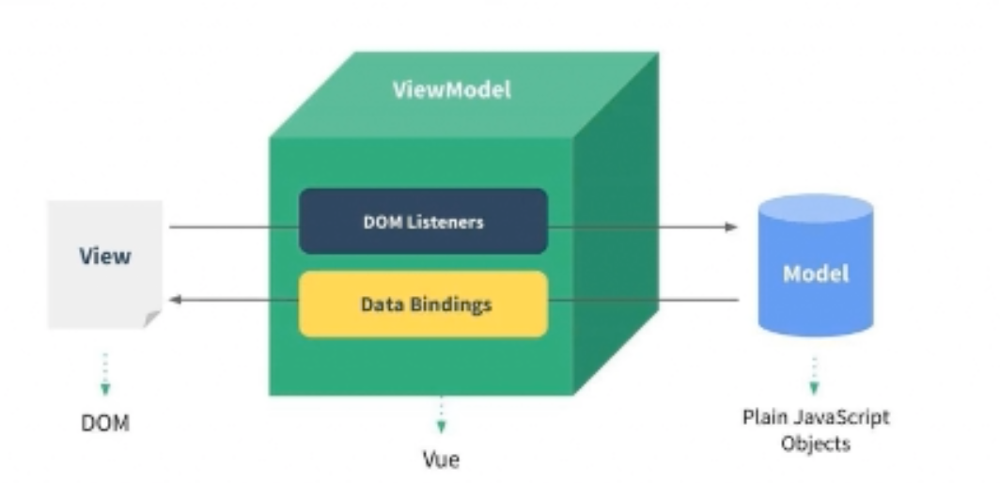

# MVVM 模型

MVC 和 MVVM 都是一种软件的体系结构（软件模式）

- MVC：View（HTML）、Controller（用js进行DOM操作，数据修改等）、Model（数据）。
- MVVM：Modle-View-ViewModel，Vue 是一个没有完全遵循 MVVM 模型的前端框架，但是整个设计受到它的启发。
  - View：DOM 结构、DOM 树。**template**。
  - ViewModel：Vuejs 将 View 和 Model 进行绑定，提供了监听、渲染等功能。
  - Model：所有我们定义的 Js 对象。**data**。




# 大纲

创建组件

```js
// HTML ==
<div id="app"></div>

// Js ====
import {createApp} from 'vue'
import App from './App.vue'

const app = createApp(App)
app.mount('#app')
```


## 1 基本

### 数据 datas


### 方法 method


### 计算属性 computed

通常用于在 HTML 中展示数据前，进行统一的处理逻辑。如对所有数字添加 `¥` 符号，可定义并调用 computed。

特点，也是和 method 的主要区别：

- 自动依赖并缓存。当状态未发生改变，及函数中使用的依赖未发生改变时，会缓存并服用计算属性结果，值并不会重新计算。
- 自动执行。在 HTML 中使用计算属性函数时，不需要括号调用，Vue 自动调用。
- 入参：
  - 一个回调函数。computed 的普遍用法，Vue 会自动调用回调函数，相当于只定义了 getter。
  - 一个对象。添加 setter、getter 属性。让 computed 可添加 setter 修改状态（数据）。但这可能导致继续触发响应式，更新 DOM。所以 getter 不应当有副作用。


### 模版引用

通过对 HTML 元素添加 `ref` 属性，可获得一个该元素的引用。

```vue
<script setup>
import { ref, onMounted } from 'vue'

// 必须和模板里的 ref 同名
const input = ref(null)

// 组件加载后自动聚焦
onMounted(() => {
  input.value.focus()
})
</script>

<template>
  <input ref="input" />
</template>
```

- 组件尚未加载时，`input` 变量值为 null，因为此时 `<input>` 元素的引用无法获取。只有组件完全挂载后，才可获得正确引用。

- 可以通过 v-for 遍历 list，通过 ref 批量添加引用。

- 可动态绑定函数，在组件每次更新时调用，参数为该元素的引用：

  ```vue
  <input :ref="(el) => { /* 可将 el 赋值给一个数据属性或 ref 变量 */ }">
  ```

  


## 2 指令 Directives

在 HTML 元素标签中使用，会有各种不同的功能。


### v-html、v-text、v-pre、v-cloak

- `v-html` 网页展示 HTML 内容，而不是转化为一个 HTML 元素。
- `v-text` 语法糖：`<h2 v-text="message"></h2>` 等价于：`<h2>{{message}}</h2>`
- `v-pre`：跳过不需要编译的节点，加快编译的速度。所以其子元素会直接显示原始的Mustache标签。
- `v-cloak`：该指令会一直保持在元素上，直到关联组件实例结束编译后才自动删除。通常配合CSS 规则如 [v-cloak] { display: none } 一起用，可以隐藏未编译的 Mustache 标签直到组件实 例准备完毕。


### v-bind 属性绑定

- 在元素中添加 `v-bind:***`，会动态绑定属性到元素上，可以通过一个冒号简写 `:`


具体有：

```vue
# 绑定 src、href、class、style 等等所有属性
<div v-bind:id="dynamicId"></div>

# 绑定无值的属性（布尔），渲染后该属性没有值仅有属性名
<button :disabled="isButtonDisabled">Button</button>

# 绑定自定义属性，第一个key为data变量，第二个key为'happy'字符串
<div :[nameKey]=nameValue>Button</div>
<div :happy='everyday'>Button</div>


```

绑定方式：

```vue
# js 对象绑定，会把数组展开，key/value
const objectOfAttrs = {
  id: 'container',
  class: 'wrapper'
}
<div v-bind="objectOfAttrs"></div>
<div :class="{active: isActive, title: true}"></div>

# method调用绑定，返回一个对象/数组
<div :class="getClassObj()"></div>


# 数组绑定
<div :class="['abc', className]">通过数组的形式，添加静态（单引号）和动态的class名（无引号）</div>
<div :class="['abc', className, isActive ? 'active': '']">三元运算符</div>
<div :class="['abc', className, classObj]">数组中可包含对象</div>


```


### v-on 事件监听

为元素绑定事件监听，简写`@`

- 可以添加 `.***` 作为修饰符，增加其他功能。例如 `.prevent` 让事件调用触发 `event.preventDefault()`。

```vue
# 基本使用
#完整写法: v-on:事件名="methods方法"
<button v-on:click="btn1Click">绑定函数：点击打印</button>
<div class="area" v-on:mousemove="mouseMove">绑定函数：鼠标移动</div>

# 直接绑定表达式
<button @click="counter++">绑定表达式：{{counter}}</button>

# 绑定对象，语法糖形式绑定多个事件。
<div class="area" @="{click: btn1Click, mousemove: mouseMove}"></div>

# 绑定箭头函数
<button @click="(event) => console.log(event, 'ok...', )">Submit</button>


# 参数传递
<button @click="btn1Click">默认绑定 Event 参数，不需要括号调用/button>
<button @click="btn2Click($event, 'coderwhy', 18)">额外添加其他参数，$event 固定语法：获取事件对象</button>


# v-on 修饰符，固定的快捷方法
<div @click="divClick">
  <button @click.stop="btnClick">.stop 阻止冒泡，divClick不会触发</button><p />
  <button @click="btnClick">.divClick会触发</button>
</div>

<span>松开按键就触发：</span>
<input type="text" @keyup="enterKeyup">

<span>.enter 按下Enter才触发：</span>
<input type="text" @keyup.enter="enterKeyup">
```


### v-if、v-else-if、v-else、v-show 条件渲染

- `v-if` 只有值为 true 时才会展示元素内容。
- `v-else` 必须跟在一个 `v-if` 之后，没有值，当 `v-if` 为 false 时展示元素内容。
- ``v-else-if`` 相当于 python 的 `elif。`
- `v-show` 不可和 v-else 搭配。用法和 `v-if` 一致。s


要点：

- `<template>` 元素

  - v-if / else-if / else 可在 `<template>` 元素上添加。 `<template>` 最后不会渲染，而是成为一个包装器元素，子元素会遵循规则隐藏/展示。

  - v-show 不可在 `<template>` 元素上添加。

- 隐藏效果

  - `v-show` 会在 DOM 上保留，通过 `display: none`的效果隐藏。
  - `v-if` 会直接从 DOM 上摘除，相当于对 DOM 结构直接进行操作。

- 首次渲染

  - `v-if` 是惰性的。如果在首次渲染时值为 false，则不会做任何事。
  - `v-show` 不论元素初次是否要展示，都会渲染并保留在 DOM 树上。


### v-for 列表渲染

 `v-for` 基于一个数组 / 对象来渲染一个列表，有自己的固定语法。

- in / of 遍历。使用 in 或 of 对一个数组遍历： `v-for="item in itemsArr"`。

- key 管理。必须动态添加一个 key，以便 diff 时提升效率：`<div v-for="item in items" :key="item.id">`

- 遍历数组

  - 获取下标。可获得 value 和 index：`v-for="value, index in itemsArr"`

  - 快捷解构。可直接在 vlue 对数组进行解构：`v-for="{ name, age }, index in itemsArr"`

- 遍历对象。
  - 顺序与 `Object.keys()` 相同。
  - 获取 key + index 。可获得 value、key、index：`v-for="value, key, index in itemsObject"`
- 使用范围值
  - 类似 python 对 range(10) 会进行遍历，从 1～10：` v-for="n in 10"`
- 其他特点
  - 当 `v-if` 和 `v-for` 同时存在于一个元素上的时候，`v-if` 会首先被执行。
  - 可在 `<template>` 元素上添加。


### v-model 表单输入绑定

v-model 将输入值和事件监听进行绑定。

- 输入的内容同步更新到响应式数据 text 中：

```vue
<input
  :value="text"
  @input="event => text = event.target.value">

# 简化为：
<input v-model="text">
```

- 多种输入支持：
  - 文本类型： `<input>` 和 `<textarea>` 元素会绑定 `value` 输入值并侦听和触发 `input` 事件。
  - 选择类型：`<input type="checkbox">` 和 `<input type="radio">` 会绑定 `checked` 选择值并侦听和触发 `change` 事件。
  - 列表选择：`<select>` 会绑定 `value` 值，并侦听和触发 `change` 事件。

- 修饰符
  - `.lazy`：让 input 元素的触发更新时间从 input 推迟到 change 事件。
  - `.number`：输入内容自动转化为数字。
  - `.trim`：去除用户输入内容前后的空格。


## 3 响应式

### reactive()

`reactive()` 创建一个响应式对象或数组（仅引用类型）

- 异步更新。响应式更新状态是异步的，在下一时机才可获得状态更新后的数据，通过 `nextTick()` 可得到 DOM 更新完的数据。
- 深层响应。即使一个对象/数组内深层的变量发生改变，DOM 也可得到响应并更新。
- Proxy代理。`reactive()` 返回的是入参对象的代理 Proxy，和原始对象并不相等。所以有下面两个特点。
- 对象有效。仅对引用类型有效（object、map、array、set），基本类型无效（7 种：string、number、boolean ... ）。
- 不可解构  / 链接丢失。如果对返回的引用重新赋值，或将返回的对象解构后再赋值（传递），都会失去响应式链接。


### ref()

`ref()` 创建一个任意类型的响应式数据，解决了 reactive 仅能创建引用类型的问题。

- `.value` 访问。通过 `.value` 可访问 ref 对象的值。
- 防链接丢失。可对返回的引用重新赋值，也可将对象解构后再赋值，不会失去响应式。
- 顶层访问解包。变量是顶层是，可语法糖省略 `.value`，直接访问数据。


### shallowReactive()

获得一个浅层响应。

- 更多学习：https://cn.vuejs.org/api/reactivity-advanced.html#shallowreactive


```vue
<script setup>
import { reactive } from 'vue'

const state = reactive({ count: 0 })

function increment() {
  state.count++
}
</script>

<template>
  <button @click="increment">
    {{ state.count }}
  </button>
</template>
```


### watch()

在状态发生变化时，执行副作用，类似 React 的 useEffect。

- 格式：监听状态变化，一旦发生改变，则触发回调函数，同时可获取到状态变化前后的值。
- 监听对象：ref 状态、computed 计算属性、reactive 响应式对象、getter 函数、多个数据源组成的数组。

```jsx
// 格式
watch(someRef, (oldValue, newValue) => {
  // code...
})

const x = ref(0)
const y = ref(0)

// 单个 ref
watch(x, (newX) => {
  console.log(`x is ${newX}`)
})

// getter 函数
watch(
  () => x.value + y.value,
  (sum) => {
    console.log(`sum of x + y is: ${sum}`)
  }
)

// 多个来源组成的数组
watch([x, () => y.value], ([newX, newY]) => {
  console.log(`x is ${newX} and y is ${newY}`)
})
```

- getter 监听。不可直接监听一个 reactive 的某个属性，而是通过定义 getter 的方式监听。
- 深层监听。监听完整的 reactive 响应式对象，会深层监听。只要任意属性值发生变化，就会触发回调。
  - reactive 完整响应式对象触发回调的 `(oldValue, newValue)` 会指向同一个对象，也就是那个 reactive 对象本身。
- 参数
  - `deep: true`：使用 getter 只会针对该属性触发。通过 `deep` 可转化成深层监听，但 `(oldValue, newValue)` 指向同一引用。
  - `immediate: true`：组件初始加载时，遍先执行一次，而不是默认的懒加载。
  - `flush: 'post'`：调整触发时机。从默认的 DOM 组件更新前调用回调，调整为 DOM 组件更新后调整。


### watchEffect()

简化 watch 的执行，省略第一个参数，只定义回调函数即可。

- 初始化执行。组件初始加载时立即执行，相当于默认添加了 `immediate` 参数。
- 自动依赖。Vue 会自动跟踪回调函数中使用到的响应式数据，自动关联依赖。


### watchPostEffect()

相当于 `watchEffect()` 添加了 `flush: 'post'`功能。也就是自动依赖的监听函数修改（推迟）了触发时机。


## 4 生命周期

每个生命周期环节，都有一个钩子，可以执行自己的逻辑。

- setup
- 组件创建
  - beforeCreate
  - created
- 组件挂载
  - beforeMount
  - mounted
- 组件更新
  - beforeUpdate
  - updated
- 组件卸载
  - beforeUnmount
  - unmounted


网站：

- https://cn.vuejs.org/guide/essentials/lifecycle.html#lifecycle-diagram

课程：

- 


