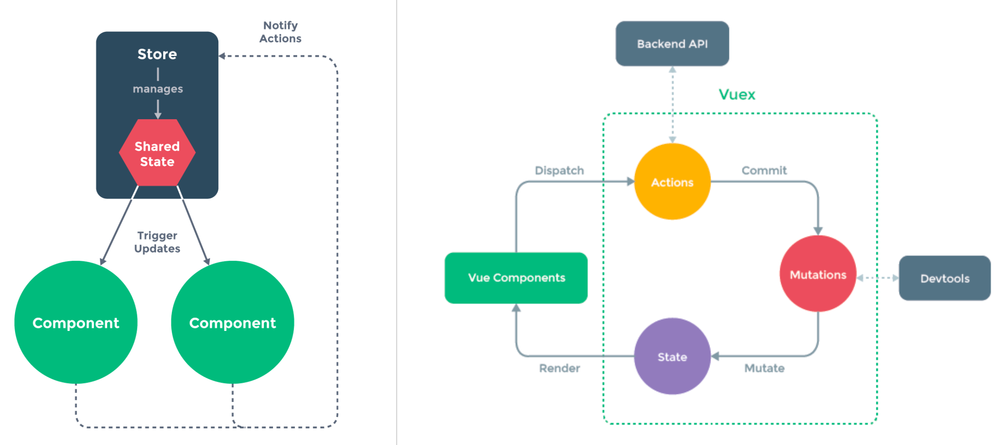

# Vuex 状态管理

- Vuex：https://vuex.vuejs.org/zh/index.html
- Pinia：https://pinia.vuejs.org/zh/

## 1 核心概念

Vuex 有5个核心概念：

- State：数据即状态，数据变化管理即状态管理。
- Getters：类似组件的computed。组件在获取state前，store会进行拦截并进行适当修改后再返回。
  - 也可返回一个回调函数，组件可调用该Getters，并传入参数。该回调函数可根据入参返回需要的值。
- Mutations：修改 State 的唯一方式是提交 Mutations。
  - Mutations中不可进行异步操作，不可从网络获取数据。Mutation修改数据，可在devtool中被跟踪并记录快照，如果采用异步操作，devtool无法跟踪变化。 
- Actions：耗时的、异步的操作在Actions里定义，如网络请求。
  - 所以，Actions提交的是Mutation，也就是调用Mutation，而不是直接变更状态。
- Modules：模块化。根据业务/组件/数据的不同，可将state和相应的操作抽离分类，形成模块化管理。


状态管理：在开发中，应用需要处理各种各样的数据，这些数据需要保存在我们应用程序中的某个位置集中管理。

- 状态：数据当前的具体值，就是一个“状态”；数据是不断变化的，也就是说状态是不断变化的。

状态管理的核心概念：

- State 状态：在 Vue 中，data 或 setup 中定义和使用的数据，就是状态。
- View 视图：在模版 template 中使用数据，模块最终渲染成 DOM，称之为视图。
- Action 行为：在页面中用户交互等因素会触发事件，事件推动状态变化，称之为行为。
- Store：仓库，即状态树。Vuex 规定单一数据源（Single Source of Truth），即一个项目中只可创建一个Store（Pinia不限制）。


Vuex 状态管理流程图：




常见的目录结构：

```js
--src
 |--store  // vuex 根目录
   |--index.js  // 创建并导出 store
   |--mutation_types.js   // 保存常量。推荐规范：mutation中的函数名称统一在这里定义
   |--modules
      |--counter.js
      |--home.js
```


## 2. State、Getters、Mutations、Actions 基本使用

流程 & 案例：

```js
//【1】store/index.js 定义 Store 并导出
import { createStore } from 'vue';
const store = createStore({
  state: () => ({
    counter: 100,    // 定义state数据
    friends: ['ninjee', 'moxy', 'hou']
  }),
  mutations: {
    increment(state) { state.counter++ }  // 定义修改数据的逻辑，必须调用mutation才可修改数据
    changeCounter(state, payload) { state.counter = payload } // payload 可接受组件commit传递的参数，
  },
  getters: {
    doubleCounter(state, getters) {
      // getters.xxx 可以调用getters中其他函数并获取返回值
      return state.counter * 2;     // 使用：$store.getters.doubleCounter
    },
    findFriendByIndex(state) {
      // 可以返回一个函数，组件可调用并传入参数，找到需要的值
      return (index) => state.friends[index];
    }
  },
  actions: {
    // context于createStore()产生的store一样，具有相同的方法，所以可以通过.commit()提交修改
    getCountAction(context, payload) {
      // 异步获取一些数据...
      const count = payload + xxx;
      console.log(context.state)               // 当前state：
    	context.commit("changeCounter", count);  // mutations
      context.getters("doubleCounter", count); // getters
  	}
  }
})
export default store


//【2】在main.js通过插件形式安装store
crateApp(App).use(store).mount('#app')

//【3】在模版中使用：$store.state
<template>
  <h2>当前计数：{{ $store.state.counter }}</h2>
</template>


//【4】修改vuex的数据：useStore()；
//【5】在代码中使用：需通过toRefs添加依赖，使解构的state不丢失响应式
import { toRefs } from 'vue';
import { useStore } from 'vuex';
const store = useStore();

// 使用state
const counter = toRefs(store.state);
console.log(counter);

// 修改state：定义触发事件的回调函数，修改counter
function increment() {
  store.commit("increment");    // 调用store中mutations定义的修改逻辑
}

function change() {
  store.commit("changCounter", 99) //调用mutations中的回调，并传递参数
}

//【6】映射：state的快速解构和使用，template无需再通过$store.state.xxx调用
//【7】映射：getters的快速解构和使用
//【8】映射：mutations的快速解构和使用【暂无】
<template>
  <h2>当前计数：{{ counter }}</h2>
	<h2>翻倍：{{ doubleCounter }}</h2>
</template>

const store = useStore();
const {counter, level} = toRefs(store.state); //【6】state
const doubleCounter = computed(() => store.getters.doubleCounter); //【7】getters


//【9】action的快速解构和使用
function actionGetCounter() {
  store.dispatch("getCountAction", 300);
}


//【10】actions中的异步操作：store/index.js 定义 Store 并导出
import { createStore } from 'vue';
const store = createStore({
  state: () => ({}),
	mutations: {
    changeCounter(state, payload) { state.counter = payload } // payload 可接受组件commit传递的参数，
  },
  getters: {},
  actions: {
    async fetchGetCounterAction(context) {
      const res = await fetch("https://123.207.32.32/xxxx/xxx/xx")  // 发起异步请求
      const data = await res.json();   // 请求得到返回
      context.commit("changeCounter", data.counter); // commit更新数据 
    }
  },
})
```

额外补充：

- map 映射的语法糖，在 Options API 中，
- 在`computed`中，通过`mapState()`建立store中state和template的映射关系；
- 在`computed`中，通过`mapGetters()`建立store中getters和template的映射关系；
- 在`method`中， 通过`mapMutations()`建立store中mutations和template的映射关系；
- 在`method`中， 通过`mapActions()`建立store中Actions和template的映射关系；


## 3. Modules 的基本使用

Modules 的命名空间

- 默认情况下，模块内部的Getters、Actions和Mutations仍然是注册在全局的命名空间中的。这样使得多个模块能够对同一个 action 或 mutation 作出响应，有可能导致命名冲突。仅有State时在局部注册的。
- 设置：`namespaced: ture`，对局部模块内限制命名空间，则所有 getter、action 及 mutation 都会自动根据模块注册的路径调整命名，使模块具有更高的封装度和复用性。

```js
//【11】modules的基本使用
// modules可根据业务逻辑对store中数据分开管理
//【文件结构】
---store
	|---index.js
  |---mutation_types.js
  |---modules //  根据业务/组件/数据逻辑，分开管理
    |---counter.js
    |---home.js

/*--【index.js】--*/
// 在index.js中，mudules引入counter和home对象
import { createStore } from 'vuex';
import homeModule from './modules/home';
import counterModule from './modules/counter';

const store = createStore({
  state: () => ({}),
  getters: {
    doubleCounter(state, getters, rootState) {  
      // 第一个参数：获取当前state内的数据；
      // 第二个参数：调用getters中其他函数；
      // 第三个参数：获取根的state内的数据，即未经过module打包的数据；
      return state.counter * 2;     // 使用：$store.getters.doubleCounter
    },
  modules: {
    home: homeModule,
    counter: counterModule
  }
});
export default store;

 
/*--【counter.js】--*/
// 定义 counter 对象，counter类的数据存储、修改、提交逻辑全部打包
const counter = {
  namespaced: ture,   // 解决命名冲突，强制要求
  state:() => ({}),
  mutations: {},
  getters: {},
  actions: {},
}
export default counter;
  

//【12】模块的使用：默认情况下(默认命名空间)
/*--【Counter.vue】--*/
// 在组件中使用：module中的state和getters、mutations时：
<template>
    <!-- 1.使用state时, 是需要state.moduleName.xxx -->
    <h2>Counter模块的counter: {{ $store.state.counter.count }}</h2>
    <!-- 2.使用getters时, 是直接getters.xxx -->
    <h2>Counter模块的doubleCounter: {{ $store.getters.doubleCount }}</h2>
</template>

// 派发dispatch、提交mutation时, 不需模块名称
function incrementCount() {
  store.dispatch("incrementCountAction")
}

//【13】模块的使用：限制命名空间(namespaced: ture)
// 使用getters、dispatch、mutaiton时, 需要 muduleName/xxxxx 调用
<template>
    <h2>Counter模块的counter: {{ $store.state.counter.count }}</h2>
		<!-- 注意，这里语法变成了方括号：getters["muduleName/xxxx"]-->
    <h2>Counter模块的doubleCounter: {{ $store.getters["counter/doubleCount"] }}</h2>
</template>

// 派发dispatch、提交mutation：
function incrementCount() {
  store.dispatch("counter/incrementCountAction");
}


//【14】在actions中修改root中的state
changeNameAtction({commit, dispatch, state, rootState, getters, rootGetters}) {
  // changeRootName为rootStore中的mutation
  commit("changeRootName", null, {root: true});
  // changeRootNameAction为rootStore中的Action
  dispatch("changeRootNameAction", null, {root: true});
  // 第一个参数：调用的方法名
  // 第二个参数：传递过去的参数 payload
  // 第三个参数：{root: true} 设置后可以调用root store中的方法。
}
```


# Pinia 状态管理

## 1 Pinia 和 Vuex 的对比

- Vuex：https://vuex.vuejs.org/zh/index.html
- Pinia：https://pinia.vuejs.org/zh/


## 2 Pinia 的 Store

Store 是一个实体，将state和对应的操作逻辑全部保存在store中，从整体上对状态进行管理。

- Pinia 的 store 不是唯一，可以定义任意多的store。
- 一旦 store 被实例化，就可以直接在store对象上访问state、getters、actions内定义的属性。
- `defineStore()` 定义一个 store，并传入：唯一标识符 + 配置对象（state、getters、actions属性）。
- `useXxx` 获得一个 store 实例，并开始使用。
- 对 store 直接解构获取 state，会失去响应性；可通过 `toRefs()` 构建响应式 ref。

Store的基本定义和使用：

```js
/*【文件结构】*/
---stores
	|---index.js  // 根文件，暴露pinia对象
	|---counter.js 	// 业务文件1
	|---home.js			// 业务文件2
	|---user.js			// 业务文件3


/*【index.js】获取pinia对象 */
import { createPinia } from 'pinia';
const pinia = createPinia();
export default pinia;


/*【home.js】定义counter的store */
import { defineStore } from 'pinia';

// 调用useCounter，可获得couter模块的store
const useCounter = defineStore("counter", {
  state: () => ({
    count: 99,
  })
})

export default useCounter;


/*【Home.vue】使用counter的store */
<template>
  <!--【2】state可直接使用，无需'.state.count'调用 -->
  <h2>count:{{ counterStore.count }}</h2>
  <!--【3】解构使用 -->
  <h2>count:{{ count }}</h2>
</template>

<script setup>
	import { storeToRefs } from 'pinia';
	import useCounter form '@/stores/counter';

	//【1】实例化coutnerStore
	const counterStore = useCounter();

	//【3】解构：关联响应式，这相当于：toRefs(counterStore);
	const { count } = storeToRefs(counterStore);

  //【4】修改state：无需像vuex通过'.commit()'，而是可以符合直觉的直接修改。 
  const incrementCount = () => {
    counterStore.count++;
  }
</script>
```


## 3 Pinia 核心概念

Pinia 有三个核心概念：

- State：相当于组件的data。
- Getters：相当于组件的computed。
- Actions：相当于组件的methods。


### State

对State的操作，Store API：

- `.$path(obj/func)`：传入一个对象/函数，可批量修改state；
- `.$reset()`：pinia内部缓存最初的数据，通过`.$reset()`可恢复最初state数据；
- `.$state(obj)`：用的少，且功能性存疑：替换整个state为一个新的对象？
- `.$subscribe()`：订阅，可监听state的的变化。

```js
/*【stores/user.js】store模块定义*/
import { defineStore } from 'pinia'

const useUser = defineStore("user", {
  state: () => ({
    name: "why",
    age: 18,
    level: 100
  })
})
export default useUser;


/*【Home.vue】组件使用store*/
<template>
  <h2>name: {{ name }}</h2>
  <h2>age: {{ age }}</h2>
  <h2>level: {{ level }}</h2>
  <button @click="changeState">修改state</button>
  <button @click="resetState">重置state</button>
</template>


<script setup>
  import useUser from '@/stores/user';
  import { storeToRefs } from 'pinia';

  const userStore = useUser();
  const { name, age, level } = storeToRefs(userStore);

  //【修改State】
  function changeState() {
    //【1】单个直接修改状态
    userStore.name = "kobe";
    userStore.age = 20;

    //【2】一次性修改多个状态
    userStore.$patch({
      name: "james",
      age: 35
    })

	//【3】pinia内部缓存最初的数据，通过$reset()可恢复最初数据
  function resetState() {
    userStore.$reset();
  }

</script>
```


### Getters & Actions

Getters 相当于 Store 的计算属性：

- 通过 `defineStore({obj})` 中的 obj 配置对象定义 getters 属性；

Actions 非常适合定义业务逻辑：

- 通过 `defineStore({obj})` 中的 obj 配置对象定义 actions 属性。

- 在actions的函数中使用this可访问当前 store 的 state。

```js
/*【counter.js】定义store*/
// 定义关于counter的store
import { defineStore } from 'pinia';
import useUser from './user';
const useCounter = defineStore("counter", {
  state: () => ({
    count: 99,
    friends: ['001', '002', '003']
  }),
  getters: {
    // 【1】基本使用
    doubleCount(state) {
      return state.count * 2
    },
    // 【2】一个getter引入另外一个getter，this指向当前store实例
    doubleCountAddOne() {
      return this.doubleCount + 1 
    },
    // 【3】getters支持返回函数，可在组件中调用，组件可传递参数
    getFriendByIndex(state) { // 入参，获取当前store的state
      return function(index) {
        return state.friends[index];
      }
    },
    // 【4】getters读取其他store中的state
    showMessage(state) {  // 入参，获取当前store的state
      const userStore = useUser(); // 获取其他store的state
      return `name:${userStore.name}-count:${state.count}`
    }
  },
  actions: {
    //【5】actions的两种使用方式（有参/无参）
    // 在actions的函数中使用this可访问当前store的state
    increment() { this.count++; },
    incrementNum(payload) {this.count += payload;}
  }
});
export default useCounter;


/*【home.js】定义store*/
import { defineStore } from 'pinia';

const useHome = defineStore("home", {
  state: () => ({
    banners: [],
    recommends: []
  }),
  actions: {
    //【6】actions异步获取数据，async函数
    async fetchHomeMultidata() {
      const res = await fetch("http://123.207.32.32:8000/home/multidata");
      const data = await res.json();
			// 保存数据
      this.banners = data.data.banner.list;
      this.recommends = data.data.recommend.list;
    }
  }
})
export default useHome;
```

```vue
/*【Home.vue】组件使用store*/
<template>
  <!--【3】调用getters，并传参 -->
  <h2>friend-001: {{ counterStore.getFriendByIndex(0) }}</h2>
  <h2>showMessage: {{ counterStore.showMessage }}</h2>
	<!--【5】调用actions -->
	<h2>doubleCount: {{ counterStore.count }}</h2>
  <button @click="changeState">修改state</button>

	<!--【6】调用actions，异步获取数据 -->
	<template v-for="item in homeStore.banners">
    <li>{{ item.title }}</li>
	</template>
</template>

<script setup>
  import useCounter from '@/stores/counter';
  import useHome from '@/stores/home';

	//【5】使用Actions，并传参
  const counterStore = useCounter();
  const changeState = () => {
    counterStore.incrementNum(10);
  }

  //【6】使用Actions，从网络异步获取数据
  const homeStore = useHome();
  homeStore.fetchHomeMultidata();
</script>
```


