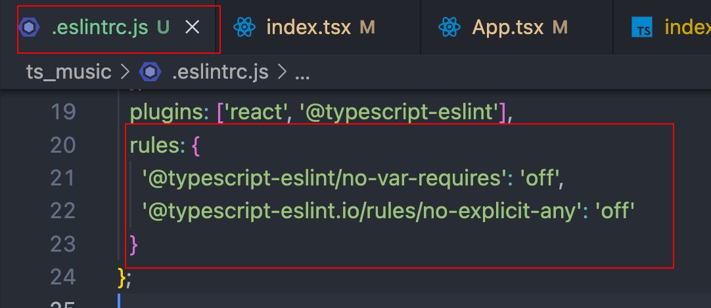

# React18 + Ts

## 1 项目启动

### 1.1 项目构建

创建项目：` create-react-app ts_music --template typescript`

类型声明文件：`react-app-env.d.ts`

- 默认：将 jpeg、png、svg 等文件，已经 `react-app.d.ts` 中声明好，并在 `react-app-env.d.ts` 中引入了。


项目配置：

- 配置 icon、标题；
- 配置 src 地址别名；
- 配置 editorconfig；
- 配置项目 Prettier；
- 配置项目 esLint；


#### 配置 src 地址别名

修改 webpack 配置的方法：

- 通过 eject 暴露 webpack 根配置文件（风险大，不推荐）；

- 通过 craco(crate-react-app config) 配置 webpack：`npm install @craco/craco -D` 

  ```json
  // package.json
  "devDependencies": {
    "@craco/craco": "^7.1.0",
    "prettier": "^2.8.8"
  }
  ```

  

通常采用方法2：

配置 craco，创建 craco.config.ts；

```js
const path = require("path");

const resolve = (dir) => path.resolve(__dirname, dir);
module.exports = {
  webpack: {
    alias: {
      "@": resolve("src"),
      components: resolve("src/components"),
    },
  },
};
```

- 配置 tsconfig.json：解决ts报错，找不到 '@' 的路径问题

  ```js
  "compilerOptions": {
    // ...
    "baseUrl": ".",
      "paths": {
        "@/*": ["src/*"]
      }
  }
  ```

- 配置 package.json：解决webpack启动，采用craco启动以应用craco配置

  ```js
  "scripts": {
  	"start": "craco start",
  	"build": "craco build",
  	"test": "craco test",
  	"ejest": "react-scripts ejest",
    "prettier": "prettier write . "   // prettier格式化：执行 npm run prettier 自动格式化本地项目
  }
  ```

#### 配置EditorConfig

1. 创建 .editorconfig 文件

   - EditorConfig 有助于为不同 IDE 编辑器上处理同一项目的多个开发人员维护一致的编码风格。
   - VSCode需要安装插件：EditorConfig for VS Code

   ```yaml
   # http://editorconfig.org
   
   root = true
   
   [*] # 表示所有文件适用
   charset = utf-8 # 设置文件字符集为 utf-8
   indent_style = space # 缩进风格（tab | space）
   indent_size = 2 # 缩进大小
   end_of_line = lf # 控制换行类型(lf | cr | crlf)
   trim_trailing_whitespace = true # 去除行尾的任意空白字符
   insert_final_newline = true # 始终在文件末尾插入一个新行
   
   [*.md] # 表示仅 md 文件适用以下规则
   max_line_length = off
   trim_trailing_whitespace = false
   ```

#### 配置项目 Prettier

- Prettier 支持绝大多数前端语言的代码格式化，支持 JavaScript、TypeScript、CSS、SCSS、Less、JSX、Angular、Vue、GraphQL、JSON、Markdown 等语言。

1. 安装 prettier：`npm install prettier -D`

   - vs code 安装 prettier 插件，并在首选项/settings 中启用 prettier：

     

2. 创建 .prettierrc 文件：

   - useTabs：使用tab缩进还是空格缩进，选择false；

   - tabWidth：tab是空格的情况下，是几个空格，选择2个；

   - printWidth：当行字符的长度，推荐80，也有人喜欢100或者120；

   - singleQuote：使用单引号还是双引号，选择true，使用单引号；

   - trailingComma：在多行输入的尾逗号是否添加，设置为 `none`，比如对象类型的最后一个属性后面是否加一个，；

   - semi：语句末尾是否要加分号，默认值true，选择false表示不加；

3. 配置 .prettierignore 文件：

   - 忽略不需要通过 prettier 格式化的文件

   ```js
   /dist/*
   .local
   .output.js
   /node_modules/**
   
   **/*.svg
   **/*.sh
   
   /public/*
   ```

4. 配置 package.json/scripts：`"prettier": "prettier --write ." `，对本项目所有文件执行一次 prettier 格式化。

```json
{
  "useTabs": false,
  "tabWidth": 2,
  "printWidth": 100, // 当前字符的长度：80, 100, 120
  "singleQuote": true,
  "trailingComma": "none",
  "semi": true    // 默认末尾加分号
}
```

#### 配置项目 ESLint

1. 安装 ESLint：`npm install eslint-plugin-prettier eslint-config-prettier -D`

   - vs code 安装 ESLint 插件；

2. 解决eslint和prettier冲突的问题：在 .prettierrc 添加插件：

   ```json
     extends: [
       'eslint:recommended',
       'plugin:react/recommended',
       'plugin:@typescript-eslint/recommended',
       'plugin:prettier/recommended' // 添加这个
     ],
   ```


3. 配置 ESLint

   1. 使用`npc eslint --init`，通过 npx 查找并调用 node_modules 中 aslant 的初始化工具；
   2. 选择 2： `To check syntax and find problems`；帮忙检查错误并提出修改意见；
   3. 选择 1：`JavaScript modules` ES 模块化语法；
   4. 选择 React、Yes (use Ts)、Browser (only run Browser)；
   5. 生成的 eslintconfig 文件方式，选择1：JavaScript；
   6. 安装依赖、选择本项目使用的包管理工具 npm；
   7. `.eslintrc.js` 文件自动生成完毕。

4. 进行适当修改：

   - 可以看到，在 `.eslintrc.js` 文件内部使用了 `module.exports` 语法，会标红；同时，在`crao.config.js` 中使用了 `require` 语法，也会标红。所以对 eslintrc 进行适当配置：

     ```js
     module.exports = {
       env: {
           browser: true,
           es2021: true,
     	    // 解决 mudule.exports 不允许使用的问题，增加 node 适配：
           node: true
         },
     	// ...
       // ...
       // 解决 require 不允许使用的问题：
       rules: {
           '@typescript-eslint/no-var-requires': 'off'
       }
     }
     ```


### 1.2 文件结构

- assets：项目资源，如css、data、img 等；
- components：当前项目的公共组件
- hooks：自定义的hook
- router：路由组件
- store：redux 数据存放
- service：网络请求
- views：页面组件
- utils：一些抽离的公共脚本
- [base-ui]：其他项目也可用的公共UI，可通用的UI组件。如后台管理的通用组件，许多项目都可通用；
- [global]：全局常量


### 1.3 CSS 重置

normalize 默认重置：

1. 安装：`npm install normalize.css`；
2. 在 `src/index.tsx` 中引入：`import 'normalize.css';`

项目自定义重置：

- 在 `src/assets/css` 中定义：`index.less` 统一出口、`common.less` 公共CSS定义、`reset.less` 初始化CSS定义。

```css
/* assets/css/index.less */
@import './common.less';
@import './reset.less';
  
/* src/index.tsx */
import 'normalize.css';
import './assets/css/index.less';
```

配置 .less 格式

1. 安装 `npm install craco-less@2.1.0-alpha.0`

2. 配置 craco.config.js

   ```js
   const path = require('path');
   const CracoLessPlugin = require('craco-less');    // 引入less
   
   const resolve = (dir) => path.resolve(__dirname, dir);
   
   module.exports = {
     plugins: [{ plugin: CracoLessPlugin }],  // 加载plugin
     webpack: {
       alias: {
         '@': resolve('src'),
         components: resolve('src/components')
       }
     }
   };
   
   ```

### 1.4 路由配置

安装：`npm install react-router-dom`;

1. 创建并配置：`@/routes/index.tsx`，导出配置 routes 对象；
2. 使用配置：`@/app.tsx` 中使用 useRoutes，并引入 routes 对象；
3. 加载路由：`@/index.tsx` 中使用 BrowserRouter 或 HashRouter 包裹根组件 `<App />`；

其他注意点：

- 设置 React Component 的初始化模版，需创建代码片段。具体内容在下文的代码片段中阐述；

- 添加根目录的重定向，使用 `<Navigate />` 组件，而不再是 redirect 函数；
- children 嵌套二级路由；
  - 注意：二级路由的导航区需通过 `<Outer />` 占位组件，以确定内容区的位置。
- 添加路由懒加载，并通过 suspense 包裹；
  - 注意，二级路由也需要用 `<Suspense />` 包裹。防止二级路由在平行切换时，react 会找到上层的 suspense 渲染，导致二级路由的内容和导航会整体刷新。设置二级路由的 suspense 后，平级切换时不会刷新二级路由的导航区，仅刷新内容区。


### 1.5 引入 redux

使用最新的 rtk 方式引入 redux（可以在 react 18 课程中补充学习一下）。

1. **安装 rtk、react-redux**

   - `npm install @reduxjs/toolkit react-redux`；

2. **配置 store/index.ts**

   ```ts
   import { configureStore } from '@reduxjs/toolkit';
   
   const store = configureStore({
     reducer: {}
   });
   
   export default store;
   ```

3. **引入 store，在 index.tsx 中**

   ```tsx
   import { Provider } from 'react-redux';
   import store from './store';
   /// ...other import
   
   const root = ReactDOM.createRoot(document.getElementById('root') as HTMLElement);
   root.render(
     <Provider store={store}>
       <BrowserRouter>
         <App />
       </BrowserRouter>
     </Provider>
   );
   ```

4. **举例：创建 `store/modules/counter.ts`**

   定义 counter modules，举例数据的保存

   ```js
   import { createSlice } from '@reduxjs/toolkit';
   
   const counterSlice = createSlice({
     name: 'counter',
     initialState: {
       count: 100,
       name: 'ninjee',
       message: 'Hello Redux'
     },
     reducers: {
       changeMessageAction(state, { payload }) {
         state.message = payload;
       }
     }
   });
   
   export default counterSlice.reducer;
   ```

5. **定义 `store/index.ts`**

   定义 index.ts，并引入 counter modules

   ```ts
   import { configureStore } from '@reduxjs/toolkit';
   import counterReducer from './modules/counter';
   
   const store = configureStore({
     reducer: {
       counter: counterReducer
     }
   });
   
   // 以下代码在第6步：
   type GetStateFnType = typeof store.getState;
   export type IRootState = ReturnType<GetStateFnType>;
   
   export default store;
   ```

6. **TypeScript：获取 store 内 state 的全部类型**

在组件中使用 state，需要对 state 加注类型，则需要提前获取 store 内保存的这些 state 的对应类型。

- 引子：getState() 返回一个state对象，获得store中的所有state。而我们希望获得这个state对象的所有类型

```ts
const state = store.getState();
```


本质上，state对象的类型，就是 getState 这个函数的返回值类型。所以，问题变为获取 getState 的返回值类型。

根据 ts 知识，获取函数的返回值类型需要两步：1获取函数类型，2获取函数返回值类型：

```ts
//[1]获取getState函数的类型：
type GetStateFnType = typeof store.getState;
//[2]获取getState函数的返回值类型：
type IRootState = ReturnType<GetStateFnType>;
```

此时，FnReturnType 就是我们需要的全部 State 类型，通常命名为 IRootState：


对以上代码进行抽离，放在 `store/index.ts` 中：

7. **在组件中使用 state**

   ```tsx
   // ...other import
   import { useSelector, shallowEqual } from 'react-redux';
   import { IRootState } from '@/store';
   
   const Main: FC = (): JSX.Element => {
     const { count, message } = useSelector(
       (state: IRootState) => ({
         count: state.counter.count,
         message: state.counter.message
       }),
       shallowEqual
     );
   
     return (
       <div className="container">
         <div>当前计数：{count}</div>
         <div>当前消息：{message}</div>
       </div>
     );
   };
   
   export default memo(Main);
   ```

8. **进一步优化，实现state类型自动约束**

`TypedUseSelectorHook` 的最佳实践，在redux的官方文档中有：[链接](https://cn.redux.js.org/tutorials/typescript-quick-start#%E5%AE%9A%E4%B9%89-hooks-%E7%B1%BB%E5%9E%8B)。

更近一步，我们期望组件中无需再引入`IRootState`类型，限制state的选择；而是在使用store中的state时，Ts可自动推导有哪些state可用，实现自动约束。

解决：引入 `TypedUseSelectorHook` 类型，该类型需传入一个范型，称为`Tstate`。

- `TypedUseSelectorHook`规定其本身是一个hook函数，该函数有两个参数；
  -  第一个参数：依然是一个函数，该函数需要携带一个参数(`state`)，类型为范型`Tstate`；该函数返回值为`TSelected`；
  - 第二个参数：可选，就是 `shallowEqual` 函数；

所以，我们可以把`IRootState`类型作为Tstate传入`TypedUseSelectorHook<Tstate>`中：

通过对 `useSelector` 做出额外的类型约束，返回自定义的 `useAppSelector`。那么在使用该函数 `useAppSelector` 时，入参 `state` 就会自动推导 `IRootState` 类型约束，而无需我们再手动进行约束。

react-redux 对`TypedUseSelectorHook` 的定义如下：


代码实现：

```ts
type GetStateFnType = typeof store.getState;
type IRootState = ReturnType<GetStateFnType>;

// 导出 useAppSelector，进行函数调用签名
export const useAppSelector: TypedUseSelectorHook<IRootState> = useSelector;
```

9. **最终redux的使用**

```ts
// 使用自定义hook：useAppSelector，state无需再手动类型约束
const { count, message } = useAppSelector(
  (state) => ({
    count: state.counter.count,
    message: state.counter.message
  }),
  shallowEqual
);
```

自动推导类型约束：


10. 自定义 useAppDispatch

Dispatch 也可通过自定义实现ts的推导类型约束：

1. 定义`useDispatch`的函数调用签名：`useAppDispatch`；
2. `useAppDispatch` 是一个函数类型，所以使用`useAppDispatch:() => any` 定义；
3. `useAppDispatch` 函数的返回值应当是一个 dispatch，所以通过 `typeof store.dispatch` 获取 dispatch 的类型；

最终代码如下：

```js
type DispatchType = typeof store.dispatch;
export const useAppDispatch: () => DispatchType = useDispatch;
```

调用`usdAppDispatch`，返回的 dispatch 可实现自动推导：


## 小技巧

#### 对 eslint 进行调整

1. 定义`const route: any[] = []`，发现 eslint 会警告提示：

   

2. 复制蓝色下划线的错误，添加在 .tsconfig.js 后和注释掉该警告提示：

   


#### React Function Component 初始化模版

**【1】React 组件 props 类型约束**

方法一：直接对props进行类型约束

缺点：对该组件添加默认 props：`Discover.defaultProps()` 时，不会有提示。因为对 props 约束直接定义在 props 本身时，ts 并不知道该组件的 props 有什么约束。

```tsx
import React, { memo } from 'react';

interface IProps {
  name: string;
  age?: number;
}

const Discover = (props: IProps): JSX.Element => {
  return (
    <div>
      <div>Discover component</div>
      <div>{props.name}</div>
      <div>{props.age}</div>
    </div>
  );
};

// defaultProps在输入时没有智能提示
// Discover.defaultProps

export default memo(Discover);
```


方法二：对组件进行约束，使用范型

- 注：新版 React 不会自动添加 `children` 属性，所以如果父组件在调用子组件时期望添加 children：`<Discover>'哈哈哈'</Discover>` 时，子组件需要手动添加 chilren 属性，并引入 `ReactNode` 类型：可添加字符串、React元素等等类型。

最后，React 的初始化模版如下：

```tsx
import React, { memo } from 'react';
import type { FC, ReactNode } from 'react';

interface IProps {
  children?: ReactNode;
  name: string;
  age?: number;
}

const Demo: FC<IProps> = (props): JSX.Element => {
  return (
    <div>
      <div>Demo component</div>
      <div>{props.name}</div>
      <div>{props.age}</div>
    </div>
  );
};

Demo.defaultProps = {
  name: 'ninjee',
  age: 18
};

export default memo(Demo);
```


#### 创建初始化 Component 代码片段

1. 精简后的初始化 template.tsx：

   ```tsx
   import React, { memo } from 'react';
   import type { FC, ReactNode } from 'react';
   
   interface IProps {
     children?: ReactNode;
   }
   
   const Template: FC<IProps> = (): JSX.Element => {
     return <div>Template component</div>;
   };
   
   export default memo(Template);
   ```

2. 打开 [snippet generator](https://snippet-generator.app/)，并设置：
   - Descripiton：ts react component
   - Tab trigger：tsreact
   - Your snippet：template.tsx 的内容，修改 `Template` 为 `${1:temp}` ；
3. 复制右侧 vscode 代码；
4. 打开vscode：首选项-Configure user snippets/配置用户代码片段，输入：typescriptreact，在其中配置；
5. 直接将复制的文件放在 typescriptreact.json 内，保存后即可。


#### React 组件进行名称修改

在组件末尾追加如下api，即可修改组件在 devtool 上的名称，方便在 debug 时快速找到该组件：

```tsx
Discover.displayName = '测试一下';
```


