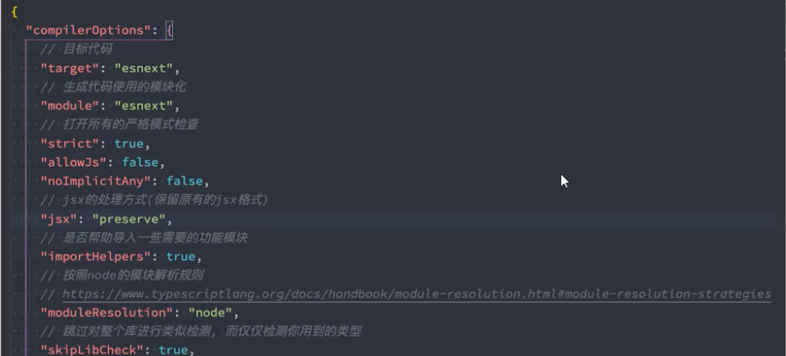

## 1 引言

**编程错误的发现越早越好**：

- 编写阶段：能在编写代码的时候发现错误，就不要在编译时再发现错误。
  - IDE的语法拼写检查。
- 编译阶段：能在代码编译阶段发现错误，就不要在代码运行期间发现错误。
  - TypeScript的类型检测机制。
- 开发阶段：能在开发阶段发现错误，就不要在测试阶段发现错误。
  - Pr核对、逻辑梳理、代码自查。
- 测试阶段：能在测试阶段发现错误，就不要在上线后再发现错误。


TypeScript 的引入，给js添加类型约束，在开发中可避免类型错误。尤其是在团队协作，不同开发者相互调用接口时，对类型的约束可以在编译代码时及时发现类型错误，而不是等到运行时发现。对类型的约束，省去对别人传入接口的参数进行类型校验，提升代码的健壮性，提升团队的开发效率。

- TypeScript 是拥有类型的JavaScript超集，它可以编译成普通、干净、完整的JavaScript代码。
- 增加类型约束、增加语法扩展：如枚举类型（Enum）、元组类型（Tuple）。
- TypeScript 最终会被编译为 JavaScript 代码，所以开发人员无需担心兼容问题，在编译时也可不借助于 Babel（通常都有 Babel，但也可使用 tsc 转换）。

TypeScript 的特点：

- 始于 JavaScipt，归于 JavaScript（超集、编译结果）；
- 是一个强大的工具，可以构建大型项目（类型约束）；
- 拥有先进的 JavaScript（保持更新、扩展语法）；


安装：

```sh
npm install typescript -g # 全局
npm install tslib @types/node -g # ts-node 依赖 tslib @types/node 这两个包

tsc --version # 5.0.4
ts-node xxx.ts # 运行
```

- 小技巧：在当前文件的末尾添加：`export {}` 指定该文件为一个独立模块，不会定义全局变量影响其他文件。


## 2 基本数据类型

### 2.1 类型注解 Type Annotation

在定义标识符时，需要添加对类型的约束：

- 类型声明： `const myName: string = 'Ninjee';`

- 类型推导：在初始化标识符时，ts 可通过赋值的类型自动推导标识符的类型注解，不需要自行定义。

  - 用 let 来进行类型推导，推导出的是通用类型；

  - 用 const 进行类型推导，结果是字面量类型；

    ```ts
    let name1 = "ninjee"   // 推导类型为：string 通用类型
    const name2 = "ninjee" // 推导类型为： ninjee 字面量类型（自定义名称）
    ```

类型举例：

- Js中存在的类型：string、number、object、symbol、null、undefined、function
- 匿名函数通常不需要添加类型，可以自动推导，如使用 forEach 进行遍历(下面有例子) 

```typescript
// 数组类型
const names1: string[] = ['abc', 'def'];
const names2: Array<string> = ['abc', 'def'];

// Object类型 (定义对象类型:type)
type InfoType = {
  name: string
  age: number
}
const info: InfoType = {
  name: 'moxy',
  age: 18
}

// null / undefined
const n: null = null;
const u: undefined = undefined;

// 函数
function sum(num1: number, num2: number): number {
  return num1 + num2;
}
// 箭头函数
const sum =  (num1: number, num2: number): number => num1 + num2;


// 匿名函数
const names = ['ninjee', 'moxy', 'hou'];
names.forEach((item, index) => {				// 回调函数的入参不需要手动添加类型约束
  console.log(item.toUpperCase(), index)
})

```


### 2.2 对象类型 type

**别名，type本质上就是给一个object起一个别名**

- 对象类型：用来细化 object 类型

```typescript
type PointType = {
  x: number;
  y: number;
  z?: number;
}

function printCoordinate(point: PointType) {
	console.log('坐标:', point.x, point.y);
}

printCoordinate({x: 20, y: 30});

export {};
```


### 2.3 类型介绍

#### (1) any

任意类型 any：表示不限制标识符的任意类型，相当于在 TypeScript 中使用 JavaScript。

做任何事都是合法的：

- 可对 any 类型的变量获取不存在的属性，方法；
- 可对 any 类型的变量赋值为任意一种类型。

 

#### (2) unknown

不确定类型 unknown

- 类似 any 类型，但在 unknown 类型的值上做任何事都是不合法的。
- 必须进行 **类型缩小**，才能根据缩小后的类型进行对应的操作。

```typescript
let foo: unknown = 'aaa';
foo = 123;   // 允许：修改unknown类型的变量

console.log(foo.length); // 不允许：unknown进行属性访问

// 类型缩小后，允许属性访问
if (typeof foo == "string") {
  console.log(foo.length)
}

```


#### (3) void

- 在 Ts 中如果一个函数没有任何的返回值，那么返回值的类型就是`void` 类型。
  - 常见的应用场景，用来指定函数类型的返回值，是 void。
  - 如果对函数约束返回值为 void 类型，那么在实际使用时，只可不返回任何值，或返回 `undefined`。

```typescript
// 表示foo函数的入参个数和类型不做限制，不返回任何值
type FooType = (...args: aby[]) => void

const foo: FooType = () => {}
```


#### (4) never

开发中很少实际定义 never 类型，在某些情况下会自动推导出 never 类型；

- 在开发框架（工具）时，可能会用到 never；
- 在封装一些类型工具时，可能会使用 never；

never 表示永远不会发生的值，比如一个函数：

- 一个死循环，或者内部发生异常的函数，其返回值时 never；

```typescript
//【1】死循环/报错
function foo(): never {
  // throw new Error('报错');
  
  while (true) 
    console.log('死循环');
}

//【2】自动推断 never
function fun() {
  return [];  // 返回空数组，推断为 never[]，表示该数组永远不会放任何东西
}

//【3】封装工具，兜底报错
// 防止工具开发人员在扩展工具时，入参添加了其他类型（如boolean），但对于没有处理case，会自动报错。
function handleMessage(message: string | number) {
  switch(typeof message) {
    case 'string':
      console.log(message.length);
      break;
    case 'number':
      console.log(message);
      break;
    default:
      const check: never = message;  // never，check永远取不到值
  }
}
```


#### (4) tuple

元组类型：类似数组结构。不同的是，元组可以存放任意不同的数据类型在其中，并且每一个数据的类型都是明确的。

对比：

- 数组：最好保存相同的数据类型，这样可以通过遍历进行整体处理。获取其中的值也无法明确知道其数据类型
- 对象：为了保存 value，必须明确指出 key。如果 key 无意义的话，增加了代码和数据量。
- 元组：
  - 相对数组而言，可以存放不同的数据类型，并知道每一个元素的类型；
  - 相对对象而言，没有额外的代码和数据量。

用处：

- 常用在函数中，特别是函数的返回值

```ts
// 想用一种数据类型保存：moxy, 18, 1.88，有三个方法：
// 1数组
const info1: any[] = ["moxy", 18, 1.88]
const info1: (string | number)[] = ['moxy', 18, 1.88]

// 2对象
const info2 = {
  name: 'moxy',
  age: 18,
  height: 1.88
}

// 3元组，对每一个元素的类型进行定义
const info3: [string, number, number] = ["moxy", 18, 1.88]


/**
 * 用处：函数返回值
 * 如：React 中的 useState，可以通过对返回值进行规定，让调用者知道第一个返回值是基本数据类型，第二个返回值是是一个函数。
 * 细节：T 为范型，通过入参 initialState 类进行自动推导并绑定后续遍历的类型
 */
const [count, setCount] = useState(10)

// 定义
function useState<T>(initialState: T): [T, (newValue: T) => void] {
  let stateValue = initialState

  function setValue(newValue: T) {
    stateValue = newValue
    // 值发生变化，重新渲染组件
  }

  return [stateValue, setValue]
}

```


## 3 细节

### 3.1 类型注解：联合类型、交叉类型

运用多种运算符，从现有类型中构建新类型

- 联合类型：要么是A类型，要么是B类型，满足其一即可。
- 交叉类型：既是A类型，又是B类型，都要满足。
- 字面量类型：对 string、numbe 等基本数据类型的内容进行限定。

```ts
// 【1】联合类型
let foo: number | string = 'abc'
type Aligment = 'left'|'right'|'center' // 字面量联合类型


// 小心：使用时需进行类型缩小
if (typeof foo === "string")
  console.log(foo.length)

// 【2】交叉类型
interface IKun {
  name: string
  age: number
}
interface ICoder {
  name: string
  coding: () => void
}

const info: IKun & ICoder = {
  name: 'why',
  age: 18,
  coding: function() {}
}
```


### 3.2 别名&接口: type、interface

类型注解解决了构建新类型的问题，但每次使用该类型时，都需要再重新完整的定义一次，增加代码量。

- 类型别名 type：对类型注解起一个别名，方便定义好的类型注解则各处进行使用。

```js
// 方便的别名 type
type MyType = number | string
```


对象类型的声明，可以通过「类型别名」，也可以通过「类型声明」。

- type 类似于 `const`，相当于对一个「自定义的类型」定义一个名称。
- interface 类似于 `class`，相当于对一个「自定义的对象类型」进行声明。

直观上，两个的使用没有区别，但特性上有局部区别：

1. 适用范围

   - `interface` 的使用范围仅适用于对象类型。

   - `type` 的使用范围更广，不仅适用于对象类型， 还可定义其他任意联合类型。

2. 重复定义

   - interface 可以多次声明同一个interface 接口名称（但不推荐，ESLint会报错）。

   - type 仅可以定义一次，不允许两个相同的 type 别名同时存在。

3. 类的继承和实现

   - interface 支持继承，可以被类实现
   - type 不支持继承

总结：

- 如果是非对象类型的定义，直接使用 type
- 如果是对象类型的定义，基本使用 interface，因为扩展性更强。

```ts
// 【2】重复定义
interface IProp {
  x: number
  y: number
}


const obj: IProp = {
  x: 1,
  y: 2,
  z: 3
}

// 这里可以额外追加属性，并存在接口提升，上面的obj对象中需要加入z变量
interface IProp {
  z: number
}

//【3】继承和类的实现
interface IPerson {
  name: string
}

// 接口继承接口
interface IKun extends IPerson {
  slogan: string
}

// 类继承接口
class Person implements IKun {
    name = 'why'
    slogan = '你干嘛'
}
```


### 3.3 类型断言: as

把 x对象 当作 y对象。

规则：断言只能将对象的类型缩小，或者类型扩大，不能指鹿为马。

- 常用1：比如，获取DOM元素，imgEl返回的型为: `Element | null`。但我们确定它是一个 `image Element`，使用类型断言 `HTMLImageElement`，则可访问 `img` 元素的特定属性。
- 常用2：非空类型断言，程序员向ts表明不需要判断某对象是否为空，强制指出该类型一定存在，ts对该对象跳过判断存在的检测。

```ts
// 不能指鹿为马
const age: number = 18
const age2 = age as string  // 错误


// 常用1
const imgEl = document.querySelector('.someImg') as HTMLImageElement
imgEl.src = 'xxxx'
imgEl.alt = '111'

// 常用2
interface IPerson {
  name: string
  friend?: {
    name: string
  }
}

const info: IPerson = {
  naem: 'moxy',
  age: 18
}
// 访问属性
info.friend?.name
// 给属性赋值
// 方案一：类型缩小
if (info.friend) info.friend.name = 'ninjee'
// 方案二：非空类型断言
info.friend!.name = 'ninjee'
```


### 3.4 字面量类型

字面量类型：对 string、numbe 等基本数据类型的内容进行限定。

```ts
type Aligment = 'left'|'right'|'center' // 字面量联合类型
type ID = 0 | 1 | 2 | 3 | 4 | 5 | 6  // 类似枚举的作用


type MethodType = 'get' | 'post'
function request(url: string, method: MethodType) {}

request('http://xxxx/com', 'get')


const info = {
  url: 'xxxx',
  method: 'post'
} as const
// 通过 as const 将info对象，转换为 readonly 对象，编译器可以很好的识别其中的内容。
// method: string 类型便可识别为正确的一个字面量类型。
request(info.url, info.method)
```


### 3.5 类型缩小

- 类型缩小 Type Narrowing / 类型保护 type guards
- 目的：限制和缩小变量的类型，确保变量可以正确的被使用。

常见的类型保护方式：

- typeof：判断类型
- ===， !==：平等缩小，一般是判断字面量类型
- instanceof：属于什么类型的实例
- in：判断该对象内是不是有指定的属性

```ts
// [1]typeof
if (typeof id === 'string') {
  // id 变量在这里一定是string类型，可以使用String类型的方法
}

// [2]平等缩小
type Direction = 'left'|'right'|'up'|'down'
if (direct === 'left') {
  // 判断字面量类型
}

// [3]instanceof
function printDate(date: string | Date) {
  if (date instanceof Date) {
    // 判断 date 是不是 Date 对象的实例
  }
}

// [4]in
interface ISwim {
  swim: () => void
}
  
interface IRun {
  run: () => void
}

function move(animal: ISwim | IRun) {
  // 通过 in，判断传入的animal对象是否包含指定的属性
  if ('swim' in animal) animal.swim()
  else if ('run' in animal) animal.run()
}

const fish: ISwim = {
  swim: function() {}
}

const dog: IRun = {
  run: function() {}
}

move(fish);
move(dog);
```


### 3.6 ts 类型检测 - 鸭子类型

ts 类型检测，并不是类似 Java 的严格审查，而是只关心属性和行为，不关心具体的类型。

```ts
class Person {
    constructor(public name: string, public age: number) {}
}

class Dog {
    constructor(public name: string, public age: number) {}
}

function printPerson(p: Person) {
    console.log(p.name, p.age)
}

// 以下传入 printPerson 的对象，即便不是 Person 的实例化，只要有类似的属性和方法，便检测通过
printPerson(new Person('Moxy', 18))
printPerson({name: '汾酒青花瓷', age: 20})
printPerson(new Dog('旺财', 3))
```


## 4 函数类型

- 函数表达式：`() => void`
- 函数调用签名：`interface { (): void}`
- 函数构造签名：`interface {new (): void}`


### 4.1 函数类型表达式 Function Type Expressions

函数 bar 本身也是一个标识符，也应该有自己的类型。

- 使用函数类型表达式对函数类型进行约束。

```ts
// 等号左边：标识符 bar 的类型, (num1: number) => string
// 等号右边：对函数的具体定义, (arg: number): string => {...}
const bar: (num1: number) => string = (arg: number): string => {
  return 'OK'
}

// 如果将 bar 的类型添加别名，则有如下写法：
type BarType = (num1: number) => string

const newBar: BarType = (arg: number): string => {
    return 'OK'
}
// 有了类型约束，后面对函数的类型约束也可省略
const newBar2: BarType = (arg) => {
    return "OK"
}
```


### 4.2 调用签名 Call Signatures

函数的调用签名

- 在 JavaScript 中，函数除了可以调用外，还可拥有自己的属性。
- 对函数进行类型限定，无法表达其额外的属性，使用调用签名则可满足既有属性，又有函数调用的需求。

应用场景：

1. 如果只是描述函数类型本身（函数可以被调用），使用函数类型表达式 Function Type Expressions。
2. 如果函数不仅可被调用，还需拥有对象的属性，使用函数调用签名 Call Signatures。

书写区别：

1. 函数类型表达式中，返回值通过 “**箭头**” 规定。
2. 函数调用签名中，返回值通过 “**冒号**” 规定。

```ts
interface IBar {
    name: string
    age: number
    // 函数调用签名，(参数列表): 返回值类型
    (num1: number): number
}

const bar: IBar = (num1: number): number => {
    return num1
}

bar.name = 'moxy'
bar.age = 18
bar(123)
```


### 4.3 构造签名 

当函数通过 new 来调用，通过构造签名进行类型限定。

- 默认情况下，当在 ts 中 `new foo()` 的方式调用函数时，是不会报错的。但 ts 无法正确推导出 foo 的类型。通过 **构造签名** 可让 ts 对该函数的具体类型进行正确推导。
- 规则：通过 `new` 关键字，指明该函数可通过 new 调用。

```ts
class Person {
}

interface IClassPerson {
    new (): Person  // 构造签名
}


// 期望描述 fn 是一个可构造的(new) 的一个函数，不报错
function factory(fn: IClassPerson) {
    const f = new fn()
    return f
}
```


其他：可选参数、参数的默认值、剩余参数

- 可选参数：
  - 定义时，可选类型参数需放在最后；

- 有默认值的参数：
  - 允许不注明类型(自动推导)；
  - 允许在调用时不传递参数；
  - 允许在调用时传递 `undefined`；
- 剩余参数：
  - 剩余参数用数组类型进行收集，可对数组成员的类型进行限制。

```ts
/** 可选参数 */
function foo(x: number, y?: number) {
    return x
}

foo(1, 2)
foo(1)


/** 参数的默认值 */
function bar(x: number, y = 100) {
    return x + y
}
bar(1, 2)
bar(1, undefined) // 允许接收 undefined
bar(1)


/** 剩余参数 */
function foo(...arg: (string|number)[]) {
    return arg
}
foo(123, 123)
foo('abc', 123)
```


### 4.4  函数重载

在实际的业务时，函数重载用的相对较少，更多的用在框架开发，公共方法的开发。

ts 中重载签名的书写方式：

- 仅写函数名称、入参类型、返回值类型，**不编写函数体**
- 多个重载函数，定义多个重载签名；

```ts
function add(arg1, arg2) {
    return arg1 + arg2
}

// 调用函数时，只能将两个数组，或两个字符串进行相加
add(10, 20)
add('abc', 'cba')

/** 函数重载 */
// 【1】编写重载签名
function add(arg1: number, arg2: number): number
function add(arg1: string, arg2: string): string


// 【2】编写通用的函数实现
function add(arg1: any, arg2: any){
    return arg1 + arg2
}

// 函数的重载
add(123, 321)  // 444
add('moxy ', 'ninjee') // "moxy ninjee" 
```


### 4.5 (了解)this 相关的内置工具

ts 提供了一些工具类型来辅助进行常见的类型转换，这些类型全局可用。这些方法在框架开发时会用到，但开发业务代码时用的少。

**`thisParameterType`**

- 用于提取一个函数类型 Type 的 this（opens new window）参数类型；
- 如果这个函数类型没有 this 参数返回 `unknown`

**`OmitThisParameter`**

- 删除 this 类型，获取其他剩余的函数类型

```ts
function foo(this: {name: string}, info: {name: string}) {
    console.log(this, info)
}

// 函数类型
type FooType = typeof foo
// 函数中 this 的类型
type FooThisType = ThisParameterType<FooType>
// 删除 this 类型，获取剩余的函数类型
type PureFooType = OmitThisParameter<FooType>
```

**`ThisType`**

- 用于绑定一个上下文当中的 this ，提升开发效率

```ts
interface IState {
    name: string
    age: number
}
interface IStore {
    state: IState
    eating: () => void
    running: () => void
}

const store: IStore = {
    state: {
        name: 'moxy',
        age: 18
    },
    // 如果要在函数内调用this,必须显示绑定this类型，较为繁琐
  	// 如果不进行显示定义，而直接使用this，就会直接报错
    eating: function(this: IState) {
        console.log(this.name)
    },
    running: function(this: IState) {
        console.log(this.age)
    }
}

// 使用ThisType绑定上下文的this，无需在函数中额外定义参数，更简便
const store2: IStore & ThisType<IState> = {
    state: {
        name: 'moxy',
        age: 18
    },
    eating: function() {
        console.log(this.name)
    },
    running: function() {
        console.log(this.age)
    }
}
```


## 5 面相对象

### 5.1 ts 类的基本使用

类的成员和属性存在 3 种修饰符：

- `public`：该成员在任何地方可访问、共有的属性 / 方法、默认属性为 `public`；
- `private`：该成员仅在该类的内部可访问，外界无法访问，私有的属性 / 方法；
- `protected`：该成员仅在类自身 / 子类 中可访问，外界无法访问，受保护的属性 / 方法；

```ts
class Person {
    // 成员属性：声明成员属性
    public name: string
    private age: number
    protected call: string

    constructor(name: string, age: number, call: string) {
        this.name = name
        this.age = age
        this.call = call
    }

    protected eating() {
        // 内部允许访问
        console.log('吃东西', this.age)
    }

}

const p1 = new Person('moxy', 18, 'hello ~')

p1.name
// 外部不允许访问
// p1.age
// p1.call

class Student extends Person {
    say() {
        // protected 子类内部可访问
        console.log('打招呼', this.call)
        // private 子类不可访问私有属性
        // console.log('身高', this.age)
    }
}

const s1 = new Student('ninjee', 22, 'hi ~')
s1.say()
```


### 5.2 `readonly` 只读

```ts
class Person {
    public readonly name: string
		private readonly age: number
    
    constructor(name: string, age: number) {
        this.name = name
        this.age = age
    }
}
```


### 5.3 getter / setter

私有属性外界无法直接访问，可以通过 getter 和 setter 进行访问。

- 主要作用：getter 和 setter 可视作 class 内部的拦截器，修改和访问变量时可判断操作是否符合预期 / 是否合法，并进行适当修饰。

```ts
class Person {
    private _name: string
    
    constructor(name: string) {
        this._name = name
    }

    // setter/getter
    set name(newValue: string) {
        this._name = newValue
    }

    get name() {
        return this._name
    }
}

const p1 = new Person('moxy')

// 私有属性外界不可访问
p1._name 
// 利用 getter / setter 访问私有属性
p1.name = 'ninjee'
p1.name
```


### 5.4 参数属性 Parameter Properties

把一个构造函数转换成一个同名同值的类属性。

- 是一个语法糖
  - 在构造函数前添加修饰符 public、prvivate、protected、readonly，创建参数属性，ts 会自动定义参数和赋值。

```ts
class Person {
    name: string
    private readonly age: number
    protected height: number
    
    constructor(name: string, age: number, height: number) {
        this.name = name
        this.age = age
        this.height = height
    }
}

// 语法糖：相当于上面的代码。自动：声明属性 + 赋值
class Person {    
    constructor(public name: string,private readonly age: number, protected height: number) {}
}


const p1 = new Person('moxy', 18, 180)
```


### 5.5 抽象类 abstract

JavaScript 中原生没有抽象类，但 java 中有相关的概念，ts 将其实现了。

- **继承** 是 **多态** 的前提。
- 在定义通用的调用接口时，通常让调用者传入父类，通过多态来实现更加灵活的调用方式。
- 但是，父类本身通常不需要对方法进行具体的实现，仅需定义方法的名称、结构等关键信息，以明确方法的用处。具体的方法实现需子类继承后，根据不同的需求进行实现。这种父类称之为 “**抽象类**”，对应的方法称之为 “**抽象方法**”。
- **多态**：父类引用，指向子类对象。

特点：

- 抽象类、抽象方法，必须添加 `abstract` 关键字；
- 只有抽象类内，才允许定义抽象方法；
- 抽象类不允许创建实例，仅允许子类实例化；

```ts
// 抽象类
abstract class Shape {
    // 抽象方法，只有声明，没有实现。让子类必须自行实现
    abstract getArea(): number
}

// 矩形
class Rectangle extends Shape {
    constructor(public width: number, public height: number) {
        super()
    }

    getArea() {
        return this.width * this.height
    }
}

// 圆形
class Circle extends Shape {
    constructor(public radius: number){
        super()
    }

    getArea() {
        return this.radius ** 2 * Math.PI
    }
}


// 【1】多态：父类引用，指向子类对象
const shape1: Shape = new Rectangle(10, 20)
const shape2: Shape = new Circle(10)


// 【2】通用函数：获取面积
function calcArea(shape: Shape) {
    return shape.getArea()
}

// 鸭子类型
calcArea(new Rectangle(10, 20))
calcArea(new Circle(5))
```


#### 补充：‘抽象类’ 和 ‘接口’ 的区别：

**相同点：**

1. 都不能被实例化，都位于继承树的上层，用于被其他类实现和继承；
2. 都可以包含抽象方法，实现接口或抽象类的普通子类都必须实现定义的抽象方法。

**不同点：**

1. 抽象类是事物的抽象，抽象类用来捕捉子类的通用特性，接口通常是一些行为的描述；
   - 抽象类是对事物的抽象，表达的是 is a 的关系。猫是一种动物，动物是一个抽象类；
   - 接口是对行为的抽象，表达的是 has a 的关系。猫拥有跑、爬树的行为，跑、爬树是两个接口。
2. 抽象类通常用于一系列关系紧密的类之间，接口只是用来描述一个类应该具有什么行为；
3. 接口可以被 **多层实现** ，而抽象类只能 **单一继承**；
4. 抽象类中 **可以有实现体**，接口中 **只能有函数声明**；


### 5.6 类的特性

类的作用：

1. 可以创建类对应的实例对象；
2. 类本身可以作为这个实例的类型；
3. 类也可以当作一个 **有构造签名** 的对象 / 函数；

```ts
class Person {
    constructor(public name: string, public age: number) {}
}

// 2 Person类的名称就是类型
const p: Person = new Person('ninjee',18)

// 3 一个有构造签名的对象/函数
function factory(ctor: new(arg1: string, arg2: number) => void) {}
factory(Person)
```


### 5.7 索引签名 Index Signatures

对象类型的索引签名。

- 对一个对象 object 的索引访问： `object[xxx]` 进行约束比如：
  - `xxx` 的类型，是 string，还是 number 等；
  - `object[xxx]` 的返回值，是 string，还是 number 等。

```ts
interface ICollection {
    // 必须具备 length 属性 
    length: number

    // 索引签名，标明访问该对象的方式
    // 这里访问要求访问时必须使用 number 类型，且返回值类型是 string
    [index: number]: string
		// [key: string]: string
}

function iteratorCollection(collection: ICollection) {
    // 允许下标访问
    collection[0]
    // 不允许字符串访问
    // collection['abc']
}

iteratorCollection(['abc', 'cba', 'nba'])
iteratorCollection([123, 111])  // 访问的返回值不是string，报错
iteratorCollection({length: 10})  // 即使是一个object，满足要求便不报错
```


### 5.8 实现接口

不仅接口可以通过 `extends` 继承接口，类也可以通过 `implements` 实现接口。

- 类仅可继承一个类，但可以实现多个接口

```ts
interface IPerson {
    name: string
    age: number
}

interface IKun {
    slogan: string
}

// 类实现多个接口
class Person implements IPerson, IKun {
    constructor(public name: string, public age: number, public slogan: string ) {}
}
```


### 5.9  枚举类型

把所有可能性的值列举出来。

- 将一组可能出现的值，一个个列举出来，定义在一个类型中，这个类型就是枚举类型。
- 允许开发这定义一组命名常量，常量可以是数组、字符串类型。

枚举值：

- 枚举类型是有值的，默认第一个类型为 0，以此递增；
- 如果手动对第一个赋值为 10，则后续枚举类型会递增；
- 也可手动设置为 string 类型。

```ts
// 定义
enum Direction {
 UP,
 DOWN,
 LEFT,
 RIGHT 
}

// 使用: 类型约束 + 对象调用
const d1: Direction = Direction.DOWN
const d2: Direction = Direction.UP

enum Direction {
 UP,
 DOWN,
 LEFT,
 RIGHT 
}


// 枚举值：有些框架喜欢通过位运算定义
enum Operation {
    READ = 1 << 0,  
    WRITE = 1 << 1
}
// 既可读、又可写：Operation.READ && Operation.WRITE => 值 '11'
```


## 6 范型编程

### 6.1 基本

软件工程的主要目的，不仅是构建明确和一致的 **API**，还要让代码具有很强的 **可重用性**。

- 参数的类型是否可以参数化？
- 通过传入不同的函数参数，让 API 完成不同的操作。操作完成后的返回值，也有确定的类型和明确的属性（方法）。

下例：通过传入范型，可让函数具有高可用的同时（**支持传入多种类型的入参**），**函数返回值的类型和属性也可进行约束**。

- 调用时，可进行自动类型推断。

**范型 T 相当于是一个变量，用于记录本次调用的类型，所以在整个函数的执行周期中，一直保留这参数的类型。**

````ts
function bar<Type>(arg: Type) {
  return arg
}

const res1 = bar<number>(123)
const res11 = bar(123)    // 自动类型推断
const res2 = bar('abc')
const res3 = bar({name: 'moxy'})
````


**举例1：`useState` 的练习**

```js
// 效果相同的简写：
// function useState<T>(initialState: T) {
function useState<T>(initialState: T): [T, (newState: T) => void] {
    let state = initialState
    
    function setState(newState: T) {
        state = newState
        // 页面重新渲染
    }

    return [state, setState]
}

// 每次在调用时传递不同的类型，通过范型约束返回的 state 和 setState 类型。
const [count, setCount] = useState<number>(10)
const [count, setCount] = useState(10)    // 自动推断
const [banners, setBanners] = useState<string[]>([])  // 数组内容无法正确推断，通常手动定义范型

setCount(20)    // 正确
setCount('moxy')  // 入参类型错误，报错
```


**举例2：**

- 接口使用范型
- 范型可以添加默认值

```ts
interface IKun<T = number> {
    name: string
    slogan: T
}

const kun: IKun<string> = {
    name: 'moxy',
    slogan: 'haha'
}

// 范型使用默认值 number
const kunkun: IKun = {
    name: 'moxy',
    slogan: 666
}
```


**举例3：范型类的使用**

```ts
class Point<T = number> {
    constructor(public x:T, public y:T) {}
}

const p1 = new Point(10, 20)  // 使用范型默认值
const p2 = new Point('111', '112') // 范型类可自动类型推断
console.log(p1.x)  // 10
console.log(p2.x)  // '111'
```


### 6.2 范型约束 Generic Constraints

**`extends`**：有时候我们希望传入的类型有某些共性，但这些共性可能不是在同一种类型中。

**`keyof`**：`A keyof B` 获取 B 的所有属性名，并构建为成一个联合类型返回给 A。


**举例1：**extends

- 需求：要求约束传入的对象都是有 length 属性的，且 ts 可正确推断出返回值的类型，和入参类型一致。

- 特点：通过 `T extends ILength` 对范型 T 进行约束，必须遵守 ILength 接口的类型约束。

```ts
interface ILength {
    length: number
}

function getInfo<T extends ILength>(arg: T): T {
    return arg
}

const info1 = getInfo('aaaa')
const info2 = getInfo(['111', '222', '333'])
const info3 = getInfo({ length: 10})
const info4 = getInfo({ })  // 报错，没有 length 属性
```


**举例2**: keyof

- `A keyof B` 获取 B 的所有属性名，并构建为成一个联合类型返回给 A。

```ts
interface IKun {
    name: string
    age: number
    slogan: string
}

type IKunKeys = keyof IKun // 联合类型：'name' | 'age' | 'slogan'

const key1: IKunKeys = 'name'
const key2: IKunKeys = 'age'
const key3: IKunKeys = 'height'   // 报错，不属于 IKunKeys 类型
```


**举例3:** extends + keyof

- 特点：在范型约束中，使用参数类型。
- 目的：声明一个类型参数 K，这个类型参数 K 被其他类型参数 O 约束。
- 需求：该函数要求传入一个对象 obj，和一个属性名 key。要求该对象 obj 内必须有这个属性名 key，所以要对 key 做约束。

```ts
function getObjectPorperty<O, K extends keyof O>(obj: O, key: K) {
	return obj[key]
}

const info = {
  name: 'why',
  age: 18, 
  height: 1.88
}

const v1 = getObjectPorperty(info, 'address') // 报错，address不属于info对象中的属性
const v2 = getObjectPorperty(info, 'name')    // 正确
```


### 6.3 映射类型、条件类型

#### (1) 映射类型 Mapped Types 基本使用

业务开发用的很少，只有在框架开发时才用，理解较难。

作用：一个类型许油基于另外一个类型来创建，但是不想直接拷贝一份，这个时候考虑使用映射类型。

- 大部分的内置工具是通过映射类型实现的；
- 大部分的类型体操题目也是通过映射类型完成的。

映射类型建立在索引签名的语法上：

- 必须使用 type，而不能使用 interface；
- 映射类型，就是使用了 `PropertyKeys` 联合类型的范型；
- 其中 `PropertyKeys` 大多是通过 keyof 创建，然后循环遍历键名，创建一个类型。


举例：拷贝一份 IPerson，并对内容进行适当修改，创建新的 NewPerson

```ts
interface IPerson {
    name: string
    age: number
}

type MapPerson1<T> = {
    [key in keyof T]?: T[key]

    // 索引类型，依次使用（遍历）,这相当于：
    // name: T[name]  ==> name?: string
    // age: T[age]    ==>  age?: number
}

type MapPerson2<T> = {
    [key in keyof T]: boolean

    // 这相当于：
    // name: boolean
    // age: boolean
}

type NewPerson1 = MapPerson<IPerson>   // 新 type: {name?: string, age?: number}
type NewPerson2 = MapPerson<IPerson>   // 新 type: {name: boolean, age: boolean}
```


#### (2) 映射类型修饰符 Mapping Modifiers

修饰符：

- `readonly`，设置属性可读；

- `?`，设置属性可选；


#### (3) 条件类型：

`extends`、`infer`、`as`、`keyof` ....

- 修饰符前可以添加 `+` 和 `-`，如果没有任何添加，则默认添加 `+`。
- 加号表示添加后面的修饰符，减号表示减去后面的修饰符

```ts
interface IPerson {
    name?: string
    age?: number
    height?: number
    address: string
}

type MapPerson<T> = {
    +readonly [Property in keyof T]-?: T[Property]
}

type NewPerson = MapPerson<IPerson>
// 新的类型：开头添加了 readonly，末尾减去了可选类型
// type NewPerson = {
//     readonly name: string;
//     readonly age: number;
//     readonly height: number;
//     readonly address: string;
// }
```


### 6.4 类型工具


## 7 扩展

### 7.1 模块

#### (1) 非模块 Non-modules

Ts 认为的模块，与 Js 一样：

- 在 js 中，没有 export 的 js 文件都被认为是一个脚本，而非一个模块；
- 在一个脚本文件中，变量和类型会被声明在共享的全局作用域中，将多个输入文件合成并输出一个文件，或者在 HTML 使用多个 `<script>` 标签加载这些文件。

非模块 `export {}`

- 如果有一个文件，没有任何 import 或者 export，但是希望他被作为模块处理，添加这行代码：`export {}`
- 这样会把文件变为一个没有导出任何内容的模块。

类型导入

- 在倒入时添加 type，指定导入的是一个类型，而不是普通对象。即使不添加 type 也可正常使用，但推荐添加 type。
- 原因：类型仅在编写代码时供 ts 校验使用，而会在编译前删除，不会对 js 代码编译造成性能影响。
  - 可以让一些非 Typescript 编译器（如 Babel, swc, esbuild (vite) ）知道什么样的导入可以被安全移除。

```ts
import type { IPerson, IProp } from './type'
```


### 7.2 命名空间 namespace

命名空间是 ts 自己的模块化格式，是在 es 模块化标准之前出现的。现在更推荐使用 es 标准。

```ts
export namespace Price {
    export const name = 'price'
    export function format(price: string) {
        return "$20.00"
    }
}
```


### 7.3 声明文件 `.d.ts`

`.d.ts` 文件

- 之前编写的 `.ts` 文件，最终会被输出为 `.js` 文件；
- `.d.ts` 文件，用来做类型的声明 declare，称为类型声明 Type Declaration / 类型定义 Type Definition 文件。
- 该文件内不会写逻辑，仅仅用来做类型检测。

```ts
// 内置声明文件
// 来源：lib.dom.d.ts
const h2El = document.createElement("h2");

// 来源：lib.es2015.d.ts
const promise = new Promise((resolve, reject) => {});
```

类型声明的来源：内置类型声明、第三方库外部定义类型声明、开发者自定义类型声明。

- 内置声明文件：如 `../Microsoft VS Code/../node_modules/typescript/lib/lib.dom.d.ts`，只要安装过 ts 就会内置。
  - 通常的命名方式：`lib.xxx.d.ts`
  - `tsconfig.json` 可配置哪些 `.d.ts` 文件可以使用，默认关键字 ：`target: es2015`
- 外部定义类型声明文件：
  - 有些第三方库中，自己有类型声明(`.d.ts` 文件)，可以直接使用；
  - 第三方没有，通过社区的一个公有库 `Definitly Typed` 存放类型声明文件
    - 库地址：https://github.com/DefinitelyTyped/DefinitelyTyped
    - 查找地址：https://www.typescriptlang.org/dt/search?search= / https://github.blog/changelog/2020-12-16-npm-displays-packages-with-bundled-typescript-declarations/
    - 比如 React 的类型声明：`npm i @types/react --save-dev`
- 自定义类型声明文件：
  - 如果内置、第三方都没有声明，则可自行声明类型文件：`xxx.d.ts`


#### declare

`declare module xxx` 模块声明，在一个模块内部导出的类型，都需要通过导入该模块后才可调用：

- 给自己的代码声明一些类型，方便该类代码在多个地方使用。

```ts
/** moxy.d.ts 自定义声明文件 */
declare module "moxy" {
    export function join(...args: any[]): any;
}


/** index.ts */
// 可以引入自定义的 moxy 模块，并调用其中的方法
import moxy from "moxy";
moxy.join(111);
```


例子1: 需要自行编写类型声明

```ts
// 在 index.html 中的 <script> 中定义以下变量，虽然是全局变量，但 ts 无法正确引入
const moxyName = 'moxy'
const moxyAge = 18
const moxyHeight = 180


// 解决：创建声明文件：index.d.ts
declare const moxyName = string
declare const moxyAge = number
declare const moxyHeight = number


// 在 index.ts 中，我们可以直接使用全局变量：
console.log(moxyName, moxyAge, moxyHeight);
```


例子2: 声明文件模块

- 开发 vue 的过程中，ts 默认不识别 `.vue` 文件，需要进行文件声明；
- 在开发中需要引入 `jpg` 等文件，ts 也不支持，需要对其声明；

```ts
// index.d.ts
declare module "*.png"
declare module "*.jpg"
declare module "*.jpeg"
declare module "*.svg"

declare module "*.vue"
```

`vue` 默认引入的模块书写方式如下：


### 7.4 tsconfig 配置文件

作用：

1. 主要作用，让 Typescript Compiler 在编译时，知道如何去编译 Typescript 代码和进行类型检测；
   - 比如：是否允许不明确的 this  选项，是否允许隐式的 any 类型；
   - 比如：将 typescript 代码编译成什么版本的 javascript 代码；
2. 让编辑器，如 VS Code 可以按照正确的方式识别 ts 代码；
   - 对于哪些语法进行提示、类型错误检测等。


**tsconfig 顶层选项**


```JS
{
  "compilerOptions": { ... },
  "files": [], // 指定项目哪些ts文件需要进行编译，
	"include": ["src/**/*", "types/**/*"], // 在数组中指出项目中哪些目录中的文件需要编译
  "exclude": [] // 在include的包含范围内，排除不需要tsc编译的文件
	//其他选项
}
```

**常见的 `compilerOptions`：**




- `paths`：修改别名时，这里也需要配置。


## 8 封装 axios

ts_project 项目中有，课程内容为 ts 课程第四天（day103 202）


## 9 特点

**Typescript 的编写是否报错，仅遵循与 TypeScript 内部的规则，有许多自己的规定。**

- 细节1：Typescript 对于传入的函数类型的参数个数不进行检测。

```js
type CalcType = (num1: number, num2: number) => number

function calc(calcFn: CalcType) {}


// 原本规定clac传入的函数必须是2个参数，但只传入1个参数也不报错。
calc(function(10){
  return 123
})
```

- 细节2：Typescript 第一次定义的对象，保持 “新鲜”，必须遵循规定的类型；但在第二次定义时，则不进行类型检测。下例中 info1 不是首次定义，则不报错；info2 是首次定义，报错。

```ts
interface IPerson {
    name: string
    age: number
}

const p = {
    name: 'moxy',
    age: 18,
    height: 1.88,
    address: '北京市'
}

// 不报错
const info1: IPerson = p

// 报错，IPerson 限定仅有两个属性
const info2 : IPerson = {
    name: 'moxy',
    age: 18,
    height: 1.88,
    address: '北京市'
}
```


- 演练场：https://www.typescriptlang.org/zh/play


