# Vue3 + TypeScript 后台管理项目

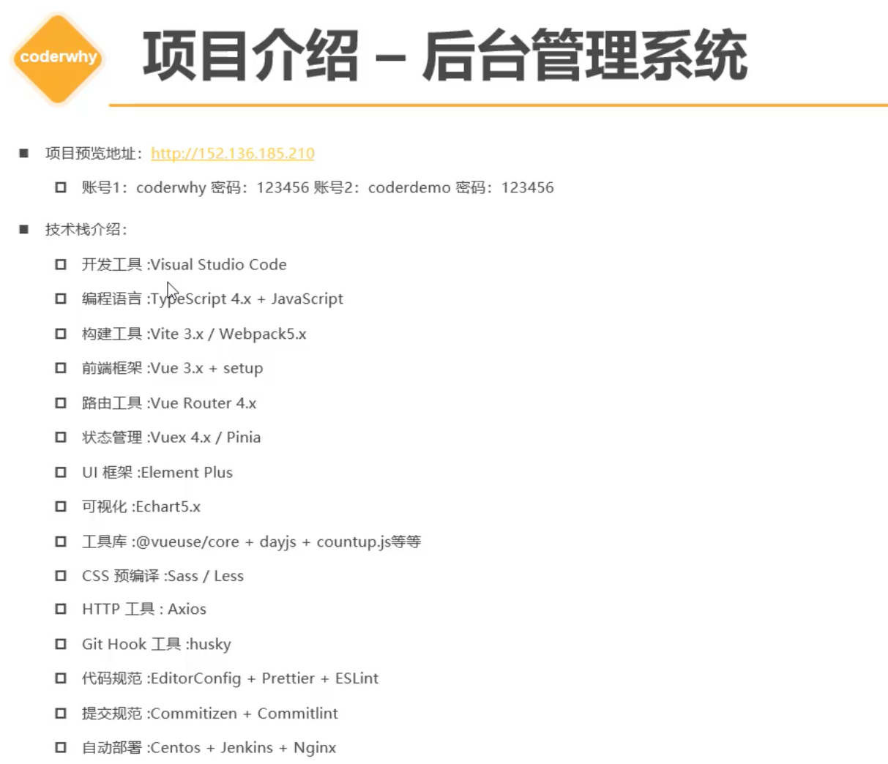


## Step 1 创建 vue 项目

- 文档：cn.vuejs.org

（1）创建 vue 项目

1. 使用 webpack
   - 安装脚手架：`npm install @vue/cli -g `；
   - 创建项目：`vue create xxx`，可自定义配置。
2. 使用 vite
   - 创建项目：`npm init vue@latest`  最新版 / `npm init vue`；
     - 该操作会自动安装本地工具：`create-vue`；
   - 该项目没有安装依赖，进入项目后 `npm install`；


本项目使用 vite，配置选项：

- ✅：typescript, Vue Router, Pinia, ESLint, Prettier
- ❌：JSX, unit testing, end-to-end test, 


（2）配置 tsconfig 相关

```sh
# 总的配置文件，导入app和node，通常不做调整
tsconfig.json

# 本项目环境配置
tsconfig.app.json

# node环境配置（vite环境、服务器端ssr）
tsconfig.node.json
```


## Step 2 项目搭建规范

- 项目最终打包为：default_project


### 2.1 集成editorconfig配置

说明：EditorConfig 有助于为不同 IDE 编辑器上处理同一项目的多个开发人员维护一致的编码风格。

流程：

1. 安装插件：`editor config for VS code`。
2. 创建文件：`.editorconfig `，并放入下列内容。

```yaml
# http://editorconfig.org

root = true

[*] # 表示所有文件适用
charset = utf-8 # 设置文件字符集为 utf-8
indent_style = space # 缩进风格（tab | space）
indent_size = 2 # 缩进大小
end_of_line = lf # 控制换行类型(lf | cr | crlf)
trim_trailing_whitespace = true # 去除行尾的任意空白字符
insert_final_newline = true # 始终在文件末尾插入一个新行

[*.md] # 表示仅 md 文件适用以下规则
max_line_length = off
trim_trailing_whitespace = false
```


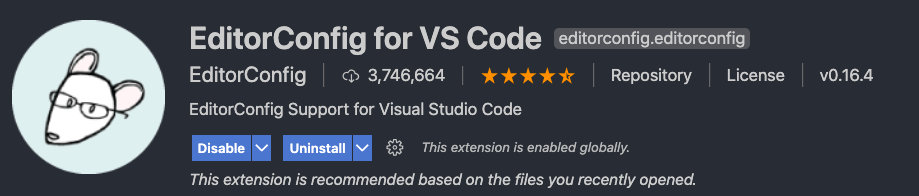


### 2.2 使用prettier工具

说明：Prettier 是代码格式化工具，支持主流前端等语言（js、ts、css、less、vue、react、md...）。

流程：

1. 安装 prettier (vue创建时已安装)

```shell
npm install prettier -D
```

2. 配置 `.prettierrc.json` 文件

```json
{
  "useTabs": false,
  "tabWidth": 2,
  "printWidth": 80,
  "singleQuote": true,
  "trailingComma": "none",
  "semi": false
}
```

- 说明：

  - useTabs：使用tab缩进还是空格缩进，选择 false 空格锁进；

  * tabWidth：tab是空格的情况下，是几个空格，选择2个；

  * printWidth：当行字符的长度，推荐80，100，120；

  * singleQuote：使用单引号还是双引号，true 为单引号；

  * trailingComma：在多行输入的尾逗号是否添加，设置为 `none`，比如对象的最后一个属性否加`,`；

  * semi：语句末尾是否要加分号，默认 true 添加；


3. 创建 `.prettierignore` 忽略文件

```
/dist/*
.local
.output.js
/node_modules/**

**/*.svg
**/*.sh

/public/*
```


4. 安装 `prettier` 插件

VSCode 中配置：

- settings =>format on save => 勾选上

- settings => editor default format => 选择 prettier

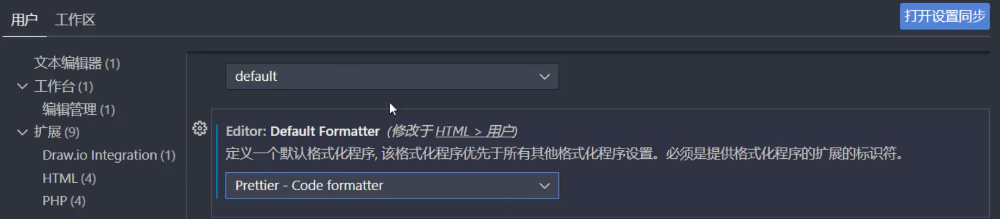


### 2.3 使用ESLint检测

流程：

1. 项目创建时自动导入并配置 ESLint

2. VSCode 安装 ESLint 插件：

3. 解决 eslint 和 prettier 冲突的问题：

   1. 安装插件：

      ```shell
      npm install eslint-plugin-prettier -D
      ```

   2. `.eslintrc.cjs` 添加 prettier 插件：

      ```json
        extends: [
          "plugin:vue/vue3-essential",
          "eslint:recommended",
          "@vue/typescript/recommended",
          "@vue/prettier",
          "@vue/prettier/@typescript-eslint",
          'plugin:prettier/recommended' // 添加这个
        ],
      ```

4. 关闭部分 ESLint 检测：

   在 .eslintrc.cjs 中添加 rules 字段，可配置 ESLint 的其他规则。比如下面例子中，将“已声明但未使用的变量”警告提示关闭。

   ```js
     rules: {
       '@typescript-eslint/no-unused-vars': 'off'
     }
   ```

   

### 2.4 git Husky和eslint

虽然我们已经要求项目使用eslint了，但是不能保证组员提交代码之前都将eslint中的问题解决掉了：

* 保证代码仓库中的代码都是符合eslint规范的；

* 需要在组员执行 `git commit ` 命令的时候对其进行校验，如果不符合eslint规范，自动规范代码；

* 执行：`npm run lint`，会对指定的类型文件进行代码检查和修复；

那么如何做到这一点呢？可以通过Husky工具：

* husky是一个git hook工具，可以帮助我们触发git提交的各个阶段：pre-commit、commit-msg、pre-push

如何使用husky呢？

这里我们可以使用自动配置命令：

```shell
npx husky-init && npm install

# 前提1: 系统已安装git
git --verison

# 前提2: 当前项目包含 .git 文件
git init
```

这里会做三件事：

1.安装husky相关的依赖：

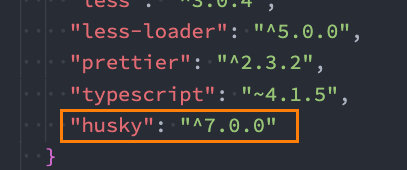

2.在项目目录下创建 `.husky` 文件夹：

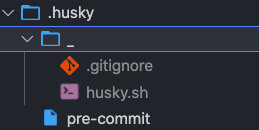

3.在package.json中添加一个脚本：

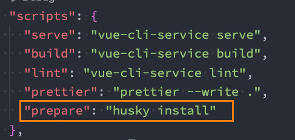

接下来，我们需要去完成一个操作：在进行commit时，执行lint脚本：

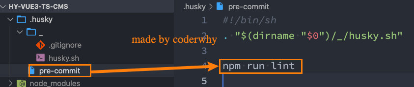

这个时候我们执行git commit的时候会自动对代码进行lint校验。


### 2.4. git commit规范（后续）

#### 2.4.1 代码提交风格

通常我们的git commit会按照统一的风格来提交，这样可以快速定位每次提交的内容，方便之后对版本进行控制。

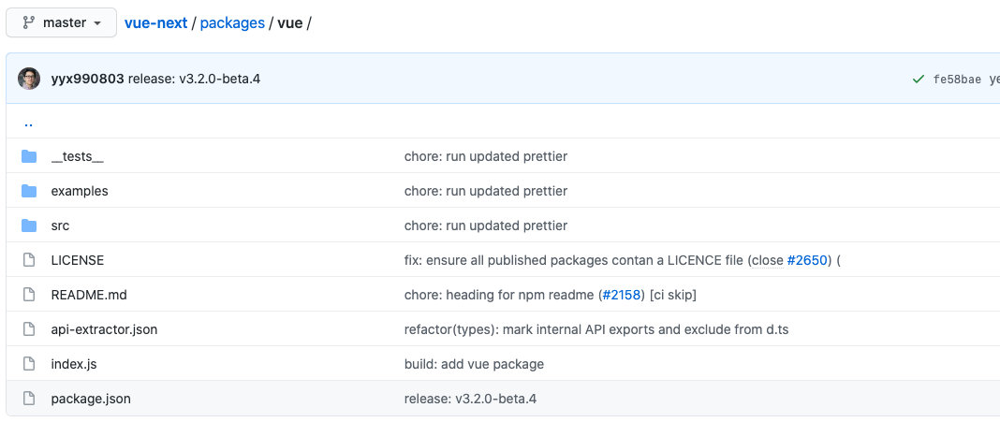

但是如果每次手动来编写这些是比较麻烦的事情，我们可以使用一个工具：Commitizen

* Commitizen 是一个帮助我们编写规范 commit message 的工具；

1.安装Commitizen

```shell
npm install commitizen -D
```

2.安装cz-conventional-changelog，并且初始化cz-conventional-changelog：

```shell
npx commitizen init cz-conventional-changelog --save-dev --save-exact
```

这个命令会帮助我们安装cz-conventional-changelog：

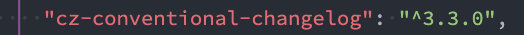

并且在package.json中进行配置：

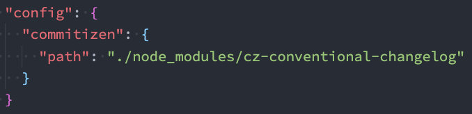

这个时候我们提交代码需要使用 `npx cz`：

* 第一步是选择type，本次更新的类型

| Type     | 作用                                                         |
| -------- | ------------------------------------------------------------ |
| feat     | 新增特性 (feature)                                           |
| fix      | 修复 Bug(bug fix)                                            |
| docs     | 修改文档 (documentation)                                     |
| style    | 代码格式修改(white-space, formatting, missing semi colons, etc) |
| refactor | 代码重构(refactor)                                           |
| perf     | 改善性能(A code change that improves performance)            |
| test     | 测试(when adding missing tests)                              |
| build    | 变更项目构建或外部依赖（例如 scopes: webpack、gulp、npm 等） |
| ci       | 更改持续集成软件的配置文件和 package 中的 scripts 命令，例如 scopes: Travis, Circle 等 |
| chore    | 变更构建流程或辅助工具(比如更改测试环境)                     |
| revert   | 代码回退                                                     |

* 第二步选择本次修改的范围（作用域）

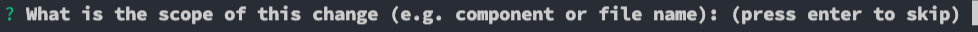

* 第三步选择提交的信息

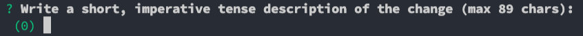

* 第四步提交详细的描述信息

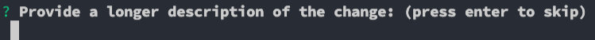

* 第五步是否是一次重大的更改


* 第六步是否影响某个open issue


我们也可以在scripts中构建一个命令来执行 cz：

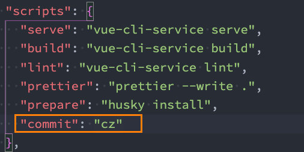


#### 2.4.2 代码提交验证

如果我们按照cz来规范了提交风格，但是依然有同事通过 `git commit` 按照不规范的格式提交应该怎么办呢？

* 我们可以通过commitlint来限制提交；

1.安装 @commitlint/config-conventional 和 @commitlint/cli

```shell
npm i @commitlint/config-conventional @commitlint/cli -D
```

2.在根目录创建commitlint.config.js文件，配置commitlint

```js
module.exports = {
  extends: ['@commitlint/config-conventional']
}
```

3.使用husky生成commit-msg文件，验证提交信息：

```shell
npx husky add .husky/commit-msg "npx --no-install commitlint --edit $1"
```


### 2.5  接口文档

接口文档v1版本：

- https://documenter.getpostman.com/view/12387168/TzsfmQvw

baseURL的值：

```shell
http://152.136.185.210:5000
http://152.136.185.210:4000
http://codercba.com:5000 # new
```

设置全局token的方法：

```js
const res = pm.response.json();
pm.globals.set("token", res.data.token);
```


接口文档v2版本：（有部分更新）

- https://documenter.getpostman.com/view/12387168/TzzDKb12


### 2.6 项目结构重置

- 在 src 中创建以下文件：

```shell
assets
  css
    common.less # 公共css
    index.less # 统一导出
    reset.less # 重置css
  img
base-ui # 公共UI组件
components # 主要组件
hooks # 自定义hooks
router # vue-router 路由
service # 服务器接口
stores # pinia 状态管理
utils	# 赋能函数
views # 视图，主页面
```


### 2.7 配置 CSS 样式

- 安装：`npm install normalize.css`
- 在 `main.ts` 中导入：`import 'normalize.css'`
- 安装：`npm install less -D`（开发时依赖）
- 在 `assets/css/reset.less` 中配置重置样式


### 2.8  配置 vue-router 路由配置

- 在项目初始化时已做安装，略作修改，具体见项目代码
- 主要是在 router、view、App.vue 文件中修改


### 2.9 配置 pinia 状态管理

- 在项目初始化时已做安装，略作修改，具体见项目代码
- 主要是在 store、main.ts 文件中修改


### 2.10 封装网络请求 axios

- npm install axios
  - 配置并测试 axios
- 区分 development 和 production 环境


## Step 3 开发细节

### 3.1 集成 Element-Plus

- 文档：https://element-plus.org/zh-CN/guide/installation.html

- 安装：`npm install element-plus`

- 全局注册组件 / 按需导入组件

  - 完整引入：相对方便，但打包体积较大，组件和CSS文件全部导入并打包；

  - 按需导入：按量导入，推荐使用“自动导入”方式，在文档中有导入方式。

    - 会生成 `auto-imports.d.ts` 和 `components.d.ts` 文件，手动添加到 `tsconfig.app.json`后，被导入组件才会有自动提示。注：Feedback 反馈组件，不在 `<template>` 中使用，所以不会自动导入。

      ```json
      {
        "extends": "@vue/tsconfig/tsconfig.dom.json",
        "include": ["env.d.ts", "src/**/*", "src/**/*.vue", "auto-imports.d.ts", "components.d.ts"],
      // ...
      ```

- 安装 icons，文档中有

  ```ts
  /** elementplus 全局注册图标 */
  import type { App } from 'vue'
  import * as ElementPlusIconsVue from '@element-plus/icons-vue'
  
  function registerIcons(app: App<Element>) {
    // 遍历所有图标
    for (const [key, component] of Object.entries(ElementPlusIconsVue)) {
      // app.component 将图标注册成组件
      app.component(key, component)
    }
  }
  
  // 导出注册函数，在main.ts中使用plugin方式直接自动调用并注册
  export default registerIcons
  ```

- 引入 ElMessage  样式

  1. 安装插件：`npm i vite-plugin-style-import -D`
  2. 在 vite.config.ts 中配置 plugin：

  ```ts
  // 导入
  import { createStyleImportPlugin, ElementPlusResolve } from 'vite-plugin-style-import'
  
  // 配置 plugins: [ ... ]
  createStyleImportPlugin({
    resolves: [ElementPlusResolve()],
    libs: [
      {
        libraryName: 'element-plus',
        esModule: true,
        resolveStyle: (name) => {
          return `element-plus/theme-chalk/${name}.css`
        }
      }
    ]
  })
  ```

  

### 3.2 使用 postman 调试工具

- 官网安装 postman
- 接口文档：`https://documenter.getpostman.com/view/12387168/TzzDKb12`
- baseURL：`http://codercba.com:5000`


### 3.3 RBAC

系统管理：包含用户管理、部门管理、角色管理、菜单管理等。

系统管理等开发，主要是基于权限管理的。

- 权限管理：根据登录用户身份不同，呈现不同的后台管理系统（具备不同的权限）。
- role based access control 基于角色的访问控制。
- 拓展了解：Linux 的文件管理系统。


### 3.4 动态路由

动态路由：跟上用户的权限信息，动态的添加左侧菜单，并不是一次性的注册所有路由。

背景：登录接口的三个内容

- token
- role：用户角色信息
- menu：用户菜单信息


思路一：基于角色（Role）的动态路由管理

- 后端提供完整的角色-路由信息表，前端全部获取后，通过 roles 对象统一管理。

```ts
const roles = {
  "superAdmin": ['路由1'，'路由2'，'路由3'，'路由4'，'路由5'],
  "admin":  ['路由1'，'路由2'，'路由3'，'路由4'],
  "svervice": ['路由2'，'路由3']
}
```


思路二：基于菜单（menu）的动态路由管理

- 将接口获取的菜单信息，动态映射为前端路由。


 


## 技巧：

- vscode `cmd + p` 快速打开文件搜索，不需要在左侧费劲的找文件。


### Vue + less

- `:deep` 让父组件可对子组件内部的元素进行css设定；
- `:global` 让当前css规则的作用域失效，变为全局规则；

```less
:deep(.test) {
  // 规则...
}

:global(.test) {
  // 规则...
}
```


### Pinia 持久化

- 问题：Pinia 状态管理存储在内存中，所以一旦用户刷新页面，所有存储的数据就会丢失。
- 解决：Pinia 持久化，将数据存储在本地内存中：Cookie、LocalStorage、SessionStorage。

方法一：使用自动化插件 `pinia-plugin-persist`

- https://juejin.cn/post/7213994684262891576#heading-10

方法二：手动将重要数据存储在 LocalStorage 中

在本项目中，用户 token、userInfo、menu 都存储在 localStorage 中。当用户刷新页面，重新执行并注册 APP 前，设置从 localStorage读取menu数据，并动态绑定到路由表中，再通过 `app.use()` 加载路由，具体代码为：

```ts
/* =========== src/store/index.ts =========== */
import { createPinia } from 'pinia'
import type { App } from 'vue'
import useLoginStore from './login/login'

const pinia = createPinia()

function registerStore(app: App<Element>) {
  // import pinia
  app.use(pinia)

  // 加载本地数据
  const loginStore = useLoginStore()
  loginStore.loadLocalCacheAction()
}

export default registerStore


/* =========== src/main.ts =========== */
import router from './router'
import store from './store'

const app = createApp(App)

app.use(store) // 加载store中导出的registerStore，此时便会先执行动态路由注册
app.use(router) 
app.mount('#app')

/* =========== src/store/login/ligin.ts =========== */
// 在 pinia 中，设置两个action：
// [action 1]: 当用户点击登录时：
//   1 发送网络请求，验证 token；
//   2 获取 userInfo 和 userMenu‘
//   3 将 token、userInfo、userMenu 保存在 localStorage 中
//   4 调用action2
//   5 跳转页面至 main

// [action 2]: 当用户刷新，和用户点击登录的后续action
//   1 从 localStorage 中获取 token、userInfo、userMenu
//   2 将上述数据保存在 pinia 中
//   3 动态添加路由对象
```


### dayjs 时间格式化

使用 dayjs 对时间文本进行格式化

- `npm install dayjs`


### 编写技巧

- Pinia 会在页面刷新后数据消失。
- 网络请求
  - 网络请求逻辑：在 Vue3 中，通常将网络请求的逻辑放在 pinia 的 store 的 action 中编写。
  - 网络请求时机：直接在 Component 的 setup 中调用，该环境的调用时机为 created。
  - 网络请求数据：通常将数据保存在 pinia 中统一管理，在使用 pinia 中数据时，用 `storeToRefs()`  将数据包裹，将数据修改为响应式，自动依赖。当 pinia 中的数据发生改变时，view 视图数据也同步发生改变。
- `computed` 自动添加依赖，类似 React 中的 `useEffect` 添加依赖的效果。
- `reactive`  响应式变量，通常和 `v-model` 配合，绑定 Element 元素，实现数据的双向绑定。
- `ref` 通常用来保持对 Element 的引用，或添加一些 `isOpen` 等，Boolean 类型的基础变量。

- 组件兄弟间传递数据的思路：
  - 事件总线。适用于跨度较大的组件间传递数据，且容易造成事件混乱，少用。
  - Pinia。保存在 Pinia 中，其他组件通过自动依赖拿到数据。
  - 父组件。A 子组件通过自定义事件，向父组件传递数据。父组件通过 ref 保持对 B 子组件的引用，直接调用 B 子组件暴露的函数；或者父组件通过 props 向 B 子组件传递数据。


Boolean 类型的转换：

- 使用两个感叹号，转换 Boolean 类型。一个感叹号，取反 + Boolean；两个感叹号，再次取饭

```ts
Boolean(someValue)
!!someValue
```


`v-bind` 自动展开

```vue
<template v-for="item in contentConfig.propsList" :key="item.prop">
	<el-table-column align="center" :name="item.name" :prop="item.prop" :width="item.width" />
</template>

// 使用 v-bind，直接将 item 内的属性全部绑定到 el-table-column 中
// v-bind="item" ，可以简写为 :="item"
<template v-for="item in contentConfig.propsList" :key="item.prop">
	<el-table-column align="center" :="item" />
</template>
```


使用插槽

三个地方

- 子组件：定义插槽位置
  - `#default="scope"` ，Element-plus 会将表格内当前行的数据传递给插槽中。
  - `:name="item.slotName"` 定位父组件传递过来的，需要展示的插槽。
- 父组件：定义插槽内容，通过 `scope` 可获取所需的数据，并做展示；
  - 作用域 CSS 规则：父组件也可以通过给插槽内添加 class，设置 css 样式；
- Config.ts：配置数据所需数据。

```vue
<!-- 子组件 Page Content -->
<template v-else-if="item.type === 'custom'">
	<el-table-column align="center" v-bind="item">
    	<template #default="scope">
        	<slot :name="item.slotName" :="scope" :width="`${item.width ?? 150}px`"></slot>
			</template>
  </el-table-column>
</template>

<!-- 父组件 -->
<template>
	<page-content ref="contentRef" :content-config="contentConfig">
    <template #leader="scope">{{ scope.row.leader }}</template>
    <template #parent="scope">{{ scope.row.parentId }}</template>
  </page-content>
</template>
```

```ts
// config.ts 配置
const contentConfig = {
  propsList: [
    {type:'custom', label:'部门领导', prop:"leader", width:'150px', slotName:'leader'},
    {type:'custom', label:'上级部门', prop:"parentId", width:'150px', slotName:'parent'},
  ]
}
```

- 子元素：
  - slot 元素是一个插槽出口，标志了父元素提供的插槽内容将在那里被渲染。
  - slot 内部的内容，由父元素提供。
- 具名插槽：
  - 子组件：通过 `<slot name='header'>` 来指出需要插入的位置。
  - 父组件：通过 `<template v-slot:header>` 表明该内容（模版）的名称。
    -  `<template #header>` 

- 作用域限制：

  - 组件只能访问其定义时所处的作用域。所以 slot 内部的作用域环境是父组件，只可访问父组件的数据，无法访问子组件的数据。

    - 父组件可以在 template 中自定义 Element 结构、CSS 样式，甚至其他组件。

  - 子组件也可通过 props 方式，将子组件作用域内的数据传递给 `<slot>` 内部，也就是传递给 父组件的 `template`

    ```vue
    <!--【匿名插槽】--> 
    <!-- Son 子组件，以下方式都可 -->
    <slot :="scope"></slot>
    <slot :nick="scope.nick" :age="scope.age" ></slot>`
    
    <!-- 父组件 -->
    <template>
    	<son #="props">
        {{ props.nick }}
        {{ props.age }}
      </son>
    </template>
    
    <!--【具名插槽】--> 
    <!-- Son子组件 -->
    <template>
      	<slot name="header" :="scope" ></slot>
      	<slot name="footer" :="scope"></slot>
    </template>
    
    <!-- 父组件 -->
    <template>
    	<Son>
    	<template #header="slotProps">
    		{{ slotProps.header }} {{ slotProps.age }}
    	</template>
    	<template #footer="slotProps">
    		{{ slotProps.footer }} {{ slotProps.age }}
    	</template>
      </Son>
    </template>
    ```

    

    


### 项目细节

- 商品类别、商品信息、故事列表，功能基本相似，略。
- 你的故事，采用富文本框架 WangEdit，基于 ts 编写可以学习一下。
- 核心技术，基本是内容的搭建，其中项目结构采用命令行工具一键生成：
  - 一键生成生成目录结构：windows 下 tree 命令（bing）
- 商品统计，echars

Day05 - 预习代码 - hy-vue3-ts-cms 基于 webpack 搭建，有相关页面的搭建。

Day10 - 预习代码 - hy-vue3-ts-cms -  src/compoennts/echarts/page-charts 做了组件封装，可以一建导入学习一下。


### nextTick(cb)

**作用**：解决异步操作的问题

- **异步更新**：在Vue 中更改响应式状态，最终的 DOM 更新不是立即生效的。Vue 会将 DOM 修改缓存在一个队列中，直到下一个 `tick` 才集中执行，以确保每个组件无论发生多少状态改变，都仅执行一次更新。

- **累计更新**：如果在一个同步时间段内，批量修改数字，均会生效，但会累积一次性更新。

**重点：**

- `nextTick` 在状态改变后，即 DOM 更新完毕后，会立即执行回调。
- 在 `nextTick` 中的回调，是一个宏任务，还是微任务？
  - Vue2 版本中，发生过很多次变化，最开始是宏任务，之后微任务、宏任务交替发生过很多次变化。
  - **Vue3 版本中是微任务。**将 nextTick 中，将回调函数全部加入到 `Promise.the()` 中执行。

```js
// 使用
nextTick(() => {
  // ...
})


// nextTick 回调的微任务
const promise = new Promise(() => {
  // 队列一 queueJob
  // 队列二 ...
  // 队列三 ...
  // ..
}).then(nextTickCallback) // 放在队列的 then() 中，立即执行。
```


### 兄弟组件通信

- EventBus

- `emit('')` 自定义事件 + 借助父组件交流

- `store`。事件发起者 A 组件：向 pinia store 中更新数据，通过 action ；事件监听者 B 组件：监听action 是否被执行

  ```ts
  // B 组件，通过设置监听 api：$onAction，监听特定的 action 是否在别处被触发，触发立即执行回调
  // args.name 是 aciton 名称
  systemStore.$onAction((args) => {
  	console.log('Action 被调用：', args.name)
    console.log()
  })
  
  systemStore.$onAction(({name, after}) => {
  	after(() => {
      if (name == 'newPageDataAction') {
        currentPage += 1
        // 通过after包裹，该逻辑会在 newPageDataAction 执行完毕，并执行成功后才回调
        // 如果执行失败则不触发回调 
      }
    }) 
  })
  ```

  

### 数字载入时的动画效果

- 组件：county.js


