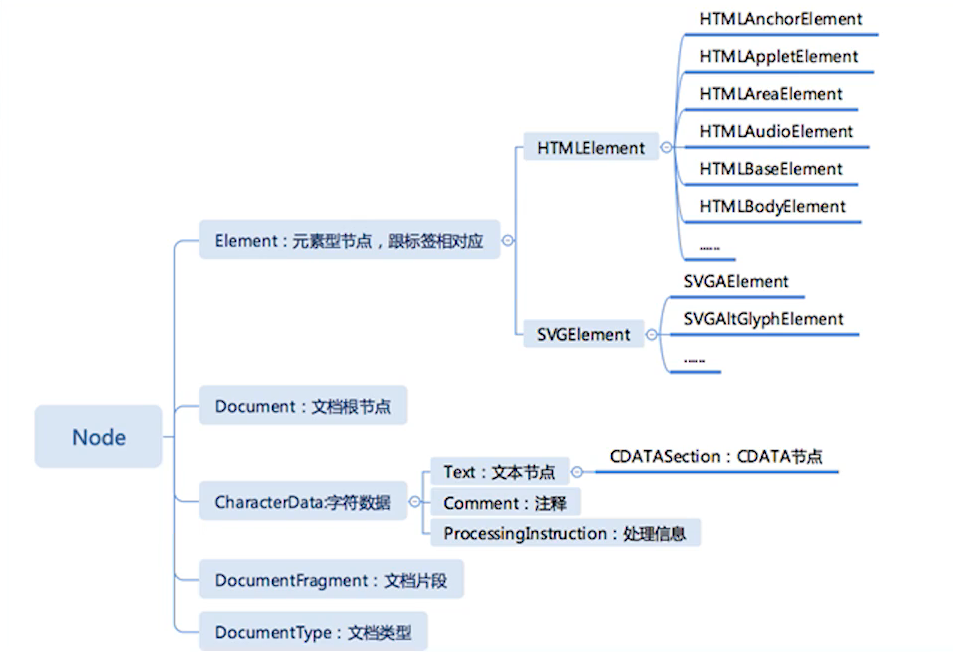

# 1. HTML的定义：XML与SGML

## 1.1 DTD 与 XML namespace

http://www.w3.org/TR/xhtml1/DTD/xhtml1-strict.dtd

http://www.w3.org/1999/xhtml

### 1.1.1 DTD

#### nbsp转义符

-  no-break space。不要在HTML中，使用 nbsp 达到体现空格的效果。因为 nbsp 本质的含义是：两个单词之间没有空间，直接链接。所以如果使用了 nbsp，两个单词看似是空开了，但是在语义上，这两个单词是连在一起的。会影响排版。
- 解决：如果要体现空格。要从 CSS 入手：white-space 属性，显示空格。

#### 记忆，在HTML要使用转义符，不能直接在HTML敲出：

- &quot：双引号（quotation mark）

- &amp ： & 符（ampersand）

- &lt ：< 号（less-than sign）

- &gt ：> 号（greater-than sign）

  ```html
  <!-- 举例：假设下列代码需要HTML-->
  <p> Hello World! </p>
  <p> Happy Code Every Day! </p>
  
  <!-- 写入网页中 -->
  <code>
    &lt;p> Hello World! &lt;/p>
  	&lt;p> Happy Code Every Day! &lt;/p>
  <code>
  ```

  

# 2. HTML 标签语义

语义化 wiki 某页时，看到的技巧：

- HTML在编写时，要从大到小到排布标签。同时暂时不要考虑任何非结构的东西（css的部分不要管）。甚至空格，回车这些也用不着去理会。只专注HTML结构、语义的问题。

- 当没有一个确切的标签去处理语义的时候，用 class="xxx" 补充说明。
  - ​	`<p class="note">注记：一段斜体注释，没有合适的标签表示</p>


# 3. HTML 语法

**合法元素**

- Element：`<tagname> ... </tagname>`
- Text:` Text`
- Comment: `<!-- comments -->`
- DocumentType: `<!Doctype html>`
- ProcessingInstruction: `<?a 1?>`    预处理
- CDATA: `<![CDATA[]]>`


# 1. 事件 API ｜ 浏览器 API

参考：[MDN:事件](https://developer.mozilla.org/zh-CN/docs/Web/API/EventTarget/addEventListener)

`EventTarget.addEventListener()`

### 1.1 语法：

- ` target.addEventListener(type, listener [, options]);`
- `target.addEventListener(type, listener [, useCapture]);`
- `target.addEventListener(type, listener [, useCapture, wantsUntrusted]);`

参数：

- type
  - 监听事件的类型
- listener
  - 回调函数。当监听事件被触发时，会调用该函数 / Event接口的对象。
- options 可选
  - capture：Boolean，在捕获阶段 (true) / 冒泡阶段 (false 默认) 触发该事件。
  - once：Boolean，只触发一次 (true) / 触发多次 (false 默认) 。true 触发一次后，会移除该事件监听。
  - passive：Boolean，`listener`永远不会调用`preventDefault()` (true)，会调用 (false 默认)。
    - true，定义一个不会产生副作用的事件， 当使用 onScroll 滚动，这样高频次触发的事件，会提升性能。
    - false，可以设置阻止事件的默认行为。

### 1.2 冒泡和捕获

任何一个事件，在冒泡和捕获两个阶段，都会被监听。

 先捕获、后冒泡。从外到内，从内而外。先捕获，就是让浏览器从外到内去计算，找到用户鼠标点击的那个元素，到底是哪一层的。默认是得到冒泡的事件监听，更符合人的直觉，点到里面的元素，一层层传递到外部 。


# 2. DOM API ｜ 浏览器 API

browser API 浏览器 API

DOM的四类 API

- traversal API：废弃不用。
- Node API：最重要、常用的。
- 事件 API：常用。
- Range API：应用性差，过于专业。




### 2.1 导航类操作

节点类：

- parentNode
- childNodes
- firstChild
- lastChild
- nextSibling
- previousSibling

元素类，会忽略文本节点：

- prentElement：和 parentNode 完全相同，有子节点的节点，一定是 element。
- children
- firstElementChild
- lastElementChild
- nextElementSibling
- previousElementSibling

### 2.2 修改类操作

- appendChild
- insertBefore
- removeChild
- replaceChild

### 2.3 高级操作

- compareDocumentPosition：一个用于比较两个节点中关系的函数，得到一个前后的关系。

- contains：检查一个节点是否包含另一个节点的函数。
- isEqualNode：检查两个节点是否完全相同。
- isSameNode：废用。检查两个节点是不是同一个节点(地址相同)，实际上在 JavaScript 中可以用 "==="。
- cloneNode：复制一个节点，如果传入参数 true，则会连同子元素做深拷贝。


# 3. Range API ｜ 浏览器 API

对 DOM操作的万能 API。

掌握 Range API，就是 DOM API 掌握程度的一个最高标志。能灵活的运用 fragment 和 Range API 可以实现任何对 DOM 树的精确操作，像一把细致的手术刀。

### 3.1 一个问题

把一个元素的所有的子元素逆序。

```jsx
element 1						element 5
element 2						element 4
element 3		 =>			element 3
element 4						element 2
element 5						element 1
```

- 方法0：原生态的糙方法

- 方法1：普通 DOM API
  - 考点1：
    - DOM Collection 是动态的。
    - insert 操作。对一个元素改变位置的时候，只需要一个insert操作即可，不需要先remove下来。insert会先对该元素执行remove，把它从原位置摘下来，然后执行append，追加到新位置。
- 方法2：使用 Range API，进行高效操作。
  - 考点2：只使用两次 DOM 操作就可以完成任务，减少了网页重排次数，提高性能。

```html
<!-- HTML 结构 -->
<div id="a">
    <span>1</span>
    <p>2</p>
    <a>3</a>
    <div>4</div>
</div>


<!-- 方法一, DOM API 也不会用 -->
<script>
let element = document.getElementById("a");

function reverseChildren(element) {
    // 把 childNodes 变成普通的数组。这样，它不会再随着 insert remove 这些操作，去改变自己。
    // 因为Array不是一个 living collection，不是动态集合。
    let children = Array.prototype.slice.call(element.childNodes);


    for (let child of children) {
        element.removeChild(child);
        // element.innerHTML = "";
    }
    children.reverse();
    for (let child of children) {
        element.appendChild(child);
    }
}
  
reverseChildren(element);
</script>


<!-- 方法二, 使用 DOM API -->
<!-- 进行了3次DOM操作(3次插入)，有3次网页重排 -->
<script>
    let element = document.getElementById("a");

    function reverseChildren(element) {
        // 记录长度，ChildrenNodes 是一个 living collection
        var l = element.childNodes.length;
        // l 自减，第一次循环前，就会减1，变成 "childrenNodes.length - 1"
        // 因为是一个 living collection，每次循环，把最末的元素移到最前即可。
        while(l --> 0) {
            element.appendChild(element.childNodes[l])
        }
    }

    reverseChildren(element);
</script>

<!--
 * 使用 Range API
 * 最终答案
 * 两次DOM操作：把节点拿下来（第一次），反转后，把节点放上去（第二次）
 * 反转元素：在 fragment对象 中进行三次插入，提高性能。
 * 因为直接在DOM树中进行插入操作，每次DOM操作，都会进行一次重排，对性能造成影响。
-->
<script>
    let element = document.getElementById("a");

    function reverseChildren(element) {
        let range = new Range();
        range.selectNodeContents(element);

        let fragment = range.extractContents();
        var l = fragment.childNodes.length;
        while(l --> 0) {
            fragment.appendChild(fragment.childNodes[l]);
        }
        element.appendChild(fragment);
    }

    reverseChildren(element);
</script>
```

#### 综上：

`range` 和 `fragment`，是一对好基友。 range 负责从DOM树中摘取节点、franment负责对节点进行操作，然后再 append到DOM树中。该方法相比直接在 DOM树中操作，极大的提高了网页性能。


### 3.2 Range API

#### 1 创建

Range 是一个范围，在DOM树中，代表了一个范围内的元素。所以需要起点（setStart）和终点（setEnd），都通过一个element + 相应偏移值（文字个数）确定。因为是文字节点代表偏移值，所以它有可能只包含了半个节点。

```jsx
ver range = new Range();
range.setStart(element, 9);
range.setEnd(element, 4);
var range = document.getSelection().getRangeAt(0);
```

#### 2 常用选择方法

```jsx
range.setStartBefore
range.setEndBefore
range.setStartAfter
range.setEndAfter
range.selectNode          // 选中一个元素
range.selectNodeContents  // 选中一个元素的所有内容
```

#### 3 操作元素的方法

删除 / 添加

```jsx
// 1. 删除 extractContexts()
// 把range选中的内容，从DOM树中摘下，保存到fragment对象中。
// fragment对象，可以保存一系列元素（有父子关系），可以直接把它append到DOM树中，对象自身不会添加到DOM树，而是会把其全部子节点放入其中。
var fragment = range.extractContexts() 

// 2. 添加 createTextNode()
// 在range位置，插入新节点。
range.insertNode(document.createTextNode("aaaa"))  
```


#### 4 举例1：

利用 Range API，删除了123456789 和 012。

- 确定选中的内容，就用 光标 + 偏移量 的概念来看。不要用 "第几个文本，是否包含该文本" 这样的思路。

```html
<div id="a">123<span style="background-color: pink;">456789</span>0123456789
</div>
<script>
    let range = new Range();
  	// 从第一个子节点（123文本节点）的 3后面 开始（偏移3位）。
    range.setStart(document.getElementById("a").childNodes[0], 3);
  	// 从第三个子节点（0123456789文本节点）的 2,3 之间截止（偏移3位）。
    range.setEnd(document.getElementById("a").childNodes[2], 3);
</script>
```

Console执行：

- `range.extractContents();`

- 返回了一个 fragment 对象，里面保存着选中后，摘取的DOM节点：

```jsx
#document-fragment
	"123"
	<span style="background-color: pink;">456789</span>
	"012"
```

#### 5 举例2:

利用 Range API，删除结构中 span标签内的一部分内容，而不删除 span 标签本身。

- 如果删除了 span 元素的借鼠标签，没关系，浏览器会默认补上一个结束标签。

```html
<div id="a">123<span style="background-color: pink;">456789</span>0123456789
</div>
<script>
	let range = new Range();
  // 开始：span中的6,7之间。
  // 结束：span标签后面的 2,3 之间。
  range.setStart(document.getElementById("a").childNodes[1].childNodes[0], 3);
  range.setEnd(document.getElementById("a").childNodes[2], 3);
</script>
```

Console执行：

- `range.extractContents();`
- 返回了一个 fragment 对象，里面保存着选中后，摘取的DOM节点：

```jsx
#document-fragment
	<span style="background-color: pink;">456789</span>
	"012"
```

在浏览器中，此时的DOM树：

- 注意 span 结束标签添加的位置。

```html
<div id="a">
  123
  <span style="background-color: pink;">456</span>
  3456789
</div>
```


# 4. CSSOM ｜ 浏览器 API

浏览器 API，不是 DOM API。

DOM API，可以理解为一个 HTML 语言的对象化，和 HTML 中元素经常是对等的概念。所以，DOM 是对一个 HTML所描述的文档的一个抽象。

CSSOM，就是一个对 CSS 文档的一个抽象。

### 4.1 document.styleSheets

严格来说，CSSOM也是需要 DOM API 去进行访问的。CSS 代码是嵌在 HTML 代码中的。document.styleSheets，就是 CSSOM一切的起点。

styleSheets 就代表一个样式表，它对应着一个 CSS 的 link 标签，或者一个 style 标签。

#### 举例

主要有两类 CSS 标签：一个是网页中`<style>`元素包裹的CSS；一个是`<link>`元素链接的地址中的CSS。

- 这里的 link 标签中，为了方便使用了data uri，直接把文本转义为地址，所以{大括号}需要转移字符：`%7B` 和 `%7D`

```html
<style title="Hello">
  a::before {
    color: red;
    content: "Hello";
  }
</style>

<link rel="stylesheet" title="x" href="data:text/css,p%7Bcolor:blue%7D">
<a> world</a>

<!-- 键入：document.styleSheets -->
StyleSheetList {0: CSSStyleSheet, 1: CSSStyleSheet, length: 2}
0: CSSStyleSheet {ownerRule: null, cssRules: CSSRuleList, rules: CSSRuleList, type: "text/css", href: null, …}
1: CSSStyleSheet {ownerRule: null, cssRules: CSSRuleList, rules: CSSRuleList, type: "text/css", href: "data:text/css,p%7Bcolor:blue .......
```

### 4.2 Rules

Rules 是 styleSheets 的一个子类。styleSheets里面有 CSSRules 是一个类数组的 collection，取出所有 CSS 相关代码。

- styleSheets ：代表一个样式表，它对应着一个 CSS 的 link 标签，或者一个 style 标签。
- Rule ：一个样式表有若干条 rule，每个 rule 就是一个 CSS 规则。
  - insertRule、removeRule 可以控制样式表中的规则。

```jsx
// 显示所有 rule
document.styleSheet[0].cssRules

// 插入一段CSS代码
// 参数1:string，代码。参数2:位置
document.styleSheet[0].insertRule("p {color:pink;}", 0) 

// 删除一段CSS代码
// 参数：位置
doucment.styleSheet[0].removeRule(0)    
```

#### 4.2.1 回顾：Rule的分类

- CSSStyleRule（普通 rule）

- at-rule

通常可以这样记忆：CSS里的语法有什么，CSSCOM就有什么，基本是一一对应的。

- CSSStyleRule：重点。
- CSSCharsetRule
- CSSImportRule
- CSSMediaRule
- CSSFontFaceRule
- CSSPageRule
- CSSNamespaceRule
- CSSKeyframesRule
- CSSKeyframeRule
- CSSSupportsRule
- ...

#### 4.2.2 回顾：Rule 的结构 

- CSSStyleRule
  - selectorText String
  - style K-V 结构


举例：改变伪元素的颜色。

- 伪元素是无法通过 DOM API访问的，最开始的举例中，红色的 Hello就是一个伪元素，必须通过 CSSOM来改变：

```jsx
document.styleSheets[0].cssRules[0].style.color = "lightgreen";
// 颜色就会改为亮绿色。
```


