#  组件化

--------------

# 1 组件基础 ｜ 组件的基本知识

前端最热门的两个话题：

- 组件化：主要目标就是复用。
- 架构模式：MVC、MVVC。关心前端和数据逻辑层之间的交互规则。

组件既是对象，又是模块。组件是一个与UI强相关的概念。可以以树形结构来组合。

## 1.1 组件 & 对象

### 对象

对象的三大要素：

- Properties 属性
- Methods 方法
- Inherit 继承关系（Javascript在运行时，原型继承）

### 组件

- Properties 属性
- Methods 方法
- Inherit 继承关系
- Attribute 特性
- Config & State 配置（预传参数） & 状态（随着人的操作/方法的调用，会发生变化）
- Event 事件机制（组件往外传递东西）
- Lifecycle 生命周期
- Children 树形结构的必要性


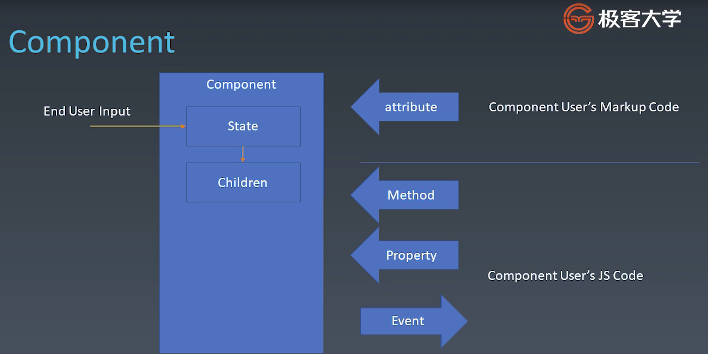

结构：左边是用户、中间是组件（或者说开发组件的程序员）、右边是程序员（或者说使用组件的程序员）

- 用户操作组件，会影响组件的 State状态（界面操作、输入文本），相应的，Children也可能会收到影响。

- 程序员通过 Attribute 去更改组件的特征 / 特性。
  - attribute：是声明型语言，markup language。
  - Property：和对象的Property的概念一致。直接设置组件上的属性。
  - attribute 和 Property 有时候统一，有时候不一样，这要看设计者的思路。
  - Property 在 Js 中，有 Get 和 Set 两个方法获取属性值，这一点上和 Method 有重合的功能。所以，根据不一样的设计者思路，有可能 Method 和 Property 也会是一个统一的概念。
- Event 的箭头是反过来的。可以看到，是开发组件的程序员向使用组件的程序员传递信息。

## 1.2 Attribute & Property

**Attribute**，强调描述性。描述一个对象的具体细节。

**Property**，强调从属关系。描述一个对象的是某个对象的子对象 / 父对象，体现从属关系。


### 举例：

在HTML中，property 和 attribute 就是不相同的概念：

```jsx
<!-- attribute -->
<my-component attribute="v" />

myComponent.getAttribute("a");
myComponent.setAttribute("a", "value");

<!-- property -->
myComponent.a = "value";
```


### 举例1

早年 JavaScript 中，class 是关键字，不允许 class 做属性名。现在允许了，HTML为了规避这一问题，区分了 attribute 和 property，做了如下改动：

- attribute：class，HTML依然不支持 class，只支持 className。
- property：className

```html
<div class="cls1 cls2"></div>

<script>
var div = document.getElementsByTagName('div');

// console 键入：
// property方法获取
div[0].className    // "cls1 cls2"
div[0].class        // undefined。property的命名，不是class，而是className。

// attribute方法获取
div[0].getAttribute("class");  // "cls1 cls2"
div[0].getAttribute("className");  // null
</script>
```


### 举例2

有些时候，attribute 和 property 之间的类型也不同。

- Attribute是一个字符串
- Proporty是一个字符串语义化的一个对象。

比如 style 属性在HTML中，attribute style 是一个字符串。可以用 getAttribute 和 setAttribute 修改 属性值。但是，用 proporty style 是一个 K-V 结构的集合，用来修改属性值更方便。所以，用 proporty 更方便。

```html
<div class="cls1 cls2" style="color: blue"></div>

<script>
var div = document.getElementsByTagName('div');
// console 键入：
div[0].style   //  一个对象。CSSStyleDeclaration {...}
div[0].getAttribute("style")     // "color: blue"
</script>
```


### 举例3

href 属性，attribute 和 property 的意思差不多。但是 Proporty是一个经过 resolve 过的 url。而 attribute 就是代码中写啥是啥。虽然两者语义非常相似，但是还是有区别。

```html
<a href="//m.taobao.com"></div>
<script>
    var a = document.getElementsByTagName("a");
    a[0].href                   // "file://m.taobao.com/"，这个URL是resolve的结果
    a[0].getAttribute("href")   // "//m.taobao.com"，跟HTML代码中完全一致
</script>
```


### 举例4

input 属性，value 是值是不相同的：

- attribute：value 是一个默认值。不论是用户在页面中修改 input 内容，还是程序员用代码给 proporty 赋值，它的 attribute 都是不会变的。
- property：在网页显示上，会优先显示 property 的值。
- attribute 和 property 可以分别定义，分别获取。两者是不等效的。

```html
<input value="cute" />
<script>
    var input = document.getElementsByTagName("input")[0];

    input.value     //"cute"
		input.getAttribute("value")     //"cute"
		input.value = "hello"           // 此时，value属性已经设置，则attribute不变，property变化。
  																	// 网页显示，会显示 property的 hello。
		input.value         //"hello"。property的值已经改变
		input.getAttribute("value")     //"cute"。attribute的值没有改变。
  
  	input.setAttribute("value", "world")	// 如果修改了attribute值
		input.value					//"hello"					// property的值不会改变。网页依然显示 hello
		input.getAttribute("value")						//"world" attribute被修改了。
</script>
```


## 1.3 如何设计组件状态

#### 四个场景

- Markup set：用标签去设置，静态声明语言。
- JS set：用 JavaScript 代码去设置。
- JS Change：用 JavaScript 去改变。
- User Input Change：由用户去改变。

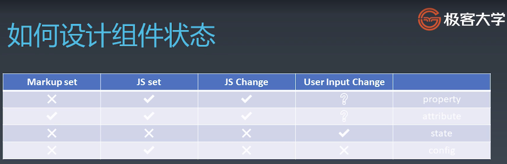

State：状态通常是由用户去改变的，组件的设计者不会把改变状态的功能，设计给程序员。

config：是一个一次性的结果。只有在组件构造的时候会触发。是不可更改的。通常会把 config 留给全局。


## 1.4 Lifecycle

生命周期：created + destroyed

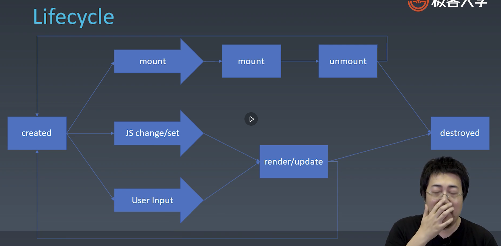

1. mount：组件挂到屏幕上。一个组件，在创造后，会被屏幕显示出来。即放到了 DOM 树上。
   - umount：组件从屏幕上卸下。
   - mount 和 unmount 有时会反复发生，一个循环。
2. JS change / set：组件的使用者（程序员）
3. User Input：终端用户
   - 程序员或终端用户在点击/修改组件时，触发组件更新。进入一个循环。


## 1.5 Children

Content 型 & Template 型

- Content型：有几个 Children，最终就能显示几个 Children
- Template型：Children充当了一个模板的作用。

例如，设计一个 list，Template型 Children 构造了一个 list 的结构。但是，这个 list 在真实的使用时，Children 的具体数目是不确定的。在 list 使用时，会传入一个 data，根据数据项的个数，构造相应长度的 list。如果接受了一个100项的数据，就会有100个实际的 Children，模板会复制 100份。 

```html
<!-- Template型 -->
<my-button>{{title}}</my-button>

<my-list>
	<li>{{title}}</li>
</my-list>
```


# 2 为组件添加JSX语法 ｜ 组件的基本知识

1. 在终端中：

   1. `mkdir jsx` 创建文件夹
   2. `cd jsx`
   3. `npm init` 然后所有选项不去更改，npm就创建好了。
   4. `npm install -g webpack webpack-cli` 用npm 全局安装 webpack包
      1. `npm install -g npm` npm更新
   5. `npm install -save-dev webpack babel-loader`安装 babel-loader(安装到本地目录中), babes plugin
      - 四个包的功能：
        - webpack：把一个普通的 JavaScript 文件，能够和不同 import 或 requre 一起打包。
        - babel：把一个新版本的Js编译成一个老版本的Js，可以让文件支持更多的老版本浏览器。

2. 打开 vs code：

   1. 在jsx文件夹中，创建 webpack.config.js。
      1. 设置好 entry，指向 main.js
   2. 创建 main.js。可以先定义一个简单的代码。
   3. 打开调试 ==> 创建 launch.json ==> 打开 终端 ==> 键入：webpack
   4. 可以看到，此时生成了 dist 文件夹 ==> 里面的 main.js 进过了加工。

3. 继续在 vs code中：

   1. 安装 babel，终端键入：`npm install --save-dev @babel/core @babel/preset-env`

   2. 在 webpack.config.js中，加入 module，引入 babel。
   3. 测试，终端键入：`webpack` 显示编译成功。
   4. 再看 dist/main.js中，可以看到之前到 for...of 语句，已经被编译为基本 for 循环，适配低版本的 JavaScript 代码了。  

4. 在 web pack.config.js中，添加 `mode:"development"`，开发者模式。

   1. 此时，再看 dist/main.js 中，可以看到代码不再压缩，可以直接调试生成的代码本身。

5. 在 main.js 中，常识输入一些 JSX代码，之后直接终端 `webpack`，发现会报错。这是因为没有引入 JSX。

   1. 终端键入：`npm install --save-dev @babel/plugin-transform-react-jsx`
   2. wabpack.config.js 中，配置上该包。
      1. 测试，终端：`webpack`。显示成功。JSX成功引入。
      2. 原先在 main.js 中测试的JSX代码：`let a = </div>`，在 dist/main.js 中，转义为`React.createElement(\"div\", null);`。


# 3 JSX基本语法 ｜ 组件的基本知识

粗略理解为，JSX就是一种代码在语法上的一种快捷方式。


#### 从无到有的实现一个轮播图组件：

对JSX插件（web pack.config.js）进行配置修改：

给 plugins 添加配置：

```JSX
plugins: ["@babel/plugin-transform-react-jsx"],
  
// 修改为：
plugins: [["@babel/plugin-transform-react-jsx",{pragma:"createElement"}]], 
```

可以看到，在修改配置之前，webpack 对 main.js代码的JSX文档改写，从 `<div/>` 改为：`React.createElement(\"div\", null);`。对配置修改之后，重新在终端执行 webpack，发现 main.js 改写为：`createElement(\"div\", null);`。

这样做，使 JSX 的运行和 react 没有任何关系了。


### 测试1

定义一个 div元素，其中嵌套了 3 个 children：span元素。

1. 如果在 div元素中，定义了属性值，那么第二个参数位置就是一个 K-V 对象，保存着各个属性值；反之，如果没有任何属性定义，那第二个参数就会传递 `null`。

2. 可以看到，在HTML页面，最终显示的效果递归调用 createElement()。所有的子元素（span）被作为参数，传递给了第一个 createElement方法。

```jsx
// main.js 中输入：
function createElement(){
    return;
}

let a = <div id="a">
        <span></span>
        <span></span>
        <span></span>
    </div>;    


// 最终在HTML是这样显示的：
function createElement(){
    return;
}

var a = createElement("div", {
  id: "a"
}, 
	createElement("span", null), 
	createElement("span", null),
	createElement("span", null),
);
```


### 测试2

由测试1可以知道，事实上createElement存在一个参数列表，那么，在定义的时候不妨都添加上：

​	`function createElement(type, attributes, ...children) { ... }`

把 createElement方法进行丰富：

- type 是要创建的元素，直接创建出来；
- attributes 是一个K-V对象，利用 for in  和 for of 把属性值添加到 type 创建的元素上；
- ...children 是一个可变长数组，保存了所有要添加的子元素，直接添加到 type 创建的元素上。

这样，main.js 的代码变成了：

```jsx
function createElement(type, attributes, ...children){
    let element = document.createElement(type);
    // in is key, of is value 
    for(let name in attributes) {
        element.setAttribute(name, attributes[name]);
    }
    for(let child of children) {
        element.appendChild(child);
    }
    return element;
}

let a = <div id="a">
        <span></span>
        <span></span>
        <span></span>
    </div>;

document.body.appendChild(a);
```

不要忘记，在main.html 中，添加一个 body 元素。如果不添加， script 是在生成 body之前创建，会出现问题：

```html
// main.html
<body></body>
<script src="./main.js"></script>
```

进行 webpack后，打开 main.html。可以看到现在 div可以正确被创建，同时子元素也正确可以被添加：

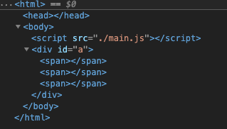

### 测试3

现在，实现的功能有：

- 正确的创建一个元素，element。
- 给 element 添加多个属性 attributes。
- 给 element 添加多个子元素 children。

问题：如果要给元素添加文本节点，需要解决哪些问题呢？

```JSX
let a = <div id="a">
      <span></span>
      Hello world!
    </div>;
```

用 webpack打包后。浏览器打开 main.html，可以看到 main.js 中是这样显示的：

```JSX
// source栏中，top/jsx/./main.js
function createElement(type, attributes) {
  var element = document.createElement(type); // in is key, of is value 

  for (var name in attributes) {
    element.setAttribute(name, attributes[name]);
  }

  for (var _len = arguments.length, children = new Array(_len > 2 ? _len - 2 : 0), _key = 2; _key < _len; _key++) {
    children[_key - 2] = arguments[_key];
  }

  for (var _i = 0, _children = children; _i < _children.length; _i++) {
    var child = _children[_i];
    element.appendChild(child);
  }

  return element;
}

var a = createElement("div", {
  id: "a"
}, createElement("span", null), "Hello World!");
document.body.appendChild(a);

```

可以看到，如果在元素中添加的不是子元素，而是文本节点。那传递的就是一个字符串。发现了这个情况，做以下改动：

- 判断 children 的成员类型，如果是 string，则创建一个 TextNode，把字符串添加到这个节点中。

```jsx
function createElement(type, attributes, ...children){
    let element = document.createElement(type);
    // in is key，of is value 
    for(let name in attributes) {
        element.setAttribute(name, attributes[name]);
    }
    for(let child of children) {
        if(typeof child === "string") {
            child = document.createTextNode(child);
        }
        element.appendChild(child);
    }
    return element;
}

let a = <div id="a">
        <span></span>
        Hello World!
    </div>;

document.body.appendChild(a);
```

成功！具备一定的 DOM 操作。


### 测试4

如果在定义时，div 是大写的 "Div"

```jsx
let a = <Div id="a">
        <span></span>
        Hello World!
    </Div>;
```

在变异后的 main.js 中看到，这里的 Div 没有加引号了，没有被正确识别。被当成了一个 class 关键字。

```jsx
var a = createElement(Div, {
  id: "a"
}, createElement("span", null, "a"));
document.body.appendChild(a);
```

需要做一个区分：div 和 Div。以下是基本的设计思路。

1. 定义一个 class Div

2. 在createElement中，对 type 做一个这样的大体判断：
   1. 如果是 Div，则传入的是一个 class Div，`element = new type`，把这个 Div 实例化，传递给 element。
   2. 如果是 div 则按照之前的代码，完成 element 的创建。

3. 下面来解决 class Div 中的内容：
   1. 利用 `mountTo()`方法，完成 div 的正确创建。
   2. 还需要完成：
      1. setAttribute() 方法，属性的正确添加；
      2. appendChild() 方法，子元素的正确添加；
      3. 这时，需要一个 constructor() 方法，确保 `this.root` 属性可以被其他方法使用。

4. 测试 webpack，可以看到，Div 可以正常的被创建了。用 mountTo() 方法，而不是appendChild() 方法。这里有个问题，普通的 “div”，是没有 mountTo() 这样的方法的，是利用 createElement 方法来完成创建，而不是利用 new Div。所以，这里要把 createElement() 方法，替换成 new ElementWrapper。重新定义一个 ElementWrapper 类。
   1. ElementWrapper 类，和 Div 类一样：
      - constructor()，把 this.root 作为变量。
      - setAttribute() 方法。实现了属性的添加；
      - appendChild() 方法。实现了子元素的添加；
      - mountTo() 方法。实现了元素在DOM上指定位置的添加。
   2. 需要把所有的 appendChild 都改为 mountTo。

5. Text Node 也需要按照上文进行 Wrapper，结构大同小异。
   1. 需要注意的是，文本节点不需要 setAttribute() 和 appendChild() 功能，留空即可。


最后：“Div” 不是真的定义一个无聊的 “div” 另一个写法，而是为了引申出一个自定义组件，比如 Carousel（旋转木马，轮播图）。有了` class Carousel`  我们可以在自己的组件中，自定义想要的结构和功能。

最终代码：


```jsx
/////////////////////    main.js     //////////////////////////
function createElement(type, attributes, ...children){
    let element;
    if(typeof type === "string"){
        element = new ElementWrapper(type);
    } else {
        element = new type;
    }
    // in is key，of is value 
    for(let name in attributes) {
        element.setAttribute(name, attributes[name]);
    }
    for(let child of children) {
        if(typeof child === "string") {
            child = new TextWrapper(child);
        }
        element.appendChild(child);
    }
    return element;
}

class ElementWrapper {
    constructor(type){
        this.root = document.createElement(type);
    }
    setAttribute(name, value){
        this.root.setAttribute(name, value);

    }
    appendChild(child){
        // this.root.appendChild(child);
        child.mountTo(this.root);
    }
    mountTo(parent) {
        parent.appendChild(this.root);
    }
}

class TextWrapper {
    constructor(content){
        this.root = document.createTextNode(content);
    }
    setAttribute(){
    }
    appendChild(){
    }
    mountTo(parent) {
        parent.appendChild(this.root);
    }
}

class Div {
    constructor(){
        this.root = document.createElement("div");
    }
    setAttribute(name, value){
        this.root.setAttribute(name, value);

    }
    appendChild(child){
        // this.root.appendChild(child);
        child.mountTo(this.root);
    }
    mountTo(parent) {
        parent.appendChild(this.root);
    }
}

let a = <Div id="a">
        <span>a</span>
        <span>b</span>
        <span>c</span>
        <div>Hello World!</div>
    </Div>;

// document.body.appendChild(a);
// 反向插入:
a.mountTo(document.body);
```

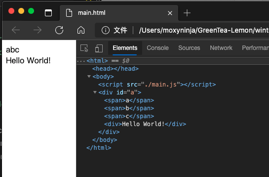


# 2 轮播组件化

## 2.1  轮播组件（1）

实现一个 Carousel组件：

1. 把之前实现的基本功能，全部都移动到一个新文件中 framework.js ：
   - function createElement(type, attributes, ...children)，function 需要在前面添加 export。
   - class ElementWrapper
   - class TextWrapper
   - class Div（这个弃用，当初只是为了做测试用）
2. 在 framework.js 中，发现 ElementWrapper 和 TextWrapper 中，`setAttribute()`, `appendChild()`, `mountTo()`，是重复的。所以把他们提取出来，新建一个 class Component， 放入其中。
   1. class Component 定义一个 `constructor()`，来获取 this.root；
   2. 另 ElementWrapper 和 TextWrapper 继承 Component；

3. main.js 中：
   1. 引入 Component，createElement 
   2. 加入 webpack-dev 方便 debug：
      1. 安装：`npm install webpack-dev-server --save-dev`
      2. 安装：`npm install --save-dev webpack-cli `
      3. 我目前的版本：
         1. webpack-cli 4.2.0
         2. webpack 5.9.0
         3. webpack-dev-server@3.11.0
      4. 此处我折腾了数次，引用评论区 @Corazon 的评论：
         1. 如果你电脑全局没有装 webpack-dev-server
            你直接使用 webpack-dev-server 命令会报错 command not found: webpack-dev-server
            需要使用 node_modules/.bin/webpack-dev-server 启动
            或者
            配置在package.json 例如:
            "scripts": {
            "start": "webpack-dev-server"
            }
            使用 npm start 或 yarn start 启动
         2. webpack-cli是4.* 版本 会和 webpack-dev-server 3.* 版本 不兼容
            启动 webpack-dev-server 会报错：Cannot find module 'webpack-cli/bin/config-yargs'
            可以换成启动 webpack serve 命令。
         3. 最终，我安装完毕后，通过`webpack serve` 成功启动。
         4. 至此，就可以使用 `localhost:8080` 加载页面了.

最终的文件构成：

```html
<!-- ///////////////////////// main.html //////////////////////// -->
<body></body>
<script src="./main.js"></script>
```

```js
///////////////////////// framework.js ////////////////////////
export function createElement(type, attributes, ...children){
    let element;
    if(typeof type === "string"){
        element = new ElementWrapper(type);
    } else {
        element = new type;
    }
    // in is key, of is value 
    for(let name in attributes) {
        element.setAttribute(name, attributes[name]);
    }
    for(let child of children) {
        if(typeof child === "string") {
            child = new TextWrapper(child);
        }
        element.appendChild(child);
    }
    return element;
}

export class Component {
    constructor(type){
        // this.root = this.render();
    }
    setAttribute(name, value){
        this.root.setAttribute(name, value);
    }
    appendChild(child){
        child.mountTo(this.root);
    }
    mountTo(parent) {
        parent.appendChild(this.root);
    }
}

class ElementWrapper extends Component {
    constructor(type){
        this.root = document.createElement(type);
    }
}

class TextWrapper extends Component {
    constructor(content){
        this.root = document.createTextNode(content);
    }
}


///////////////////////// main.js ////////////////////////
import {Component, createElement} from "./framework.js"

class Carousel extends Component {
    constructor(){
        super();
        this.attributes = Object.create(null);
    }
    setAttribute(name, value) {
        this.attributes[name] = value;
    }
    render(){
        // console.log(this.attributes.src);    //  打印一下，看看地址有没有被成功的传递进来
        this.root = document.createElement("div");
        for(let record of this.attributes.src) {
            let child = document.createElement("img");
            child.src = record;
            this.root.appendChild(child);
        }
        return this.root;
    }
    mountTo(parent){
        parent.appendChild(this.render());
    }
}

let d = [
"https://static001.geekbang.org/resource/image/bb/21/bb38fb7c1073eaee1755f81131f11d21.jpg",
"https://static001.geekbang.org/resource/image/1b/21/1b809d9a2bdf3ecc481322d7c9223c21.jpg",
"https://static001.geekbang.org/resource/image/b6/4f/b6d65b2f12646a9fd6b8cb2b020d754f.jpg",
"https://static001.geekbang.org/resource/image/73/e4/730ea9c393def7975deceb48b3eb6fe4.jpg",
];

// document.body.appendChild(a);
let a = <Carousel src={d}/>;
a.mountTo(document.body);
```

目前实现的功能：

- `<Carousel>`组件可以正确的被创建（div形式）；
- `<Carousel>`组件可以创建四个 img 子元素，用于插入四张照片；
- 四个 img 子元素，可以添加属性；
- 四个 img 子元素，添加的属性是 src，即：图片的地址。

总的来说，就是可以创建一个轮播组件，然后正确生成任意数量的 img 图片了。


## 2.2  轮播组件（2）

目前发现的问题： img 元素的特性，照片是一个鼠标可拖拽的，应当去掉这种效果。可以用 img 取消这个特性，或者直接用 div 包装，然后加入CSS属性：backgroundImage 更方便。

### tips:

- 轮播图的照片是每次只显示一张，很自然的想法就是，把照片的 CSS 都设置为： display:none。然后要显示哪一个，就把哪一个的 display 改变一下。这样会导致有一定的可能性出现两个图片同时显示的问题。（因为用户操作过快，导致js代码执行时出现顺序错误）。

  为了解决这个问题，不妨直接把 Carousel 组件的尺寸限定，而不是对子元素图片做修改。对Carousel 组件设置如下属性。其容器大小刚刚好就是一张图片的大小，然后超出的部分都做隐藏，这样绝对避免了有可能会出现同时显示两张图片的情况。

  ```css
  .carousel {
    overflow: hidden;
    width: 500px;
    height: 280px;
  }
  ```

- 如何让照片横行排放？ 用 正常流横排即可：
  - 照片元素：`display: inline-block`
  - 父容器：`white-space: norap` 不允许子元素换行。

- 给轮播组件添加时间控制：
  - 照片元素：`transition: ease 0.5s;` 添加一个缓动动画。
  - 在 render() 方法中，设置`setInterval()`，每隔一个固定周期，就调用回调函数。
    - 在`setInterval()` 中，每隔特定周期，就会令图片移动一次，达到轮播效果。
    - 如何让四张图片，在依次左移之后，可以恢复到第一张图片，重新开始循环。
      - 利用一个常用的技巧：如果想让一个数字 x 保持在 0 ～ (n-1) 之间循环，就用 n 对这个 x 取余即可：`x = x % n`。本例中，是 `current = current % children.length  `
  - 这时候发现，当最后一张切换到第一张的时候，有一个很难看的左滑过四张图片的动画，要解决这个问题：思考，想实现无限往同一个方向滑动，发现在滑动的时候，画面中最多只出现两张图片：当前图片，下一张图片。所以，只需要把这两张图片的位置确定好就可以了。
    - currentIndex --> curent
    - nextIndxt --> next
    - 如果当前图片位置是原点，那下一个图片的位置，是当前位置 + 100%，
      - 搞不懂就打开 Ai，自己画图看看。要严谨分析，就能分析清楚，难度不大。


要添加手势拖动效果，轮播不仅可以自动播放，也可以用鼠标拖动。接下来设计鼠标拖动。

- 设置鼠标监听，有三个事件：按下、拖动、松开（mousedown, mousemove, mouseup）。
  - 在设置的时候，利用 `console.log()`，随时观察事件是否触发，方便调整结构；
  - 正确的逻辑应该是：鼠标按下（mousedown触发）后，开始监听 mousemove 和 mouseup。当 mousedown事件结束，应该移除 mousemove 和 mouseup 事件。

```jsx
this.root.addEventListener("mousedown", event => {
  console.log("mousedown");

  let move = event => {
    console.log("mousemove");
  }
  let up = event => {
    console.log("mouseup");
    this.root.removeEventListener("mousemove", move);
    this.root.removeEventListener("mouseup", up);
  }

  this.root.addEventListener("mousemove", move); 
  this.root.addEventListener("mouseup", up); 
}); 
```


此时，遇到一个 bug，如果 mousedown事件触发，不松手，然后鼠标拖到图片区域之外，再松开鼠标。此时mouseup和mousemove应当被移除，但是没有被正确的移除。

- 原因：mouseup和mousemove的事件监听，不应该在 this.root 上，即不应该只在图片所在的这个容器上。应当在document上直接监听。

最终成品：

```jsx
this.root.addEventListener("mousedown", event => {
  console.log("mousedown");

  let move = event => {
    console.log("mousemove");
  }
  let up = event => {
    console.log("mouseup");
    document.removeEventListener("mousemove", move);
    document.removeEventListener("mouseup", up);
  }

  document.addEventListener("mousemove", move); 
  document.addEventListener("mouseup", up); 
}); 
```


## 2.3 轮播组件（3）

- 坐标的确定，用 clientX 和 clientY。浏览器中间可渲染区域的坐标。不会因为组件在网页中的位置改变，而影响坐标的变化，反正就是推荐用这个。

- 如果想让数字不出现负数，单纯的取余不行。
  - `pos = (pos + children.length) % children.length`
    - pos 的范围有可能在`[-1, 0, 1, 2, 3]`之间。为了让运算的结果， -1 转换为 3，-2 转换为 2。就先加一个周期长度 4（children.length），在正常的取余。

## 2.4 轮播组件（4）

分析问题的方法：

- `console.log()`打印变量。
- 用 Ai 画过程图。
- 断电监听变量。

### move 回调函数的逻辑：

```jsx
let move = event => {
  let x = event.clientX - startX;
  let current = position;

  for(let offset of [-1,0,1]) {
    let pos = current + offset;
    pos = (pos + children.length) % children.length;
    
    children[pos].style.transition = "none";
    children[pos].style.transform = `translate(${- pos * 500 + offset * 500 + x % 500}px)`;
  }
}
```

1. 先获取需要收集的参数：
   1. x 是鼠标滑过的相对位置
   2. current 是当前容器内的中心图片下标，取值：[0，1，2，3]，current 和 position 取值相同。
2. 然后分析轮播图的问题：当从静止的图片，向左 / 向右滑动的时候，最多只会展示中心图片（current）左边或右边的图片。最直接影响容器内展示的图片，就是三张图片。
   1. 定义这三张图片的位置：`offset = [-1, 0, 1]`。下标 0 就是轮播图容器内的中心图片。

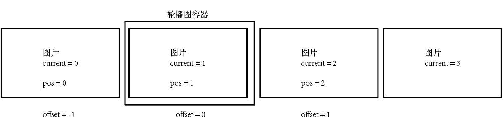

2. 每当中心图片被滑动的瞬间，要改变左图 / 右图的位置。让 offset 控制的三张图片一起滑动。

3. 利用一个 let of 循环。找到 这三张图片，下标为 pos。

   - 因为offset = -1 的时候，指的是最后一张图片，也就是 current = 3。这里要把 -1 这个数值置换为 3 ，不希望出现负数。

     - 利用：`  pos = (pos + children.length) % children.length;` 。先加上一个周期（children.length 值为3），然后取余。就转换成了正书：
       - -2 转换为 2；-1 转换为3；0 转换为 0；1转换为1 ...

   - 把动画特效设置为 none，更改图片位置的时候，不能有缓动特效出现，影响图片移动速度。

   - 移动的距离，收到三个参数的影响：图片的 pos 位置、容器的 offset 位置、鼠标的移动 x 位置：

     - pos：pos 是图片的下标，事实上，pos的值和current、posotion都相等，代表了图片未移动之前的的实际下标。计算中，`- pos * 500` ，令图片移动到容器内框中。（比如第二张图片，pos = 1，移动 -500px，就把图片移动到了轮播图容器内了）。

       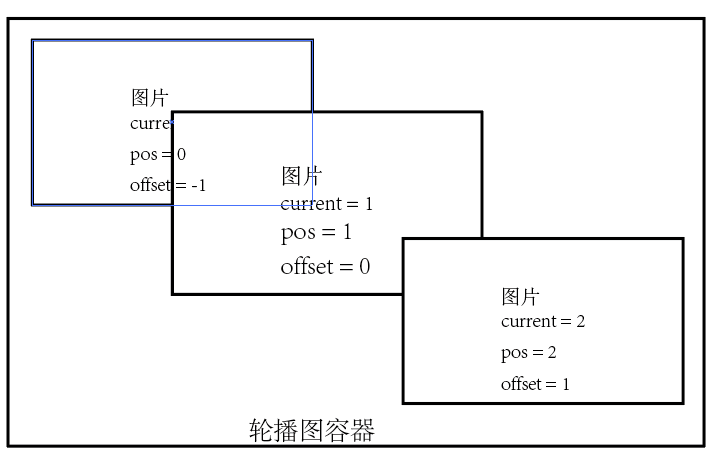

     - offset：是图片相对容器的位置，计算中，先利用 pos 把图片移动到了容器中心内，然后利用 `+ offset * 500` 把图片根据 offset下标，相对位移到容器的左边 / 右边。

       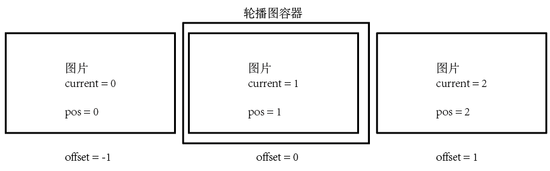

     - x ：利用`x % 500`，对 x 取余。得到的结果就是鼠标当前的移动位置。如果不取余，x的移动位置包含了 n张图片 + 一张部分的图片。我们需要的是鼠标移动过程中，残存的部分图片的位置，所以要把整体图片的距离去掉，利用取余去掉。

       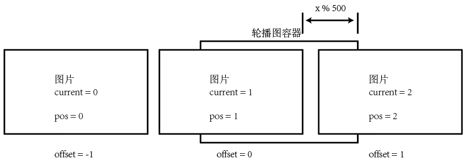


### up 回调函数的逻辑：

```jsx
let up = event => {
  let x = event.clientX - startX;

  position = position - Math.round( x / 500);
  for(let offset of [0, - Math.sign(Math.round(x / 500) - x + 250 * Math.sign(x))]) {
    let pos = position + offset;
    pos = (pos + children.length) % children.length;
    if (offset === 0) {
      position = pos;
    }
    children[pos].style.transition = "";
    children[pos].style.transform = `translate(${- pos * 500 + offset * 500}px)`;
  }
  document.removeEventListener("mousemove", move);
  document.removeEventListener("mouseup", up);
}
```

up的执行，目的是让尚未完全拖动的图片，完成后面的动画：

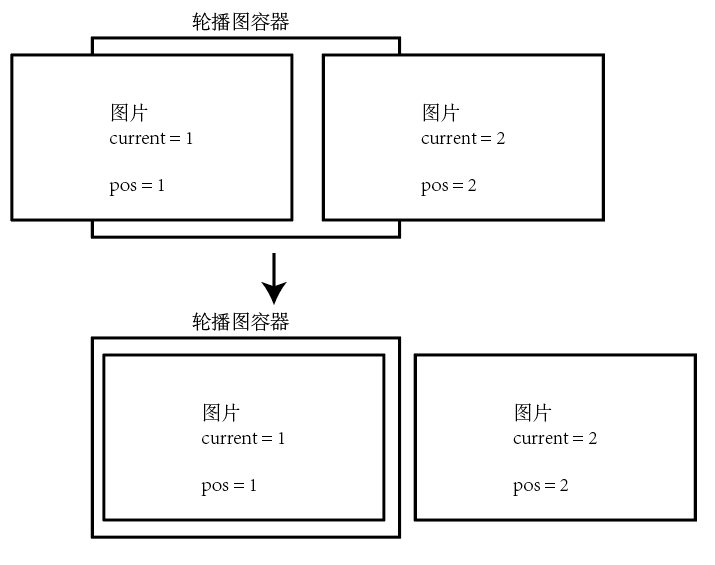

这里会出现两个情况：

- 如果下一张图片的显示面积小于 1/2，则图片不切换到下一张，保持原位置（如上图）
- 如果大于1/2，则松开手后，图片自动切换到下一张。

Up函数没有看太明白... 

# 3 手势与动画

## 3.1 初步建立动画和时间线

16毫秒，是针对 60帧动画设置的时间长度。这是一个常识。

- ```jsx
  setInterval(() => {}, 16);
  // 每隔16毫秒反复调用箭头函数。
  // 有个弊端，16毫秒的调用不确保一定会执行。
  // 也有可能会出现事件挤压。总之是不稳定。
  ```

- ```jsx
  let tick = () => {
  		// some codes
      setTimeout(tick, 16);
  }
  // setTimeout 只执行一次，所以回调函数会命名一个函数。达到反复调用的目的。
  ```

- ```jsx
  let tick = () => {
    // some codes
    requestAnimationFrame(tick);
  }
  // 发出申请：当浏览器执行下一帧的时候，执行代码 tick。
  // 和浏览器的帧率相关，如果浏览器降帧时，动画也会降帧。
  // 现代浏览器常用 该方法。
  ```


### 一个完整的时间线结构：

```jsx
export class Timeline {
    // 初始化变量
    constructor(){ }
    // 启动
    start(){ }
    // 播放速率
    get rate(){ }
    set rate(){ }

    // 暂停 & 恢复
    pause(){ }
    resume(){ }
    
  	// 重启 初始化
    reset(){ }
}
```

​	

### 用 tick 表示时间线（tick -- '滴答'）

```jsx
////////// -animation.js- //////////
const TICK = Symbol("tick");
export class Timeline {
    constructor(){
        this[TICK] = () => {
            console.log("tick");
            requestAnimationFrame(this[TICK]);
        }
    }
    start(){
        this[TICK]();
    }
}


////////// -tick.js- //////////
import {Timeline} from './animation.js';
let tl = new TICK();
tl.start();
// 启动tl后，就可以看到在浏览器的console中，一直输出tick。实现了基本的tick逻辑。
```


### 实现思路：

```jsx
////////// -animation.js- //////////
export class Timeline {
    constructor(){
        // 动画队列。
        this[ANIMATIONS] = new Set();
    }

    start(){
        let startTime = Date.now();
        this[TICK] = () => {
            let t = Date.now() - startTime;
            for(let animation of this[ANIMATIONS]) {
                let t0 = t;
                if(animation.duration < t) {
                    this[ANIMATIONS].delete(animation);
                    t0 = animation.duration;
                }
                animation.receive(t0);
            }
            requestAnimationFrame(this[TICK]);
        }
        this[TICK]();
    }
      add(animation){
        this[ANIMATIONS].add(animation);
    }
}

export class Animation {
    // 参数：目标对象，属性值，初始值，末尾值，持续时间，差值函数（可选）。
    constructor(object, property, startValue, endValue, duration, timingFunction){
        this.object = object;
        this.property = property;
        this.startValue = startValue;
        this.endValue = endValue;
        this.duration = duration;
        this.timingFunction = timingFunction;
    }
    // time是 tick 时间，由timeLine构建的，表示该动画已经执行的时间
    // 动画已经执行的时间 + 尚未执行的时间 = 总时间 ===> time + 尚未执行的时间 == duration。
    receive(time){
        let range = this.endValue - this.startValue;
        // 均匀变化：（范围✖️虚拟时间）/ 持续时间
        this.object[this.property] = this.startValue + range * time / this.duration;
    }
}
```


- class Animation 是一个动画实例。这个实例通常会传入 5 + 1 个参数：
  - 实例属性：目标对象，属性值，初始值，末尾值，持续时间，差值函数（可选）。其中差值函数是可选的，它的作用就是对动画效果进行改变：缓动、快进快出等等。
  - 事实上，动画的目的就是，把目标对象的某个属性值 proterty，从 startValue 变成 endValue，中间执行的时间长度是 duration。
    - 比如：`new Animation(object, "a", 0, 100, 1000, null)`
    - 其含义是：对 object 对象执行一个动画：令他的 a 属性值，在 1000秒内，从0 变成 100。不使用差值函数，动画的效果是默认的“均匀变化”
  - receive() 函数：
    - 每个 tick 时序，都会执行 receive函数，这个时序的时间点就是参数 time。
    - range 是属性值要变化的范围；
    - 每隔时序对 object的这个属性值，按照算法，赋值一次。这里的算法没有用差值函数，而是均匀变化：`this.startValue + range * time / this.duration`

- class Timeline 构造了一个时间线，是一个节奏，相当于动画制作时候的时间轴。每一个 tick，都是一帧。所有动画都按照一帧一帧的执行。本质上讲，Timeline 就是把物理时间（毫秒）转换为了虚拟的帧动画。
  - constrcutor中，构造一个动画队列，所有要执行的动画，会通过 add(0 方法加入进去。
  - start() 启动时间轴
    - startTime：记录时间轴的初始时间；
    - 定义 TICK 函数，并且执行它；
      - `requestAnimationFrame(this[TICK])`： 会发出申请：当浏览器执行下一帧的时候，执行 TICK 函数。所以，会变成每隔一帧，就会执行一次 TICK函数，如此循环往复。
      - `t 变量`：该轮次 / 该帧的相对时间。代表了此时距离 start 启动，经过了多少时间。
      - `for循环`：每个 tick 时序，都会遍历所有队列中动画，依次执行一次这个动画的 `receive()`；
        - 当一这个动画的 animation.duration也就是持续时间，小于已经过的时间 t 时，表明动画应当执行完毕，此时执行两步：
          1. 把该动画移除动画队列中；
          2. 对 t0 赋值为动画的最大时间，也就是 animation.duration 持续时间。
          3. 定义 t0 的意义时：在通常时候，他都和 t 的值相同，都是表明已经经过的时间。只有当该动画要结束的时间点 —— 一旦出现 ` > animation.duration`，就表明该动画应当结束了。此时应当执行最后一次动画：`receive(animation.duration)`，而不能执行 `receive(t)`，因为此时的 t 值已经超出了动画执行的最大时间。t0变量，就是成为了确保动画永远不会超出执行的时间，最后在 if 为真的时候，把 animation.duration 赋值给 t0。

## 3.2 设计时间线的更新

其实如果分析懂了上面的代码，就会发现所有 在动画队列中的动画，只有duration代表动画的结束，没有变量代表动画的开始，所有动画在`start()`开始执行之前必须全部加载到队列中，然后 stat 后，全部同一时间启动。

- constructor中，添加一个参数 delay，代表该动画开始的时间。所谓“delay“，就是相对于 startTime，即start 起始时间而言的。本来所有动画都在 startTime开始执行，但如果需要推迟执行，就设置 delay。

```jsx
export class Timeline {
    constructor(){
        // 动画队列。
        this[ANIMATIONS] = new Set();
        this[START_TIME] = new Map();
    }

    start(){
        let startTime = Date.now();
        this[TICK] = () => {
            let now = Date.now();
            for(let animation of this[ANIMATIONS]) {
                let t;
                if(this[START_TIME].get(animation) < startTime ) 
                    t = now - startTime;
                else
                    t = now - this[START_TIME].get(animation);

                if(animation.duration < t) {
                    this[ANIMATIONS].delete(animation);
                    t = animation.duration;
                }
                animation.receive(t);
            }
            requestAnimationFrame(this[TICK]);
        }
        this[TICK]();
    }
      add(animation, startTime){
        if(arguments.length < 2){
            // 支持手动添加时间，如果不手动添加。赋默认值Date.now()。
            // 此处的startTime表示该动画的开始时间。
            startTime = Date.now();
        }
        this[ANIMATIONS].add(animation);
        this[START_TIME].set(animation, startTime);
    }
}
```

- constructor构造函数：添加了一个 Map数据结构，存放所有动画的添加时间：[animation, startTime]。

- `add 函数`：添加了一个 startTime 参数，这个参数代表该动画的添加时间，一旦动画被添加队列，就会在下一个 tick 中开始执行。同时，对 StartTime 设置了默认值：`Date.now()`

- start 函数：本质上没有改变，依然是每经过一帧，执行一次 TICK函数；

  - startTime 为初始时间轴

  - TICK函数，周期性执行：

    - now 变量：每一个 tick 的时间节点。表示当前时间。

    - for循环：在动画队列中，遍历所有动画。让每个 tick轮次，动画都能“动”一下（receive() 执行一次）

      - t 变量：确定每个动画的执行时间，可以看成是一个**进度条**：
        （t = valueStart 时，动画刚刚开始；t = valueEnd 时，动画刚刚结束）
        - 如果该动画的添加时间小于时间轴启动时间，表明动画是在 start() 还未开始就预先添加进来的，`t = now - startTime`。动画的开始时间，就是start的启动时间。动画的执行时间就是：当前时间 - start 启动时间。
  - 如果该动画的添加时间大于时间轴启动时间，表明动画是在 start() 启动之后，后添加进来的，`t = now +  this[START_TIME].get(animation)`。动画加入的时间在start启动时间之后，动画的执行时间就是：当前时间 - 动画加入的时间。
    

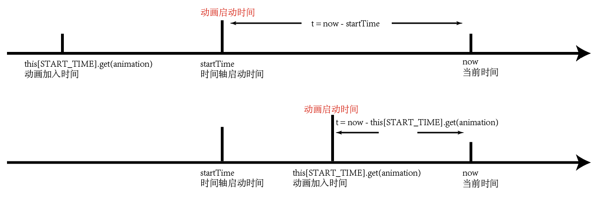
      
      - 执行 receive(t)，使动画产生效果。

## 3.3 给动画添加暂停和重启功能

给动画添加暂停和继续功能，为了看得更清楚，新建 animation.html 和 animation-demo.js 。

- 在 animation.html 中：
  - 创建了一个 div 用来展示动画。
  - 新建了两个按钮，一个控制暂停，一个控制重启。
- 在 animation-demo.js 中，对 div 新建了一个动画：
  - new Animation，该动画是： `transform: translateX(0px);`
    - 需要注意的是，这里的属性值，包含有一个 px 单位符号。所以对 Animation的 constructor 新增了一个变量 template。这个变量是一个匿名函数，保存了属性值的格式`v => translateX(${v}px)`。在使用时，只需要调用`template(value)`，即可赋属性值。

```jsx
////////// - animation.html - //////////
<body>
    <div id="el" style="width:100px; height:100px; background-color:lightblue;"></div>
    <button id="pause-btn">pause</button>
    <button id="resume-btn">resume</button>

    <script type="module" src="./animation-demo.js"></script>
</body>


////////// - animation-demo.js - //////////
import {Timeline, Animation} from './animation.js'

let tl = new Timeline();
tl.start();

// transform需要一个px作为属性的单位，用一个函数传入
tl.add(new Animation(document.querySelector("#el").style, "transform", 0, 500, 2000, 0, null, v => `translateX(${v}px)`));

document.querySelector("#pause-btn").addEventListener("click", ()=> tl.pause());
document.querySelector("#resume-btn").addEventListener("click", ()=> tl.resume());
```


然后，对 animation.js 做了修改，添加了 pause 和 resume 方法：

```jsx
const PAUSE_START = Symbol("pause-start")   // 暂停开始的时间
const PAUSE_TIME = Symbol("pause-time")     // 暂停结束的时间

start(){
  let startTime = Date.now();
  this[PAUSE_TIME] = 0;
  this[TICK] = () => {
    let now = Date.now();
    for(let animation of this[ANIMATIONS]) {
      let t;

      if(this[START_TIME].get(animation) < startTime ) 
        t = now - startTime - this[PAUSE_TIME];
      else
        t = now - this[START_TIME].get(animation) - this[PAUSE_TIME];
			// 对上面的两个 t 赋值，都剪掉 this[PAUSE_TIME] 偏移量。
      // 。。。。。 
}

pause(){
  this[PAUSE_START] = Date.now();
  cancelAnimationFrame(this[TICK_HANDLER]);
}

resume(){
  // 暂停了多久，暂停的总时间 = 当前时间 - 暂停的时间
  this[PAUSE_TIME] += Date.now() - this[PAUSE_START];
  this[TICK]();
}

add(animation, startTime){
    startTime = Date.now();
  }
  this[ANIMATIONS].add(animation);
  this[START_TIME].set(animation, startTime);
}
```

- `pause()` 新增了一个私有属性 PAUSE-START，记录按下暂停键的时间。
  - 按下暂停后，用 cancelAnimationFrame() 取消动画时间轴 timeline。
- `resume()` 新增一个私有属性 PAUSE_TIME，记录按下恢复按钮后，动画暂停了多久。也就是说，从按下暂停到再按下恢复，这中间经过的时间。
  - 为什么用 +=，因为这个 PAUSE_TIME，是一个偏移量。代表了经过暂停后，时间线应当往后推迟多久，或者说所有动画应当往后延迟 / 偏移了多久。
  - 重新启动 TICK 函数，令时间轴继续
- 在 start 中，
  - 先初始化 this[PAUSE_TIME] = 0; 此时尚未使用过暂停，偏移量为 0；
  - 然后在对 t 赋值的时候，需要减掉偏移量，所以，对所有 t 都剪掉 this[PAUSE_TIME]。


## 3.4 完善动画的其他功能

处理遗留问题：

Animation 的 delay、reset 和 timingFunction 参数对应的功能建立起来。


**delay**

- delay 就是动画加入动画队列后，不立刻开始执行，而是推迟一定的时间再去执行。很自然的，在 start 方法中，对所有的 t （进度条），剪掉一个 animation.delay 即可。
- 同时，需要注意的是，t 有可能存在被 animation.delay 减成负数的情况，这是因为该动画因为 delay 的存在，尚未达到开始执行的时间。这个时候因为尚未开始执行动画，不能进行 receive() 。添加一个判断，如果 t 大于 0 ，才执行 receive()。

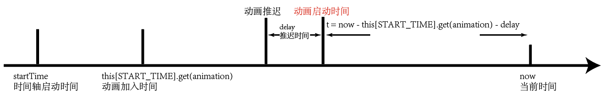


**timingFunction**

timingFunction(v)，实质上就是输入一个0到1的时间，会对应输出一个0到1的进度。

cubic-bezier.com 可以查看各种缓动效果的函数曲线（x轴时间，y轴进度）

代码中，直接抄写了的浏览器中C++代码，改写成JS代码。然后，在 animation-demo.js 中，与 CSS 的缓动效果进行了对比。

- 不知道为什么，我的 ease 效果 和 CSS 中的不一样，找不到原因。时好时坏的样子。


**reset**

重置功能很简单，先执行 pause，令动画时间线停止；然后把所有记录全部清空：

```jsx
this.pause();
let startTime = Date.now();
this[PAUSE_TIME] = 0;
this[ANIMATIONS] = new Set();
this[START_TIME] = new Map();
this[PAUSE_START] = 0;
this[TICK_HANDLER] = null;
```


## 3.5 对时间线进行状态管理

添加一个 state 状态管理，更具有健壮性。

- constructor 中，对 state赋值为：Inited 初始化；
- start() 最开始进行判断，如果 state 状态不是 Inited，就不能启动，直接退出；
  - 如果 start() 启动，state赋值为：Started 已启动。

- pause、resume 情况类似：
- reset 直接重置：


**效果**：在程序运行的时候，反复的点 pause 和 resume 按钮，不会出现各种 bug 问题。保证了状态的一致。

```jsx
// constructor：
this.state = "Inited";  // 初始化。

// start：
if(this.state !== "Inited")
  return;
this.state = "Started";

// pause的开头
if(this.state !== "Started")
  return;
this.state = "Paused";

// resume的开头
if(this.state !== "Paused")
  return;
this.state = "Started";

// reset
this.pause();
this.state = "Inited";
```

# 4  手势与动画

## 4.1 手势的基本知识

### **gestrue**

### 单指手势的四种逻辑：点击、滑动、清扫、长按。

- 如果只是点击：start ----> tap
- 如果发生移动：
  - start ----> 移动10px ----> pan start ----> pan(move一次触发一次) ----> end ----> pan end (结束)
  - flick / swipe：如果在 pan(move) 过程中，速度特别快，就会判断为轻扫
- 按压：如果按下超过 0.5 秒，就会判定为 按压，出现 press start
  - 如果按下后，又移动了，则转换到正常的移动逻辑；
  - 如果按下后，没有移动而是松开了，则按压逻辑结束。

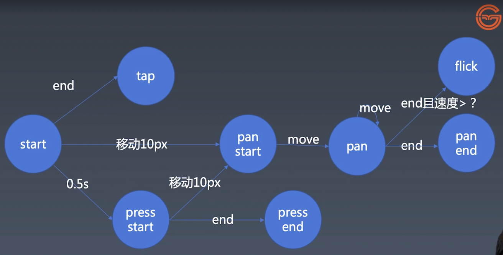


### touch 和 mouse

- 手势控制的常用四个事件：touchstart, touchmove, touchend, touchcancel
- 鼠标控制的常用三个事件：mousedown, mousemove, mouseup

- 手势控制的 touchstart 和鼠标控制的 mousedown 不同，touchstart 一定是针对某个物体触发，相应的添加 touchmove 事件，也是针对这个物体了。所以不需要像 mousedown 一样，需要把 mousemove 和 mouseup 放在 mousedown里面设置。
  - 为什么 mouse 系列设计的繁琐？因为鼠标一直会在页面中移动，而手指只可能在需要滑动的时候再会放在屏幕上，所以 touchstart、touchmove可以分开定义，他们一定是同一时间被触发的；而 mousemove 事件的监听的时机，需要 mousedown 事件被触发启动之后。
  - touchstart 支持多点触屏的监控，event 中存在多个触点。

### touchList 数组

```jsx
element.addEventListener("touchstart", event => {
    console.log("touchstart:");
    console.log(event.changedTouches);
});
element.addEventListener("touchmove", event => {
    console.log("touchmove:");
    console.log(event.changedTouches);
});
element.addEventListener("touchend", event => {
    console.log("touchend:");
    console.log(event.changedTouches);
});
```

可以看到，`event.changedTouches` 保存了所有触点信息，是一个TouchList数组，数组中每个成员是一个触点。

- identifier：是一个标识符，唯一标识了这个触点，也就是说，在 touchstart, touchmove, touchend 这三个事件监听中，特定的一个触点数值是相同的。
- clientX、clientY：表明了触点触发时的位置。

​	

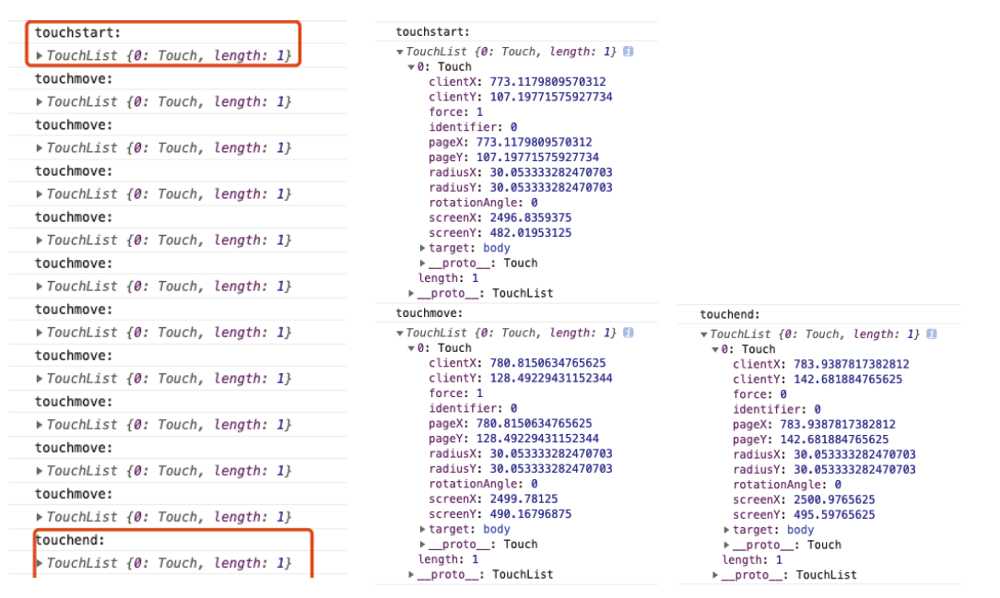

### 遍历：触点信息

所以，利用 let of 就可以把所有触点分开，下图是尝试输出所有触点的位置信息：

```jsx
element.addEventListener("touchstart", event => {
    for(let touch of event.changedTouches) {
        console.log("start", touch.clientX, touch.clientY);
    }
});
element.addEventListener("touchmove", event => {
    for(let touch of event.changedTouches) {
        console.log("move", touch.clientX, touch.clientY);
    }
});
```

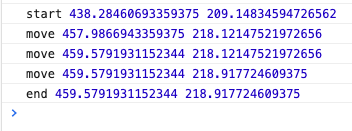

### touchcancel 事件

如果被系统打断（比如 `alert()` 弹窗）就会停止检测 触屏事件，然后不会触发touchend，而是触发cancel 事件，取消触屏事件监听：

```jsx
element.addEventListener("touchend", event => {
    for(let touch of event.changedTouches) {
        console.log("end", touch.clientX, touch.clientY);
    }
});
```

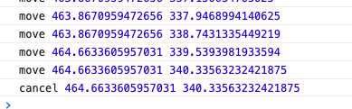

mouse不会出现被弹窗打断的问题，不会出现 “mousecancel” 的问题。


### touch 事件 和 mouse 事件的统一：

先把 mouse 和 touch事件监听的整体结构搭建好。然后，定义触点监听函数。

- mouse事件：
  - 需要注意整体结构，mousemove和mouseup需要在mousedown事件被触发后监听。还需要在该次mouseup的事件结束前，取消监听。
  - event 参数，就是触点信息。利用 start(event)等，就可以获取该事件触点的相关数据。
- touch事件：
  - 整体结构分开监听即可，不需要有潜逃结构。
  - event 参数，是一个 touchList，需要迭代器遍历出每一个成员，每个成员是一个触点信息。利用 start(touch)等，可以获取该事件触点的相关信息。
- 触点逻辑：
  - 对每个事件触发是，触点的逻辑都写到这里，即可同时对鼠标和手指都监听到。

```jsx
// mouse事件
element.addEventListener("mousedown", event => {
    start(event);
    let mousemove = event => {
        move(event);
        };
    let mouseup = event => {
        end(event);
        element.removeEventListener("mousemove", mousemove);
        element.removeEventListener("mouseup", mouseup);
    };
    element.addEventListener("mousemove", mousemove);
    element.addEventListener("mouseup", mouseup);
});

// 触屏事件
element.addEventListener("touchstart", event => {
    for(let touch of event.changedTouches) {
        start(touch);
    }
});
element.addEventListener("touchmove", event => {
    for(let touch of event.changedTouches) {
        move(touch);
    }
});
element.addEventListener("touchend", event => {
    for(let touch of event.changedTouches) {
        end(touch);
    }
});
element.addEventListener("touchcancel", event => {
    for (const touch of event.changedTouches) {
        cancel(touch);
    }
});

// 触点逻辑：
let start = (point) => {
    console.log("start", point.clientX, point.clientY);
}
let move = (point) => {
    console.log("move", point.clientX, point.clientY);
}
let end = (point) => {
    console.log("end", point.clientX, point.clientY);
}
let cancel = (point) => {
    console.log("cancel", point.clientX, point.clientY);
}
```


可以看到，在鼠标按下 + 移动 + 松开，和手指按下+移动+松开，都得到了正确的监听。

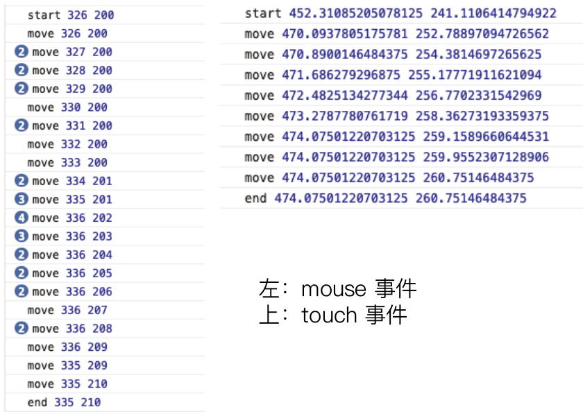


### 完善：手势的四种逻辑

#### 技巧：

- 先把所有定义的变量，放到全局作用域下（handler、startX、startY ...），方便先写整体逻辑。等所有逻辑定好后，再决定它们应该放到哪个作用域下更恰当。


#### 依次分析三个逻辑：

移动 pan

- 需要判断 isPan：是否按下后，移动超过10px。
- 移动的判断逻辑，在 move() 函数中；
- pan有两个状态：panStart 和 panEnd。


长按 press

- 需要判断 isPress：是否按下不移动，超过 0.5s。
  - 判断时间问题，主要定义一个 handler = setTimeout() ，设置 0.5s 后触发，如果被正确触发了，说明此时是一个 press 事件，如果没有触发这个 handler，说明此时不是 press，而是其他事件。任何一个其他事件被触发（pan、tap），在触发的时候，都会清楚这个函数，clearTimeout(handler)。
  - handler函数的内部，也要添加一个清除自身的代码 `handler = null;`。这样如果 handler 触发了，证明此时是一个 press 事件，不需要其他逻辑在执行 clearTimeout(handler) 去重复清除。所以让 handler = null。此时 setTimeout 失去了指向它的变量，不会被 clearTimeout(handler) 清空。

- 按下时间长度的判断逻辑，在 end() 函数中。
- press有两个状态：pressStart 和 pressEnd。 


单击 tap：

- 需要判断 isTap：是否按下不移动且没有超过0.5s，然后就松手了。

- 在end() 函数中，只要 isPan 和 isPress 都为 false，就可以确定此时的状态，应该是一个 tap。
- tap 只有一个状态：tap


默认：tap 状态是true，pan 和 press 状态是 false。此后，我们只需要去 pan 或 press 是否为 true。

- 如果为 true，则事件状态就不是 tap。而是 pan / press；
- 如果依然是 false，则此时一定进行到了 end() 函数，事件状态就是 tap。


`start():`

- startX：记录按下后的原始坐标。
- 把 isTap、isPan、isPress 初始化。
- 定义 handler 监控 0.5s 事件；
  - 一旦这个事件被触发，证明此时事件状态一定是 press：
    - 把 tap 和 pan 都置为 false；press 置为true；
    - 取消 handler 对该函数的指向，防止重复执行 clearTimeout。

`move():`

- 定义对 10px 移动的监控：
  - dx 和 dy 变量，实时记录位置 x 和 y 轴上的相对移动距离的量。
  - 判断：如果 dx 和 dy 的平方和大于 100，则证明移动已经超过了 10px，进入 pan状态。
    - 需要注意的是，此时移动依然会继续。但已经进入了 pan 状态，所以不需要再重复判断是否为 press。在 if 中，添加一个 对 isPress的判断解决这个问题。
    - 如果 if 为真，说明状态是 pan： tap 和 press 置为 false；pan 置为 true；
    - 同时，要清除对 0.5s的监控，避免 press 状态触发：clearTimeout()；


`end():`

- 对 tap、press、pan 分别判断是什么状态；
- 同时注意，tap如果为真，要消除 clearTimeout，避免进入 press 状态。


```jsx
let handler;
let startX, startY;
let isPan = false, isTap = true, isPress = false;

// 触点监听：
let start = (point) => {
    startX = point.clientX, startY = point.clientY;

    isTap = true;
    isPan = false;
    isPress = false;

    // 监控：0.5s事件
    handler = setTimeout(() => {
        isTap = false;
        isPan = false;
        isPress = true;
        handler = null;    // 如果执行了这里，表明 handler被执行，置为null，相当于自我删除。是为防止该setTimeout被多次clear。
        console.log("press");
    }, 500)
}

let move = (point) => {
    // 监控：移动10px
    let dx = point.clientX - startX, dy = point.clientY - startY;
    if (!isPan && dx ** 2 + dy ** 2 > 100) {
        isTap = false;
        isPan = true;
        isPress = false;
        console.log("panStart");
        clearTimeout(handler);
    }
    if(isPan) {
        console.log(dx,dy);
        console.log("pan");
    }
}

let end = (point) => {
    if(isTap) {
        console.log("tap");
        clearTimeout(handler);
    }
    if(isPan) {
        console.log("panEnd");
    }
    if(isPress) {
        console.log("pressend");
    }
     console.log("end", point.clientX, point.clientY);
}

let cancel = (point) => {
    clearTimeout(handler);
    console.log("cancel", point.clientX, point.clientY);
}
```


# 4 为组件添加更多属性


