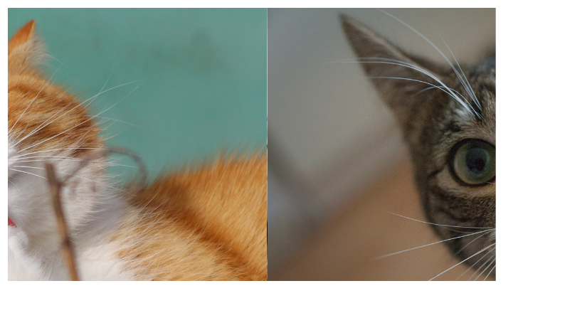

# Port 3

# 1. 手势动画的应用

## 1.1 把 gesture.js 引入到 jsx 中

- 复制 gesture.js 到 jsx 中；

- 在 carousel.js 中，做 import 引入；

  ```jsx
  import {Component} from "./framework.js"
  import {enableGesture} from "./gesture.js"
  import {Timeline, Animation} from "./animation.js"
  import {ease} from "./ease.js"
  ```

**添加 pan 状态：**

在 render() 中，先注释掉 鼠标拖动功能模块、自动轮播模块，专注与 gerture 引入；测试一下 pan 事件是否可以顺利在 root 上，也就是照片容器内触发。

```jsx
enableGesture(this.root);
let children = this.root.children;
// 测试
this.root.addEventListener("pan", event => {
    console.log(event.clientX);
});
```

通过测试，看到 pan 状态可以顺利触发，则把 鼠标拖动功能开始往里添加，鼠标点击图片，然后拖拽，即可拖拽图片。

- pan 逻辑，就是之前的 mousedown 事件。把 mousedown 事件中 event 的代码稍作修改，即可添加进来：

```jsx
this.root.addEventListener("pan", event => {
    let x = event.clientX - event.startX;
    let current = position - ((x - x % 500) / 500);
    for(let offset of [-1,0,1]) {
        let pos = current + offset;
        pos = (pos % children.length + children.length) % children.length;
        children[pos].style.transition = "none";
        children[pos].style.transform = `translate(${- pos * 500 + offset * 500 + x % 500}px)`;
    }
});
```

**添加 pan end 状态：**

pan end 状态，就是鼠标松开，与之前 mouseup 时间相同。在添加 mouseup 事件的代码给 pan end 中时，删除掉 removeEventListener 因为都是通过 状态判断的，已经不需要有添加事件和移除事件: 

```jsx
this.root.addEventListener("panEnd", event => {
    let x = event.clientX - event.startX;
    position = position - Math.round(x / 500);
    for (let offset of [0, -Math.sign(Math.round(x / 500) - x + 250 * Math.sign(x))]) {
        let pos = position + offset;
        pos = (pos + children.length) % children.length;
        if (offset === 0) {
            position = pos;
        }
        children[pos].style.transition = "";
        children[pos].style.transform = `translate(${- pos * 500 + offset * 500}px)`;
    }
});
```

**添加时间线 timeline 和  自动播放**

由于之前的 ease 动画是通过 CSS 操作的, 不能随时停止动画的执行. 现在进行修改, 通过添加时间线, 利用 ease.js 中的动画来达到相同的动画效果. 

- 在最开头, 就创建一个时间线, 同时启动它 :

```jsx
enableGesture(this.root);
let timeline = new Timeline;
timeline.start();
```

- 为 current 和 next 添加动画事件:

```jsx
timeline.add(new Animation(current.style, "transform", 
      - position * 500, - 500 - position * 500, 
      500, 0, ease, v => `translateX(${v}px)`
));
timeline.add(new Animation(next.style, "transform", 
      500 - nextIndex * 500, - nextIndex * 500,
      500, 0, ease, v => `translateX(${v}px)`
));
```

此时, 图片自动轮播, 可以正常运作了.


## 1.2 将 自动轮播 和 用户行为 结合

当用户鼠标, 用户触屏影响到图片的时候, 自动轮播功能应该停止, 优先处理用户行为. 

暂停时间线的解决：

- 先在 gesture.js 中, 添加一个 "start" 的 dispatch. 用来表示, 用户一旦有触屏 / 点击的操作, 就启动 start 状态, 令自动轮播时间线暂停; 相应的, 后面也会添加一个 "end" 的 dispatch, 用来表示 用户的鼠标 / 手指离开屏幕后, 继续恢复 时间线中的自动轮播动画. 

  -  gestrue.js 中, 为 start() 函数 添加一个 start 状态.

  ```jsx
  this.dispatcher.dispatch("start", {
      clientX: point.clientX,
      clientY: point.clientY,
  });
  ```

  - carousel.js 中, 添加当鼠标按下时, 就启动的 start 事件监听函数, 图片自动播放就需要停止. 

  ```jsx
  this.root.addEventListener("start", event => {
      timeline.pause();
  })
  ```


时间线被暂停后，也要需要自动轮播动画 setInterval()。如果要取消 setInterval()，就不能是用箭头的回调函数，而是要对回调函数命名：

```jsx
// 在开始位置，定义变量 handler 用于保存 setInterval的回调函数
let handler = null;


// 重新定义 setInterval
let nextPicture = () => {
 	//  codes ....
}
handler = setInterval(nextPicture, 3000);


// 在 start 状态中，取消 setInterval
clearInterval(handler);
```


设置好 start 状态后, 图片可以在用户点击屏幕的时候, 会停止图的自动轮播. 但是此时会出现一个问题: 如果轮播在停止的时候, 是下图这样, 没有完全的, 切换为一张新的图片的时候, 因为没有正确记录此时图片的位置信息 (此时图片的位置不是 500 的整倍数, 而是在一个"过渡"的位置. )，所以图片就会出现瞬移的问题。



动画挪动的额外距离，没有被计算进拖拽中。要把暂停时，当前图片的准确位置，传递给拖拽模块。

- 定义：
  - 变量 t ：自动轮播图片动画刚被添加的时间，也就是轮播动画开始执行的时间点；
  - 变量 ax：偏移量，由于动画自动轮播，该图片位移此时不满足 500 px 的整倍数，而额外移动的距离。
  - 变量 progress：（暂停动画时的时间 - 动话刚开始的时间） / 切换图片的时间 0.5s。得出的是此时该图的切换动画进度。
  - 则可以分析出： `ax = ease(progress) * 500 - 500;`
    - 函数 ease的参数，是一个代表进度的（0，1）之间的数字。上文提到过，（0，1）之间的数，作为时间进度传递给 ease 函数，然后经过处理，返回一个（0，1）之间的数，作为距离进度。0 代表动画尚未开始，对应位移距离就是0；1 代表动画刚好完成，对应位移应当是 1。
    - ease(progress) * 500 表明此时已经完成的动画位移量。因为图片已经移到下一帧，所以还要剪掉一个 500px。
- 在计算拖拽中，变量 x 也就是拖拽的偏移量时，额外减掉这个 ax。 
  - pan、panEnd 等等状态中。

最终，实现了在自动轮播过程中：

- 单机，使图的自动轮播暂停，可以正确拖动图片。

- 过程：网页加载，自动轮播开启（setInterval() + timeline 开启）==>
  -  鼠标按住图片，轮播停止
    - 进入 start 状态，暂停自动轮播（clearInterval() + 停止 timeline）
    - 进入 pan 状态，用户可以自由切换图片。


接下来需要解决 panEnd 的逻辑。令用户松开手后，图片在切换完毕后，继续开始轮播。

这个时候可以发现如果长按鼠标，会判定为 press 事件，此时 panEnd就不会触发。应该在 gesture 中，设计一个 end 状态，任何事件最终都会变成 end 状态。然后直接处理 end 状态的逻辑，即可把 pressEnd、panEnd、flick 状态一并处理了。

下列代码是处理 flick 状态 + end 状态的逻辑。 

```jsx
this.root.addEventListener("end", event => {
            
    timeline.reset();
    timeline.start();
    // 3秒钟后，重启自动播放
    handler = setInterval(nextPicture, 3000);

    if(event.isFlick) {
        if(event.velocity < 0) {
            direction = Math.ceil((x % 500) / 500);
        } else {
            direction = Math.floor((x % 500) / 500);
        }
    }

    let x = event.clientX - event.startX - ax;
    let current = position - ((x - x % 500) / 500);

    // [-1. 0. 1] 代表是哪个方向的图片
    let direction = Math.round((x % 500) / 500);

    for (let offset of [-1, 0, 1]) {
        let pos = current + offset;
        // 负数变正数
        pos = (pos % children.length + children.length) % children.length;

        children[pos].style.transition = "none";
        timeline.add(new Animation(children[pos].style, "transform", 
                                   - pos * 500 + offset * 500 + x % 500, 
                                   - pos * 500 + offset * 500 + direction * 500, 
                                   500, 0, ease, v => `translateX(${v}px)`));
    }

    position = position - ((x - x % 500) / 500) - direction;
    // 负数变正数
    position = (position % children.length + children.length) % children.length;
});
```


# 2. 为组件添加更多属性


