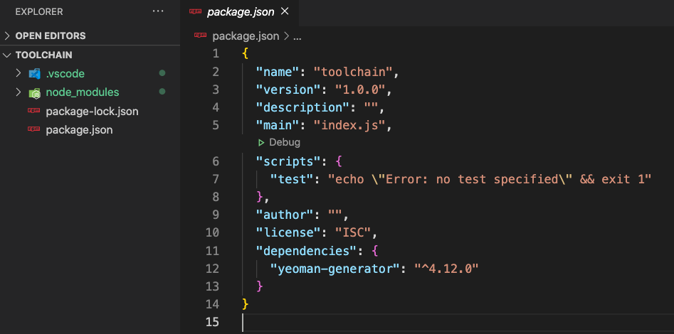
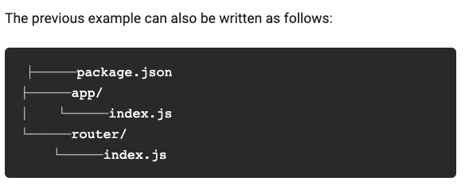
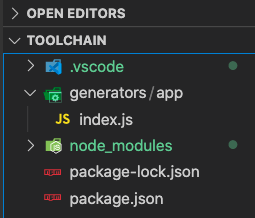
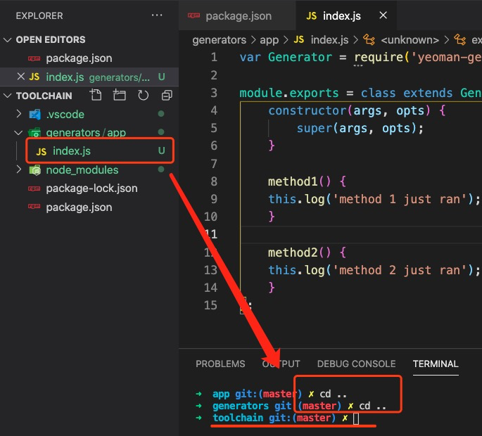
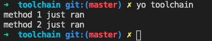
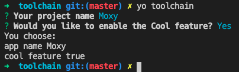
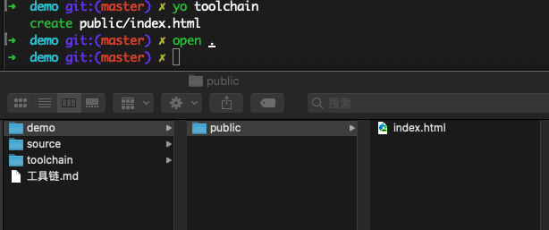
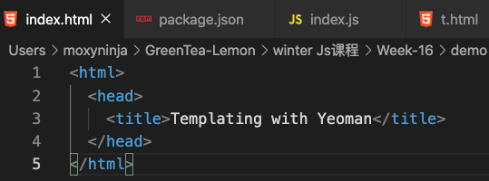
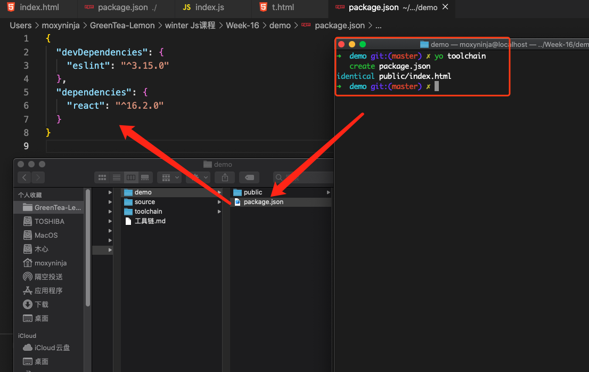
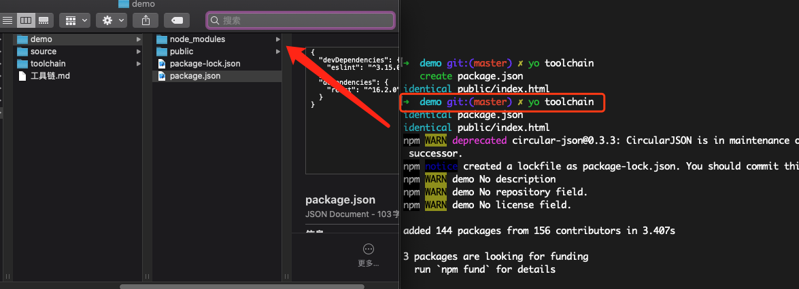

# Part 1

# 1. 初始化与构建 ｜ 初始化工具

## 1.1 环境搭建 & 基本介绍

### 1.1.0 脚手架：generator

- 脚手架生成器：yeonam（ generator 的 generator）


### 1.1.1 开始按照 yeonam

从这里开始：https://yeoman.io/authoring/index.html

- 环境搭建 :

  - 键入：`mkdir "toolchain" `

  - 键入：`npm init`，一切默认，就会获得一个 js 的模块。

  - 安装 yeoman：`npm install yeoman-generator  `

    - 补充：运行yo命令需要全局安装：`npm install -g yo`

    - 打开 toolchain：`open .`，然后拖入 vscode中。

      

- 按照文档去创建目录：

  

  router 的部分可以先不用创建，是为了更复杂的 generator。

  

- app/index.js 中，按照教程拷贝如下内容：

  ```jsx
  var Generator = require('yeoman-generator');
  module.exports = class extends Generator {
      
  };
  ```
- package.json 修改：

  ```jsx
  "main": "generators/app/index.js",
  ```

- app/index.js 添加  constructor() 和 method 后，变成如下内容：

  ```jsx
  var Generator = require('yeoman-generator');
  
  module.exports = class extends Generator {
      constructor(args, opts) {
          super(args, opts);  
      }
  
      method1() {
      this.log('method 1 just ran');
      }
  
      method2() {
      this.log('method 2 just ran');
      }
  };
  ```

- 进入 bogon：

  - 右键`index.js`，然后点击 “Open In Integrated Terminal”

    

  - 进入到 toolchain 根目录中。

  - 修改 `package.json` 中的 `name字段`： 

    ```jsx
    "name": "generator-toolchain",
    ```

  - 键入：`npm link   `，可以把本地的模块，link 到 npm 的标准模块中，Terminal中可以看到，link 到了开发中的这个模块：

    ```
    /usr/local/lib/node_modules/generator-toolchain -> 
    /Users/moxyninja/GreenTea-Lemon/winter Js课程/Week-16/toolchain
    ```


### 1.1.2 执行 yeoman

`yo toolchain`，下图是运行成功的画面：




## 1.2 Yeoman 基本功能

### 1.2.1 基础交互功能

官方文档：https://yeoman.io/authoring/user-interactions.html

- `this.log()` 可以打印输出
- `this.prompt()` 可以让用户输入:
  - input：让用户输入一个字符串
  - confirm：让用户做 Y/n 的单选决定。
  - 最后，可以利用 log 打印输出，内容保存在 name 字段中。

```jsx
    async method1() {
        const answers = await this.prompt([
            {
                type: "input",
                name: "name",
                message: "Your project name",
                default: this.appname // Default to current folder name
            },
            {
                type: "confirm",
                name: "cool",
                message: "Would you like to enable the Cool feature?"
            }
        ]);
        this.log("app name", answers.name);
    		this.log("cool feature", answers.cool);
    }
```




### 1.2.2 文件系统

官方文档：https://yeoman.io/authoring/file-system.html

- 在 app 文件夹中，创建文件夹/文件 `./templates/t.html`

- 在 index.html 中，创建如下模板：

  ```html
  <html>
    <head>
      <title><%= title %></title>
    </head>
  </html>
  ```

- 在 index.js 中，调用 copyTpl:

  允许：传一个 json 给.html，给<%  %>空位填上内容。下例就是往 title 中，传一个文本文档。

  ```jsx
      async step1() {
          this.fs.copyTpl(
              this.templatePath('index.html'),
              this.destinationPath('public/index.html'),
              { title: 'Templating with Yeoman' }   // 传一个 json
          );
      }
  ```

  - 打开一个新终端，在 toolchain 中，创建一个新的文件夹 demo：`mkdir demo`
    - 键入：`yo toolchain`

      

    - 然后，可以看到成功创建一个 index.html 文件，内容是修改好的内容。

      


### 1.2.3 依赖系统

官方文档：https://yeoman.io/authoring/dependencies.html

以文档中的例子，按照 eslint、react 这两个库：

```jsx
    initPackage(){
        const pkgJson = {
            devDependencies: {
              eslint: '^3.15.0'
            },
            dependencies: {
              react: '^16.2.0'
            }
        };

        // Extend or create package.json file in destination path
        this.fs.extendJSON(this.destinationPath('package.json'), pkgJson);
    }
```

在 demo 根目录中，执行：` yo toolchain`，可以看到，自动创建了一个 packge.json，添加好了库




如果添加： `this.npmInstall();`，就会安装 npm：




## 2. 实现一个 generator

1. 创建 generator-vue
   - 把之前在 toolchain 中，创建好的 generators 和 package.json 放到文件夹中。
   -  package.json 中，改个名字 ：`"name": "generator-vue",`

2. 思路：新建一个文件夹，先尝试手工制作一个 vue-demo。然后再把这些手工制作的过程，一步步 generator 出来，构造一个脚手架。

3. 最终实现：generator-vue

   `yo vue`

   `werbpack`


## 3. webpack

安装 webpack，要安装两个包：

- `webpack-cli` 提供了 webpack 这个命令。
- `webpack` webpack自身。


全局安装 webpack ：

- 全局安装 webpack-cli：`npm install -g "webpack-cli"`
- 全局安装 webpack： `npm -g "webpack"`

- 卸载：`npm uninstall "webpack-cli" -g`
           ` npm unistall "webpack" -g`


局部安装 webpack：

- local 安装 webpack-cli：`npm install webpack-cli --save-dev`  `npm install -D webpack -W`

- 运行 webpack：`npx webpack`
  - tips：`rmdir -r XX` 删除文件夹及子文件。


# Prot 2

# 1 


