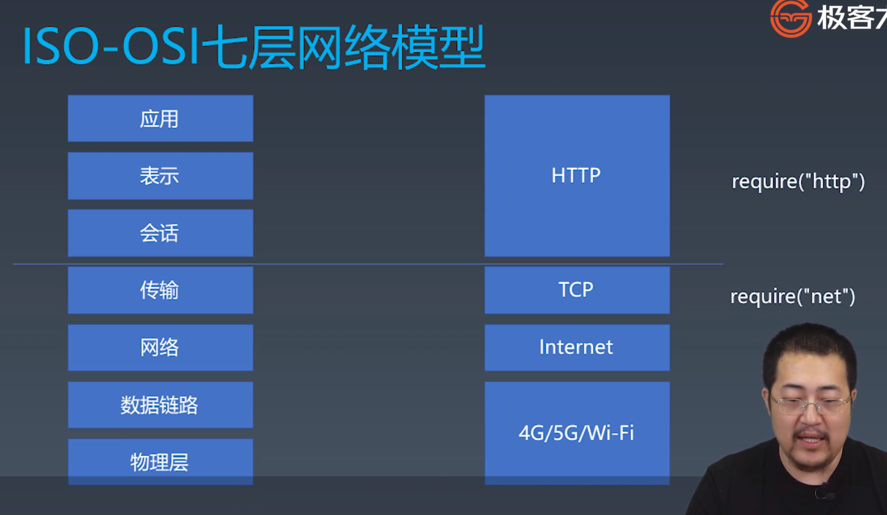
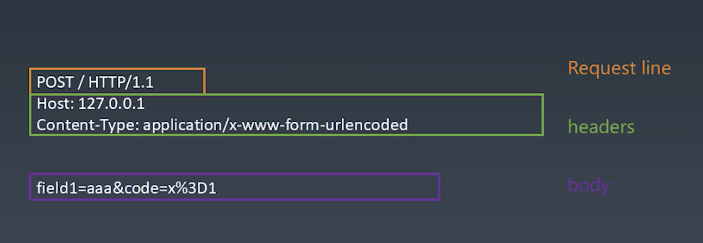

# 浏览器工作原理

# Port I 状态机

# 1. 总论

浏览器完成整体渲染，需要五个步骤：


# 2. 有限状态机

有限状态机 == 状态机。

- 每一个状态都是一个独立的机器。
  - 在每一个机器里，我们可以做计算、存储、输出……
  - 所有的这些机器接受的输入是一致的
  - 状态机的每一个机器本身没有状态，如果我们用函数来表示的话，它应该是纯函数（无副作用）
- 每一个机器知道下一个状态
  - 每个机器都有确定的下一个状态（Moore ）。摩尔状态机，较简单，程序基本写死了，不受输入影响，不可以做分支。
  - 每个机器根据输入决定下一个状态（Mealy）。米粒状态机，接受不同的输入，可以进入不同的状态中。代码变得复杂，但更灵活。

## 2.1 Mealy 状态机

state变量，永远表示当前状态 return一定有多个：是根据不同的input，在**if ... else** 中，决定返回

```jsx
// 用一个函数，定义一个状态
function state(input) {   // 参数就是输入
	// 函数体中，编写状态代码。根据输入，处理每个状态的逻辑。
	return next;   // 返回值作为下一个状态。
}

///////// 调用 /////////
while(input) {
	// 获取输入
	state = state(input)  // 把状态机的返回值作为下一个状态
}
```

## 2.2 使用有限状态机处理字符串

### 2.2.1 字符串判断：不使用有限状态机的处理方式：

#### 1. 在一个字符串中，找到字符“a”

```jsx
function match(string) {
  for(let c of string) {
    if(c == 'a')  return true
  }
  return false
}

match('I am groot');
```

#### 2. 在一个字符串中，找到字符“ab”

- 不可使用正则表达式(正则就是用有限状态机实现的）

```jsx
// 自己的方法，很差
function match(string) {
  for(let i = 0; i < string.length; i++) {
    if (string[i] == 'a') {
      if (string[i+1] == 'b') 
        return true; 
    }
  }
  return false
}

match('I am groot');

// 老师的方法，很妙
function match(string) {
  let foundA = false;
    for(let c of string) {
        if (c == 'a') {
            foundA = true;
        }
        else if(foundA && c == 'b') {
            return true;
        }
        else foundA = false;
    }
    return false
}

match('I abm groot');  // true
match('I acbm groot');  // false
```

#### 3. 在一个字符串中，找到“abcdef”

```jsx
// 原始人版本： 
    function match(string) {
        let foundA = false;
        let foundB = false;
        let foundC = false;
        let foundD = false;
        let foundE = false;
        for (let c of string) {
            if (c == 'a') {
                foundA = true;
            } else if (foundA && !foundB && c == 'b') {
                foundB = true;
            } else if (foundB && !foundC && c == 'c') {
                foundC = true;
            } else if (foundC && !foundD && c == 'd') {
                foundD = true;
            } else if (foundD && !foundE && c == 'e') {
                foundE = true;
            } else if (foundE && c == 'f') {
                return true;
            } else {
                foundA = false;
                foundB = false;
                foundC = false;
                foundD = false;
                foundE = false;
            }
        }
        return false;
    }

// 优化后的版本：
function findSubstring(str) {
    let step = 0;
    for (let c of str) {
      if (c === 'a') {
        step = 1;
      } else if (step === 1 && c === 'b') {
        step = 2;
      } else if (step === 2 && c === 'c') {
        step = 3;
      } else if (step === 3 && c === 'd') {
        step = 4;
      } else if (step === 4 && c === 'e') {
        step = 5;
      } else if (step === 5 && c === 'f') {
        return true;
      } else {
        step = 0;
      }
    }
    return false;
  }
```

#### 反思

1. 原始人版本：

   - 首先：利用 for ... of 只遍历一边字符串。同时用 if else 来判断。

   - a b c d e f，每个变量都定义一个对应的标识符，表示是否找到该字符。每当有一个字符被判断出来，就把相应的标识符置为 true。

   - 会出现“a b b c d e f”，即中间有两个的情况，会出现前面都匹配成功，最终返回 true。

     ```jsx
     // 如果单纯的把匹配成功的位置，重置为true，会出现 ‘abbcdef’也匹配成功的问题。
       for(let c of string) {
         if (c == 'a') foundA = true;
         else if (foundA && c == 'b') foundB  = true;
         else if (foundB && c == 'c') foundC = true;
         else if (foundC && c == 'd') foundD = true;
         else if (foundD && c == 'e') foundE = true;
         else if (foundE && c == 'f') return true;
         else {
           foundA = false; foundB = false; foundC = false;
           foundD = false; foundE = false;
         }
       }
     ```

     - 解决办法：当前判断位置，会先判断前一个位置是否匹配成功，然后判断当前位置是否已经置为true（如果当前位置是true，表明上一次判断和这次判断的字符相同），最后才匹配当前位置：“每次判断三个事情：上一个字符是否匹配成功，当前字符是否已经被匹配成功，当前位置是否匹配字符。

       - 换句话说：判断语句的时候，多一个判断：当前待判断字符，是否已经被置为true。如果置为true，则表明该字符上一次已经判断过，是重复字符。

       ```jsx
       for (let c of string) {
         if (c == 'a') {
           foundA = true;
         } else if (foundA && !foundB && c == 'b') {
           // foundA = false;
           foundB = true;
         } else if (foundB && !foundC && c == 'c') {
           // foundB = false;
           foundC = true;
         } else if (foundC && !foundD && c == 'd') {
           // foundC = false;
           foundD = true;
         } else if (foundD && !foundE && c == 'e') {
           // foundD = false;
           foundE = true;
         } else if (foundE && c == 'f') {
           return true;
         } else {
           foundA = false; foundB = false; foundC = false;
           foundD = false; foundE = false;
         }
       }
       ```

2. 优化后版本：

   - 利用step，可以很方便的确认当前判断位置是在哪里，如果step数字与字符应当在的位置不同，可以立刻分析出是否出现重复的字符。

### 2.2.2 字符串判断：使用有限状态机的处理方式：

- 解决的小问题：

  1. 没有可用的调试程序，无法发送“variables”：在用Vscode调试代码的时候，出现打印不出字符，是因为node.js 在执行完毕后，程序就会关闭。只需要在 需要打印的地方，添加断点即可。
  2. `return start()`：遇到这个问题，是先执行 `start()`，后执行return。具体：调用start函数，栈帧指向start函数，start函数返回后，再返回当前函数。 

- 遇到的小技巧：

  1. 有限状态机中，trip 陷阱。表示如果达到某个完成的标准，之后再进行任何判断，都会陷入“trip”中，只返回完成状态。本例中，进入 end 状态后，表明字符串已经匹配完成，后面的任何字符串匹配不再会改变当前“匹配完成”的状态，固不需要再判断他们。每次遇到判断，使用 trip，一直让字符进入 end 状态。

     ```jsx
     // trip的实现：
     function end(c) {
       return end;    // 只要是调用end状态机，就返回end状态。陷入。
     }
     ```

  2. 有限状态机中，reConsume 重新使用。在当前状态机已经判断完当前字符后，返回状态后，理应把下一个字符交给下一个状态机判断。但是，如果想让下一个状态机，重复判断当前字符，需要用到 reConsume。换句话说，当前状态机的判断完毕的字符，想交给下一个状态机再判断一次。

     - 本例中：为了防止字符被“吞掉”。在当前字符，遇到当前状态机判断，且不通过的时候。不应该证明这个字符已经判断完毕，不符合匹配原则。有可能这个字符是待匹配字符串，最开头的那个字符（例子中的a）。那么，这个字符不能被“吞掉”，需要交给 start状态机再判断一次。

       ```jsx
       // reConsume实现：
       function foundB(c) {
         if(c === "c")  
           return foundC;
         else 
           // return start;  // 不使用reConsume的写法。交给下一个状态机，会吞掉当前字符。
           return start(c);  // 执行start()状态机，该字符交给start状态机判断。不丢失。
       }
       ```

#### 1. 在一个字符串中，找到“abcdef”

```jsx
function match(string) {
    let state = start;
    for (const c of string) {
        state = state(c);
    }
    return state === end;
}

function start(c) {
    if(c === 'a')
        return foundA;
    else 
        return start(c);
}

// trip，陷阱。如果执行到end状态，证明已经匹配完毕，不再管后面的字符串判断，永远返回end。
function end(c) {
    return end;
}

function foundA(c) {
    if(c === 'b')
        return foundB;
    else 
        return start(c);
}

function foundB(c) {
    if(c === 'c')
        return foundC;
    else 
        return start(c);
}

function foundC(c) {
    if(c === 'd')
        return foundD;
    else 
        return start(c);
}

function foundD(c) {
    if(c === 'e')
        return foundE;
    else 
        return start(c);
}

function foundE(c) {
    if(c === 'f')
        return end;
    else 
        return start(c);
}

match('ababcdefg');
```

#### 2. 在一个字符串中，找到“abcabx”

这里有一个不同的问题：

- 如果遇到 ‘a b c a b c a b x’，即前面有两个重复的abc，在判断到：a b c a b c，第六个字母c的时候，如果按照之前的逻辑， c 这个字符会判断是否等于 x。不等于 x ，就会回到 start 去判断是否等于 a。最终，会判断失误，最终返回false。
- 事实上，最后一位： a b c a b x，中的第六位 x 这个位置。需要前前后后经过三个状态机判断：
  - 用 foundB2 判断：是否等于 x？ 
    - 如果等于 x，则全部字符串判断结束，返回 end 状态，最终输出 true。
    - 如果不等于 x ，则交给 foundC 状态机。
  - 用 foundC 判断：是否等于第二个a？（解决 a b c a b **c** ，的 c 问题）
    - 如果等于 a，则证明最近三个字符串是：abc，返回 foundA2状态，不是从头开始循环。
    - 如果不等于 a，则交给 start 状态机。
  - 用 start 判断：是否等于第一个a？
    - 此时，字符串的判断从头开始了。

```jsx
function match(string) {
    let state = start;
    for (const c of string) {
        state = state(c);
    }
    return state === end;
}

function start(c) {
    if(c === 'a')
        return foundA1;
    else 
        return start;
}

// trip，陷阱。如果执行到end状态，证明已经匹配完毕，不再管后面的字符串判断，永远返回end。
function end(c) {
    return end;
}

function foundA1(c) {
    if(c === 'b')
        return foundB1;
    else   
        return start(c);
}

function foundB1(c) {
    if(c === 'c')
        return foundC;
    else 
        return start(c);
}

function foundC(c) {
    if(c === 'a')
        return foundA2;
    else
        return start(c);
}

function foundA2(c) {
    if(c === 'b')
        return foundB2;
    else
        return start(c);
}

function foundB2(c) {
    if(c === 'f')
        return end;
    else
        return foundB1(c);
}

let a = match('abcabcabf');
console.log(a);
```

#### 3. 在一个字符串中，找到“abababx”

a b a b a b **a** b x：只需记住，加粗的“b”。应判断：

- foundB3 状态机：是否是 x ？
  - 是 x ：则此时执行结束，end 状态机。最终返回 true。
  - 不是 x ：则此时应判断是否是 A3 ？ -- 因为能判断到 B3（ababab已确认），证明前面已经判断了三个b，已经有了字符串：
    a b a b a b。既然最后一个字符不是 x，则现在应该分析：
    - 此时字符串的模式是不是：a b a b **a** b x
- foundB2 状态机：是否是 A3 ？
  - 是 A3 ：返回 foundA3 状态机，继续正常执行。
  - 不是 A3 ：返回 start，从头开始匹配。
- start 状态机：是否是 A1？

```jsx
function match(string) {
    let state = start;
    for (const c of string) {
        state = state(c);
    }
    return state === end;
}

function start(c) {
    if(c === 'a')
        return foundA1;
    else 
        return start;
}

// trip，陷阱。如果执行到end状态，证明已经匹配完毕，不再管后面的字符串判断，永远返回end。
function end(c) {
    return end;
}

function foundA1(c) {
    if(c === 'b')
        return foundB1;
    else   
        return start(c);
}

function foundB1(c) {
    if(c === 'a')
        return foundA2;
    else 
        return start(c);
}

function foundA2(c) {
    if(c === 'b')
        return foundB2;
    else   
        return start(c);
}

function foundB2(c) {
    if(c === 'a')
        return foundA3;
    else 
        return start(c);
}
function foundA3(c) {
    if(c === 'b')
        return foundB3;
    else   
        return start(c);
}

function foundB3(c) {
    if(c === 'x')
        return end;
    else 
        return foundB2(c);
}

let a = match('abababababx');
console.log(a);
```


# Port II 实现 toy browser

------------------------------------------------

# 1. HTTP请求

## 1.1 HTTP协议的解析



### 1.1.1  TCP IP 基础知识

#### TCP 层

- 流：TCP的数据，没有明显的分割范围，数据是按照顺序规范的。
- 端口：网卡根据端口，把接到的数据流，分发到需要的程序接口。
- require('net')；：node中对应的依赖库。

#### IP 层

- 包：传输的数据，是数据包为一个单位。根据网络情况，可大可小。
- IP地址：路由根据地址，分发数据包，最终达到目的网卡。
- libnet / libpcap：node中不需要负责IP，调用底层 C++的库。
  - libnet：封装IP数据报，并发送。
  - libpcap：提取网卡中的IP数据报（流经该路由的，目的地不是这里的IP包也可以抓取）。


#### HTTP

客户端、服务端的 Request Responce 是一呼一应，相互对应的。

- Request：客户端最先发起。
- Response：服务端接收Request后，执行Response回应。


## 1.2 服务端环境准备

 

server.js，需要接收 require 的三种信息：

- on error：直接打印 error
- on data：
  - 数据保存到 body 数组中。
- on end
  - 用concat方法，把数组中的内容拼起来。
  - 打印一下查看。
  - response 回复一个值，这里做测试用写死了。 writeHead，end

```jsx
const http = require('http');

http.createServer((request, response) => {
    let body = [];
    request.on('error', (err) => {
        console.log(err);
    }).on('data',(chunk) => {
        body.push9(chunk.toString());
    }).on('end', () => {
        body = Buffer.concat(body).toString();
        console.log("body:", body);
        response.writeHead(200, {'Content-Type': 'text/html'});
        response.end(' Hello World\n');
    });
}).listen(8088);

console.log("server started");
```


Http协议是一个文本协议，所以他的下层：Tcp协议中，相对应的“流”，其内容都可以看作是字符内容。

Http Request的三大结构：

- Request line、headers、空行、body




## 1.3 实现一个 HTTP请求

client.js

```jsx
void async function (){
    let request = new Request({
        mathod: "POST",
        host: "127.0.0.1",   // IP层
        port: "8088",        // Tcp层
        path: "/",
        headers: {
            ["X-Foo2"]: "customed"
        },
        body: {
            name: "Moxy"
        }
    });

    let response = await request.isReloadNavigation();

    console.log(response);
}
```

请求一个 Request。

请求结束，会调用send方法，返回一个promise，promise成功之后，会得到一个 response对象。


- 在使用立即执行的函数表达式时，可以利用 void 运算符让 JavaScript 引擎把一个function关键字识别成函数表达式而不是函数声明（语句）。
  - 不然是个匿名的函数声明，会报错，加上void会形成语句并调用。
- 使用void要比在 functio 外层加 ( ) 好，可以避免因为上一语句结尾没带分号导致的语法合并错误。


调试 node.js，会创建 .vscode 隐藏文件，创建 launch.json 


### 第一步：设计一个 HTTP 请求的总结

- 设计一个 HTTP 请求的类
- content type 是一个必要的字段，要有默认值
- body 是 KV 格式
- 不同的 content-type 影响 body 的格式


## 1.4 response格式，send() 函数

class ResponseParser，逐步接受 response文本，并且进行分析。


### 第二步：send函数总结

- 在 Request 的构造器中收集必要的信息。
- 设计一个 send 函数，把请求真实发送到服务器。
- send函数应该是异步的，所以返回 Promise。

### response 格式

- status line：HTTP版本号、HTTP状态码、HTTP状态文本 ==>（HTTP/1.1 200 OK）
  - 服务器状态码：
    - 500系列：服务器内部错误
    - 404：找不到网页
    - 200：获取到网页
    - 301、302、304：其他常见状态码
- headers
- 空行
- body


## 1.5 发送请求

### 第三步：发送请求

- 设计支持已有的connection 或者自己建立新的 connection
- 收到数据，传给parser
- 根据 parser 的状态，resolve Promise。


 

