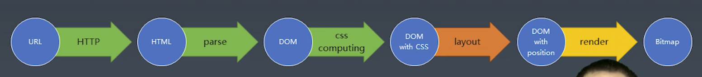

# 4. 排版 layout

## 第一步：根据浏览器属性进行排版

使用 Flex 排版技术进行排版。

如果主轴 Main Axis是横轴，则对应的属性有：

- flex-direction: row
  - Main 方向的属性：width，x，left，right
  - Cross方向的属性：height，y，top，bottom

如果主轴 Main Axix是竖轴，则对应的属性有：

- flex-direction：column
- Main 方向的属性：height，y，top，bottom
- Cross 方向的属性：width，x，left，right

## 第二步：收集元素进行(háng)

分行

- 根据主轴尺寸，把元素分进当前行中
  - 如果当前行的剩余尺寸不足以容纳当前元素，就新建一个当前行，把元素放入下一个当前行中。
- 若设置了 no-wrap，则强行分配进第一行，不会新建当前行。

## 第三步：计算主轴

计算主轴的方向：

- 找出所有 Flex 元素
- 把主轴方向的剩余尺寸按比例分配给这些元素
- 若剩余空间为负数，所有 flex 元素为 0，等比压缩剩余元素

## 第四步：计算交叉轴

计算交叉轴的方向：

- 根据每一行中最大元素的尺寸，计算行高
- 根据行高 flex-aligb 和 item-aligh，确定元素具体位置

# 5 渲染

安装环境：images包

- `npm install --save-dev images`

## 第一步：绘制单个元素

- 绘制需要依赖一个图形环境
  - 这里采用了 npm包，images
- 绘制在一个 viewport 上进行
  - 与绘制相关的属性：background-color、border、background-image等

## 第二步：绘制DOM树

- 递归调用子元素的绘制方法，完成DOM 树的绘制
- 忽略一些不需要绘制的节点
- 实际浏览器中，文字绘制是难点，需要依赖字体库，把字体转换成图片去渲染，我们这里忽略。
- 实际浏览器中，还会对一些图层做cpmpositing，我们这里也忽略了。

## 最终效果：

文件结构：

- server.js
- class-render
  - client.js
  - layout.js
  - parser.js
  - render.js
- node_modules
  - `npm install --save-dev css`
  - `npm install --save-dev images`