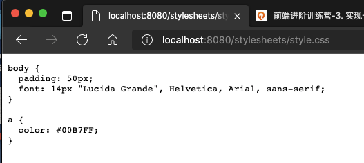

# Part I 实现一个线上 Web 服务

## 1 初始化 server

### 1.1 服务器的三个子系统： 

- （用户）线上服务系统
- （程序员）发布系统
- （命令行工具）发布工具

### 1.2 虚拟机运行服务器

- Oracle VM VirtualBox 下载地址：[ https://www.virtualbox.org/](https://www.virtualbox.org/)
- Ubuntu 20.04.1 LTS (Focal Fossa) 下载地址：
  - 官网：[ https://releases.ubuntu.com/20.04/](https://releases.ubuntu.com/20.04/)
  - 网盘：[ https://pan.baidu.com/s/1s8lga6YxuVcOdcAdhGQqoQ](https://pan.baidu.com/s/1s8lga6YxuVcOdcAdhGQqoQ)
    提取码：b8yw

**创建成功：**

创建成功后，开机，此时需要载入 Ubuntu  iso 光盘。

右下角调整大小：

语言选择英语 --> 不需要更新 --> Configure 名称等等全部默认 --> proxy 代理不用 --> 

mirror 镜像位置：修改为阿里云的，提升速度。`http://mirrors.aliyun.com/ubuntu`

后面 不用动，两个 done。全部默认，直到下面这里选 continue

填写账号 / 密码（123456）

SSH 默认 Install OpenSSH server 要选择上。

剩下全部不选，默认 done

提示错误，最后用 parallels 16 安装成功。

`sudo apt install nodejs` 	安装 nodejs

`sudo apt install npm`

`sudo npm install -g`   安装node包管理工具

`sudo n latest`   安装 node 最新版本

`PATH="$PATH"`     修改Path地址

## 2 利用 Express 编写服务器

 

# Part II 实现一个发布系统

流式处理

参考链接：

- https://nodejs.org/docs/latest-v13.x/api/stream.html#stream_class_stream_readable

- https://npmjs.com/package/unzipper
- https://docs.github.com/en/free-pro-team@latest/developers/apps/authorizing-oauth-apps

- https://github.com/settings/apps/toy-publish-m

用户：moxy_

密码：1-8

压缩：`npm install --save archiver`

解压：`npm install --save unzipper`

# Part III 持续集成

- Git Hook
- ESLint: https://eslint.org/docs/developer-guide/nodejs-api

- 无头浏览器 headless: https://developers.google.com/web/updates/2017/04/headless-chrome

