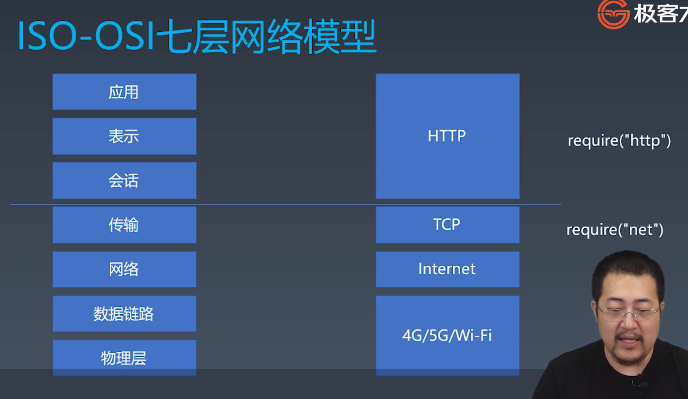
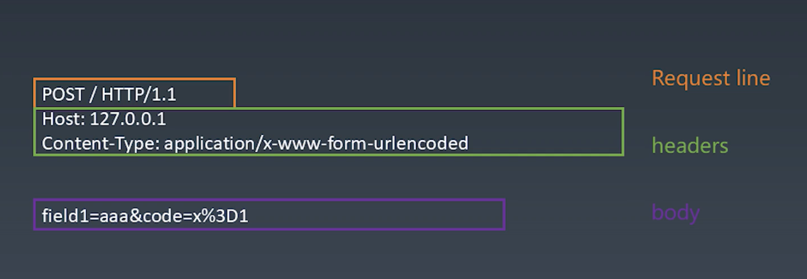
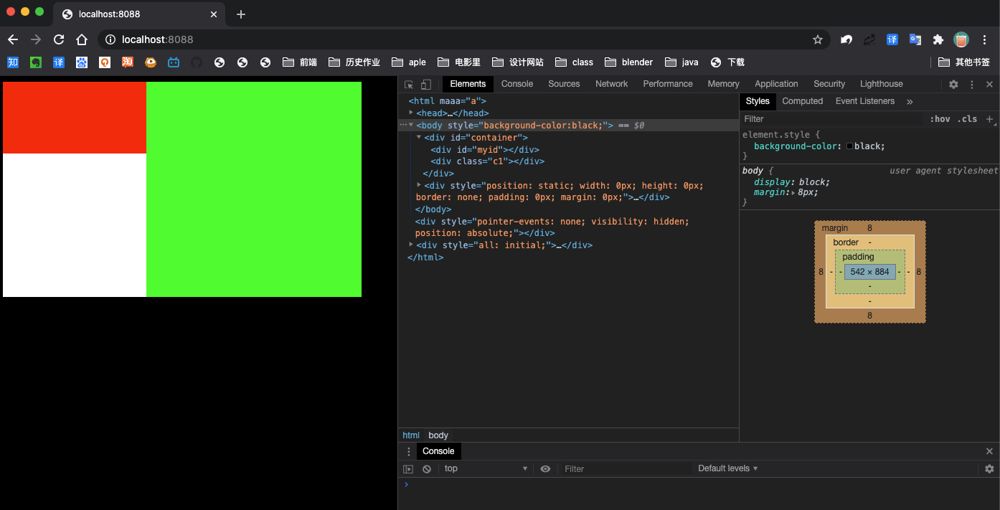

# 浏览器工作原理

# Port I 状态机

# 1. 总论

浏览器完成整体渲染，需要五个步骤：


# 2. 有限状态机

有限状态机 == 状态机。

- 每一个状态都是一个独立的机器。
  - 在每一个机器里，我们可以做计算、存储、输出……
  - 所有的这些机器接受的输入是一致的
  - 状态机的每一个机器本身没有状态，如果我们用函数来表示的话，它应该是纯函数（无副作用）
- 每一个机器知道下一个状态
  - 每个机器都有确定的下一个状态（Moore ）。摩尔状态机，较简单，程序基本写死了，不受输入影响，不可以做分支。
  - 每个机器根据输入决定下一个状态（Mealy）。米粒状态机，接受不同的输入，可以进入不同的状态中。代码变得复杂，但更灵活。

## 2.1 Mealy 状态机

state变量，永远表示当前状态 return一定有多个：是根据不同的input，在**if ... else** 中，决定返回

```jsx
// 用一个函数，定义一个状态
function state(input) {   // 参数就是输入
	// 函数体中，编写状态代码。根据输入，处理每个状态的逻辑。
	return next;   // 返回值作为下一个状态。
}

///////// 调用 /////////
while(input) {
	// 获取输入
	state = state(input)  // 把状态机的返回值作为下一个状态
}
```

## 2.2 使用有限状态机处理字符串

### 2.2.1 字符串判断：不使用有限状态机的处理方式：

#### 1. 在一个字符串中，找到字符“a”

```jsx
function match(string) {
  for(let c of string) {
    if(c == 'a')  return true
  }
  return false
}

match('I am groot');
```

#### 2. 在一个字符串中，找到字符“ab”

- 不可使用正则表达式(正则就是用有限状态机实现的）

```jsx
// 自己的方法，很差
function match(string) {
  for(let i = 0; i < string.length; i++) {
    if (string[i] == 'a') {
      if (string[i+1] == 'b') 
        return true; 
    }
  }
  return false
}

match('I am groot');

// 老师的方法，很妙
function match(string) {
  let foundA = false;
    for(let c of string) {
        if (c == 'a') {
            foundA = true;
        }
        else if(foundA && c == 'b') {
            return true;
        }
        else foundA = false;
    }
    return false
}

match('I abm groot');  // true
match('I acbm groot');  // false
```

#### 3. 在一个字符串中，找到“abcdef”

```jsx
// 原始人版本： 
    function match(string) {
        let foundA = false;
        let foundB = false;
        let foundC = false;
        let foundD = false;
        let foundE = false;
        for (let c of string) {
            if (c == 'a') {
                foundA = true;
            } else if (foundA && !foundB && c == 'b') {
                foundB = true;
            } else if (foundB && !foundC && c == 'c') {
                foundC = true;
            } else if (foundC && !foundD && c == 'd') {
                foundD = true;
            } else if (foundD && !foundE && c == 'e') {
                foundE = true;
            } else if (foundE && c == 'f') {
                return true;
            } else {
                foundA = false;
                foundB = false;
                foundC = false;
                foundD = false;
                foundE = false;
            }
        }
        return false;
    }

// 优化后的版本：
function findSubstring(str) {
    let step = 0;
    for (let c of str) {
      if (c === 'a') {
        step = 1;
      } else if (step === 1 && c === 'b') {
        step = 2;
      } else if (step === 2 && c === 'c') {
        step = 3;
      } else if (step === 3 && c === 'd') {
        step = 4;
      } else if (step === 4 && c === 'e') {
        step = 5;
      } else if (step === 5 && c === 'f') {
        return true;
      } else {
        step = 0;
      }
    }
    return false;
  }
```

#### 反思

1. 原始人版本：

   - 首先：利用 for ... of 只遍历一边字符串。同时用 if else 来判断。

   - a b c d e f，每个变量都定义一个对应的标识符，表示是否找到该字符。每当有一个字符被判断出来，就把相应的标识符置为 true。

   - 会出现“a b b c d e f”，即中间有两个的情况，会出现前面都匹配成功，最终返回 true。

     ```jsx
     // 如果单纯的把匹配成功的位置，重置为true，会出现 ‘abbcdef’也匹配成功的问题。
       for(let c of string) {
         if (c == 'a') foundA = true;
         else if (foundA && c == 'b') foundB  = true;
         else if (foundB && c == 'c') foundC = true;
         else if (foundC && c == 'd') foundD = true;
         else if (foundD && c == 'e') foundE = true;
         else if (foundE && c == 'f') return true;
         else {
           foundA = false; foundB = false; foundC = false;
           foundD = false; foundE = false;
         }
       }
     ```

     - 解决办法：当前判断位置，会先判断前一个位置是否匹配成功，然后判断当前位置是否已经置为true（如果当前位置是true，表明上一次判断和这次判断的字符相同），最后才匹配当前位置：“每次判断三个事情：上一个字符是否匹配成功，当前字符是否已经被匹配成功，当前位置是否匹配字符。

       - 换句话说：判断语句的时候，多一个判断：当前待判断字符，是否已经被置为true。如果置为true，则表明该字符上一次已经判断过，是重复字符。

       ```jsx
       for (let c of string) {
         if (c == 'a') {
           foundA = true;
         } else if (foundA && !foundB && c == 'b') {
           // foundA = false;
           foundB = true;
         } else if (foundB && !foundC && c == 'c') {
           // foundB = false;
           foundC = true;
         } else if (foundC && !foundD && c == 'd') {
           // foundC = false;
           foundD = true;
         } else if (foundD && !foundE && c == 'e') {
           // foundD = false;
           foundE = true;
         } else if (foundE && c == 'f') {
           return true;
         } else {
           foundA = false; foundB = false; foundC = false;
           foundD = false; foundE = false;
         }
       }
       ```

2. 优化后版本：

   - 利用step，可以很方便的确认当前判断位置是在哪里，如果step数字与字符应当在的位置不同，可以立刻分析出是否出现重复的字符。

### 2.2.2 字符串判断：使用有限状态机的处理方式：

- 解决的小问题：

  1. 没有可用的调试程序，无法发送“variables”：在用Vscode调试代码的时候，出现打印不出字符，是因为node.js 在执行完毕后，程序就会关闭。只需要在 需要打印的地方，添加断点即可。
  2. `return start()`：遇到这个问题，是先执行 `start()`，后执行return。具体：调用start函数，栈帧指向start函数，start函数返回后，再返回当前函数。 

- 遇到的小技巧：

  1. 有限状态机中，trip 陷阱。表示如果达到某个完成的标准，之后再进行任何判断，都会陷入“trip”中，只返回完成状态。本例中，进入 end 状态后，表明字符串已经匹配完成，后面的任何字符串匹配不再会改变当前“匹配完成”的状态，固不需要再判断他们。每次遇到判断，使用 trip，一直让字符进入 end 状态。

     ```jsx
     // trip的实现：
     function end(c) {
       return end;    // 只要是调用end状态机，就返回end状态。陷入。
     }
     ```

  2. 有限状态机中，reConsume 重新使用。在当前状态机已经判断完当前字符后，返回状态后，理应把下一个字符交给下一个状态机判断。但是，如果想让下一个状态机，重复判断当前字符，需要用到 reConsume。换句话说，当前状态机的判断完毕的字符，想交给下一个状态机再判断一次。

     - 本例中：为了防止字符被“吞掉”。在当前字符，遇到当前状态机判断，且不通过的时候。不应该证明这个字符已经判断完毕，不符合匹配原则。有可能这个字符是待匹配字符串，最开头的那个字符（例子中的a）。那么，这个字符不能被“吞掉”，需要交给 start状态机再判断一次。

       ```jsx
       // reConsume实现：
       function foundB(c) {
         if(c === "c")  
           return foundC;
         else 
           // return start;  // 不使用reConsume的写法。交给下一个状态机，会吞掉当前字符。
           return start(c);  // 执行start()状态机，该字符交给start状态机判断。不丢失。
       }
       ```

#### 1. 在一个字符串中，找到“abcdef”

```jsx
function match(string) {
    let state = start;
    for (const c of string) {
        state = state(c);
    }
    return state === end;
}

function start(c) {
    if(c === 'a')
        return foundA;
    else 
        return start(c);
}

// trip，陷阱。如果执行到end状态，证明已经匹配完毕，不再管后面的字符串判断，永远返回end。
function end(c) {
    return end;
}

function foundA(c) {
    if(c === 'b')
        return foundB;
    else 
        return start(c);
}

function foundB(c) {
    if(c === 'c')
        return foundC;
    else 
        return start(c);
}

function foundC(c) {
    if(c === 'd')
        return foundD;
    else 
        return start(c);
}

function foundD(c) {
    if(c === 'e')
        return foundE;
    else 
        return start(c);
}

function foundE(c) {
    if(c === 'f')
        return end;
    else 
        return start(c);
}

match('ababcdefg');
```

#### 2. 在一个字符串中，找到“abcabx”

这里有一个不同的问题：

- 如果遇到 ‘a b c a b c a b x’，即前面有两个重复的abc，在判断到：a b c a b c，第六个字母c的时候，如果按照之前的逻辑， c 这个字符会判断是否等于 x。不等于 x ，就会回到 start 去判断是否等于 a。最终，会判断失误，最终返回false。
- 事实上，最后一位： a b c a b x，中的第六位 x 这个位置。需要前前后后经过三个状态机判断：
  - 用 foundB2 判断：是否等于 x？ 
    - 如果等于 x，则全部字符串判断结束，返回 end 状态，最终输出 true。
    - 如果不等于 x ，则交给 foundC 状态机。
  - 用 foundC 判断：是否等于第二个a？（解决 a b c a b **c** ，的 c 问题）
    - 如果等于 a，则证明最近三个字符串是：abc，返回 foundA2状态，不是从头开始循环。
    - 如果不等于 a，则交给 start 状态机。
  - 用 start 判断：是否等于第一个a？
    - 此时，字符串的判断从头开始了。

```jsx
function match(string) {
    let state = start;
    for (const c of string) {
        state = state(c);
    }
    return state === end;
}

function start(c) {
    if(c === 'a')
        return foundA1;
    else 
        return start;
}

// trip，陷阱。如果执行到end状态，证明已经匹配完毕，不再管后面的字符串判断，永远返回end。
function end(c) {
    return end;
}

function foundA1(c) {
    if(c === 'b')
        return foundB1;
    else   
        return start(c);
}

function foundB1(c) {
    if(c === 'c')
        return foundC;
    else 
        return start(c);
}

function foundC(c) {
    if(c === 'a')
        return foundA2;
    else
        return start(c);
}

function foundA2(c) {
    if(c === 'b')
        return foundB2;
    else
        return start(c);
}

function foundB2(c) {
    if(c === 'f')
        return end;
    else
        return foundB1(c);
}

let a = match('abcabcabf');
console.log(a);
```

#### 3. 在一个字符串中，找到“abababx”

a b a b a b **a** b x：只需记住，加粗的“b”。应判断：

- foundB3 状态机：是否是 x ？
  - 是 x ：则此时执行结束，end 状态机。最终返回 true。
  - 不是 x ：则此时应判断是否是 A3 ？ -- 因为能判断到 B3（ababab已确认），证明前面已经判断了三个b，已经有了字符串：
    a b a b a b。既然最后一个字符不是 x，则现在应该分析：
    - 此时字符串的模式是不是：a b a b **a** b x
- foundB2 状态机：是否是 A3 ？
  - 是 A3 ：返回 foundA3 状态机，继续正常执行。
  - 不是 A3 ：返回 start，从头开始匹配。
- start 状态机：是否是 A1？

```jsx
function match(string) {
    let state = start;
    for (const c of string) {
        state = state(c);
    }
    return state === end;
}

function start(c) {
    if(c === 'a')
        return foundA1;
    else 
        return start;
}

// trip，陷阱。如果执行到end状态，证明已经匹配完毕，不再管后面的字符串判断，永远返回end。
function end(c) {
    return end;
}

function foundA1(c) {
    if(c === 'b')
        return foundB1;
    else   
        return start(c);
}

function foundB1(c) {
    if(c === 'a')
        return foundA2;
    else 
        return start(c);
}

function foundA2(c) {
    if(c === 'b')
        return foundB2;
    else   
        return start(c);
}

function foundB2(c) {
    if(c === 'a')
        return foundA3;
    else 
        return start(c);
}
function foundA3(c) {
    if(c === 'b')
        return foundB3;
    else   
        return start(c);
}

function foundB3(c) {
    if(c === 'x')
        return end;
    else 
        return foundB2(c);
}

let a = match('abababababx');
console.log(a);
```


# Port II 实现 toy browser

------------------------------------------------

# 1. HTTP请求

## 1.1 HTTP协议的解析



### 1.1.1  TCP IP 基础知识

#### TCP 层

- 流：TCP的数据，没有明显的分割范围，数据是按照顺序规范的。
- 端口：网卡根据端口，把接到的数据流，分发到需要的程序接口。
- require('net')；：node中对应的依赖库。

#### IP 层

- 包：传输的数据，是数据包为一个单位。根据网络情况，可大可小。
- IP地址：路由根据地址，分发数据包，最终达到目的网卡。
- libnet / libpcap：node中不需要负责IP，调用底层 C++的库。
  - libnet：封装IP数据报，并发送。
  - libpcap：提取网卡中的IP数据报（流经该路由的，目的地不是这里的IP包也可以抓取）。


#### HTTP

客户端、服务端的 Request Responce 是一呼一应，相互对应的。

- Request：客户端最先发起。
- Response：服务端接收Request后，执行Response回应。


## 1.2 服务端环境准备

 

server.js，需要接收 require 的三种信息：

- on error：直接打印 error
- on data：
  - 数据保存到 body 数组中。
- on end
  - 用concat方法，把数组中的内容拼起来。
  - 打印一下查看。
  - response 回复一个值，这里做测试用写死了。 writeHead，end

```jsx
const http = require('http');

http.createServer((request, response) => {
    let body = [];
    request.on('error', (err) => {
        console.log(err);
    }).on('data',(chunk) => {
        body.push9(chunk.toString());
    }).on('end', () => {
        body = Buffer.concat(body).toString();
        console.log("body:", body);
        response.writeHead(200, {'Content-Type': 'text/html'});
        response.end(' Hello World\n');
    });
}).listen(8088);

console.log("server started");
```


Http协议是一个文本协议，所以他的下层：Tcp协议中，相对应的“流”，其内容都可以看作是字符内容。

Http Request的三大结构：

- Request line、headers、空行、body




## 1.3 实现一个 HTTP请求

client.js

```jsx
void async function (){
    let request = new Request({
        mathod: "POST",
        host: "127.0.0.1",   // IP层
        port: "8088",        // Tcp层
        path: "/",
        headers: {
            ["X-Foo2"]: "customed"
        },
        body: {
            name: "Moxy"
        }
    });

    let response = await request.isReloadNavigation();

    console.log(response);
}
```

请求一个 Request。

请求结束，会调用send方法，返回一个promise，promise成功之后，会得到一个 response对象。


- 在使用立即执行的函数表达式时，可以利用 void 运算符让 JavaScript 引擎把一个function关键字识别成函数表达式而不是函数声明（语句）。
  - 不然是个匿名的函数声明，会报错，加上void会形成语句并调用。
- 使用void要比在 functio 外层加 ( ) 好，可以避免因为上一语句结尾没带分号导致的语法合并错误。


调试 node.js，会创建 .vscode 隐藏文件，创建 launch.json 


### 第一步：设计一个 HTTP 请求的总结

- 设计一个 HTTP 请求的类
- content type 是一个必要的字段，要有默认值
- body 是 KV 格式
- 不同的 content-type 影响 body 的格式


## 1.4 response格式，send() 函数

class ResponseParser，逐步接受 response文本，并且进行分析。


### 第二步：send函数总结

- 在 Request 的构造器中收集必要的信息。
- 设计一个 send 函数，把请求真实发送到服务器。
- send函数应该是异步的，所以返回 Promise。

### response 格式

- status line：HTTP版本号、HTTP状态码、HTTP状态文本 ==>（HTTP/1.1 200 OK）
  - 服务器状态码：
    - 500系列：服务器内部错误
    - 404：找不到网页
    - 200：获取到网页
    - 301、302、304：其他常见状态码
- headers
- 空行
- body


## 1.5 发送请求

### 第三步：发送请求

- 设计支持已有的connection 或者自己建立新的 connection
- 收到数据，传给parser
- 根据 parser 的状态，resolve Promise。


报错：

- Uncaught SyntaxError: Unexpected identifier异常，通常就是语法错误：
  - 导致的问题，就是在调试的过程中，打断点会不起作用。
  - 标点符号错了（逗号，点）
  - 字符串类型的值没有加双引号。
  - 我找到的错误：`net.XXX`，写成了 `new.XXX`


##  1.6 Response 解析

### 第四步：ResponseParser 总结

- Response 必须分段构造，所以我们要用一个 ResponseParser来“装配”
- ResponseParser 分段处理 ResponseText，我们用状态机来分析文本结构。

```jsx
class ResponseParser{
    constructor(){
        // status line 有 \r 和 \n 两个状态。
        this.WATTING_STATUS_LINE = 0;
        this.WATTING_STATUS_LINE_END = 1;
        // header name输入状态，name冒号后等待空格，value，header line end 四个状态
        this.WATTING_HEADER_NAME = 2;
        this.WATTING_HEADER_SPACE = 3;
        this.WATTING_HEADER_VALUE = 4;
        this.WATTING_HEADER_LINE_END = 5;
        // header之后，还要等一个空行。
        this.WATTING_HEADER_BLOCK_END = 6;  
        // body 格式不固定，所以这里不判断。
        this.WATTING_BODY=7;

        this.current = this.WATTING_STATUS_LINE;
        this.statusLine = "";
        this.headers = {}
        this.headName = "";
        this.headValue = "";
    }

    receive(string){
        for (let i=0; i<string.length;i++){
            this.receiveChar(string.charAt(i));
        }
    }
    receiveChar(char){
        if(this.current ===  this.WATTING_STATUS_LINE){
            if(char === '\r')
                this.current = this.WATTING_STATUS_LINE_END;
            else
                this.statusLine += char;
        }else if(this.current ===  this.WATTING_STATUS_LINE_END){
            // console.log(string.charAt(i))
            // this.statusLine.push(char);
            if(char === '\n'){
                this.current = this.WATTING_HEADER_NAME;
           }
        }else if(this.current === this.WATTING_HEADER_NAME){
            // console.log(char);
            if(char === ':'){ 
                this.current = this.WATTING_HEADER_SPACE;
            }else if(char === '\r'){
                this.current = this.WATTING_HEADER_BLOCK_END;
            }else{
                this.headName += char;
            }
        }else if(this.current === this.WATTING_HEADER_SPACE){
            if(char === ' '){
                this.current = this.WATTING_HEADER_VALUE;
            }else{
                this.statusLine += char;
            }
        }else if(this.current === this.WATTING_HEADER_VALUE){
            if(char === '\r'){
                this.current = this.WATTING_HEADER_LINE_END;
                this.headers[this.headName] = this.headValue;
                this.headName = ''
                this.headValue = ''
            }else{
                this.headValue += char;
            }
        }else if(this.current === this.WATTING_HEADER_LINE_END){
            if(char === '\n'){
                this.current = this.WATTING_HEADER_NAME;
            }
        } else if(this.current === this.WATTING_HEADER_BLOCK_END){
            if(char === '\n'){
                this.current = this.WATTING_BODY;
            }
        }else if(this.current === this.WATTING_BODY){
            this.bodyParser.receiveChar(char); 
            // if(this.current === )
          
        } 
    }
}
```


## 1.7 response body 的解析

### 第五步：BodyParser 总结

- Response 的 body 可能根据 Content-Type 有不同的结构，因此我们会采用子Parser 的结构的解决问题
- 以 TrunkedBodyParser 为例，我们同样用状态机来处理 body 的格式。


问题： 最后 `console.log(response)` 不打印

- 原因：没有添加 get isFinished() 和 get response() 这两个方法。没有把状态机解析到的数据整合到 response 中返回。
- 如果发现 node 程序有些地方“不执行”的问题，肯定是自己的代码出现了问题，要找逻辑结构哪里落下了，或者哪个字符和标点敲错了。


# 2 HTML 解析

浏览器完成整体渲染，需要五个步骤：


今天要做的就是第二步，HTML 进过 parse 变成 DOM 树。


### 第一步：HTML parse 模块的文件拆分

- 为了方便文件管理，我们把 parser 单独拆到文件中
- parser 的作用：接受HTML文本作为参数，返回一颗DOM树。


### 第二步：用FSM实现HTML的分析

网址：html.spec.whatwg.org/multipage/

- 12.2.5 Tokenization 讲了HTML的词法，通过状态机描述的。

- 用FSM实现HTML的分析
- 在HTML标准中，已经规定了HTML的状态
- Toy Browser 只挑选其中一部分状态，完成最简版本。


### 第三步：解析标签

- 标签有三种：开始标签、结束标签、自封闭标签。本步骤用状态机实现对三种标签的解析和识别。

- 设置对应的状态机。


### 第四步：创建元素

- 在状态机中，除了迁移状态，还要加入业务逻辑。
  - 创建 token，把字符加到 token 上，emit token。
- 在结束标签的结束状态，提交标签 token。


### 第五步：处理属性

- 属性值氛围单引号、双引号、无引号三种写法，因此需要较多状态处理。
- 处理属性的方式跟标签类似
- 属性结束时，我们把属性加到标签Token上。 


### 第六步：用token构建DOM树   --> 栈

- 从标签构建DOM树的基本技巧是使用栈
- 遇到开始标签时创建元素并入栈，遇到结束标签时出栈
- 自封闭节点可视为入栈后立即出栈
- 任何元素的父元素时它入栈前的栈顶


### 第七步：将文本节点加到DOM树

- 文本节点与自封闭标签处理类似，入栈后立刻出栈。

- 多个文本节点如果相连，需要合并。

# **！！！！作业提交！！！！**


# 3 CSS计算 CSS Computing


准备：环境准备 `npm install css`

## 第一步：收集CSS规则

为什么要把对 CSS 规则的收集加在 endTag 环节：因为只有识别到 style 的 endTag 标签时，才能完整的摘取标签内的所有文本节点。这些文本节点就是要收集的CSS规则。

- 遇到 style标签时，我们把CSS规则保存起来。
- 我们调用 CSS Parser 来分析 CSS规则（现成的）。
- 我们必须要仔细研究此库分析 CSS规则的格式。

## 第二步：添加调用

- 当我们创建一个元素的时候，就会立即计算 CSS
- 理论上，当我们分析一个元素时，所有的 CSS 规则已经收集完毕（在 hear 的 style标签中收集）
- 在真实的浏览器中，可能遇到写在 body 的 style 标签，需要重新执行 CSS计算的情况，这里先忽略。


## 3.3 获取父元素序列

- 在 computeCSS 函数中，我们必须知道所有的父元素才能判断元素与规则是否匹配。因为选择器有子孙选择器，父选择器。
- 我们从上一步骤的 stack，可以获取本元素所有的父元素。

- 因为我们首先获取的是“当前元素”，所以我们获得和计算计算父元素匹配的顺序是从内向外。


## 第四步：选择器与元素的匹配

- 选择器也要从当前元素向外排列
- 复杂选择器拆成针对单个元素的选择器，用循环匹配父元素队列。


## 第五步：计算选择器与元素匹配

  根据选择器的类似和元素属性，计算是否与当前元素匹配

- 这里仅实现了三种基本选择器，实习的浏览器要处理符合选择器
- 作业：实现复合选择器，实现支持空格的Class选择器：

```jsx
//////// 正则方法 ////////
function match(element, selctor) {
    if (!selctor || !element || !element.attributes) return false;
    if (selector.match(/^\#\w|\#\w[\n\t\f ]\.\w|\#\w[\n\t\f ]\w$/)) {
        let attr = element.attributes.filter(a => a.name === 'id')[0];
        if (attr && attr.value === selctor.replace("#", '')) {
            return true;
        }
    } else if (selctor.match(/^\.\w|\#\w[\n\t\f ]\.\w|\#\w[\n\t\f ]\w$/)) {
        let attr = element.attributes.filter(a => a.name === 'class')[0];
        if (attr && attr.value === selctor.replace(".", '')) {
            return true;
        }
    } else {
        if (element.tagName === selector) {
            return true;
        } else if (selector.match(/^\w|\w[\n\t\f ]\#\w|$\w[\n\t\f ]\.\w$/)) {
            return true;
        }
    }
    return false;
}

////////////状态机方法 ////////////
function match(element, allSelector) {
    if (!allSelector || !element.attributes) {
        return false;
    }
    let tagSelector = [];
    let idSelector = [];
    let classSelector = [];
    let start = selectorStart;
    let currentSelectorName = "";
    for (let c of allSelector) {
        start = start(c)
    }
    start(EOF);

    function selectorStart(c) {
        if (c === '.') {
            return classSelectorName;
        } else if (c === '#') {
            return idSelectorName;
        } else if (c === EOF) {
            return;
        } else {
            return selectorName(c)
        }
    }

    function classSelectorName(c) {
        if (c === '.' || c === '#' || c === EOF) {
            classSelector.push(currentSelectorName);
            return selectorStart(c);
        } else {
            currentSelectorName += c
            return classSelectorName;
        }
    }

    function idSelectorName(c) {
        if (c === '.' || c === '#' || c === EOF) {
            idSelector.push(currentSelectorName);
            currentSelectorName = "";
            return selectorStart(c);
        } else {
            currentSelectorName += c
            return idSelectorName;
        }
    }

    function selectorName(c) {
        if (c === '.' || c === '#' || c === EOF) {
            tagSelector.push(currentSelectorName);
            currentSelectorName = "";
            return selectorStart(c);
        } else {
            currentSelectorName += c
            return selectorName;
        }
    }
    let count = 0;
    if (idSelector.length != 0) {
        let attr = element.attributes.filter(attr => attr.name === "id")[0]
        if (attr) {
            let ids = attr.value.split(" ")
            for (let i = 0; i < idSelector.length; i++) {
                if (ids.includes(idSelector[i])) count++;
            }
        }
    }
    if (classSelector.length !== 0) {
        let attr = element.attributes.filter(attr => attr.name === "class")[0]
        if (attr) {
            let classNames = attr.value.split(" ")
            for (let i = 0; i < classSelector.length; i++) {
                if (classNames.includes(classSelector[i])) count++;
            }
        }
    }
    if (tagSelector.length !== 0) {
        if (element.tagName === tagSelector[0]) {
            count++;
        }
    }
    let sumLength = idSelector.length + classSelector.length + tagSelector.length
    return count === sumLength

}
```


## 第六步：生成computed 属性

- 一旦选择匹配，就应用选择器到元素上，形成 computedStyle


## 第七步：specificity的计算逻辑

```css
/* 规则的优先级，要按照优先级顺序来判断是否运用该规则。 */
[0,		0,		0,		0]
inline	id		class	tag
```

尝试在 selectorParts 中去解析复合选择器：

```jsx
function getSelectors(selector) {
    if (!selector) {
        return []
    }
    let selectors = []
    let currentSelector = ''

    for (let c of selector) {
        for (let c of selector) {
            if (c === '#' || c === '.') {
                if (currentSelector.length > 0) {
                    selectors.push(currentSelector)
                }
                currentSelector = c
            } else {
                currentSelector += c
            }
        }
        if (currentSelector.length > 0) {
            selectors.push(currentSelector)
        }
        return selectors
    }

    function matchAll(element, selector) {
        let selectors = getSelectors(selector)
        for (let selector of selectors) {
            if (!match(element, selector)) {
                return false
            }
        }
        return true
    }
}
```

- CSS规则是规矩specificity和后来优先规则覆盖。
- specificity 是个四元组，越左边权重越高（开头已说）。
- 一个CSS规则的specificity根据包含的简单选择器相加而成。


# 4. 排版 layout


## 第一步：根据浏览器属性进行排版

使用 Flex 排版技术进行排版。


如果主轴 Main Axis是横轴，则对应的属性有：

- flex-direction: row
  - Main 方向的属性：width，x，left，right
  - Cross方向的属性：height，y，top，bottom


如果主轴 Main Axix是竖轴，则对应的属性有：

- flex-direction：column
- Main 方向的属性：height，y，top，bottom
- Cross 方向的属性：width，x，left，right


## 第二步：收集元素进行(háng)

分行

- 根据主轴尺寸，把元素分进当前行中
  - 如果当前行的剩余尺寸不足以容纳当前元素，就新建一个当前行，把元素放入下一个当前行中。
- 若设置了 no-wrap，则强行分配进第一行，不会新建当前行。


## 第三步：计算主轴

计算主轴的方向：

- 找出所有 Flex 元素
- 把主轴方向的剩余尺寸按比例分配给这些元素
- 若剩余空间为负数，所有 flex 元素为 0，等比压缩剩余元素


## 第四步：计算交叉轴

计算交叉轴的方向：

- 根据每一行中最大元素的尺寸，计算行高
- 根据行高 flex-aligb 和 item-aligh，确定元素具体位置


# 5 渲染

安装环境：images包

- `npm install --save-dev images`

## 第一步：绘制单个元素

- 绘制需要依赖一个图形环境
  - 这里采用了 npm包，images
- 绘制在一个 viewport 上进行
  - 与绘制相关的属性：background-color、border、background-image等


## 第二步：绘制DOM树

- 递归调用子元素的绘制方法，完成DOM 树的绘制
- 忽略一些不需要绘制的节点
- 实际浏览器中，文字绘制是难点，需要依赖字体库，把字体转换成图片去渲染，我们这里忽略。
- 实际浏览器中，还会对一些图层做cpmpositing，我们这里也忽略了。


## 最终效果：



文件结构：

- server.js
- class-render
  - client.js
  - layout.js
  - parser.js
  - render.js
- node_modules
  - `npm install --save-dev css`
  - `npm install --save-dev images`


