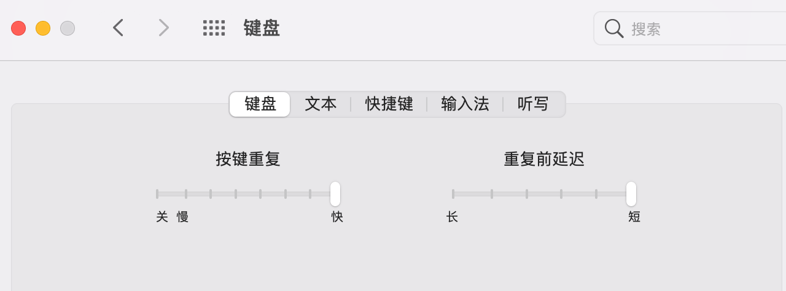
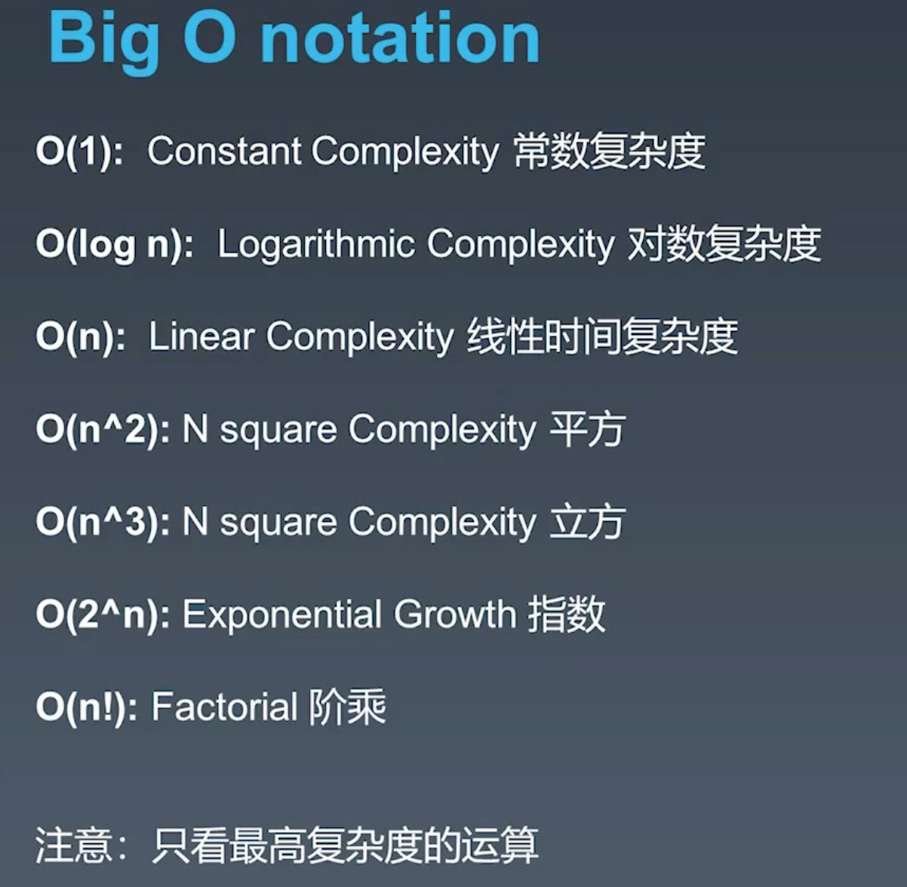
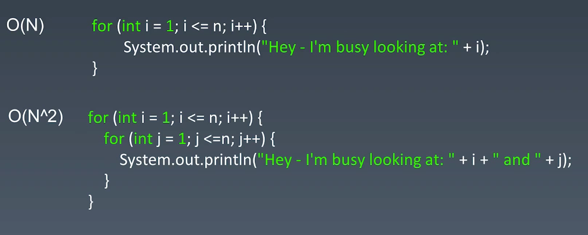
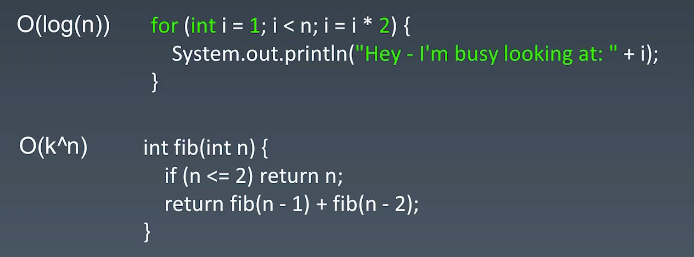
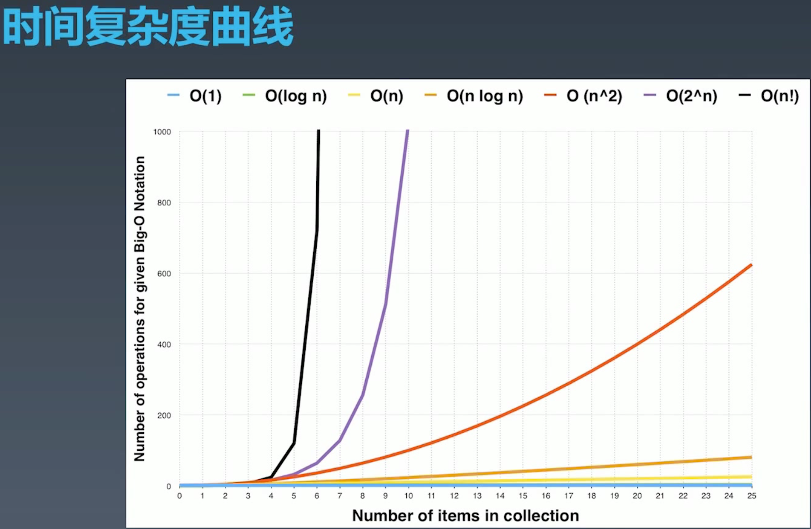
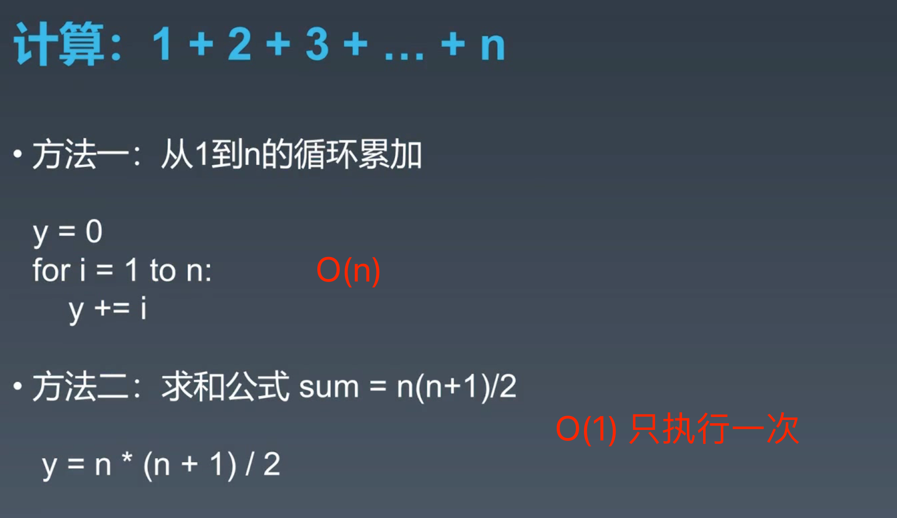
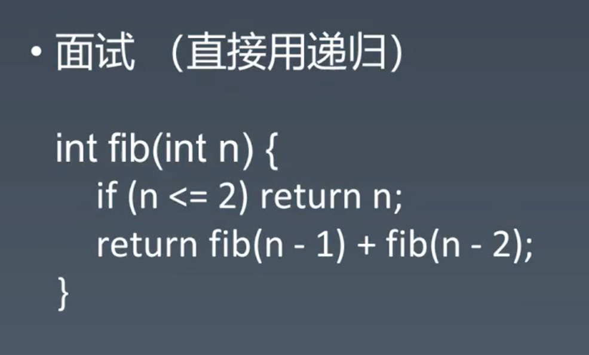
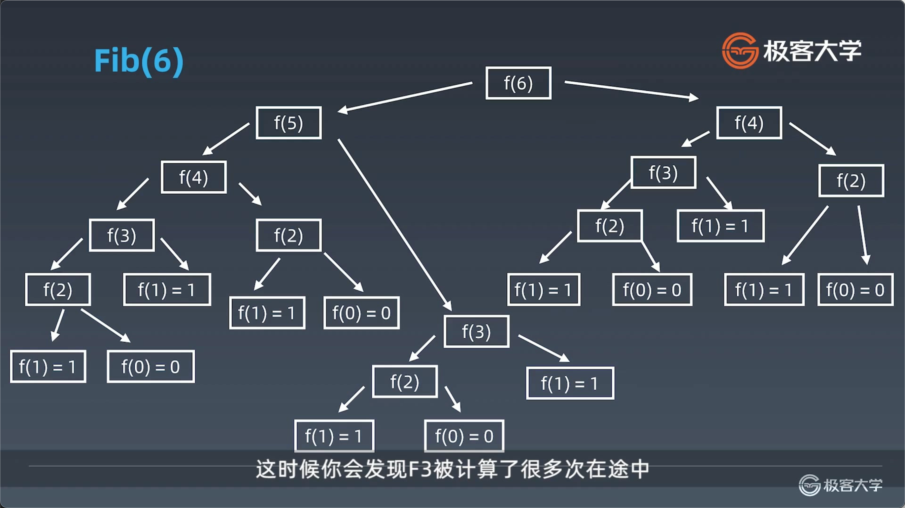
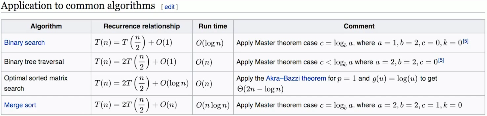

# 1. 数据结构与算法总览

## 1.1 职业训练 —— 三步法快速掌握新知识

### 1. Chunk it up

reddit网站

切碎知识点、庖丁解牛。

每个知识体系都是一棵树，树状结构。有根、延伸出主干、然后延伸出分支、枝叶。要把新知识和就知识挂靠在一起，形成关系。最后变成一个树形结构。人脑不适合孤立的记忆，要形成一个记忆脑图。

### 2. 刻意练习

基本功练习：对基础知识反复练习。练题，只练习一遍是远远不够的，不能够形成条件反射。

- 五遍刷题法

  - 练习自己的弱项、弱点的地方。
  - 不舒服、枯燥、无聊的地方，就是要突破的薄弱环节。

  - 反复练习，形成肌肉记忆。

### 3. Feedback

- 即时反馈
- 主动型反馈（自己去找）
  - 高手代码 (GitHub, LeetCode, etc.) 
  - 第一视角直播
- 被动式反馈（高手指点）
  - 我没有（哭


## 1.2 数据结构与算法大纲

### 1. 数据结构的分类（3）

- 一维：
  - 基础：数组 array（string）、链表 linked list
  - 高级：栈 stack、队列 queue、双端队列 deque、集合 set、映射 map（hash or map）、etc
- 二维：
  - 基础：树 tree、图 graph
  - 高级：二叉搜索树 binary search tree（red-black tree、AVL）、堆（leap）、并查集（disjoint set）、字典树（Trie、etc）
- 特殊：
  - 位运算 BitWise，布隆过滤器 Bloom Filter
  - LRU Cache

### 2. 算法的分类（8）

基础：

- If-else、switch  --> branch 跳转
- for、while loop --> Iteration 遍历
- Recursion（Divide & Conquer、Backtrace）递归

高级（基于基础泛化而来）：

- 搜索 Search：深度优先搜索 Depth first search、广度优先搜索 Breadth first search、A*、etc
- 动态规划 Dynamic Programming
- 二分查找 Binary Search
- 贪心 Greedy
- 数学 Math、几何 Geometry

## 1.3 学习二法宝

### 1. 切题四件套

#### 1. Clarification

向面试官问清具体的问题是什么

#### 2. Possible solutions

构思自己所有可能的想法都过一遍，比较不同方法的时间和空间复杂度。

- compare（time/space）时空复杂度

#### 3. Coding

写下代码

#### 4. Test cases

提供测试用例，让面试官感觉更清晰、完整。


### 2. 五步刷题法（无毒神掌）

#### 第一遍：

- 5分钟：读题 + 思考
  - 如果陌生，最多10-15分钟思考时间。
- 直接看解法：如果没思路，直接看解法。
  - 注意对比多种解法之间的优劣。
- 背诵、默写好的解法（几乎是肌肉记忆）。

#### 第二遍：

- 马上自己默写出来
  - 写出来后，在LeetCode提交自己的代码，修改Bug。

- 多种解法都写，进行比较。
  - 优化：根据执行时间优化自己的解法（领先80%以上）。

#### 第三遍：

- 一天之后，第二天再重复做题。
- 不同解法的熟练程度，如果有自己没有掌握牢固的，进行专项训练

#### 第四遍：

- 一周之后，反复回来练习相同的题目。
- 四遍过后，基本达到不会忘记了。

#### 第五遍：

- 面试前一两周，进行恢复性训练。

### **⚠️注意：做题不能只做一遍！！**


# 2. 环境准备 & 复杂度分析

## 2.1 环境准备

- 据说，Win平台的Mircosoft New Terminal 很不错。https://github.com/microsoft/terminal

- leetcode的中文站和英文站，题库内容是相同的。每个题目的地址，在两个站中，后缀是相同的。可以以中文站为主，然后如果想看更多讨论，把中文站的地址:leetcode-cn.com，删除cn，修改为:leetcode.com即可进入英文站-“Most votes”。
  - 在做题第三遍、第四遍的一定要看 Most votes中，与我语言相关的最高票的回答，和最高票的前三个回答，一定有很多知识可以学习。
- 修改键盘响应速度，提高码字效率。




- Google Code Style

```javascript
// if和左括号，必须要有空格。
// 几乎所有的括号和关键字前后，都要有空格（空格尽量多）。
class InnerClass {
  constructor() {}

  /** @param {number} foo */
  method(foo) {
    if (condition(foo)) {
      try {
        // Note: this might fail.
        something();
      } catch (err) {
        recover();
      }
    }
  }
}

// for 循环
for (let i = 0; i < foo.length; i++) bar(foo[i]);

// 数组的定义
const a = [
  0,
  1,
  2,
];

const b =
    [0, 1, 2];

// 箭头函数
export function setMutateFoo(newMutateFoo) {
  // Exported classes and functions can be mutated!
  mutateFoo = () => {
    foo = newMutateFoo(foo);
  };
}

```


- Top tips
  - 遇到一个新的IDE，先搜搜看它的top tips
  - opt + delete 删除单个单词
  - cmd + delete 删除整行单词 
  - 自动补全：opt+enter，在一个尚未定义的函数上使用，会自动补全。


- 代码要自顶向下的方式来写，类似写新闻稿一样。
  - 重要的函数，关键的逻辑，要先写在最上方。
  - 次要的函数，细节函数，要放在后面。


- IDE
  - VSCode
  - Java：IntelliJ
  - Python：Pycharm


## 3 时间 & 空间复杂度

## 3.1 时间复杂度

### 3.1.1 Big O notation

- 7种常见的时间复杂度

 

- logn是指：以2为底的log对数。


**案例分析：**





- O(log(n))
  - 分析：
    - 若 n == 4，i == 1，2，4(跳出循环)，执行2次循环。
    - 若 n == 10，i == 1，2，4，8，16(跳出循环)，执行5次循环。
    - 若 n == 20，i == 1，2，4，8，16，32（跳），执行6次循环。
  - 判断：
    - i == 1，2，4，8，16，32，64，128 ==> 满足条件： 2^x < n，x就是循环次数；
    - 则：x = log2(n)  ==> O(log(n))
- O(k^n)
  - 后面再判断



**常数 < 对数 < 幂函数 < 指数 < 阶乘**

**n < n·log2(n) < n^2 < 2^n < n!**


举例：对一个计算进行优化，可以大大提升执行的效率。




举例：斐波那契数列

- F(n) = F(n - 1) + F(n - 2)



分析的时候，用树状结构来分析。可以看到，没一层展开都会变成两个分支节点，同时会有大量的重复计算。




### Master theorem 主定理

- [主定理](https://zh.wikipedia.org/wiki/%E4%B8%BB%E5%AE%9A%E7%90%86)



- 一维层面的二分法：O(logn)
- 二叉树：O(n)
- 在排好序的二维矩阵进行二分法：O(n)

- 归并排序：O(nlogn)


思考：

- 二叉树遍历：前序、中序、后序：时间复杂度：O(n) 
- 图的遍历 ：时间复杂度：O(n)
  - 二叉树、图的遍历，每一个节点都会访问且只访问一次，所以时间复杂度是 O(n)。
- 搜索算法：DFS（深度搜索优先）、BFS（广度搜索优先）：时间复杂度：O(n)
- 二分查找的时间复杂度：O(nlogn)


