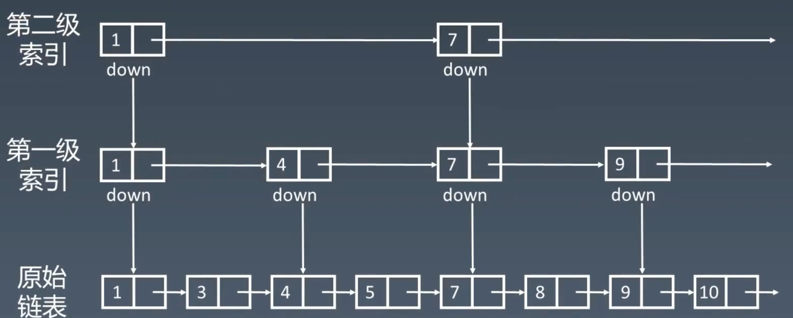
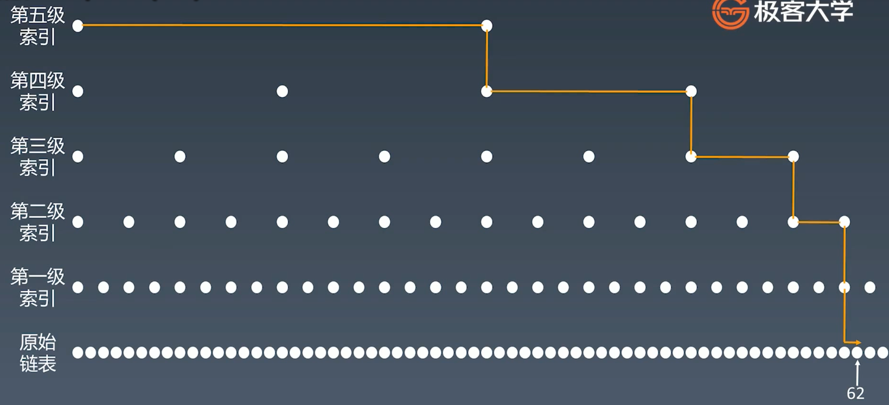
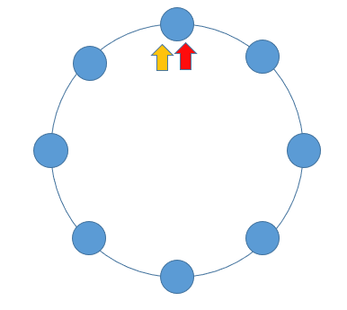
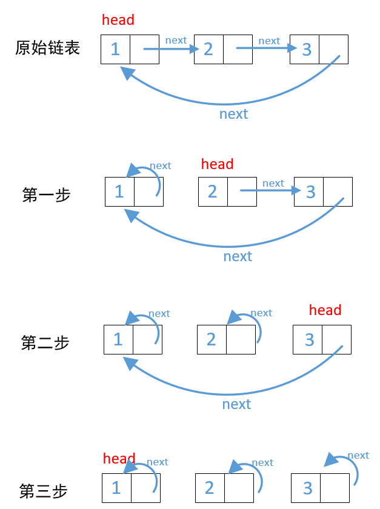
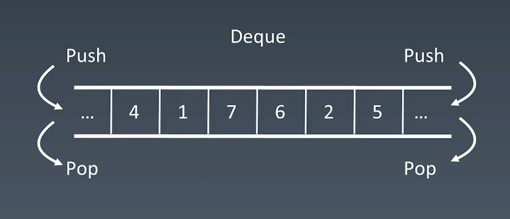
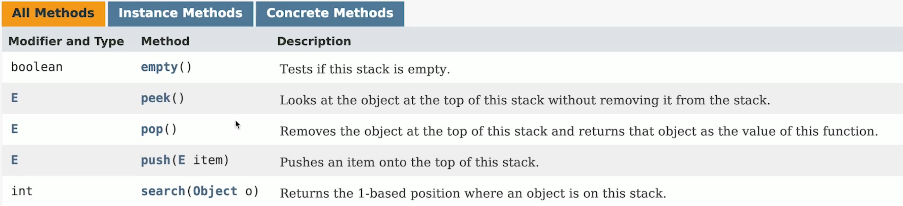
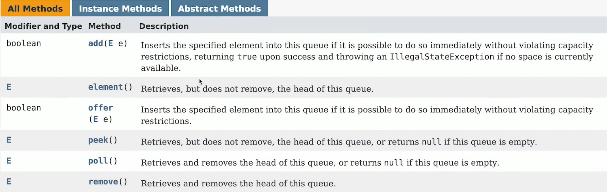
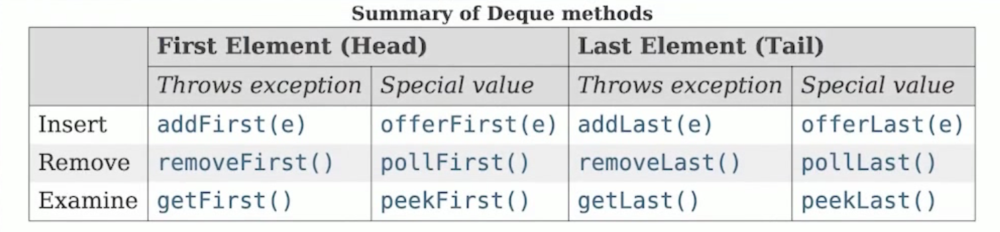
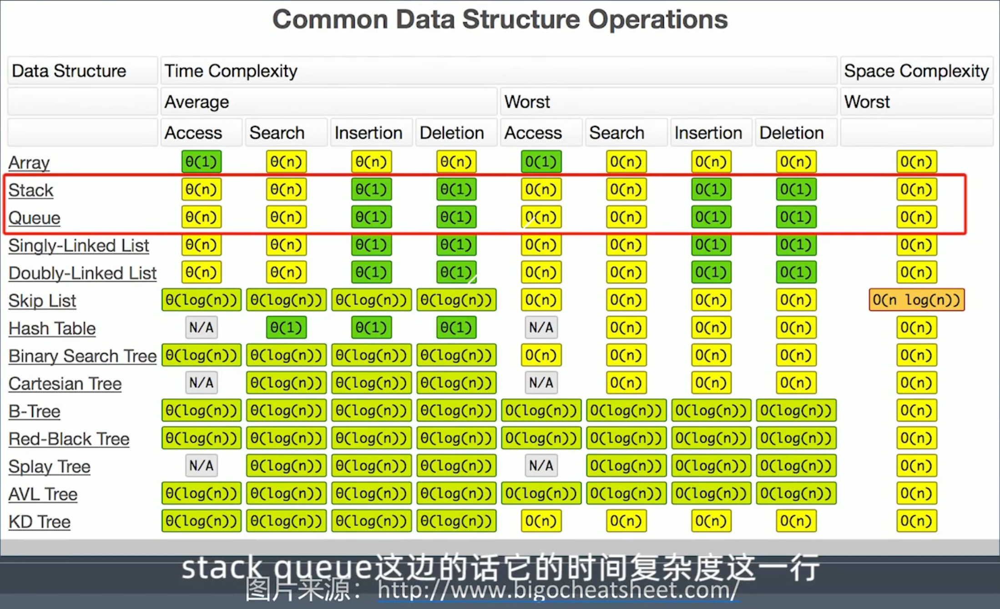

# 3 数组、链表、跳表

|                | Array List | Linked List | Skip List |
| -------------- | ---------- | ----------- | --------- |
| Prepend 头增删 | O(1)       | O(1)        |           |
| Append 尾增删  | O(1)       | O(1)        |           |
| Lookup 查找    | O(1)       | O(n)        | O(log(n)) |
| Insert 插入    | O(n)       | O(1)        |           |
| Delete 删除    | O(n)       | O(1)        |           |
| 空间复杂度     | O(n)       | O(n)        | O(n)      |


## 301 基本实现和特性

### Array List 数组

Java,  C++:  `int a [100];`

Python:  `list = []`

JavaScript: `let x = [1, 2, 3]`

- 每当申请一个数组，内存管理器会开辟一个连续的地址
- 优点：访问任何地址的时间复杂度（常数级 O(1)）是一样的，随机访问很快
- 缺点：插入、删除操作需要拖动较多元素，时间复杂度较高（O(n)）。
  - 扩容：如果数组空间不足，就会扩容new 一个新数组。扩容后的大小：`Math.max(current * 2, minCapacity)`，是当前空间的二倍，或者是当前操作（插入元素后）所需要的内存空间中的更大值。

#### Array 插入元素

O(n) 的时间复杂度，在中间位置插入一个元素，需要把后面的元素全部位移，访问到了后面每一个元素。

#### Array 删除元素

O(n)的时间复杂度，在中间位置插入一个元素，需要把这个元素删除，把后面的元素全部位移，访问到了后面每一个元素。


### Linked List 链表

`class node` 自定义一个node链表类。

- 单链表：后继节点、直接后继
- 双链表：前驱结点和后继结点、直接后继和直接前驱
- 循环链表：末尾的最后一个 Tail指针，指向 Head 开头。


- 优点：频繁的插入、删除操作比数组更优，时间复杂度更低O(1)。

- 缺点：不支持随机访问，访问任意位置需要从头节点一步一步查找，时间复杂度O(n)。

Linked List的最简单实现：

```c++
class LinkedList {
  	Node head;  // head of list
  
  // Linked list Nost
  	class Node {
    		int data;
      	Node next;
      
      	Node(int d) { data = d;}
  	}
}
```

#### Linked List 插入节点

只需要修改插入位置的前驱节点、后继节点即可。时间复杂度是 O(1)。

#### Linked List 删除节点


目标节点的前一个节点中，后继节点替换为下一个节点即可。时间复杂度O(1)。


## Skip List 跳表

Redis中常用。理解工作原理为主，不需要会编写。

跳表的出现，是为了解决链表的 lookup随机访问是 O(n)而诞生的 。

**算法的中心思想：升维。用空间换时间。**

优点：优化了链表查找速度，时间复杂度O(log(n))

缺点：进行插入、删除操作后，需要频繁更新维护跳表。


### 跳表的改进原理：

#### 添加第一级索引

增加一级索引，可以让速度提高一倍，及速度x2


#### 添加第二级索引

增加二级索引，可以让查找速度 x4



#### 以此类推



#### 分析：跳表的时间复杂度

- 原始链表节数树为 n、一级索引节点数为 n/2、二级 n/4、三级 n/8 = n/(2^3)
  -  第 k 级索引的节点数是： n/(2^k)
- 假设索引有 k 级，最高级索引的节点数为 2。 => 2 =  n/(2^k) ，则求得：k = log2(n) - 1
- 建立了以 索引高度 k 和 原始链表节点数 n 的关系。


- 查询时，可以看到在每层索引遍历的节点的个数，一定不会超过2。则时间复杂度的数量级等于索引的数量级，时间复杂度：O(log(n))

#### 现实中的跳表形态


由于有插入、删除节点的问题，所以现实中的跳表形态可能是这样不规则的。所以，跳表在现实中，存在维护不方便的问题。每当对跳表进行插入、删除节点，就需要对跳表进行更新。时间复杂度：O(log(n))

#### 空间复杂度分析


因为这个数列最终收敛，占用空间连 2n 也没超过。空间复杂度的数量级也是 n。

#### 应用

LRU Cache - Linked List 。缓存机制 —— 力扣

Redis - Skip List。


### 题目

#### Array List

1. https://leetcode-cn.com/problems/container-with-most-water/ 
2. https://leetcode-cn.com/problems/move-zeroes/
3. https://leetcode-cn.com/problems/climbing-stairs/
4. https://leetcode-cn.com/problems/3sum/ (高频老题） 

#### Linked List

1. https://leetcode-cn.com/problems/reverse-linked-list/ 
2. https://leetcode-cn.com/problems/swap-nodes-in-pairs 
3. **https://leetcode-cn.com/problems/linked-list-cycle** (巧妙)
4. https://leetcode-cn.com/problems/linked-list-cycle-ii 
5. https://leetcode-cn.com/problems/reverse-nodes-in-k-group/

#### Homework

1. https://leetcode-cn.com/problems/remove-duplicates-from-sorted-array/ 
2. https://leetcode-cn.com/problems/rotate-array/ 
3. https://leetcode-cn.com/problems/merge-two-sorted-lists/ 
4. https://leetcode-cn.com/problems/merge-sorted-array/ 
5. https://leetcode-cn.com/problems/two-sum/ 
6. https://leetcode-cn.com/problems/move-zeroes/ 
7. https://leetcode-cn.com/problems/plus-one/ 


### 实战1：移动零

#### 练习步骤：

1. 5 - 10分钟：读题和思考
   - 然后马上看题解。默写背诵、熟练。
2. 在IDE里，开始自己写（闭卷）

https://leetcode-cn.com/problems/move-zeroes/submissions/


```javascript
// 替换后，填0法 88ms
var moveZeroes = function(nums) {
    j = 0;
    for(i = 0; i < nums.length ; i ++) {
        if (nums[i] != 0) {
            nums[j] = nums[i]
            if (i !=j )
                nums[i] = 0
            j++
        }
    }
};

// 交换法 92ms
var moveZeroes = function(nums) {
    j = 0;
    for(i = 0; i < nums.length ; i ++) {
        if (nums[i] != 0) {
            temp = nums[i]
            nums[i] = nums[j]
            nums[j] = temp
            j ++
        }
    }
};
```

```java
// 替换后，填0法 0ms
class Solution {
    public void moveZeroes(int[] nums) {
        int j = 0;
        for(int i = 0; i < nums.length; i++) {
            if(nums[i] != 0) {
                nums[j] = nums[i];
                if(i != j)
                    nums[i] = 0;
                j++;
            }
        }
    }
}
```

```python
# 交换法 16ms
class Solution(object):
    def moveZeroes(self, nums):
        j = 0
        for i in xrange(len(nums)):
            if nums[i] != 0:
                nums[j], nums[i] = nums[i], nums[j]
                j += 1
                
# 替换后，填0法 20ms
class Solution(object):
    def moveZeroes(self, nums):
        j = 0
        for i in xrange(len(nums)):
            if nums[i] != 0:
                nums[j] = nums[i]
                if i != j:
                    nums[i] = 0
                j += 1
```

 `xrange(len(nums))`：

- `xrange()`：为一个length创建一个可以遍历的生成器。
- `len([dist])`：获取一个dist的length。


### 实战2：盛水最多的容器

[11. 盛最多水的容器](https://leetcode-cn.com/problems/container-with-most-water/)

遇到两层遍历 `i, j`，且 `i, j` 不能重复的时候，需要非常熟练写下如下for循环：

```java
// i从左边界开始，j截止到右边界
for (int i = 0; i < str.length - 1; ++i) {
  	for (int j = i + 1; j < str.length; ++j) {
      // codes
    }
}
```

一层循环，`i, j`一个从左边界往内遍历，一个从右边界往内遍历。也要形成肌肉记忆

```java
for (int i = 0, j = str.length - 1; i < j; ) {
  // codes
  // i的递增和j的递减，在循环里设置。
}
```


解法一：两次for循环

- **O(n^2)**

```java
// java
class Solution {
    public int maxArea(int[] height) {
        int max = 0;
        for (int i = 0; i < height.length - 1; ++i) {
            for (int j = i + 1; j < height.length; ++j) {
                int area = (j - i) * Math.min(height[i], height[j]);
                max = Math.max(area, max);
            }
        }
        return max;
    }
}
```

```python
# python
# 超出时间限制，但是可用
class Solution:
    def maxArea(self, height: List[int]) -> int:
        maxA = 0;
        for i in range(0, len(height) - 1):
            for j in range(i + 1, len(height)):
                area = (j - i) * min(height[i], height[j])
                maxA = max(maxA, area)
        return maxA
```


解法二：左右夹逼（收敛）

- **O(n)**

- 一层循环，`i, j`一个从左边界往内遍历，一个从右边界往内遍历。也要形成肌肉记忆
- 思想：i 和 j分别从左右往内遍历，先确保了容积的最宽，但是容积的高度不是最优。
  - 这个时候，当i和j往里遍历的时候，任何一组新的 i, j 都不如之前的宽，那它必须要比之前那组 i, j 高，才会有可比性。
  - 所以，在 i, j 向内遍历时，不断判的新的一组 i, j 高度是否更高，然后比较 max。
    - 这里的‘高度’，指的是 i 和 j 中，更高的一个棒子。

```java
// 老师的方法
// 为什么在计算area的时候，是(j - i + 1)，要加1；
// 原因：老师的三目运算起到了一举两得的作用：
//		1. 令 i 和 j 的边界向内收缩一次。也就是下一次计算面积时，i和j的坐标位置；
//		2. 求出了当前i和j的最小高度，方便了本次面积计算。
// 所以，因为i和j在三目运算中，肯定改变了其中之一的数值，不论是i还是j，一定是向内收缩了，
// 			这个时候，在计算 area的时候只需要(j - i + 1），多加一个1，就是当前i和j的差了。
//			如果不加1，只计算(j - i）是下一次面积计算的值，不是当前遍历的值。	
class Solution {
    public int maxArea(int[] height) {
        int max = 0;
        for (int i = 0, j = height.length - 1; i < j;  ) {
            int minHeight = height[i] > height[j] ? height[j--] : height[i++];
            int area = (j - i + 1) * minHeight;
            max = Math.max(area, max);
        }
        return max;
    }
}
```


```python
# 不会用for + 三目运算，用的是普通的while
class Solution:
    def maxArea(self, height: List[int]) -> int:
        maxA, i, j = 0, 0, len(height) - 1
        while i < j:
            maxA = max(maxA, min(height[i],height[j]) * (j - i))
            if height[i] < height[j]:
                i += 1
            else:
                j -= 1
        return maxA
      
      
# 如果不用自带的 max和min 方法，速度可以快许多：
class Solution:
    def maxArea(self, height: List[int]) -> int:
        maxA = 0
        i, j = 0, len(height) - 1
        while i < j:
            if height[i] < height[j]:
                area = (j - i) * height[i]
                if maxA < area:
                    maxA = area
                i += 1
            else:
                area = (j - i) * height[j]
                if maxA < area:
                    maxA = area
                j -= 1
        return maxA
```


### 实战3：爬楼梯

#### 解题心得：

1. 如果遇到不会做的情况，先考虑有没有**暴力解法**；
2. 考虑有没有更优的解法，尽可能全面的考虑**多个解法**；
3. 如果什么想法都没有，就考虑基本情况：一步一步假设的来 ----> **最近重复子问题**，数学归纳法。
   - 因为计算机任何运算，都是对 if else、loop (for, while)、递归。的不断重复而已。没有很难的逻辑包含在其中，所以，要拆解每一个算法，找到最近重复字问题，然后找到解答。


1. 想：最近重复字问题

- 走到一级台阶，有 1 种走法；f(1)
- 走到二级台阶，有 2 种走法；f(2)
- 那么走三级台阶，就可以找到重复的规律，只有两种情况：f(1) + f(2)
  - 从一级台阶，爬 2 节走到第三级； 
  - 从二级台阶，爬 1 节走到第三级； 
- 可以推广，后面所有的台阶都是这么走过来的，走到第 n 级台阶，有两种情况：
  - f(n) = f(n-1) + f(n-2)：本质上就是一个**求斐波那契数列**。
  - 从 n-2 级台阶，爬 2 节走到第三级；
  - 从 n-1 级台阶，爬 1 节走到第三级；


[解答的很好](https://leetcode-cn.com/problems/climbing-stairs/solution/cong-zhi-jue-si-wei-fen-xi-dong-tai-gui-hua-si-lu-/)

- 从上至下的递归数、重复子问题、自底而上的动态规划

```python
# 斐波那契数列
class Solution(object):
    def climbStairs(self, n):
        if n <= 2: return n;
        f1, f2, f3 = 1, 2, 3
        for i in range(3, n + 1):
            f3 = f1 + f2
            f1 = f2
            f2 = f3
        return f3
      
# 还可以进一步优化，将f3变量定义的作用域更小
class Solution(object):
    def climbStairs(self, n):
        if n < 3: return n
        f1, f2 = 1, 2
        for _ in range(3, n + 1):
            f3 = f1 + f2
            f1 = f2
            f2 = f3
        return f2
```

### 复习时发现问题：

- Line 5: `for _ in range(3, n + 1):`，这里我总忘记是从 3 开始遍历。1 和 2 的情况已经在前面返回了。


### 实战4：3数之和

[3数之和](https://leetcode-cn.com/problems/3sum/)

- 引子：[2数之和](https://leetcode-cn.com/problems/two-sum/)

- 解题：a + b = -c

- 解法：

  1. 暴力求解：三重循环，相当于在 2数之和外面再套一层 target循环。O(n^3)

  2. hash 表来记录（高级数据结构方法）
  3. 双指针、夹逼，左右下标推进（套路方法，自己想不到的，直接看题解就行）。
     1. 排序		`nums.sort()`
     2. 夹逼

- 总结：双指针法，可以代替一些双层for循环的遍历。前提条件是寻求的结果是不可重复的。

```python
# 1 暴力求解
# 注意1: 如何写三重循环的 for in
# 注意2: 先定义 length 变量，可以少计算两次 len(nums)
# 注意3: 题目要求返回的list中，没有重复的项，但是这里有重复的项，是个错误。

class Solution(object):
    def threeSum(self, nums):
        res = []
        length = len(nums)
        for i in range(0, length - 2):
            for j in range(i + 1, length - 1):
                for k in range(j + 1, length):
                    if nums[i] + nums[j] + nums[k] == 0:
                        res.append([nums[i], nums[j], nums[k]])
        return res
```


双指针法： -c = a + b

- 如果 nums不存在，或长度小于3，直接返回空；
- 排序 sort()，nums按照从小到大排序。
- for循环，遍历 c
  - 判断：如果 nums[c] 大于0，跳出循环，返回结果。因为 nums[a] 和 nums[b] 一定大于nums[c]。此时nums[a] ， nums[b] 这两个数字也大于零，三个数相加不可能等于 0。
  - 判断：如果有两个连续相同的 nums[c]，则跳过相同的部分。
    - 这里要添加一个 c > 0 。如果不添加这个条件，当 c 等于 0 时，nums[c - 1]超出下标范围。
  - a 和 b 是两个双指针，分别代表除 c 以及 c 左边的数组外，其余的区域最左端和最右端。
  - 循环 ： a < b 时
    - 如果 nums[c] + nums[b] + nums[a] 相等，则把结果 append 到 res 中。同时左指针右移动，右指针左移动。注意要左右指针，要跳过重复的数字。
    - 如果 nums[c] + nums[b] + nums[a] < 0，表明此时结果太小，应该适当增大，则调整左指针右移，使结果增大
    - 如果 nums[c] + nums[b] + nums[a] > 0，表明此时结果太大，应该适当减小，则调整右指针左移，使结果减小
  - 最终返回 res

```python
# 2 双指针法
class Solution(object):
    def threeSum(self, nums):
        n = len(nums)
        res = []
        if (not nums or n < 3): return res
        nums.sort()
        for c in range(n):
            if nums[c] > 0: return res
            if c > 0 and nums[c] == nums[c - 1]: continue
            a = c + 1
            b = n - 1
            while a < b:
                s = nums[c] + nums[b] + nums[a]
                if s M0:
                    res.append([nums[c], nums[a], nums[b]])
                    a += 1
                    while a < b and nums[a] == nums[a - 1]: a += 1
                    b -= 1
                    while a < b and nums[b] == nums[b + 1]: b -= 1
                elif s > 0:
                    b -= 1
                else:
                    a += 1
        return res

def threeSum(self, nums):
    res = []
    nums.sort()
    for i in xrange(len(nums)-2):
        if i > 0 and nums[i] == nums[i-1]:
            continue
        l, r = i+1, len(nums)-1
        while l < r:
            s = nums[i] + nums[l] + nums[r]
            if s < 0:
                l +=1 
            elif s > 0:
                r -= 1
            else:
                res.append((nums[i], nums[l], nums[r]))
                while l < r and nums[l] == nums[l+1]:
                    l += 1
                while l < r and nums[r] == nums[r-1]:
                    r -= 1
                l += 1; r -= 1
    return res
```

### 实战5：环形链表




#### 方法一：快慢指针

- 固定套路：快慢指针，快指针一次走两步，慢指针一次走一步。
  - 是否有环形链表：
    - 如果快慢指针相等，则证明快指针“套圈”了慢指针，此时有环形链表；
    - 如果 fast 或 fast.next 为 none，证明快指针此时已经走到了链表尽头，没有环形链表；
  - 如果有环形链表，链表长度是多少？
    - 在形成环形后，让快慢指针继续往前走，直到出现第二次“套圈”。这两次套圈之间，两个指针的移动路程之差：fastStep - slowStep 即是环形的节点数。

```python
class Solution(object):
    def hasCycle(self, head):
        if not head or not head.next:
            return False
        slow = head
        fast = head.next
        while slow != fast:
            if not fast or not fast.next:
                return False
            slow = slow.next
            fast = fast.next.next
        return True
      
# 在最后的return前，添加记步 slowS 和fastS，再次循环一圈，最终的差值即是环形的节点数。
      	slowS = 0
        fast = fast.next
        fastS = 1
        while slow != fast:
            fast = fast.next.next
            slow = slow.next
            fastS += 2
            slowS += 1
        print(fastS - slowS)
        return True
```

#### 方法二：逐个删除

- 如果没有环形，最后一个指针指向 null。
- 如果存在环形，最后一个指针指向了链表中的一个节点。

操作思路是：把当前链表从头节点开始，一步步删除（删除，就是令当前节点自己指向自己）。

具体流程：

1. head 指针指向链表最开头的指针，head指针指向的节点方便的称之为Node，head.next 就是下一个节点；
2. 判断：Node 和 head.next 是否存在，如果不存在，证明没有环形，返回 False；
3. 判断：Node 和 head.next 是否相等，如果相等，证明该节点自己指向了自己，链表有环形，返回 True；
4. 令 Node的属性：nextNode 指向他自己，相当于把他删除。
   - 这一步的操作是让 head 指针指向的这个节点，即当前节点的 指针，指向自身。
     而 noxtNode属性，就是记录 "下一个节点的地址" 的，所以令 nextNode = head.next。
5. 让 head 指针后移，抛弃删除的指针，去判断下一个指针： head = head.next
6. 递归，return 这个函数。

**问题：为什么 head.next ==  head，就表明有环形呢？**

- 因为最开始讲过：
  - 如果没有环形，最后一个节点的 nextNode的值为 null 的。如果一步步删除链表中的节点，最后 head 指向了最后一个节点。这时候head.next 的值为 null。也就是说 head.next 不等于 head。
  - 如果存在环形，最后一个节点的 nextNode 的值为一个“地址信息”，也就是说这个节点不是“尽头”，它依然指向了下一个节点，是链表中的某一个节点。
    - 这种情况下，一步步删除链表中的节点，最终 head 也会指向最后一个节点。
    - 此时 head.next 的值是一个地址，于是会继续递归调用该函数：
      - 删除最后一个节点（把最后一个节点指向自身）。
      - 然后 head = head.next，让 head 指针指向“下一个节点”（最后一个节点指向的那个节点，在链表中的某个节点）。
      - 而”下一个节点“，在链表中曾经已经被删除过了，也就是说，现在他自己已经指向自己了。此时head也指向了它。那么就会出现：head == head.next 的情况。证明存在环形。

[解法链接](https://leetcode-cn.com/problems/linked-list-cycle/solution/3chong-jie-jue-fang-shi-liang-chong-ji-bai-liao-10/)



```java
public boolean hasCycle(ListNode head) {
    //如果head为空，或者他的next指向为空，直接返回false
    if (head == null || head.next == null)
        return false;
    //如果出现head.next = head表示有环
    if (head.next == head)
        return true;
    ListNode nextNode = head.next;
    //当前节点的next指向他自己，相当于把它删除了
    head.next = head;
    //然后递归，查看下一个节点
    return hasCycle(nextNode);
}
```


# 4 栈、队列、优先队列、双端队列

|      | Stack<br />栈                      | Queue<br />队列                    | Deque: <br />Double-End Queue<br />双端队列 | Priority Queue<br />优先队列 |
| ---- | ---------------------------------- | ---------------------------------- | ------------------------------------------- | ---------------------------- |
| 特点 | Last in - Frist out <br />先入后出 | First in - Fist out <br />先入先出 | 头和尾都可以进行出和入                      | 按照元素的优先级取出         |
| 添加 | O(1)                               | O(1)                               | O(1)                                        | O(1)                         |
| 删除 | O(1)                               | O(1)                               | O(1)                                        | O(logN)                      |
| 查询 | O(n)                               | O(n)                               | O(n)                                        |                              |




#### 用 Java 的文档 对比 Stack、Queue、Deque 的区别和联系：

- Stack java 10




- Queue java 10




- Deque java 10



总结：

- offer & add
  - `offer()`： 查询队列中是否有空位，可以添加新的元素，返回 True/False，不抛异常
  - `add()`：向队列中加入新元素，如果队列没有空位为，抛出异常。
- poll & remove
  - `poll()`：从队列中取出第一个元素，如果集合为空就会抛出异常。
  - `remove()`：从队列中取出第一个元素，如果集合为空，返回 null，不抛异常。

- peek & element
  - `peek()`：看一下，查询队列头部的元素，队列为空时， 返回 null。
  - `element()`：看一下，查询队列头部的元素，队列为空时，抛出异常。

- pop & push （Deque现在不用 pop和push了）
  - `pop()`：集合中摘取顶端的一个元素，返回这个元素 --> `add()`
  - `push()`：集合中插入一个元素，返回 Boolean。      --> `remove()`
- Deque 比 Queue 多了一套API（First - Last），因为Deque可以从头和尾两端进行队列操作。


#### Priority Queue 优先级队列

底层具体的数据结构较为复杂：heap、hst、treap，后文会讲。

[Java 10 实现](https://docs.oracle.com/javase/10/docs/api/java/util/PriorityQueue.html)

- `add()`：添加元素
- `clear()`：清空队列
- `poll()`：摘取元素



#### 小结：

- 遇到不会的 API 和技术问题，要学会 google，举例：
  - stack java 12   --> API
  - java stack source code --> 查源代码，更好的方法是在 github上找到别人分享的，可以直接下载后，在自己的 IntelliJ 里面查看，更方便。 


## 题目

预习：

1. https://leetcode-cn.com/problems/valid-parentheses/ - 最近相关性 —> 栈
2. https://leetcode-cn.com/problems/min-stack/ 

实战：

1. https://leetcode-cn.com/problems/largest-rectangle-in-histogram 
2. https://leetcode-cn.com/problems/sliding-window-maximum 

Homework

1. https://leetcode.com/problems/design-circular-deque
2. https://leetcode.com/problems/trapping-rain-water/ 


#### 预习1: 20 有效的括号

像🧅洋葱一样，最近相关性，用栈。

先来后到，用队列。

解法1:

- 暴力求解，一遍一遍的过这个字符串，每次遇到匹配的一对括号，就把括号替换成“空”，然后重新遍历这个字符串，这样一步一步替换，最后如果字符串为“空”，则证明是有效括号，返回 True。

解法2:

- 利用数据结构：栈。

```python
# dic的key是右括号，value是左括号
class Solution(object):
    def isValid(self, s):
        dic = {'}': '{', ']': '[', ')': '('}
        stack = []
        for i in s:
            # 右括号
            if i in dic:
                # 如果遇到了一个右括号，但stack此时是空的，直接报错
                if not stack: return False
                # 栈顶元素和有括号匹配，出栈
                elif stack[-1] == dic[i]: 
                    stack.pop()
                # 不匹配 False
                else: 
                    return False
            # 左括号，添加到栈中
            else: stack.append(i)            
        
        # 此时stack应当为空，如果为空，返回True，不为空 返回False
        return not stack

      
     
# dic的key是左括号，value是右括号
class Solution(object):
    def isValid(self, s):
        dic = {'{': '}', '[': ']', '(': ')'}
        stack = []
        for i in s:
            # 左
            if i in dic:
                stack.append(i)
            # 右
            else:
                if not stack:
                    return False
                elif dic[stack.pop()] != i:
                    return False
        return not stack

      
# 不需要dic，
# 如果遇到一个做括号，则存入一个右括号；
# 如果遇到一个右括号，则stack.pop() 然后判断是否相等。
```


#### 预习2： 115 最小栈

题外话：

- 如何只用栈来实现队列？
  - 用两个栈来实现队列。队列是先进先出的：
    - 添加：添加新的数据，队列和栈一样，直接加进去即可；
    - 删除：如果要拿去一个数据，则把放了数据的栈A，依次拿取到栈B，然后最低下的数据就是要的数据。
- 如何只用队列，来实现栈？
  - 用两个队列来实现栈。栈是先进后出的，思路和上面的一样，删除的时候来回倒腾一下就行了。


[这篇文章讲解的很好](https://leetcode-cn.com/problems/min-stack/solution/min-stack-fu-zhu-stackfa-by-jin407891080/)

- 最小栈用 min_stack 实现
- 普通栈用 stack实现
  - 遇到新的元素，一步步往 stack 中压即可，遇到比 min_stack 栈顶更小（或相等，自己画一下相等的情况）的元素，则同时压入 min_stack 中。
  - 往外取元素的时候，如果等于 min_stack 栈顶的元素，同时 pop 出来即可。

```python
class MinStack(object):
    def __init__(self):
        self.stack = []
        self.min_stack = []

    def push(self, x):
        self.stack.append(x)
        if not self.min_stack or self.min_stack[-1] >= x:
            self.min_stack.append(x)

    def pop(self):
        
        if self.stack.pop() == self.min_stack[-1]:
            self.min_stack.pop()

    def top(self):
        return self.stack[-1]

    def getMin(self):
        return self.min_stack[-1]
```


#### 实战1: 柱状图中最大的矩形

- 反思：
  - 暴力求解法老师给讲述了一下，大概知道思路就可以了，自己没有必要去研究怎么做。我琢磨了好长时间去研究怎么做，最后虽然基本实现了，但是在提交代码的时候，有一个判例太长了，暴力求解根本不可能计算得出，所以其实暴力求解就无法运用在这个题目。
  - 最好的办法还是先学习正确的解法，然后自己动手实现。这样解决时间，也不容易出现这种问题。


- 解法一：暴力求解1
  - 两层for循环，i和j。来遍历出所有矩
    - 然后寻找每个矩形中，高度最低的数，算出面积。
  - 在两层for循环的同时，找出所有数字中，最大的数字，令最终面积和数字最大的数进行比较。这是有可能存在某个数特别大，的情况：[2, 3, 1, 5]。这个例子可说明这个问题。
- 解法二：暴力求解2
  - 一层 for 循环，遍历每一个柱子的高度，
    - 遍历到某个柱子，就求出这个柱子的左右边界：
      - 就是以这个柱子为原点，向左和向右遍历，各自找到第一个比柱子更小的柱子，这个柱子就是边界。算出矩形面积。
- 解法三：分治
  - 后面再讲
- 解法四：Stack

看官方题解 + [这篇教程的最后一个解](https://leetcode-cn.com/problems/largest-rectangle-in-histogram/solution/zhao-liang-bian-di-yi-ge-xiao-yu-ta-de-zhi-by-powc/)

```python
class Solution:
    def largestRectangleArea(self, heights: List[int]) -> int:
        stack = [-1]
        heights = heights + [0]
        res = 0
        for i in range(len(heights)):
            # stack 从小到大排序
            # 如果小， 就出栈，然后做判断：
            while heights[stack[-1]] > heights[i]:
                temp = stack.pop()
                # 遇到高度相等的情况，一并处理
                area = (i - stack[-1] - 1) * heights[temp]
                if area > res:
                    res = area
            # 如果大/等于 入栈
            stack.append(i)
        return res
```


#### 实战2: 滑动窗口的最大值

解法一：暴力求解

- 两层 for 循环：
  - 第一层，从 0 到 length - k 遍历。遍历的范围就是滑动窗口的所有情况。
  - 第二层，每遍历到一个滑动窗口，就遍历窗口内的所有数值，找出最大值。
- 时间复杂度：O(n * k)


解法二： deque 队列 --> 滑动窗口的通用解法

- 时间复杂度：O(n)
- 遍历 nums，维护一个队列，按如下要求：
  - 每次在判定元素 i 是否添加到队列之前，先判断队尾元素是否超出滑动窗口边界：
    - 如果超出边界，则先 pop该元素。
  - 判断正在遍历到的元素 i 和队列中元素的关系：
    - 如果元素 i ，比队头元素大，则pop队头元素
      （因为对头的那个元素，生命周期比 i 短，数值比 i 小，完全没用了）。
    - 然后继续判断新队列中， 队头元素和 i 的大小。直到：
      - 队尾元素比元素 i 更大；
      - 队列清空。
    - 此时元素 i 加入队列中。

- 队列中的最左端，就是目前窗口中的最大值。队列中的元素：
  - 数值从大到小。
  - 生命周期从短到长，下标是从小到大；
- 返回的 ans 中需要把最开头的 k-1 位去掉。`return ans[k-1:]`
  - 因为 i 是从 0 开始遍历的，每遍历到一个i ，就会把 deque 中的最大值放到 ans 中。然而假设 窗口 k= 3，则最开始的两次判断（第一次判断只有一个元素，第二次判断只有两个元素），尚不满足 3 个元素的窗口大小，所以最开始的两次判断不算数。

```python
class Solution(object):
    def maxSlidingWindow(self, nums, k):
        deque = []
        ans = []
        # 遍历 i 
        for i in range(len(nums)):
          	# 如果最末尾的元素不在 窗口的范围内，pop掉
            if deque and deque[0] <= i - k:
                deque.pop(0)
            # 循环判断，队头元素如果小于i，就pop掉。确保队列在 append(i)，后是从小到大排序的
            while deque and nums[i] > nums[deque[-1]]:
                deque.pop()
            deque.append(i)
            # 每个周期把队尾的元素 append到ans中，该元素是当前最大值。
            ans.append(nums[deque[0]])
        # 最终返回时，去掉多余的，在上文末有讲到。
        return ans[k-1:]
```


