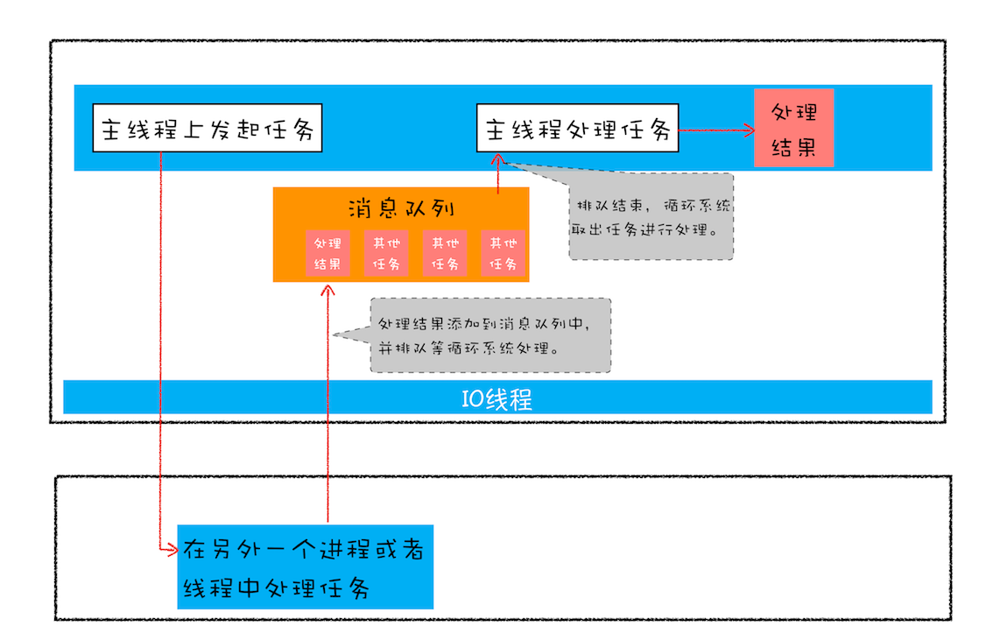

## 问题1：Promise API

### Promise 常用 API 一共有 7 个：

- `Promise.prototype.then()`

- `Promise.protototype.catch()`

- `Promise.prototype.finally()`

- `Promise.resolve()`

- `Promise.reject()`

- `Promise.all()`
- `Promise.race()`


### Promise 的 2 个状态 ：

- `panding`：尚未决议。

- `resolved`：已决议
  - `fulfilled`：已决议，且完成。又是也会不准确的把 `resolved` 当成已经完成。
  - `rejected`：已决议，且拒绝。


### 1. 具有 then 方法的鸭子类型

一共具有 then 方法的对象，很容易被识别为一个 Promise。这种对象被称为 `thenable` 。

所以，Promise API 在面对 `thenable` 时，会有不同的表现，后文会讲到。

在此举例一个 `thenable`：

```js
// p 对象拥有 then 方法
let p = {
    then: function(cb) {
        cb(42)
    }
}

// 调用p.then，可以看到，resolve 方法可以被使用，但是 reject 是无法使用的
p.then((data)=> {
        console.log('resolved', data);	// 输出：resolved 42
    },(err) =>{
        console.log('rejected', err);	// 永远不会被执行
	}
)
```


### 2 `new Promise()`

固定结构。`new Promise(...)` 必须接收一个回调函数，且这个函数必须有两个参数来表示：**resolve 完成** 和 **reject 拒绝**。

```js
let p = new Promise((resolve, reject) => {
    // resolve() 决议 Promise 时调用。可能是完成，也可能是拒绝
    // reject()  拒绝 Promise 时调用，
})
```

特点：

1. 吞掉错误或异常。
   - 如果在决议过程中的任何时间点上出现了一个 JavaScript 异常错误，比如一个 `TypeError`、`ReferenceError`，这个异常就会被捕捉，并且这个 `Promise` 被拒绝。而不是会直接抛出异常

2. 参数过多忽略。
   - 如果在 `resolve`、`reject` 等回调中传递多个参数，最后只会传递第一个参数，剩余的参数全部被忽略。


#### 1 `resolve()` 回调

1. **`resolve()` 返回的 `promise`，既可能完成，也可能拒绝，要根据传入参数而定。**
2. `resolve()` 回调，会对参数进行展开，
   - 如果传给 `resolve()` 的是一个立即值 (非 `Promise`、非 `thenable`)，这个 `promise` 就会用这个值完成。
   - 如果传给 `resolve()` 的是一个 `Promise` / `thenable`，这个值就会被展开(执行)，直到获得一个最终决议值，用这个值完成 / 拒绝。

```js
let p1 = new Promise((resolve, reject) => {
    resolve(Promise.reject("Oops!"))
})
p1.then(
    (data) => {
        console.log("fulfilled", data) // 不会被执行
    },
    (err) => {
        console.log("rejected", err) // rejected Oops!
    }
)
```


#### 2 `reject()` 回调

1. **`reject()` 会返回一个拒绝的 `Promise`。**
2. `reject()` 回调，不会对参数进行展开，
   - 如果参数是一个立即值，则直接把这个立即值作为 `reject` 决议，包装 `Promise` 后返回。
   - 如果参数是一个 `Promise` / `thenable`，就会把这个值 **原封不动地设置为拒绝理由**。后续 `then` 的拒绝回调函数中接收到的参数就是你实际传给 `reject(...)` 的那个 `Promise` / `thenable`，而不是底层值。

```js
let p2 = new Promise((resolve, reject) => {
    resolve(Promise.resolve("Oops!"))
})

let p3 = new Promise((resolve, reject) => {
    reject(Promise.resolve("Oops!"))
})
// 控制台输入：
p2		// Promise {<rejected>: 'Oops!'},
p3		// Promise {<rejected>: Promise}可以看到，拒绝理由是一个 Promise
```

可以看到，

- `p2` 返回的 `Promise`，是对 `Promise.resolve("Oops!")` 一个展开的结果，得到了拒绝理由 `"Oops!"` 并包装为一个 `Promise` 返回。
- `p3` 返回的 `Promise`，没有对  `Promise.resolve("Oops!")` 展开，直接把这个 `promise` 作为拒绝理由，外面再包装一个 `Promise` 返回，


### 3. `Promise.prototype.then()`

一个典型的 `then` 方法使用：

```js
p.then(
    (resolve1) => {
    	console.log(resolve1)
	},
    (err) => {
        console.log(err)
    }
).then(
    (resolve2) => {
    	console.log(resolve2)
	},
    (err) => {
        console.log(err)
    }
).then(
    (resolve3) => {
    	console.log(resolve3)
	},
    (err) => {
        console.log(err)
    }
)
```

1. `then` 有两个参数：Promise 的成功 resolve 和失败 `reject` 的回调函数。
2. 当 `then` 成功捕获了 `reject` 失败状态时，会向下传递 `resolve` 即成功。
3. 如果没有添加 `reject` 的回调，失败状态会顺延到下一个 `then` 中。


### 3 `Promise.protototype.catch()`

`catch()` 方法效果等同于没有添加 `resolve` 回调的 `then` 方法：

```js
p.then( null,
    (err) => {
        console.log(err)
    }
)
// 等同于
p.catch((err) =>{
	console.log(err)
})
```

未被捕获的错误会 冒泡 / 顺延  到下一个 `then` 中。不论在 `then` 调用链中的哪一个 `then` 中发生了错误，都会被最后 `catch` 捕获到这个错误：

```js
p.then((resolve1) => {
   	console.log(resolve1)
	})
.then((resolve2) => {
   	console.log(resolve2)
	})
.then((resolve3) => {
  	console.log(resolve3)
})
.catch((err) =>{
	console.log(err)
})
```


### 4 `Promise.prototype.finally()`

`finally()` 方法返回一个 `Promise`。

在一个 `then` 调用链结束时，无论结果是 `fulfilled` 或者是 `rejected`，都会执行 `finally` 指定的回调函数。

- 不论在 `Promise` 是否成功完成，都需要在最后执行一段代码，就是用这个方法。
- `finally()` 不接收任何参数，没办法在`finally()` 中知道 `Promise` 最终的状态是 `fulfilled` 还是`rejected` 的。

```js
p.then((resolve1) => {
   	console.log(resolve1)
	})
.then((resolve2) => {
   	console.log(resolve2)
	})
.then((resolve3) => {
  	console.log(resolve3)
})
.finally(() =>{
	console.log(err)
})
```


### 5 `Promise.resolve(...)`

`Promise.resolve(...)` 方法可以把一个待验证的、将要使用的 promise，检测并包装为一个可以信任的 `Promise`：

- 如果传递的是一个立即值（非 Promise、非 thenable ），就会返回一个用这个值填充的 promise；
- 如果传递的是一个 Promise，就会返回这个 promise 本身；
- 如果传递的是一个 thenable（非 Promise），就会试图 **展开**(执行) ，展开过程直到获得一个具体的立即值（非 Promise），然后返回一个用这个值填充的 promise；

被 `resolve(..)` 执行后的返回值，一定是一个 `Promise`，所以它便当作按照 Promise 放心使用了。

```js
// 传递一个立即值，效果等同于 new Promise 中的 resolve 方法
let p1 = new Promise((resolve, reject) => {
    resolve(42)
})
let p2 = Promise.resolve(42);

// 传递一个 Promise，就会返回这个 Promise 本身
let p1 = Promise.resolve(40)
let p2 = Promise.resolve(p1)
p1 === p2  // true

// 传递一个 thenable，就会展开这个thenable，展开为一个最终值，包装到一个 Promise 中。
Promise.resolve(p)
.then((data) => {
	console.log(data)   // 输出：42
	},(error) => {
    console.log(error)	// 永远不会被执行
	}
)
```


### 6 `Promise.reject(...)`

效果等同于：

```js
let p1 = new Promise((resolve, reject) => {
    reject("Oops")
})

// 等同于
let p2 = Promise.reject("Oops")
```

所以从特性上，`Promise.reject(...)` 和 `new Promise()` 中的 `reject()` 方法相同。会直接把 `Promise.reject(...)` 参数作为 拒绝决议的结果返回给 `Promise`。


### 7 `Promise.prototype.then()`

1. `then(..)` 接收两个回调函数：**完成回调** 和 **失败回调**；
2. 每次调用 `then(..)` 都会创建并返回一个新的 `Promise`，这样多次调用就会形成一个 **链式流**；
3. 当 `then(..)` 的 **完成回调函数** 或 **失败回调函数** 的返回值是：
   - 一个立即值，它会被会被包装为一个 `Promise`，然后返回；
   - 一个 `thenable` 或者 `Promise`，会一直 **展开**(执行)。直到得到一个立即值，然后包装为一个 Promise 并返回。
   - **所以，回调函数的 `return` 后，总会等待一个立即值，返回包装好这个立即值的 `promise`。**

比如下面的例子：虽然把 42 封装在一个新 promise 中返回，但它仍然会被展开，获得一个立即值后包装为一个 promise 返回。所以，这个立即值作为决议，参与到下一个 `then()` 方法中。

```js
let p1 = Promise.resolve(21)

p1.then(
    (data) => {
        console.log(data)	// 21
        return new Promise((resolve, reject) => {
            resolve(data * 2)
        })
    }
).then(
    (data) => {
        console.log(data)	// 42
    }
)
```


4. 如果没有显示的返回一个值，就会隐式返回 `undefined`。

5. 如果在 then 中发生了错误，不会抛出错误程序停止执行；而是会把这个错误捕捉，作为决议（rejected）包装为一个 Promise 并返回。

```js
let p1 = Promise.resolve(21)

p1.then(
    (data) => {
        console.log(data)	// 输出：21
        foo.bar() 			// 没有 foo 对象，报错!
        return data * 2		// 没有被执行
    }
).then(
    (data) => {				// 没有执行成功回调		
        console.log(data)
        return "No errors"
    },
    (err) => {				// 执行失败回调
        console.log(err)	// 输出：ReferenceError: foo is not defined
        return "resolved errors"
    }
).then(
    (data) => {
        console.log(data)	// 输出：resolved errors
    }
)
```

可以看到，当在 `then` 中发生了错误，并不会导致后续的代码停止执行，而是会把错误作为 `rejected` 决议，包装后返回。

在下一个 `then` 链中，会执行失败回调，也就是被下一个 `then` 的失败回调捕捉。

- 当这个失败回调成功捕捉到错误后，会返回一个 `fulfilled` 成功决议的 Promise，也就是说后续的 Promise 又回到了正常运作。

- 如果没有失败回调，则会继续向下传递 `rejected` 决议的 Promise ，如果最终也没有一个失败回调去处理这个 `rejected`。则会在控制台中显示：


```js
let p1 = Promise.resolve(21)

p1.then(
    (data) => {
        console.log(data)
        foo.bar() 			// 没有 foo 对象，报错
        return data * 2		// 没有被执行
    }
).then(
    (data) => {				// 没有被执行
        console.log(data)	
        return "No errors"
    }
).then(
    (data) => {				// 没有被执行
        console.log(data)
    }
)
```


### 8 `Promise.all([...])`

1. 传给 `Promise.all([...])` 的数组中的成员，可以是 `Promise` / `thenable` / 立即值。
2. 本质而言，数组中的成员均会经过 `Promise.resolve(...)` 过滤，以确保最终是一个真正的 `Promise`。
3. 数组中的成员中一旦 **有** `reject` 决议，就立即把这个 `reject` 决议设置为拒绝理由，并返回。不再理会其他成员的决议。
4. 数组中的成员如果 **没有** `reject` 决议，就一直等待所有成员全部 `fulfill`，把它们成功决议传递的值打包成一个数组，然后再包装为一个成功决议的 `Promise` 并返回。
   - 这个返回的成功决议的数组中，成员顺序不是按照决议完成的先后顺序，而是按照传递 `Promise.all([...])` 时的成员顺序。
5. 如果传入的是空数组，就会立即完成。

使用举例：

先定义 3 个不同时间的成功决议，1 个失败决议。

```js
// 1000 毫秒后成功决议
let p1 = new Promise((resolve, reject) => {
    setTimeout(() => {
        console.log("resolve1, done!")
        resolve("resolve 1")
    }, 1000)
})

// 8000 毫秒后成功决议
let p2 = new Promise((resolve, reject) => {
    setTimeout(() => {
        console.log("resolve2, done!")
        resolve("resolve 2")
    }, 8000)
})

// 4000 毫秒后成功决议
let p3 = new Promise((resolve, reject) => {
    setTimeout(() => {
        console.log("resolve3, done!")
        resolve("resolve 3")
    }, 4000)
})

// 失败决议
let p4 = new Promise((resolve, reject) => {
    setTimeout(() => {
        console.log("reject, done!")
        reject("reject 4")
    }, 0)
})
```


如果 `Promise.all([...])`  的参数数组中，全部会成功决议：

```js
let pAll1 = Promise.all([p1, p2, p3])
.then((data) => {
    console.log(data);
}, (err) => {
    console.log("Promise.all reject!", err);
})
```

最终的返回结果可以看到：

- 所有成员全部成功决议，`Promise.all` 才会成功决议；
- `Promise.all` 返回的 `Promise` 信息是一个数组，这个数组就是所有传入 `promise` 的完成消息所组成的数组。
- 这个数组的成员的顺序，和完成时间顺序无关，和传入时的顺序一致。


如果 `Promise.all([...])`  的参数数组中，有失败决议：

```js
let pAll2 = Promise.all([p1, p2, p3, p4])
.then((data) => {
    console.log(data)
}, (err) => {
    console.log("Promise.all reject!", err)
})
```

可以看到，一旦有成员失败， `Promise.all([...])`  就拿着这个失败成员的决议，直接返回为失败决议。不再理会其他成员的决议。


### 9 `Promise.race([...])`

1. 门闩、静态。获得第一个跨过终点线的 Promise，而抛弃其他 Promise。

2. 传给 `Promise.race([...])` 的数组中的成员，可以是 `Promise` / `thenable` / 立即值。

3. 一旦有任何一个 Promise 决议为完成， `Promise.race([...])` 就会完成；

   一旦有任何一个 Promise 决议为拒绝，它就会拒绝。

4. 如果传入了一个空数组，则 `Promise.race([...])` 永远不会决议；

5. 如果数组中有成员是立即值，则成员中第一个立即值胜出。


## 问题2：Promise 解决的痛点是什么？

Web 页面是单线程架构模型，这种模型决定了我们编写代码的形式——异步编程。

基于异步编程模型是基于页面的事件循环系统实现的：

当我们需要获取一些非常耗时的任务时，比如网络下载任务、获取用户输入信息等任务，这些任务都会放到页面主线程之外的进程（IO进程、网络进程）中去执行，等待有了结果后，主线程再接着处理这些任务。

这样就避免了耗时任务一直占用页面主线程的情况。



上图就是一个典型的异步任务。主线程发起一个异步任务后，就丢给其他进程去处理。此时主进程可以着手处理其他任务。等这个异步任务有了结果，就放入消息队列中排队，然后主线程去处理这个结果。

**这就是页面编程的最大特点 —— 异步回调。**

写出来的代码会把一些关键的逻辑点打乱，真正执行的起来，不是按照写代码的顺序去往下执行。所以这种风格的代码不符合人的线性思维方式。

流程如下，主线程：

1. 请求资源，请求一个异步网络调用 `a` ；
2. 等待结果，执行别的任务；
3. 得到结果，根据结果调用对应的回调函数。

```js
请求a(function(请求结果a)){
	处理请求结果a
}
```

如果要连续的请求资源，比如获得 `a` 资源后，接着获得 `b` 资源；等 `b` 资源得到后，去获得 `c` 资源 ...

流程如下，主线程：

```js
请求a(function(请求结果a)){
    请求b(function(请求结果b)){
		请求c(function(请求结果c)){
			...
		}
	}
}
```

如果回调函数嵌套太多，就会形成 **回调地狱**。


**形成回调地狱的原因：**

1. **嵌套调用。**下一个异步任务的开始，依赖上一个异步任务的请求结果。这会需要**在上一个异步任务的回调函数内部去执行新的业务逻辑。**
2. **任务的不确定性。**每个异步任务都会有多种可能的结果（成功、失败等），这在代码中就需要为每个任务准备至少两套回调函数，增加了代码的混乱程度。


**回调函数带来的问题：**

1. 代码混乱，可读性差；
2. 耦合度过高，可维护性差，复用性差。


所以，我们希望的异步处理方式是这样的：

```js
let 请求结果1 = 请求1();
let 请求结果2 = 请求2(请求结果1成功的回调，请求结果1失败的回调); 
let 请求结果3 = 请求3(请求结果2成功的回调，请求结果2失败的回调); 
let 请求结果4 = 请求2(请求结果3成功的回调，请求结果3失败的回调); 
let 请求结果5 = 请求3(请求结果4成功的回调，请求结果4失败的回调); 
```


这需要解决形成回调地狱的两个问题：

1. 消灭嵌套调用；
2. 合并多个任务的错误处理。


Promise 是如何解决这回调地狱的这两个问题的：

**首先，Promise 实现了回调函数的延时绑定技术。**

1. `new Promise(...)` 在创建的同时，会立即执行（同步调用）参数中的任务，然后会异步等待一个结果。产生的结果（完成 / 失败）会保存在返回的 `Promise` 中。
2. 当我们通过调用 `.then(...)` 处理这个结果时，才会动态绑定回调函数。绑定好后，才会执行回调函数。
3. 为了实现延时绑定，V8 引擎把调用回调函数改成了微任务。这样既可以让回调函数延时被调用，又提升了代码的执行效率。

**其次，Promise 实现了将回调函数的返回值穿透到最外层**

把每次执行回调函数后的处理结果，穿透到最外层，就能避免回调地狱的层层嵌套结构。

下面是 Promise 的调用逻辑：

```js
new Promise(请求1)
    .then(请求2(请求结果1成功的回调))
    .then(请求3(请求结果2成功的回调))
    .then(请求4(请求结果3成功的回调))
    .then(请求5(请求结果4成功的回调))
    .catch(处理异常(异常信息))
```


```js
// 自己定义的一个Bromise，传递参数为一个异步任务executor
function Bromise(executor) {
    // 回调函数初始化时为 null
    var onResolve_ = null
    var onReject_ = null
    
    // 模拟实现 .then。
    // 模拟实现调用时绑定。只有在调用 then 时，才会绑定成功回调函数。
    this.then = function (onResolve, onReject) {
        onResolve_ = onResolve
    };
    
    // 延迟定义 resolve 回调
    // 在调用到 onResolve_ 函数的时候，Bromise.then 还没有执行，
    // 所以要利用 setTimout延迟调用。而V8 引擎是通过微任务来延迟调用的。
    function resolve(value) {
        setTimeout(()=>{
            onResolve_(value)
        },0)
    }
    
    // 在创建Bromise的时候，就会同步立即执行传递的executor任务。
    executor(resolve, null);
}


// 使用 Bromise
// 定义一个异步任务 executor
function executor(resolve, reject) {
    // 这里是任务内容...
    resolve(100)
}
// 定义异步任务成功时的回调
function onResolve(value){
    console.log(value)
}

let demo = new Bromise(executor)
demo.then(onResolve)
```


## 问题3：Promise 中为什么要延时绑定回调函数？

为了解决回调地狱的层层嵌套问题。见上文。


## 问题4：Promise 中为什么要引入微任务？

`promise` 采用 `.then` 延时绑定回调机制。

而 `new Promise` 时，又需要直接执行 `promise` 中的任务，并执行相应结果的回调函数。即发生了先执行方法后添加回调的现象。

此时需等待 `then` 方法绑定两个回调后，才能继续执行方法中的回调函数。把执行回调的时机添加到当前任务之后，可以采用宏任务和微任务两种方法。由于宏任务有效率问题，则采用了微任务。


