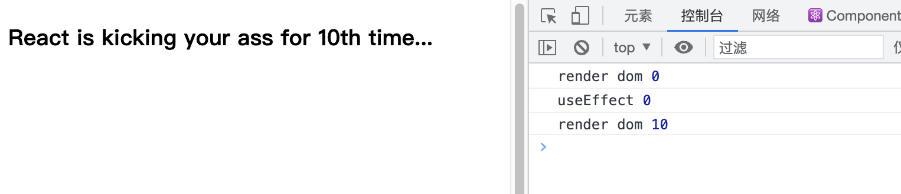
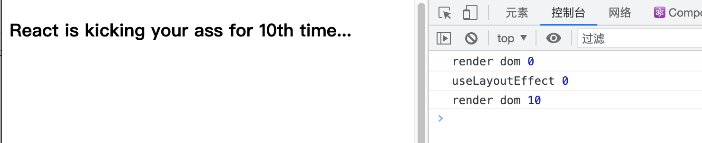

#  Fiber

> 引用：
>
> - https://juejin.cn/post/6844903975112671239#heading-4
> - https://juejin.cn/post/6844903582622285831#comment
>
> Diff 算法：
>
> - 深度遍历优先，O(n)：https://juejin.cn/post/6967626390380216334


Fiber的另外一种解读是’纤维‘: **这是一种数据结构或者说执行单元**。我们暂且不管这个数据结构长什么样，**🔴将它视作一个执行单元，每次执行完一个'执行单元', React 就会检查现在还剩多少时间，如果没有时间就将控制权让出去**。


上文中提到 React 16 之前，Reconcilation 是同步的、递归执行的。也就是说这是基于函数’调用栈‘的Reconcilation算法，因此通常也称它为`Stack Reconcilation`. 你可以通过这篇文章[《从Preact中了解React组件和hooks基本原理》](https://juejin.cn/post/6844903861434449933) 来回顾一下历史。


'`副作用`(Effect)' 

Reconcilation - 调和，v16（不含）以前的经典算法，相当于 diff。


DOM 更新

DOM 更新不是一次性完成的，而是切分为多组（一组有n个fiber）完成；这样用户体验更好，不会产生过多的堵塞。

双缓冲
WIP 树构建这种技术类似于图形化领域的'双缓存(Double Buffering)'技术, 图形绘制引擎一般会使用双缓冲技术，先将图片绘制到一个缓冲区，再一次性传递给屏幕进行显示，这样可以防止屏幕抖动，优化渲染性能。
放到React 中，WIP树就是一个缓冲，它在Reconciliation 完毕后一次性提交给浏览器进行渲染。它可以减少内存分配和垃圾回收，WIP 的节点不完全是新的，比如某颗子树不需要变动，React会克隆复用旧树中的子树。

所以，DOM 更新虽然不是一次性完成，但只有在一个 DOM 更新任务全部完成后，才会一次性渲染到页面中，防止页面多次抖动。


Git 功能分支，**你可以将 WIP 树想象成从旧树中 Fork 出来的功能分支，你在这新分支中添加或移除特性，即使是操作失误也不会影响旧的分支。当你这个分支经过了测试和完善，就可以合并到旧分支，将其替换掉. 这或许就是’提交(commit)阶段‘的提交一词的来源吧？**:


一帧16ms，然后16ms减去该帧使用的时间才是剩余可用的空闲时间，我不太懂的是一个待处理的fiber node 超过这个空闲时间，是如何处理的，会不会去判断该帧的空闲是否能执行完这个node，还是只要有空闲时间就会执行这个会阻塞下一帧的node ？

- “每个工作单元（fiber）执行完成后，都会查看是否还继续拥有主线程时间片，如果有继续下一个，如果没有则先处理其他高优先级事务，等主线程空闲下来继续执行。”这里貌似没有考虑到任务过期的情况：如果在一次遍历时发现如果有过期任务，因该会立即执行，即使时间片已经用完。
- 是会阻塞的，浏览器是没权阻止你在requestIdleCallback的回调里处理一个超长任务的，毕竟js引擎始终是单线程的。
- 可以肯定的是，react会对每个任务维持一个过期时间，如果已经过期，则在此时不会去考虑是否出现掉帧的情况（即时间片是否用完的情况），而选择立即执行。


大佬，您才看我是不是可以这样理解：

- 在react16之前setState触发视图更新是从待更新组件开始逐层递归更新。如果更新时间过程超过了浏览器一帧的时间就会造成卡顿的现象。 

- 所以在react16以后将每一个虚拟dom节点都用fiber来实现，所有的执行单元通过链表的结构来维护。从而实现遍历节点时的暂停恢复。 在setState触发更新后分为两个阶段分别是 **协调** 和 **提交**。
  - 在 **协调阶段** 利用浏览器每一帧处理事件后的剩余时间进行计算，如果时间不够则下一帧再处理。以此来计算出哪些节点产生了副作用是需要处理的。最后再 **提交阶段** 统一处理。


问题：react 函数组件重新渲染都会重新执行，函数内到变量、数据都会重新被创建，那 state 值如何能一直保存下来呢？

精简答案：fiber 中有一个 memorizedState 一直持有对组件内 state 的引用；所以利用闭包可以实现 state 值会丢失的问题。

> - https://blog.matthew-wang.com/react-hooks-learning-notes-2/
>
> Hooks 保存 state？
> 那既然都说了函数组件每次重新渲染的时候内部所有东西都是全新的，hooks 又怎么能够实现保存 state 的逻辑呢？原理其实也很简单，想象一下这样的场景，我们在函数外面定义了一个变量，函数里面读取了这个变量，甚至给这个变量重新赋值，都会真实反映在外部的这个变量身上，即使函数执行完成被销毁，其对该变量的操作也不会丢失。那如果我再次执行这个函数，它读取到的这个变量就将会是经过它逻辑修改过一个的值，如果这个变量只会被这个函数读取和改变的话，那从某种意义上，我们是否能说这个变量保存了这个函数每次执行时的 state 呢？答案是肯定的，而 hooks 也确实是这样做的，每次你使用 hooks，其对应的 state、function 都被保存在当前 fiber 的 memorizedState 属性上，而 fiber 在每次重新渲染的时候都会依据某种逻辑（fiber 的具体逻辑和本文要说的部分无关）继承之前的属性，通过这样的一个逻辑，就达到了保存 state 的效果。


=======================================================================================

### useEffect

- useEffect 的触发时间是在 render 的执行之后，此时新的 DOM 已经构建完成；
- useEffect 是异步触发的，不会对 js 进行阻塞。
- 所以，在 useEffect 对 state 进行更新，即使下例这样，只在初始化组件时更新（即 useEffect 的第二个参数传递为 `[]`），也会导致组件发生两次 DOM 构建，所以 `render dom` 执行了两次。

#### 于 **useLayoutEffect**  的区别

**useEffect** 执行， React 处理逻辑是采用异步调用。对于每一个 effect 的 callback， React 会向 `setTimeout` 回调函数一样放入任务队列中。等到主线程任务完成，DOM 更新，js 执行完成，视图绘制完毕，才执行。所以 effect 回调函数不会阻塞浏览器绘制视图。

**useLayoutEffect** 的触发时机是在新的 DOM 绘制前，所以新的 DOM 虽然也构建完毕了（return中的代码执行了），但尚未绘制，节省了浏览器的绘制性能。

所以，如果想在 DOM 绘制前修改 DOM 内容，比如对 DOM 结构进行修改、更新会插入 DOM 中的 state 数据等，用 useLayoutEffect 更合适，其余时间都用 useEffect 即可。

- 注意，两个 hook 都在新 DOM 构建完毕后再执行 callback，也就是说 return 的代码都被执行过了。

```jsx
function Container() {
  const [state, setState] = useState(0);

  useEffect(() => {
    console.log('useEffect', state)
    setState(10)
    },[]);

    return (
      <div>
      	{console.log('render dom', state)}
        <h3>React is kicking your ass for {state}th time...</h3>
      </div>
    )
}
```



如果上文相同的代码结构，只是把 useEffect 替换为 useLayoutEffect 的话：




