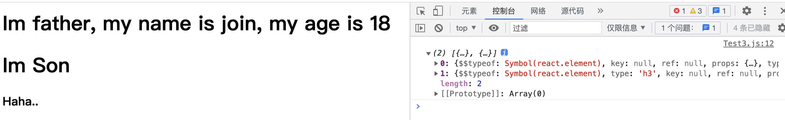
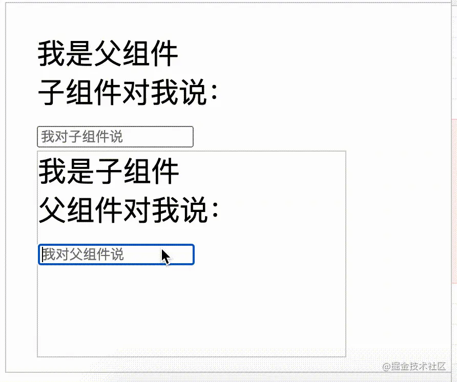
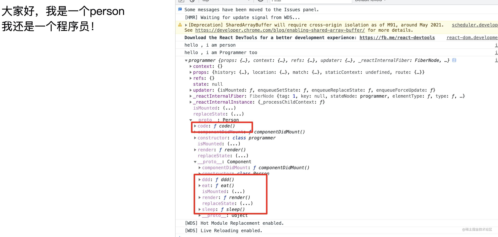
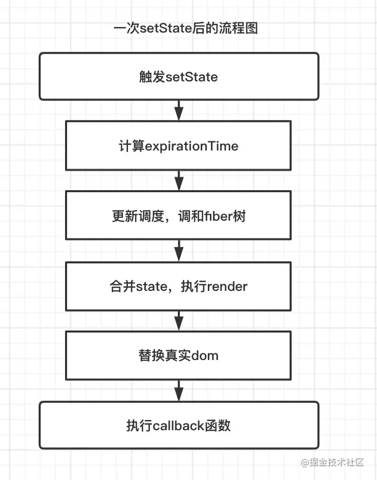
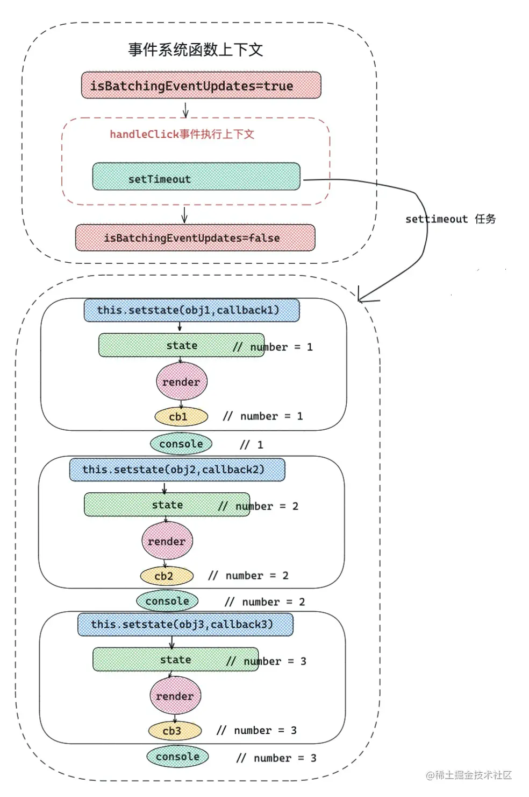
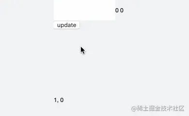

### React API

```ts
import  React from 'react';

// ReactElement 一个可以包含有React组件的dom结构，是普通dom结构的超集。

React.isValidElement()		// 判断是否是一个 ReactElement
React.cloneElement()


// React.Children 系列
React.Children.map(item, cb)		// 相当于 arr.map
React.Children.forEach(item, cb)// 相当于 arr.forEach, 从 ReactElement返回为数组，
React.Children.count()					// 相当于 arr.length
React.Children.only()						// 判断是否只有一个 child
React.Children.toArray()				// 转化为数组 + 扁平化后返回

React.createElement()				// create ReactElement
React.cloneElement()				// clone ReactElement
```

- `forEach()`：对数组中每一个元素执行一次回调函数，修改了原数组，不会返回值；

- `map()`：对数组中每一个元素执行一次回调函数，然后放到一个新数组中，返回新数组，不修改原数组；
- `React.cloneElement(ReactElement, [props], [...chilren])`
  - 三个参数分别是：
    - ReactElement：原 ReactElement，这是一个 DOM 结构；
    - [props]：原 ReactElement 中会传入的 props；
    - [...children]：替换原 ReactElement 内部的 DOM 结构，也就是说原 ReactElement 内部会被替换为 `...children`；如果参数为空，则不发生替换；


```tsx
function Son() {
  return <h1>Im Son</h1>
}

function Father(props) {
 //  props.name 值为 "join"
 //  props.age 值为 "18"
 //  props.children[0] 值为 <Son />
 console.log(props.children)
  return (
		<div>
    	<h1>Im father, my name is {props.name}, my age is {props.age}</h1>
      {props.children[0]}
      {props.children[1]}
      {/* 上面两行代码相当于下面这行，React会自动遍历*/}
      {props.children}
    </div>
  )
}

function Container() {
  return (
  	<Father name="join" age="18">
    	<Son />
      <h3>Haha..</h3>
    </Father>
  )
}
```




### React 组件

1. React 类组件和函数组件，本质区别：

   对于类组件来说，底层只需要实例化一次，实例中保存了组件的 state 等状态。对于每一次更新只需要调用 render 方法以及对应的生命周期就可以了。但是在函数组件中，每一次更新都是一次新的函数执行，一次函数组件的更新，里面的变量会重新声明。

2.  React 组件本质——UI + update + 常规的类和函数 = React 组件


### React 组件间的通信方式

React 一共有 5 种主流的通信方式：

1. props 和 callback 方式
2. ref 方式。
3. React-redux 或 React-mobx 状态管理方式。
4. context 上下文方式。
5. event bus 事件总线。

这里主要讲一下第1种和第5种，其余的会在对应章节详细解读。

**① props 和 callback 方式**

props 和 callback 可以作为 React 组件最基本的通信方式，父组件可以通过 props 将信息传递给子组件，子组件可以通过执行 props 中的回调函数 callback 来触发父组件的方法，实现父与子的消息通讯。

父组件 -> 通过自身 state 改变，重新渲染，传递 props -> 通知子组件

子组件 -> 通过调用父组件 props 方法 -> 通知父组件。

```js
/* 子组件 */
function Son(props){
    const {  fatherSay , sayFather  } = props
    return <div className='son' >
         我是子组件
        <div> 父组件对我说：{ fatherSay } </div>
        <input placeholder="我对父组件说" onChange={ (e)=>sayFather(e.target.value) }   />
    </div>
}
/* 父组件 */
function Father(){
    const [ childSay , setChildSay ] = useState('')
    const [ fatherSay , setFatherSay ] = useState('')
    return <div className="box father" >
        我是父组件
       <div> 子组件对我说：{ childSay } </div>
       <input placeholder="我对子组件说" onChange={ (e)=>setFatherSay(e.target.value) }   />
       <Son fatherSay={fatherSay}  sayFather={ setChildSay }  />
    </div>
}
```

**效果**



**⑤event bus事件总线**

当然利用 eventBus 也可以实现组件通信，但是在 React 中并不提倡用这种方式，我还是更提倡用 props 方式通信。如果说非要用 eventBus，我觉得它更适合用 React 做基础构建的小程序，比如 Taro。接下来将上述 demo 通过 eventBus 方式进行改造。

```js
import { BusService } from './eventBus'
/* event Bus  */
function Son(){
    const [ fatherSay , setFatherSay ] = useState('')
    React.useEffect(()=>{ 
        BusService.on('fatherSay',(value)=>{  /* 事件绑定 , 给父组件绑定事件 */
            setFatherSay(value)
       })
       return function(){  BusService.off('fatherSay') /* 解绑事件 */ }
    },[])
    return <div className='son' >
         我是子组件
        <div> 父组件对我说：{ fatherSay } </div>
        <input placeholder="我对父组件说" onChange={ (e)=> BusService.emit('childSay',e.target.value)  }   />
    </div>
}
/* 父组件 */
function Father(){
    const [ childSay , setChildSay ] = useState('')
    React.useEffect(()=>{    /* 事件绑定 , 给子组件绑定事件 */
        BusService.on('childSay',(value)=>{
             setChildSay(value)
        })
        return function(){  BusService.off('childSay') /* 解绑事件 */ }
    },[])
    return <div className="box father" >
        我是父组件
       <div> 子组件对我说：{ childSay } </div>
       <input placeholder="我对子组件说" onChange={ (e)=> BusService.emit('fatherSay',e.target.value) }   />
       <Son  />
    </div>
}
```

这样做不仅达到了和使用 props 同样的效果，还能跨层级，不会受到 React 父子组件层级的影响。但是为什么很多人都不推荐这种方式呢？因为它有一些致命缺点。

- 需要手动绑定和解绑。
- 对于小型项目还好，但是对于中大型项目，这种方式的组件通信，会造成牵一发动全身的影响，而且后期难以维护，组件之间的状态也是未知的。
- 一定程度上违背了 React 数据流向原则。


### React 组件的强化方式

**①类组件继承**

对于类组件的强化，首先想到的是继承方式，之前开发的开源项目 react-keepalive-router 就是通过继承 React-Router 中的 Switch 和 Router ，来达到缓存页面的功能的。因为 React 中类组件，有良好的继承属性，所以可以针对一些基础组件，首先实现一部分基础功能，再针对项目要求进行有方向的**改造**、**强化**、**添加额外功能**。

基础组件：

```js
/* 人类 */
class Person extends React.Component{
    constructor(props){
        super(props)
        console.log('hello , i am person')
    }
    componentDidMount(){ console.log(1111)  }
    eat(){    /* 吃饭 */ }
    sleep(){  /* 睡觉 */  }
    ddd(){   console.log('打豆豆')  /* 打豆豆 */ }
    render(){
        return <div>
            大家好，我是一个person
        </div>
    }
}
/* 程序员 */
class Programmer extends Person{
    constructor(props){
        super(props)
        console.log('hello , i am Programmer too')
    }
    componentDidMount(){  console.log(this)  }
    code(){ /* 敲代码 */ }
    render(){
        return <div style={ { marginTop:'50px' } } >
            { super.render() } { /* 让 Person 中的 render 执行 */ }
            我还是一个程序员！    { /* 添加自己的内容 */ }
        </div>
    }
}
export default Programmer
```

效果：



我们从上面不难发现这个继承增强效果很优秀。它的优势如下：

1. 可以控制父类 render，还可以添加一些其他的渲染内容；
2. 可以共享父类方法，还可以添加额外的方法和属性。

但是也有值得注意的地方，就是 state 和生命周期会被继承后的组件修改。像上述 demo 中，Person 组件中的 componentDidMount 生命周期将不会被执行。

**②函数组件自定义 Hooks**

在自定义 hooks 章节，会详细介绍自定义 hooks 的原理和编写。

**③HOC高阶组件**

在 HOC 章节，会详细介绍高阶组件 HOC 。


### React state 相关知识

#### 类式组件 `setState()` 方法：

**基本用法**

```js
setState(obj,callback)
```

- 第一个参数：当 obj 为一个对象，则为即将合并的 state ；如果 obj 是一个函数，那么当前组件的 state 和 props 将作为参数，返回值用于合并新的 state。
- 第二个参数 callback ：callback 为一个函数，函数执行上下文中可以获取当前 setState 更新后的最新 state 的值，可以作为依赖 state 变化的副作用函数，可以用来做一些基于 DOM 的操作。

```js
/* 第一个参数为function类型 */
this.setState((state,props)=>{
    return { number:1 } 
})
/* 第一个参数为object类型 */
this.setState({ number:1 },()=>{
    console.log(this.state.number) //获取最新的number
})
```

假如一次事件中触发一次如上 setState ，在 React 底层主要做了那些事呢？

- 首先，setState 会产生当前更新的优先级（老版本用 expirationTime ，新版本用 lane ）。
- 接下来 React 会从 fiber Root 根部 fiber 向下调和子节点，调和阶段将对比发生更新的地方，更新对比 expirationTime ，找到发生更新的组件，合并 state，然后触发 render 函数，得到新的 UI 视图层，完成 render 阶段。
- 接下来到 commit 阶段，commit 阶段，替换真实 DOM ，完成此次更新流程。
- 此时仍然在 commit 阶段，会执行 setState 中 callback 函数,如上的`()=>{ console.log(this.state.number) }`，到此为止完成了一次 setState 全过程。

**更新的流程图如下：**



请记住一个主要任务的先后顺序，这对于弄清渲染过程可能会有帮助：

- render 阶段 render 函数执行 -> commit 阶段真实 DOM 替换 -> setState 回调函数执行 callback 。


##### 一道题：

```tsx
class IndexPage extends React.Component{
    state = { number:0 }
    handleClick= () => {
          this.setState({ number:this.state.number + 1 },()=>{   console.log( 'callback1', this.state.number)  })
          console.log(this.state.number)
          this.setState({ number:this.state.number + 2 },()=>{   console.log( 'callback2', this.state.number)  })
          console.log(this.state.number)
          this.setState({ number:this.state.number + 3 },()=>{   console.log( 'callback3', this.state.number)  })
          console.log(this.state.number)
    }
    render(){
        return <div>
            { this.state.number }
            <p></p>
            <button onClick={ this.handleClick }  >number++</button>
        </div>
    }
} 
```

当用户点击后，会发生什么？


几个要点：

1. setState 是异步的，存在任务优先级的问题，可以通过多种方法调整优先级。
2. 批量更新。当有多个 setState 连续调用时，由于它们的优先级是一样的，所以最终只有最后一个 setState 生效。
   - 在第一个 `setState` 调用后，再调用第二个时，会将第一个更新任务和第二个更新任务的优先级会进行比较，如果优先级一样，则不会执行第二个更新任务，而是将第二个任务的更新内容与第一个的更新内容进行合并，最终只会进行一次更新渲染，这样的做法叫做 **批量更新**。
3. callback 会在 state 实现更新后，才被执行。所以不论是哪个 setState 的 callback，都会输出更新后的值 `3`
4. console.log 会输出当前的 state（尚未更新），所以输出 `0`;


进一步引申

```jsx
class IndexPage extends React.Component{
  state = { number: 0 };
  handleClick = () => {
    this.setState({ number: this.state.number + 1 }, () => {
      console.log("callback1", this.state.number);
    });
    console.log(this.state.number);
    this.setState({ number: this.state.number + 2 }, () => {
      console.log("callback2", this.state.number);
    });
    console.log(this.state.number);
    Promise.resolve().then(() => {
      this.setState({ number: this.state.number + 3 }, () => {
        console.log("callback3", this.state.number);
      });
      console.log("promise", this.state.number);
    });

    setTimeout(() => {
      this.setState({ number: this.state.number + 4 }, () => {
        console.log("callback4", this.state.number);
      });
      console.log("setTimeNumber", this.state.number);
    }, 0);
  }

  render(){
    return <div>
      { this.state.number }
      <p></p>
      <button onClick={ this.handleClick }  >number++</button>
    </div>
  }
} 
```


几个要点：

1. setState 是微任务（默认环境，如果不支持微任务，React 会把他置为宏任务），setTimeout 是宏任务；
2. callback 中的 state 一定是该 setState 执行后的值（批量更新，也会消化掉该 setState）；
3. 前两个 console.log 最先执行，打印了 state 尚未更新的值 0；
4. 在微任务队列中，有两个微任务：
   1. setState 微任务执行，两个 setState 的优先级相同，发生了 **批量更新**，第二个 setState 生效，值为 2；
   2. 接着自定义的 promise.resolve 微任务执行，num 值 +3，值为 5；
5. 最后执行宏任务 setTimeout 中的 setState 时，num 值已经为 2，随后 +3，值为 5；
6. **疑问**，
   1. promise 和 setTimeout 中的 console 为什么在 state 更新之后才被执行。
   2. 比如 console.log('setTimeNumber') 为什么在 callbback3 之后输出？为什么输出是更新后的 state 值？


总结：

- 为什么要使用异步渲染？在React中会将连续调用的`setState`进行**批量更新**，这样做的目的，是为了避免短时间内连续调用造成不必要的渲染，增加性能的开销。

- 批量更新只会在一个微任务或宏任务中进行。


##### 一道题：

在 React 事件执行之前通过 `isBatchingEventUpdates=true` 打开开关，开启事件批量更新，当该事件结束，再通过 `isBatchingEventUpdates = false;` 关闭开关，然后在 scheduleUpdateOnFiber 中根据这个开关来确定是否进行批量更新。

举一个例子，如下组件中这么写：

```jsx
export default class index extends React.Component{
    state = { number:0 }
    handleClick = () => {
      this.setState({ number:this.state.number + 1 },()=>{   
        console.log( 'callback1', this.state.number)
      })
      console.log(this.state.number)

      this.setState({ number:this.state.number + 1 },()=>{   
        console.log( 'callback2', this.state.number)  
      })
      console.log(this.state.number)

      this.setState({ number:this.state.number + 1 },()=>{   
        console.log( 'callback3', this.state.number)  
      })
      console.log(this.state.number)
    }
    render(){
        return <div>
            { this.state.number }
            <button onClick={ this.handleClick }>number++</button>
        </div>
    }
} 
```

点击打印：**0, 0, 0, callback1 1 ,callback2 1 ,callback3 1**

如上代码，在整个 React 上下文执行栈中会变成这样：


那么，为什么异步操作里面的批量更新规则会被打破呢？比如用 promise 或者 setTimeout 在 handleClick 中这么写：

```jsx
// 外部用 setTimeout 包裹
setTimeout(()=>{
  this.setState({ number:this.state.number + 1 },()=>{   
    console.log( 'callback1', this.state.number)  
  })
  console.log(this.state.number)

  this.setState({ number:this.state.number + 1 },()=>{    
    console.log( 'callback2', this.state.number)  
  })
  console.log(this.state.number)

  this.setState({ number:this.state.number + 1 },()=>{   
    console.log( 'callback3', this.state.number)  
  })
  console.log(this.state.number)
})
```

打印 ： **callback1 1 , 1, callback2 2 , 2,callback3 3 , 3**

那么在整个 React 上下文执行栈中就会变成如下图这样:



中间省略了其他知识，先记录这些，消化后再记录更多的：[原文](https://juejin.cn/book/6945998773818490884/section/6951186955321376775)。

综上所述， React 同一级别**更新优先级**关系是:

flushSync 中的 setState **>** 正常执行上下文中 setState **>** setTimeout ，Promise 中的 setState。


#### 函数式组件 useState hook 方法

**基本用法**

```js
 [ ①state , ②dispatch ] = useState(③initData)
```

- ① state，目的提供给 UI ，作为渲染视图的数据源。
- ② dispatch 改变 state 的函数，可以理解为推动函数组件渲染的渲染函数。
  - dispatch 方法的参数只有一个，有两种情况：
  - 第一种非函数情况，此时将作为新的值，赋予给 state，作为下一次渲染使用;
  - 第二种是函数的情况，如果 dispatch 的参数为一个函数，这里可以称它为 reducer。reducer 的参数，是上一次返回最新的 state，返回值会作为新的 state 去更新。
- ③ initData 有两种情况，第一种情况是非函数，将作为 state 初始化的值。 第二种情况是函数，函数的返回值作为 useState 初始化的值。

所以，useState 没有类似类组件中 setState 的第二个 cb 参数。无法获取最新的 state 数据。但函数组件中可以通过 useEffect 对该 state 产生依赖。当 state 发生更新时，就会调用 useEffect 函数。实现这个功能。


### React Hooks 系列知识

useRef 的作用

1. `useRef` 是一个方法，且 `useRef` 返回一个可变的 `ref` 对象（对象！！！）;
2. `initialValue` 被赋值给其返回值的 `.current` 对象；
3. 可以保存任何类型的值: dom、对象等任何值；
4. `ref` 对象与自建一个 `{current：'xx'}`对象的区别是：`useRef` 会在每次渲染时返回同一个`ref` 对象，即返回的 `ref` 对象在组件的整个生命周期内保持不变，也就是对这个对象一直持有。自建对象每次渲染时都建立一个新的。
5. `ref` 对象的值发生改变之后，不会触发组件重新渲染。
6. 本质上，`useRef` 就是一个其 `.current` 属性保存着一个可变值 “盒子”。
   1. 比如，用 `pageRef` 和 `sortRef` 分别用来保存分页信息和排序信息；
   2. 比如，用 `tableRef` 保存 ProTable 组件的 table 子组件，让它在适当的时候刷新：`tableRef.current.reload()`；


自定义 hooks 之实现一个 useState

```js
import { useEffect, useRef, useState } from 'react'

const useXState = (initState) => {
    const [state, setState] = useState(initState)
    let isUpdate = useRef()
    const setXState = (state, cb) => {
      setState(prev => {
        isUpdate.current = cb
        return typeof state === 'function' ? state(prev) : state
      })
    }
    useEffect(() => {
      if(isUpdate.current) {
        isUpdate.current()
      }
    }, [state])
  
    return [state, setXState]
  }

export default useXState
```

1. `useEffect()` 实现了当 `state` 更新后，调用传递的回调函数 cb。ps. 可以在自定义 hooks 中使用官方 hook；
2. `isUpdate` 的作用是每当调用 `useXState` 后，都会新建一个用来保存回调函数的变量（对象），这个回调函数就是 XState 所附带的回调函数。因为不论组件如何刷新，XState 和它的回调函数应当是都同一个，而不是随着组件刷新而重新被创建，所以用 useRef 保存。
3. 如果传递给 `setXState` 参数是一个函数，就会附带这个 `prev` 参数，然后调用，最后的形式类似这样：`setXState(setState(func(prev)) [, cb])`；如果传递的是要更新的数据，就是这样：`setXState(setState(data) [, cb])`


自定义 hooks 之实现一个 useUpdate

需求：实现一个强制刷新组件的方法。

思路：当 state 值发生改变时，就会导致组件重新渲染。利用这一思路，我们可以在 `useUpdate` 中定义一个内部的，用于控制组件渲染的 setFlag。

```js
import { useState } from 'react'

const useUpdate = () => {
    const [, setFlag] = useState()
    const update = () => {
        setFlag(Date.now())
    }

    return update
  }

export default useUpdate


// 调用方式：
update()
```

1. 调用 `update()` 时，就会调用 `setFlag` 方法更新数据，利用 `Date.now()` 具有的不重复性，确保每次调用 setFlag 可以更新与之前不同的数据，确保组件会强制渲染。


自定义 hooks 之实现 componentDidUpdate

- 回忆：
  - class 组件中， `componentDidUpdate` 生命周期是初次渲染完后，当接收的 `props`，`state` 改变时或者 `this.forceUpdate`() 就会调用
  - 函数组件中，`useEffect` 可以看做 `componentDidMount`，`componentDidUpdate`
    和 `componentWillUnmount` 这三个函数的组合

需求：实现类式组件中的 componentDidUpdate 生命周期

- useRef 返回一个可变的 ref 对象，其 `.current` 属性在组件初次加载时，会被初始化为传入的参数（initialValue）。返回的 ref 对象在组件的整个生命周期内保持不变。
- ref 对象只有一个 `current` 属性，你把一个东西保存在内，它的地址一直不会变。

```tsx
import { useRef, useRef } from 'react'

const useDidUpdate = (func) => {
  const mounted = useRef();
  useEffect(() => {
    if (!mounted.current) {
      mounted.current = true;
    } else {
     	console.log('I am didUpdate')
      func();   // 执行传入的函数
    }
  })
}
```

- 引入 useRef 的原因是，useEffect 会在组件每次加载后都会被执行，但我们需要的是初次加载后不要执行。
  - 而 useRef 会在组件的全生命周期中保持一个不变的值，所以在初次加载前，将它定义为 false；在完成初次加载后，调用 useEffect 会把他设置为 true，这样除了初次加载，后面 .current 的值都为 true。实现了 componentDidUpdate 的功能。


这里不能使用 useState 代替更占用资源的 useRef。因为每当 state 发生改变，都会促使组件重新 render；而 useRef 的 `.current` 不会导致 render。

- 假设使用 useState，在组件初次加载前，flag 值为 false，if 判断后，不会执行 func，而是让 flag 的值为 true；这时，即使组件的这一次 func 被拦截了，但因为作为 state 的 flag 发生了改变，所以会导致组件再次被渲染。在这一次加载时，if 判断 flag 变成了 true， 就会执行 func。
  - 所以，最终效果是组件初次加载话虽然被拦截，但因 state 发生改变，又会调用一次，组件的第二次失控加载无法拦截。


自定义 hooks 之实现 useScroll

需求：实现一个可以实时监听滚动位置的 hooks

```js
import { useState, useEffect } from 'react'

const useScroll = (scrollRef) => {
  const [pos, setPos] = useState([0,0])

  useEffect(() => {
    function handleScroll(e){
      setPos([scrollRef.current.scrollLeft, scrollRef.current.scrollTop])
    }
    scrollRef.current.addEventListener('scroll', handleScroll, false)
    return () => {
      scrollRef.current.removeEventListener('scroll', handleScroll, false)
    }
  }, [])
  
  return pos
}

export default useScroll


// 调用：
import React, { useRef } from 'react'
import { useScroll } from 'hooks'

const Home = (props) => {
  const scrollRef = useRef(null)
  const [x, y] = useScroll(scrollRef)

  return (
    <div>
      <div ref={scrollRef}>
        <div className="innerBox"></div>
      </div>
      <div>{ x }, { y }</div>
    </div>
  )
}
```

1. 利用 `addEventListener` 监听事件，通过 useEffect 包裹。确保在组件加载时开始监听、组件卸载时删除监听；
2. 利用 `useRef` 绑定一个元素，使组件发生渲染后，也变量能对该元素保持持有；
3. 利用 `setState` 来保存监听到的坐标变化，同时促使组件发生 render，让外部一直持有 pos 的最新数据。
4. 返回 pos，是监听到的坐标数据。

 


自定义 hooks 之实现 useDebounce 和 useThrottle

js 原版的 debounce 和 throttle

```js
// 节流
function throttle(func, ms) {
    let previous = 0;
    return function() {
        let now = Date.now();
        let context = this;
        let args = arguments;
        if (now - previous > ms) {
            func.apply(context, args);
            previous = now;
        }
    }
}

// 防抖
function debounce(func, ms) {
    let timeout;
    return function () {
        let context = this;
        let args = arguments;

        if (timeout) clearTimeout(timeout);
        
        timeout = setTimeout(() => {
            func.apply(context, args)
        }, ms);
    }
}
```

hooks 实现节流：

- useDebounce接受三个参数，分别为回调函数，时间间隔以及依赖项数组

```js
import { useEffect, useRef } from 'react'

const useDebounce = (fn, ms = 30, deps = []) => {
    let timeout = useRef()
    useEffect(() => {
        if (timeout.current) clearTimeout(timeout.current)
        timeout.current = setTimeout(() => {
            fn()
        }, ms)
    }, deps)

    const cancel = () => {
        clearTimeout(timeout.current)
        timeout = null
    }
  
    return [cancel]
  }

export default useDebounce

// 调用：
// ...
import { useDebounce } from 'hooks'

const Home = (props) => {
  const [a, setA] = useState(0)
  const [b, setB] = useState(0)
  const [cancel] = useDebounce(() => {
    setB(a)
  }, 2000, [a])

  const changeIpt = (e) => {
    setA(e.target.value)
  }
  return (
  <div>
    <input type="text" onChange={changeIpt} />
      { b } { a }
  </div>
}
```


hooks 实现防抖：

```js
import { useEffect, useRef, useState } from 'react'

const useThrottle = (fn, ms = 30, deps = []) => {
    let previous = useRef(0)
    let [time, setTime] = useState(ms)
    useEffect(() => {
        let now = Date.now();
        if (now - previous.current > time) {
            fn();
            previous.current = now;
        }
    }, deps)

    const cancel = () => {
        setTime(0)
    }
  
    return [cancel]
  }

export default useThrottle
```


### HOC 高阶组件

> 好文：
>
> - [掘金：「react进阶」一文吃透React高阶组件(HOC) —— 我不是外星人](https://juejin.cn/post/ 6940422320427106335)

组件间信息的传递，就是通过 props 的；

- HOC 和 WrappedComponent 的信息传递，也是通过 props。所以，HOC 的state 的传递，是把回调函数通过 props 传递过去来实现。


学习 HOC，高阶组件，明白了 HOC 具有以下几个特点：

- **高阶组件不是组件，它是一个将某个组件转换成另一个组件的纯函数。**
- HOC 主要作用是实现 **代码复用** 和 **逻辑抽象**：对 `state` 和 `props` 进行抽象和操作（如多个组件有共同的 state 和 props 逻辑）、对组件进行细化（如添加生命周期）、实现渲染劫持（如鉴权后再渲染组件）等。在实际的业务场景中合理的使用高阶组件，可以提高开发效率和提升代码的可维护性。
- HOC 被大量 `React.js` 相关的第三方库所使用，如 `React-Redux`的 `connect` 方法、`React-Loadable` 等。
- 高阶组件有两种实现方式，分别是正向代理和反向继承。
  - 它可以看作是装饰器模式在 `React` 中的实现：在不修改原组件的情况下实现组件功能的增强。


HOC 从实现方式上，有 **正向代理** 和 **反相继承** 两种模式；

HOC 从基本功能上，可以对 WrappedComponent 的 props、state、refs 和 生命周期等进行 拦截 / 删改 / 增强；

所以，对 HOC 的整体把控，应当从 HOC 的两种模式对 WrappedComponent 的 props、state、refs 和生命周期如何进行拦截；拦截方式各有什么特点来入手。


正向代理 Props Proxy

总结：通过正向代理模式，HOC 有且仅有 Wrapped Component 的 props 可以直接获取 ，其余的 state、refs 等无法直接得到。

```tsx
function HOC(WrappedComponent) {
  const newProps = { type: 'HOC' };
  return <WrappedComponent {...props} {...newProps}/>;
} 
```

- 正向代理只可以拦截 Wrapped Component 的 props；而 state、refs、生命周期都无法拦截。
- HOC 拦截了 WrappedComponent。注意正向代理的 **Proxy** 单词，这其实就相当于对组件的一次拦截，在拦截后，可以对 WrappedComponent 进行适当的修改，最后再渲染。所以，正向代理可以直接拦截 WrappedComponent 的 props，进行删改后再重新返回给 Wrapped Component。

- state、refs：HOC 对它们的拦截可以变相实现：在 HOC 中定义回调函数，Wrapped Component 中通过调用回调函数，把 state、setState、refs 的传递给 HOC。
- 生命周期：在 HOC 中定义生命周期时，相当于直接重写了 Wrapped Component 的生命周期。


反相继承 Inheritance Inversion

总结：通过反相继承 HOC 继承了 WrappedComponent，形成了父子关系。所以 HOC 继承且可获取 Wrapped Component 的 props、state、refs。

- HOC 继承了 WrappedComponent，这种结构可以理解为 HOC 是 WrappedComponent 的一个子组件。

- 反相继承中 Wrapped Component 是父，HOC 是子。所以 HOC 可以顺利继承到 Wrapped Component 中的 props、state、refs、生命周期等等可继承的东西，然后进行修改。


Form 的作用：

- 函数：提交表单、重置表单、更新表项 FormItem 到 state；
- 判断 props.children 是否是 ForItem，是的话再刷新；
- 设置 Form 的唯一标示

FormItem 的作用：

- 传递用户输入的内容；
- 


Input 的作用：

- 把用户输入的内容通过回调传递出去（给 Form）
- 一旦用户点击重置，就会把 value 重置为空
- 设置 Input 的唯一标示


