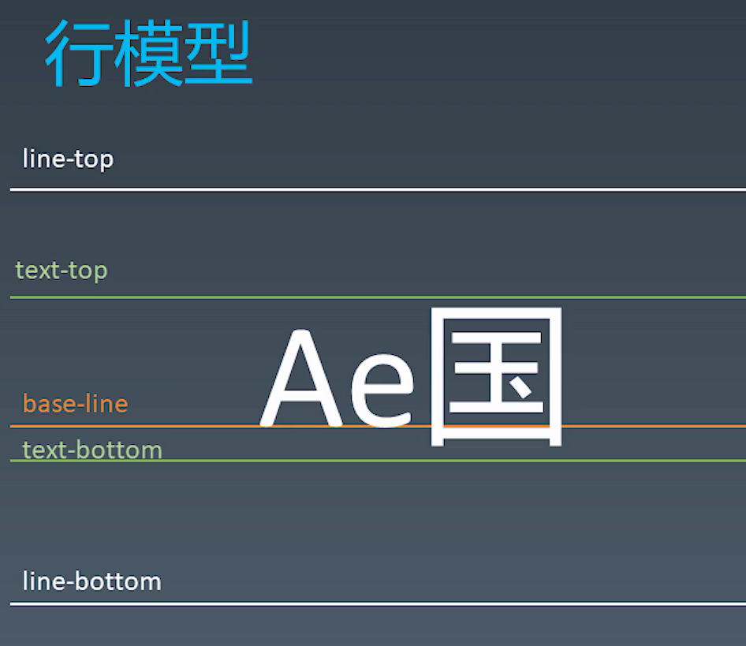

# HTML

HTML5 的新特性

HTML5 的语义化标签


# CSS

实现：两栏布局。左侧固定宽度，右侧自适应宽度。用多种方式实现。！

实现：三栏布局。任意栏实现固定，任意栏目实现等比例缩放。！

Flex 布局

CSS有哪些实现水平居中的方法（Flex ....）！！

CSS有哪些实现元素水平的方法

CSS实现一个 200x200的 div，在不同分辨率屏幕上水平和垂直居中

CSS 盒模型！！！

隐藏元素的方式有哪些，分析区别。！

浏览器的重绘重排！

BFC！！

CSS动画：transition 和 transform 的区别！

CSS 的定位 position、display、 等这几个属性！

CSS3 新特性

CSS3 元素：vh、vw、em、rem！

CSS 清除浮动

行内元素和块级元素

CSS关于文字的属性有哪些，文字如何加阴影

CSS选择器、优先级

移动端适配问题

京东主页上怎么实现鼠标移动到图片上，图片放大的效果。


#### HTML5 新特性

1.   网页结构的改进

```html
<!DOCTYPE html>
<html lang-"en">
  <head>
    <meta charset=utf-8>
    <link href=CSS/main.css rel=stylesheet>
  </head>
</html>
```

-   doctype 声明变得更短、更精简；

-   属性标签写法变得更宽容，比如：

    -   利用 link 标签引入 CSS 不用像以前一样写 `type` 属性；

    -   自闭合标签 `< img />` 不需要在末尾添加反斜杠也会识别（不推荐）；

    -   标签中的属性值，不需要添加引号也会正确识别（不推荐）；

        以前的写法：` <link href="CSS/main.css" rel="stylesheet" type="text/css" />`


2.   语义化元素

解决了无障碍问题、整体结构划分更科学系统、提升搜索引擎抓取内容的效率。


main 元素

声明页面的主内容区。

要求：

-   在一个页面中， main 元素只能定义一个。
-   不能作为 article、aside、header、footer、nav或section 等其他HTML5语义元素的后代。


section 元素

定义文档中的一个通用片段。

通常用一个 section 包装一个课件组件。或者一段有小标题的段落。


nav 元素

作为主导航链接，包装一系列跳转其他页面、或本页面中不同位置的链接。

通常是 nav 嵌套多个 a 标签，替换了之前用列表元素 ul 和 li 写导航。


article 元素

包含一个独立的内容块。比如博客中的一篇文章。


aside 元素

常作为侧边栏。基本与主内容不相关的部分。


figure 和 figcaption 元素

包含解注、图示、照片、代码等。

非常适合给文章中图片添加标题。形成一个相对独立区块：独立资源 + 小标题。


details 和 summary 元素

details 元素包含了一个可以 展示 / 隐藏的内容。summary 元素为主体隐藏时，显示的摘要。


header 元素

常用于页面的头部、每个 article 结构的头部、每个 section 的头部。作为导引和介绍，一个页面可以出现多次。


footer 元素

同上。作为其他文档的链接、版权声明、补充说明等。


address 元素

标记联系人信息。


h1 to h6 元素

一系列标题。但不是副标题，副标题官方推荐使用 `<p>`。


文本级元素

-   b、em、i

b：引入注意，无强调的意思。

em：强调

i：文章中罕见的名词。


3.   媒体嵌入

video、audio 元素

插入 视 / 音频


source 元素

为各种版本的浏览器提供后备资源。以满足不同视/音频格式的支持。


#### CSS3 新特性

《响应式Web大纲》

-   布局
-   文字处理

-   特性查询：比如响应式设计按照屏幕视口宽度来进行 CSS 规则适配或 `@supports (display: flex)` 等

-   新选择符：`[属性名称]`、子字符串匹配（以...开头、包含...、以...结尾）
-   结构化伪类：`:last-child`、`nth-child`、`:not`、`empty`
-   颜色：RGB、HSL、alpha 通道（rgba、hsla）

CSS3 高级应用

-   文字阴影
-   盒阴影（元素投影）
-   渐变背景
-   多重背景图片
-   利用媒体查询，插入高分辨率美景图片
-   CSS 滤镜


CSS4 特性需要了解吗？

-   结构化伪类：`:has`、
-   相对视口： `vw`、`vh`、`vmin`、`vmax`
-   @font-face 多浏览器是配不同字体的字体规则


### CSS3 新特性

文字相关的属性：

column：文本的多栏布局，定义一共有几栏；

column-gap：文本的多栏布局，定义两个栏间隔的宽度；

column-span：文本的多栏布局，定义该元素实现跨栏（通常是文中的小标题）；

text-feature-settings：控制OpenType字体中的高级印刷功能。

font-variant-numeric：控制数字，分数和序号标记的替代字形

font-kerning：使用字体中储存的字距信息。

text-shadow：为文字添加阴影。阴影值由元素在X和Y方向的偏移量、模糊半径和颜色值组成。


盒子相关的属性：


#### CSS 的长度单位

相对长度单位：相对字体长度单位（em、ex、rem、ch）、相对视区长度单位（vh、vw、vmin、vmax）

绝对长度单位：（px、剩余非常少见：pt、cm、mm、pc等）


ex：是字符 x 高度，与 font-size 对应。font-size 值越大，则 ex 就越大；

em：是传统 m 的宽度，也是汉字的高度。即一个字模的宽度。根据不同的英文字体，宽度会发生变化。但中文通常一个汉字正好是一个 m 的宽度和高度。font-size 是按照父元素字符尺寸来计算。

rem：root em。1 rem 和根字符大小一样，font-size 都按照根字符来计算。

ch：是阿拉伯字母 0 的宽度。等宽字体。


等宽字体的特点：有利于代码呈现、阅读更舒服。

应用：

1.   可以模拟边框 / 分割线：`--------`、`········`、`————————————`

2.   若输入11位手机号码，则可以设置输入框位 11ch，正好放下11个数字。给用户一定的输入进度提示。


#### font-size 的属性值

相对尺寸：根据当前 font-size 尺寸计算

-   larger、smaller（ big / small 标签默认是就是这个属性值）

绝对尺寸：仅受浏览器设置的字号影响，不受页面的根元素、父元素等影响。

-   xx-large、x-large、large、medium、small、x-small、xx-small


#### 文本的隐藏

`font-size: 0` 文字就会在视觉层隐藏掉。但是屏幕阅读设备、DOM流中依然存在；

`font-size` 的值小于12px，但不是 0，则会直接当作 12px 处理。这是因浏览器的限制，不允许出现过


#### text-indent 文字的缩进属性

1.   可是实现文本的隐藏：

利用缩进：`text-indent` 设置为一个非常大的负值，则改行文本会因溢出盒子，甚至 html 页面而消失不见。但是会出现溢出容器问题。

```css
.hide-text {
  	text-indent: 100%;    /* 百分比相对于包含块来决定的，100%则正好让文本想左移动了包含块的长度 */ 
  	white-space: nowrap;  /* 规定文本不换行，这样该段落的所有文字都可以利用缩进移动到最左边，消失不见 */
  	overflow: hidden；    /* 解决溢出容器的问题 */ 
}
```

2.   可以实现自然换行对齐效果：

```css
p {
   text-indent: -3em;
   padding-left: 3em; 
}
```

效果：

 


### CSS 的选择器

普通选择器：直接瞄准目标元素的东西。

-   类选择器：`.`

-   ID 选择器：`#`

-   属性选择器：`[]`

-   伪类选择器：`:`

-   伪元素选择器：`::`

关系选择器：根据与其他元素的关系来选择元素的选择器。

-   后代选择器：空格
-   相邻后代选择器：>（选择直接子元素）
-   兄弟选择器：~
-   相邻兄弟选择器：+


#### CSS 的规则

@media

@font-face

@#page

@support


### CSS 可见格式化模型

#### 盒模型

outline：轮廓线。一个与边框类似的属性，可以在盒子边框外围画出一条线。不同之处在于，outline 不影响盒子的布局，也就是说不回影响盒子的宽度和高度计算。因此，outline 常用于调试复杂布局，或者演示布局效果。


box-sizing：通过修改该属性，可以改变计算盒子尺寸的方式。改变了 width / height 属性的影响区域。比如，其默认值是 content-box。则 width / height 属性值应用在 content 内容区。

-   content-box：content 内容区为影响区域；
-   border-box：border、padding、content 都为影响区域；


#### 外边距折叠

外边距折叠有多种情况，要仔细的分清楚每种情况，之前有点忘记了。


### 关于文字的排版问题，不应当太过深入的学习，知道大概就可以了。

### 

### CSS 中，与文字 / 排版相关的属性有哪些？

#### CSS2.2（尽量按重要性排序）:

**具体每个属性的用法，再看一下书中勾画的部分**

line-height：文字的行高 / 行间距。

vertical-align：设置文字垂直对齐方式。

text-indent：字符的缩进（可以设置隐藏文字）。

text-align：对齐元素（左对齐、右对齐、左右散开对齐）。

letter-spacing：设置单个字符之间的间距。

word-spacing：设置单词之间的间距（约等于增 / 减空格的宽度）。

word-break：换行时机。

word-wrap：换行时机（CSS3 改名为 overflow-wrap）。

white-spoace：处理空白字符的方式（比如多个遇到多个连续空格，最后只显示一个）。

text-decoration：content area 文字内容区域四周的边框（可以定义一个下划线）。

text-transform：字符全部大写 / 小写。

-   应用1：身份证输入，末尾字母 X，用户虽然输入了小写，用该属性转换为大写；
-   应用2：验证码输入，网站的验证码不区分大小写，用户输入了小写，用该属性转换为大写。

伪元素 / 伪类

`::first-letter` 选择器：选中段落的首字符

`:first-line` 选择器：选中段落的首字符


#### font 系列

@font-face：CSS的一种变量。利用 font-family和src属性，可以自定义 / 替换原本的字体，也可以引入多种格式的字体。

font：是 font 系列的综合。

color：字体颜色

font-family：字体系列。

font-weight：字重。文字的粗细程度。

font-style：斜体风格。normal, italic, oblique。

font-variant：小体形大写字母


### CSS 的颜色

#### color

rgba(255, 255, 255, .7)

hsla(240, 100%, 50%, .7)

#### background

background-color：插入背景颜色

background-position：背景的位置的偏移值

background-repeat：背景图像的重复。默认在水平和垂直方向上重复。

background-attachement：背景图像的位置是在视口内固定，或者随着包含它的区块滚动。

background-image：设置一个或者多个背景图像。

background-size：背景图片大小。

background-clip：裁剪背景图片。元素背景（背景图片或颜色）是否延伸到边框、内边距盒子、内容盒子下面。


### font-size、line-height、vertical-align 之间的关系


#### strut 支撑节点

>   Each line box starts with a zero-width inline box with the elememt's font and line height properties. We call that imaginary box a "strut".

在每一个 line box 的前面，都会有一个支撑节点。这个节点的 width 宽度为 0、拥有 line box 的字体和行高属性。


#### 行模型



IFC 的每一行，就是一个 line box。在行模型中，具有以下几个注意点：

line-top / line-bottom：行高之间的区域。在 inline boxes 中，无法通过 height 定义盒子的高度，而通常是用 line-height 去定义。

text-top / text-bottom：字体大小的区域，是文字区域的顶部和底部所围成的区域，可以理解为当我们在页面中按住左键选中文字后，变色的区域。这个区域由 font-size 决定。


line-height：line-top 和 line-bottom 之间的高度，通常就是 line-height 即，行高。

-   两条基线之间的距离，也是 line-height。

x-height：在英文字母中，小写 x 的高度，就被定义为 x-height。

base-line：在英文字母中，小写 x 的下边缘，就被定义为 base-line 基线。基线通常在中文最底端靠上一点的位置。

-   如果是替换元素（通常是图片），baseline 则是该元素的下边缘位置。


半行间距：半行间距分为上下两部分。源自于当 line-height 的高度大于 font-size 时，多出来的部分会平均分为两份，分别作为 上行间距、下行间距。

-   所以如果 line-height 的高度小于 font-size时，半行间距就会变成负数，此时上下两行文字就会部分被重叠。


文字的中线：文字的中线不是上下水平居中的一条线，而是小写字母 x 上下水平居中的一条线。可以看成是 x 中心交叉点所在的水平线。

-   文字的中线是比，文字真正水平居中的中心线要略低的。

-   所以关于文字的基线 / 中线，都是参考 x 字母来定义的。


文字的近似居中对齐：

-   先说说我们要达到的居中对齐效果：在一个父元素中，包裹着几个文字和一个图片。我们要使这些文字 / 图片相对于父元素内部，水平居中对齐。参考线是父元素内部的中线。
-   再说说实际发生的效果：在上面的语境中，父元素一定是一个 block box。那么其内部的几个文字和图片，组成起来就是一个 line box，即一个行盒。上文提到过，文字的中线是围绕字母 x 来定义的。所以这些文字会对齐到父元素内部环境中的文字中线。也就是所有文字 / 图片都会对齐到 “文字的中线”，而不是盒子的中线，图片也会参考 “文字的中线” 去对齐。
    -   最终效果是，图片自身的水平中心线与 “文字的中线”对齐。而文字的中线比真正的水平中心线略低。这最终导致了文字和图片的不是真正的居中，而是比真正居中略低的 “近似居中对齐”


上图可以看到，父元素框的真正水平中心线是白色的、代表图片的绿色框真正水平中心线是黄色的。它们都对齐到 “文字的中线”，即x的中心交叉点。所以，文字和替换元素最终垂直对齐的是近似居中效果。


### line-height	

line-height 就是文字间的行间距，也称为行高。它能影响文字之间的间距，vertical-align 也会影响到文字的上下间距。

#### 属性值

默认值：normal。

-   line-height 的默认值不是固定的，而是根据 font-size 和文字种类动态定义。默认 font-size 为16px，line-height 为18px

数值：`line-height: 1.5`。行高计算值为 **当前环境** font-size * 1.5。其子元素继承的数值，是属性值 `1.5`，子元素拿到属性之后重新计算。

百分比值：`line-height: 150%`。行高计算值为 **当前环境** font-size * 150%。其子元素继承的数值，是计算值`font-size * 150%`，子元素直接拿到最终的计算值。此时子元素的 line-height 和子元素的 font-size 没有任何关系。

长度值：

-   `line-height: 20px`。子元素继承拿到最终的计算值（也是属性值）。此时子元素的 line-height 和子元素的 font-size 没有任何关系。
-   `line-height: 1.5em`。行高计算值为 **当前环境** font-size * 1.5。其子元素继承的数值，是计算值`font-size * 150%`，子元素直接拿到最终的计算值。此时子元素的 line-height 和子元素的 font-size 没有任何关系。


所以，通常使用数值来定义 line-height，避免子元素重新定义字体大小后，出现行间距过大/过小的情况。

通常的 line-height 设置在 1.6～1.8 之间。浏览器默认宋体的间距在 1.32。


#### 大值特性

-   在一个 line box中，出现多个 line-height 属性值不同，最终该 line box 会应用 line-height 的最大属性值，作为整行的行间距值。

-   所以，对一个内部是 IFC 环境的 div，设置一个 line-height，没有应用在 div 自身，而是其子内联子元素上。因为 div 本身是一个 block 不会包裹任何文字，所以 line-hieght 对它是无效的。真正应用的是 div 内部的子内联元素（匿名内联盒、内联盒等），尤其是内部 **宽度为0的strut 支撑节点**。


### vartical-align

垂直对齐方式，决定文本的垂直对齐高度基于哪一条线。所以， vartical-align 主要应用在内联元素。（还支持 table-cell 等）

#### 属性值

线类：baseline（默认）、top、middle、bottom

文本类：text-top、text- bottom

上/下标类：sub、super

数值类：根据最终的计算值，文本会基于 baseline 上下偏移。和坐标轴 y 轴一样，正值向上偏移、负值向下便宜。

-   数值：20px

-   百分比值：20%

-   长度值：2em


垂直对齐方式的值：

baseline：默认是基于基线对齐。所有文本的基线就是字母 x 的下边缘。所有替换元素（如 img）的基线，就是元素本身的下边缘。

midde：就是上文所述的，“文字的中线”，也就是近似垂直居中。所以，当一个图片和几个文字利用 `vartical-align: middle` 去垂直居中对齐是，文字会明显的偏下一点（因为图片的 middle 是真正的垂直居中、“文字的中线” 比真正的居中要靠下，图片自然下移）

top / bottom：这里文字的顶端 / 底端 和 替换元素的 顶端 / 底端 没有歧义。所以可以自然的对齐。

text-top / text-bottom：和父容器内容区的顶部 / 底部 对齐，用的少。

百分比值：基于 line-height 计算。用的少。


### 关于 height 和 line-height

对一个 block box 设置 height：改变了该盒子的高度尺寸。

对一个 block box 设置 line-height：改变了该盒子内部 “strut 支撑节点” 以及子 inline boxes 的行间距。如果这个 box 内部的内联元素重新定义了 line-height，就会覆盖 block box 的 line-height 的值。

结合以上，要牢记这个原则：height 影响的是盒子的高度、line-height 影响的是文字的行间距。这两者本就不是一个事物。


  **1.浏览器中默认文字大小 font-size 为16px;
  2.浏览器中默认文字行间距 line-height 为18px；**


**两者间的配合 1：实现单行内容的近似垂直居中。**

把 height 和 line-height 设置为相同的尺寸，就可以实现单行文字 + 图片的近似垂直居中的效果：

```html
<div>
  	我在这里近似垂直居中了
</div>
<style>
  div {
    height: 100px;
    width: 200px;
    line-height: 100px;
    background-color: pink;
  }
</style>
```

 

如果文字长度一旦过多，出现了折行，此时因行间距 line-height 的影响，就会溢出粉色盒子。


**两者间的配合 2: 实现多行近似垂直居中对齐**

```html
<div>
  <span>我居中了吗？我居中了吗？我居中了吗？我居中了吗？我居中了吗？我居中了吗？我居中了吗？我居中了吗？我居中了吗？我居中了吗？我居中了吗？
  </span>
</div>
<style>
  div {
    line-height: 200px;
    background-color: pink;
  }

  span {
    display: inline-block;
    line-height: 30px;
    vertical-align: middle;
  }
</style>
```

 

1.   span 设置为 inline-block，已确保内部可以拥有自己的行间距。同时设置自己的行间距为 30px。
2.   div 行间距设置为 200px，利用宽度为 0 的strut 支撑节点，把 div 的高度撑起来的同时，此时 “文字的中线” 也在盒子的近似中间水平。
     -   **明确一点：** div 作为一个 block 是不需要行高的，它设置 line-height 就是为了子内联元素的继承。最直接的，宽度为 0 的strut 支撑节点继承了这一属性。
3.   span 此时设置上下居中对齐，也就是 `vertical-align: middle;` 那么它就会寻找所在父元素的 “文字的中线” 去对齐。最终效果就是水平近似居中对齐。


问题1：span 为什么要设置为 inline-block？

如果不设置 inline-block，而是默认的内联元素，就会发生下图左这样的情况。span 的 `line-height: 30px` 似乎没有正确被应用，而是使用了父元素 div 的 200px 行间距。实际上，此时的，span 作为内联元素，确实是应用了 30px 的行间距。但是 span 作为内联元素，也会参与到 div 创建的 IFC 环境中，在每一行都会形成一个 行盒 line box。这个行盒的 line-hegiht 是遵循当前行盒中，所有内联元素 line-hieght 最大的那个元素，也就是匿名内联盒 **（通常没有任何文字，那就是宽度为 0 的strut 支撑节点）**，它继承了 div 设置的行间距 200px。所以 span 最终虽然应用了自己的 30px 行间距，但参与 IFC 时 line box 会应用最大的 200px，最终出现了下图左的效果。

-   如果设置 inline-block，则 span 外部作为一个整体，依然会参与 IFC 中，但是内部却创建了一个新的 BFC（其内部只有文字，所以是一个 IFC）。可以看到 div 环境中的 匿名内联盒行高依然是 200px，span 其内部也自己形成了一个 IFC 正常流，提前发生了折行。内部行间距也正确应用为了 30px。可以看到，span 外部的行间距已然是 200px。


 ```html
 <div>
     --这里是匿名内联盒--
     <span>
       滚滚长江东逝水，浪花淘尽英雄。是非成败转头空。
     	青山依旧在，几度夕阳红。白发渔樵江渚上，惯看秋月春风。
     	一壶浊酒喜相逢。古今多少事，都付笑谈中。
     </span>
 </div>
 <style>
   	div {
     	line-height: 100px;
     	background-color: pink;
   	}
 	  span {
   	  /* display: inline-block; */
     	line-height: 20px;
 	  }
 </style>
 ```


问题 2：div 为什么不能用属性 `height:200px` 来设置盒子的尺寸？

如果此处不用属性` line-height: 200px;`，而是用属性 `height:200px`。则该 div 行间距是默认的 18px，也就是说，盒子虽然尺寸被撑起来了，但是 “文字的中线” 却不在盒子水平居中附近的位置，而是很靠上的地方（line-height 为 18px，所以一定在上方 小于 18px）


**两者间的配合 3：`vertical-align:middle` 失效**

有些情况下，会遇到这种问题，`vertical-align:middle`设置后，没有实现居中效果。

```html
<div>
  
</div>
<style>
  div {
    height: 400px;
    background-color: pink;
  }

  img {
    vertical-align: middle;
  }
</style>
```

 

本质原因不是在于 vertical-align，而是设置了 height 的值，只改变了粉色盒的尺寸，而没有改变粉色盒的行间距 line-height。之前提到过，文字和图片等内联元素的居中，是参考 “文字的中线”，而不是盒子的实际上下中线。所以上面的例子中，粉色盒子的 font-size 和  line-height 是都默认尺寸。

-   解决：粉色盒子的 `line-height` = `height`，即达到近似水平居中。上文中，div 添加属性 `line-height: 400px;` 即可。

 


### 文字容器的最终高度

上文提到过，文字的高度依赖于 line-height，但这不是绝对的。文字容器的最终高度，是 font-size、line-height 和 vertical-align 共同作用的结果。

案例1 ：

```html
<div>
  	x<span>文字x</span>
</div>
<style>
    div { line-height: 32px; }
    span { font-size: 24px; }
</style>
```

在 div 容器中默认的字体大小是 16px，行高为32px；div 内部的 span 标签设置字体大小得我 24px。最终，div 内部的行高设置为 34 px。下面来解释这里的原因：

1.   设置：div 内部的匿名内联盒、宽度为0的strut 支撑节点，行高都是 32px，字号为 16px；
2.   设置：span 的内部行高继承自 div 也是 32px，字号为 24px；
3.   可以看到下图效果，虽然 div 内部存在两种字体，但是他们看起来依然在一条直线上，这条直线就是 baseline。这是由于 vertical-align 垂直排列方式默认为 baseline 的作用结果。
4.   字号越大，相对基线的位置就会越靠下，见下右图 字号16px 的文字基线明显高于 字号 32px的文字基线。这就导致字号大的字体会向上移动才能基线对齐。而此时大号文字向上移动后，因字号过大，会超出 line-height 高度。所以纵向上看，顶部会被大号字体 “撑开”。
5.   最终效果来看，顶部被大号字体撑高了 2px，最终行高是 34px。

                


tips：如何解决顶部被撑开？

按照原理，只要字号 font-size 小于 line-height 就不会被撑开。改变 vertical-align 的垂直对齐方式，可以设置为 bottm、top 等，就可以避免撑开。


案例 2:

```html
    <div>
        我是字符x 
    </div>
    <style>
        div {
            line-height: 32px;
            background-color: pink;
        }
    </style>
```

可以看到，当出现文字 + 图片的时候，就会有下图左边这样，底部多出一条边的效果；只有图片（下图右边）也会出现这样的效果。

这是因为上文提到默认基线对齐的结果。文字的基线是 x 字母的下边缘，替换元素的基线是整个元素的下边缘。所以这里图片对齐到了文字的基线处。如果 div 没有文字（右边的图），依然会有一个 **宽度为0的strut 支撑节点** 来提供 div 内部 IFC的行高和基线等基本参考线。

解决方案：

1.   更改图片的 vertical-align。图片不按照基线对齐，而是与文字的底部 bottom、顶部 top 对齐等方式，就不会有空隙了。
2.   让图片变成 block，这里便不是一个 IFC，不会遵循文字排版的垂直对齐规则了。
     -   但这种方法的只适合下图右，没文字的情况。否则图片会因是一个 block 而按照 BFC 排版，直接折行到下一排。
3.   div 内部的 line-height 足够小。常用：`line-height: 0`上文提到过，一旦 line-height 尺寸小于 font-size，则不存在半行间距。下面的空隙也就不存在了。
     -   但这种方法的只适合下图右，没文字的情况。否则文字会因 line-height 尺寸过小而溢出 div 盒子。

                  


### 总结：height、line-height、font-size 三者的关系

line-height 与 font-size：

-   行高 > 字号，则字符上下有半行距的空隙；
-   行高 = 字号，则字符正好占满行高；
-   行高 < 字号，则多行字符会上下 “挤” 再一起。


height 与 line-height：

-   height > line-height，则容器尺寸大，行间距小，默认情况下字会像写文章一样顺次往下排布。
-   height = line-height，则容器和行间距一样，达到近似居中的效果。
-   height < line-height，则容器尺寸小，行间距大，字会挤到盒子的外面。

|                | 定义                    | 百分比值（50% 为例）                           |      |
| -------------- | ----------------------- | ---------------------------------------------- | ---- |
| height         | 盒子的高度              | 父容器实际高度 x 50%                           |      |
| line-height    | 行间距，文字的高度      | 父容器实际高度 x 50%                           |      |
| vertical-align | 垂直对齐的方式          | 当前 line-height x 50%                         |      |
| width          |                         | 父容器实际宽度 x 50%                           |      |
| padding        | 内联元素的padding会断行 | 不论上下左右，都是：<br />父容器实际宽度 x 50% |      |
| margin         | 可以为负值              |                                                |      |


### 层叠上下文 Stacking Context

用户与显示器之间是存在一个 z 轴的，这个轴就是层叠上下文 Stacking Context。

一旦有元素不是在一个平面上依次排放，而是产生了堆叠，就会出现层叠上下文的相关问题。

层叠上下文的层叠水平要比普通元素高。

层叠上下文可以嵌套，内部层叠上下文及其所有子元素均受制于外部的“层叠上下文”。

每个层叠上下文是自成体系的，当元素发生层叠的时候，整个元素被认为是在父层叠上下文的层叠顺序中。


一个层叠上下文的层叠顺序依次是：

边框和背景色、负 z-index、块级水平盒子、float 浮动盒子、内联盒子、z-index 为 0 / auto、正 z-index。

需要再强调，每一个层叠顺序规则仅仅适用于当前层上下文元素的小世界中。

层叠逻辑是：装饰（边框和背景色）、布局（块级盒、浮动盒）、内容（内联盒）

 


层叠准则：

-   谁大谁上：按照层叠顺序，z-index 或排序越靠上的，则覆盖其他更小值的元素；

-   后来居上：当两个元素层叠顺序一致，则在 DOM 流中更靠后的元素会覆盖前面的元素。


层叠上下文的创建：

-   html：页面根元素被称为根层叠上下文；
-   z-index：利用 z 轴定义的元素也具有了一个自己的层叠上下文；
-   CSS3：利用CSS3 属性，也可以创建一个层叠上下文：
    -   flex 布局 + z-index 不是 auto
    -   元素的透明度调整（opacity 不是 1）
    -   元素的动画调整（ transform 不是 none）
    -   元素的 mix-blend-mode 调整，不是 normal
    -   元素的 filter 调整，不是 none
    -   元素的 isolation 是 isolate


层叠上下文涉及到一个隐藏的技巧：

利用层叠上下文，可以达到隐藏效果，更确切的说是遮挡效果。

当层叠上下文内的某个父元素拥有一个背景色，那把要隐藏的元素的 z-index 设置为负值便可以达到效果隐藏 / 遮挡的效果。

这是一个可访问性隐藏。对原来的布局、以及元素的行为没有任何影响。

-   clip 也可以达到隐藏的效果，但缺点是元素需要绝对定位。focus 控件焦点也会有细微问题。


>   参考：
>
>   《CSS世界》
>
>   [关于z-index 那些你不知道的事 (tutsplus.com)](https://webdesign.tutsplus.com/zh-hans/articles/what-you-may-not-know-about-the-z-index-property--webdesign-16892)


### 流向的改变

direction：改变文本的水平方向（自左向右，自右向左）。

writing-mode：内联文本的水平或垂直流。


## 隐藏

**文本的隐藏**

利用字号：`font-size: 0` 文字就会在视觉层隐藏掉。但是屏幕阅读设备、DOM流中依然存在；

利用缩进：`text-indent` 设置为一个非常大的负值，则改行文本会因溢出盒子，甚至 html 页面而消失不见。但是会出现溢出容器问题。

```css
.hide-text {
  	text-indent: 100%;    /* 百分比相对于包含块来决定的，100%则正好让文本想左移动了包含块的长度 */ 
  	white-space: nowrap;  /* 规定文本不换行，这样该段落的所有文字都可以利用缩进移动到最左边，消失不见 */
  	overflow: hidden；    /* 解决溢出容器的问题 */ 
}
```


**盒子的隐藏**

利用层叠上下文。当层叠上下文内的某个父元素拥有一个背景色，那把要隐藏的元素的 z-index 设置为负值便可以达到效果隐藏 / 遮挡的效果。这是一个可访问性隐藏。对原来的布局、以及元素的行为没有任何影响。


**图片的隐藏**

利用裁剪效果。`clip`  可以达到隐藏的效果，但缺点是元素需要绝对定位。focus 控件焦点也会有细微问题。


# 《CSS世界》 第10章 元素的显示与隐藏


## 垂直居中

容器内 文字 + 图片的最佳实践：


####  1 利用 vertical-align 的实现真正的垂直居中。

想要任意容器高度，实现容器内部垂直居中，有几个要点：

1.   图片和文字两个盒子，都设置为 inline-block。文字内联盒方便内部用 BFC 排版，图片不用内联也行；
2.   文字想要实现下图的多行输入，每行都各自设置为一个 block 纵向排版；
3.   图片和文字实现居中效果，均设置为 `vertical-align: middle`；
4.   **重点：** 之前提到过，文字的垂直居中是参考 line-height，而不是 height。所以，容器用 height 设置高度后，其内部 line-height 的高度没有随着 height 的设置而撑开。
     -   如果此时把容器的 line-height 设置与 height 一样高：虽然解决了容器 “文字的中线” 随 height 高度增加而居中的问题。但因继承关系，子元素中 line-height 也被修改了，所以子元素还要重新设置自己的行高。
     -   最佳方法：利用伪元素定义一个空白内容的节点在容器中，令它占据容器 100% 的高度（此时它相当于是一个宽度为0，高度与容器相当的图片）。
         -   这个伪元素是一个行内块（类似一个图片），其高度和容器高度一样，垂直对齐方式为 middle。则这一行其他行内块要对齐的中线，都会以这个高度最高的伪元素行内块做参考，最终达到了垂直居中对齐的效果。

 

```html
<div>
    
    <span>
        <span class="content">滚滚长江东逝水，浪花淘尽英雄。</span>
        <span class="content">是非成败转头空。</span>
        <span class="content">青山依旧在，几度夕阳红。</span>
        <span class="content">白发渔樵江渚上，惯看秋月春风。</span>

    </span>
</div>
<style>
    div {
        background-color: pink;
        height: 20em;
    }
    div:before {
        content: '';
        display: inline-block;
        vertical-align: middle;
        height: 100%;
    }
    img, span {
        display: inline-block;
        vertical-align: middle;
    }
    .content {
        display: block;
    }
</style>
```


P280 利用动画的平移来隐藏元素。

在从左向右书写的语言中，这意味着可以利用向上或向左（不能是向上或向右），平移来隐藏元素。


>   参考：
>
>   《CSS世界》
>
>   [彻底搞定vertical-align垂直居中不起作用疑难杂症 (juejin.cn)](https://juejin.cn/post/6844903561780789255)
>
>   [关于 vertical-align 你应该知道的一切 (juejin.cn)](https://juejin.cn/post/6844904084885995528)
>
>   [CSS深入理解vertical-align和line-height的基友关系 « 张鑫旭-鑫空间-鑫生活 (zhangxinxu.com)](https://www.zhangxinxu.com/wordpress/2015/08/css-deep-understand-vertical-align-and-line-height/)
>
>   [vertical-align - CSS（层叠样式表） | MDN (mozilla.org)](https://developer.mozilla.org/zh-CN/docs/Web/CSS/vertical-align)

