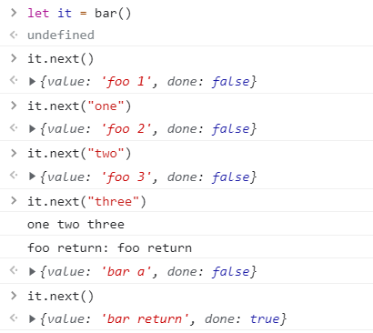

本文主要讲述了异步编程的相关知识，主要包括：

1. 可迭代对象 iterable object
2. 迭代器 iterator
3. 生成器 generator / yield
4. 异步编程 async / await
5. generator、async 和 promise


# 简要介绍异步编程相关的知识点：

#### 1 迭代相关：

**Iterator**：一个迭代器包含了一个 `next()` 方法，它可以循环迭代出所在对象的所有值。

**iterable object**：当一个对象包含 iterator 迭代器的对象，同时拥有一个  `Symbol.iterator` 方法后，就可以利用 `for...of` 自动，或 `it.next()` 手动迭代。

**generator / yield**： 是一个生成器，通过这个生成器函数，我们可以方便的随时暂停 / 重启一个函数的执行，同时建立了一个和调用者双向传递的通道，可以多次的传入 / 传出值。generator 的实现原理，就是利用了 iterator 迭代器。当生成器函数在 `yield` 处暂停后，会处于暂时挂起状态，其函数本身依然在调用栈中存在。

#### 2 异步相关：

**promise**：优化了异步编程的形式，传统依赖回调的异步编程，经常会出现回调地狱。采用使用 `promise` 后，就有了 `then` 链，使异步编程的难度得到缓解。

**async / await**：是一个进一步优化的异步编程的形式，它本质是一个 `promise` 和 `p.then()` 的语法糖，优化了 `then` 链的编程方式。可以集中处理 rejected promise、更专注于对 promise 成功回调后的处理。

#### 3 迭代 + 异步：

**async generator**：实质上是 promise + generator 的优化版本。promise 令 generator 拥有了异步迭代的能力。也就是 generator 每次迭代都是异步获取值的，一旦获取到值，就自动的把值返回给调用者。调用者可以利用在 async 环境中的 `for await ...of` 来遍历出async generator 异步获取的值。


# 1 iterable object 可迭代对象

可以使用 `for..of` 遍历值的对象，被称为一个 **可迭代的对象**。

- **iterator** 叫做迭代器，它拥有一个 `next()` 方法。在 ES6 中，迭代器函数的名称规定为 `Symbol.iterator`。

- **iterable** 称之为可迭代，即指一个包含 iterator 迭代器的对象，同时拥有一个  `Symbol.iterator` 方法的对象。这个迭代器可以在其值上迭代。


解释 `[Symbol.iterator]`：

- `[...]` 是计算属性名。指定一个表达式并用这个表达式的结果作为属性的名称。
- `Symbol.iterator` 是ES6 预定义的特殊 Symbol 值之一。


要点：

- 可迭代对象必须有一个 `Symbol.iterator` 方法。
  - 调用 `obj[Symbol.iterator]()` 会返回一个函数，这个函数被称为 **迭代器（iterator）**。由它处理进一步的迭代过程。
  - 一个迭代器必须有 `next()` 方法，调用它会返回一个 `{done: Boolean, value: any}` 对象，这里 `done:true` 表明迭代结束，此时 `value` 为 `undefined`。
- `Symbol.iterator` 方法会被 `for..of` 自动调用；也可以手工调用 `next()` 实现遍历。
- 内置的可迭代对象例如字符串和数组，都实现了 `Symbol.iterator`。


支持 Iterable 接口的内置类型有：

- String
- Array
- Map、Set
- arguments 对象
- DOM 的一些集合类型：NodeList 等


可以使用 Iterable 接口的结构有：

- `for..of`
- generator、yield
- 数组解构
- `...` 扩展操作符
- `Arrray.from()`
- Set、Map 的创建
- `Promise.all()` 、`Promise.race()`等，参数是由 Promise 组成的可迭代对象。


# 2 iterator 迭代器

**iterator** 叫做迭代器，它拥有一个 `next()` 方法。在 ES6 中，迭代器函数的名称规定为 `Symbol.iterator`。


**iterable** 称之为可迭代，即指一个包含 iterator 迭代器的对象，这个迭代器可以在其值上迭代。所以，一个 iterable 必须支持一个函数，其名称必须是 `Symbol.iterator`。调用这个函数时，它会返回一个迭代器。


## 2.1 Iterator 接口

Iterator 是一个获取对象的方式。我们把调用 iterator 的一方称之为消费者。它消费 iterator 生产的值；把 iterator 称之为生产者，它为消费者提供值。


规范中，Iterator 接口需要如下结构：

1. `next()` 方法：用来取得下一个 IteratorResult。
2. 两个可选方法：
   - `return()` 方法：停止迭代器，并返回 IteratorResult
   - `throw()` 方法：报错，并返回 IteratorResult
3. IteratorResult 接口。调用 `next()` 后，会得到一个 IteratorResult 对象，其结构是：
   - value：当前迭代值或最终返回值。 
   - done：布尔值，表示是否迭代完成。
     - 如果为： `{done: true, value: undefind}` 表示已经全部遍历完毕。


## 2.2 `return()` 和 `throw()`

消费者：需要值的对象，调用 iterator 的 `next()`，每次调用 `next()` 会获得一个 IteratorResult 。

生产者：提供值的对象。就是本节的 iterator，它可以产生值。


`return()` 表示：消费者向迭代器发送一个信号，表示自己不再需要。作为生产者的迭代器收到信号后，可以执行一些清理工作，比如关闭网络、数据库等。

- `return()` 可以 **提前终止** 迭代器继续迭代。
- 会返回一个 IteratorResult 对象。
- 消费者调用 `return()` 时传入的参数。将会作为本次 IteratorResult 的 value 返回。


`throw()` 表示：

- `throw()` 不意味着 iterator 完全停止迭代。而是会根据传递过来的异常，给出对应的反应。异常可以用 `try...catch` 捕获，未捕获的异常则会终止 iterator。
- 通过参数，用于向 iterator 传送一个异常 / 错误。
- 会返回一个 IteratorResult 对象。


另：提前终止 Iterator

- `for..of` 循环可以通过 `break`、`continue`、`return`、`throw` 提前退出；
- 调用 iterator 的 `return()` 方法 


## 2.3 `for..of` 遍历 iterator

`for..of` 可以遍历一个符合规范的 iterable 可迭代对象，

可迭代对象拥有 `[Symbol.iterator]` 函数，这个函数会返回一个 iterator 迭代器，它有 `next()` 方法。

`for...of` 循环会自动请求对象的  `[Symbol.iterator]` 函数，返回一个 iterator 迭代器；并且在每次迭代中自动调用 iterator 的 `next()` 来遍历这个对象的值，并且会在接收到 `done:true` 之后自动停止。

也可以手工调用 `[Symbol.iterator]` 函数，然后使用它返回的迭代器，调用 `next()` 。


使用方式如下：

```js
let a = [1, 3, 5, 7, 9]

// for of 使用 iterator
for (let value of a) {
    console.log(value) 	// 1 3 5 7 9
}

// 手动使用 iterator 的 next 方法
let it = a[Symbol.iterator]()
it.next().value	// 1
it.next().value	// 3
it.next().value	// 5
```


可以通过把 Symbol.iterator 指向自身，使自己既是一个 iterator 也是一个 iterable，

- generator 生成的 iterator 就是既是一个 iterator 也是一个 iterable，

```js
let it = {
    // for..of 会调用 Symbol.iterator。
    // 让 Symbol.iterator 返回自身，使自己成为一个 iterable
    [Symbol.iterator]() { return this}
    // 定义iterator的next方法
    next(){
        
    }
}

it[Symbol.iterator]() === it   // true
```


下面是一个标准的迭代器接口：

```js
let getNumber = (() => {
    let nextVal;
    let done = false
    return {
        // for..of 需要
        [Symbol.iterator]: function() { return this }
        // iterator需要
        next: function(){
            if (nextVal === undefined) {
                nextVal = 1;
            } else {
                nextVal = (3 * nextVal) + 6;
            }
            if (nextVal > 150) {
                done = true
            }
            return {done:done, value:nextVal}
        }
    }
})();


// 使用 for..of 遍历
for(let value of getNumber) {
    console.log(value)  // 1 9 33 105
}

// 使用 手工遍历
let res = getNumber.next()	
res						// {done: false, value: 1}
let res = getNumber.next()	
res						// {done: false, value: 9}
let res = getNumber.next()	
res						// {done: false, value: 33}
let res = getNumber.next()	
res						// {done: false, value: 105}
```


# 3 generator / yield 生成器

常规函数的问题：

- 一旦开始执行这个函数，在它结束之前不会被任何事情打断。
- 外部只能在调用时，传递值到函数中，中间无法继续传递；
- 只会返回一个单一值（或者不返回任何值）。

而 `generator` 是一类特殊的函数，可以一次或多次启动和停止，并不一定非得要完成：

- 在执行当中 暂停 / 恢复 自身的执行。
- 在执行当中的 暂停 / 恢复时，还提供了双向信息传递的机会。generator 可以返回多个值，也可以多次传递值给 generator。

它们可与 iterable 完美配合使用，从而可以轻松地创建数据流。


## 3.1 generator

调用一个生成器，会返回这个生成器的迭代器实例。也就是说，多次调用生成器，会返回多个迭代器实例，它们互相不受影响。


以下是调用 generator 的流程：

```js
function* gen() {
    yield 1;
    yield 2;
    yield 3;
    return "over"
}

let it = gen() 
it.next().value 	// 1
it.next().value 	// 2
it.next().value 	// 3
it.next().value		// over
```

1. 首先，调用 `gen` 获得一个 `iterator`；
2. 接着，每调用一次 `next()`，就会执行到一个 `yield` 处，返回一个 IteratorResult，其 `value` 值保存了这个 `yield` 处传递过来的值。
3. 每次调用 `next()`，都会有两个过程：
   1. generator 中的代码执行到 **下一个 `yield`** 处，然后暂停执行；
   2. 返回一个 IteratorResult，把 **下一个 `yield`** 处的值放入其中。
4. 当执行最后一个 `next()` 时，会让 generator 执行到末尾 `return` 处。此时返回的 IteratorResult 中，保存的值就是 return 返回的值。

所以，`next()` 总是比 `yield` 多一个。上例中，有 3 个 `yield` 和 4 个 `next()`。


## 3.2 yield

generator 通过 yield 来实现暂停 / 恢复和双向信息传递。

`yield` 是一个表达式。

- `yield` 从 `generator` 中传出消息： `yield` 会导致生成器在执行过程中返回一个值，这有点类似于中间的 `return`。

- `yield` 从调用处传出消息： `yield` 表达式会等待一个从调用处传递过来的结果值。

所以，没有值的 `yield` 相当于一个 `yield undefined`。

举例一个 yield 双向传递：

```js
function* gen() {
    let x = 1
    let y = x + (yield "第一次中断") * 3
    console.log(y)
    y = y + (yield "第二次中断")
    console.log(y)
    return "结束"
}

let it = gen()
console.log(it.next().value)
// 第一次中断	 -- 从 generator 传递来值
console.log(it.next(3).value)	// 从调用者传递过去值：3
// 10			
// 第二次中断	 -- 从 generator 传递来值								
console.log(it.next(2).value)	// 从调用者传递过去值：2
// 12
// 结束		   -- 从 generator 传递来值				
```

注意执行流程：

1. `let it = gen()`：获得一个 `gen` 的 iterator：。

2. 第一次调用 `it.next()`：启动这个 iterator ，`gen` 中的代码会执行到第一个 `yield` 处。

   - 此时会返回一个 IteratorResult 给调用者，其 `value` 保存了从 generator 中传递过来的值 `"第一次中断"`。

3. 第二次调用 `it.next(3)`：`gen` 代码中的第一个 `yield` 会拿到调用者传递过来的值 `3`，接着会执行到第二个 `yield` 处。

   - 在 `gen` 执行过程中，有 ` console.log(y)` 代码，所以控制台会输出：`10`

   - 在 `gen` 执行完毕后，返回一个 IteratorResult 给调用者，其 `value` 保存了从 generator 中传递过来的值 `"第二次中断"`。

4. 第三次调用 `it.next(3)`：`gen` 代码中的第一个 `yield` 会拿到调用者传递过来的值 `2`，接着会执行到最后一个 `yield` 处。

   - 在 `gen` 执行过程中，有 ` console.log(y)` 代码，所以控制台会输出：`12`
   - 在 `gen` 执行完毕后，返回最后一个 IteratorResult 给调用者，其 `value` 保存了从 generator 中传递过来 `return`，`"结束"`


## 3.3 yield*

yield 委托（yield delegation）。

`yield* ...` 表达式需要一个 iterator，然后它会自动的调用这个 iterator。

- `yield` 表达式的完成值来自于用 `it.next()` 恢复生成器的值，也就是传递的参数；
- `yield*` 表达式的完成值，来自于被委托的 iterator 的 `return` 返回值。

所以，

1. 对于 `yield*` 来说，它不是一个外部需要 `it.next()` 进行启动的断点，如果代码执行到 `yield*`  处，会自动的调用 `yield*` 后的 iterator，然后代码会继续执行到这个 iterator 的第一个断点处。
2. `yield*` 不会给你返回值，也就是说，`yield*` 不会返回给外界完成值；外界也不会传递参数给 `yield*` 。
3. 从这一点上来说，在外部看来，`yield*` 好似透明的，它不会形成一个断点，不需要 `it.next()` 去启动。


通过举一个例子来体会 `yield*` 的执行流程：

```js
function* foo() {
    let x = yield "foo 1";
    let y = yield "foo 2";
    let z = yield "foo 3";
    console.log(x, y, z)
    return "foo return"
}

function* bar() {
    let x = yield* foo()
    console.log("foo return:", x)
    yield "bar a"
    return "bar return"
}
```

我们来分析上面代码中，一共需要几个 `it.next()` 启动：

- `bar` 中有 1 个 `yield` ，所以需要 2 个 `it.next()`。而 `yield*` 不是断点，不需要启动。

- `foo` 中有 3 个 `yield`，所以需要 4 个 `it.next()`。由于是 `bar` 中的 `yield*` 调用 `foo` 的 iterator，所以 `yield*` 会自动创建并启动 `foo` 的 iterator，省去一次启动，少 1 次 `it.next()` 调用。

所以，上面的代码一个需要 5 个 `it.next()` 去启动。

当程序处在运行时，依次输入以下代码；

- `let = it = bar()`：创建一个 iterator
- `it.next()`：第一个 `next` 不传递参数。
  - 程序执行到 `yield*` 处后，会自动创建一个 `foo` 的 iterator，委托这个 iterator 去生成值；
  - 程序不会停顿，继续执行到 `foo` 中的第一个 `yield`，然后返回 `foo 1`；
- `it.next("one")`：第二个 `next`，参数传递给 第一个 `yield` 处，然后 `foo` 中的 `x` 获取到该值，程序继续执行到第二个 `yield` 处，然后返回 `foo 2`；
- `it.next("two")`：第三个 `next`，情况和上一个相同，先传递参数给第二个 `yidle`，然后执行 `foo` 代码，最后返回第三个 `yield` 的值；
- `it.next("three")`：第四个 `next`，传递参数给第三个 `yield`，程序往下执行：
  - 执行到 `console.log(x, y, z)`，控制台输出了 `one two three`；
  - 执行到 `return "foo return"` 则 `foo` 的 iterator 完成遍历，把完成值返回给 `yield*`；
  - `yield*` 接收到完成值，赋值给变量 `x`；
  - 然后程序执行到 `console.log("foo return:", x)`，控制台输出：`foo return: foo return`；
  - 程序执行到最后一个 `yield` 处，返回值 `bar a` 给外部，等待外部继续启动；
  - `it.next()`，最后一个 `next` 没有传递值给 `yield`，则默认传递 `undefined`。
    - 程序执行到最后一行， `bar` 也执行完毕，返回完成值 `bar return`
    - 外部获取到 `bar` 的完成值，`done` 属性为 `true`，知晓 `bar` 遍历完毕。

下图是在控制台中输入的截图：




## 3.4 提前完成

在 Iterator 中提到过，有两个方法 `throw()` 和 `return()` 可以提前终止一个暂停的 generator。


### `return()`

```js
function* foo() {
    yield 1
    yield 2
    yield 3
}

let it = foo()
it.next()		// { value: 1, done: false }
it.return(42)	// { value: 42, done: true }
it.next()		// { value: undefined, done: true }
```

`return(x)` 的效果相当于通过 generator，强制立即执行一个 `return x`。所以，传递过去的值 `x`，generator 会当作完成值放在 IteratorResult 中返回，然后终止。

作用：如果不再会遍历的 generator，会一直在内存中占用资源，通过 `return()` 提前终止，释放资源。

`for...of`， `spread` 等，在结束前会自动调用 `return`，然后执行 `finally` 中的代码。

```js
function* foo() {
    try{
 		yield 1
        yield 2
        yield 3
    }
    finally{
        console.log("cleanup")
    }
}

for (let v of foo()) {
    console.log(v)
}
// 1 2 3
// cleanup

let it = foo()
it.next()		// {value: 1, done: false}
it.return(42) 	// cleanup
				// {value: 42, done: true}
```

在 `generator` 内部如果有 `try...finally` 语句，即使迭代器从外部结束，也会执行 `finally` 中的语句。

- 注意在结束时的执行顺序，当出现 `it.return()` 时，会立即终止生成器。
  - **首先，执行 `finally` 中的代码，**
  - **接着，把返回的 `value` 设置为传入 `return()` 的内容。也就是此时 `vlaue` 值为  `cleanup` 。**


# 4 Async / await  异步编程

```js
async function foo() {
    return 1 
}
```

如果函数前加入了 `async` 关键字，这个函数就成为了一个 Async。Async 通常和 Promise 配合使用，Async 进一步优化了 promise 的 `then` 调用链,使异步编程更舒适。

`async` 函数的返回值，永远是一个 `promise`，且该 `promise` 是已决议的。

- 如果 `return` 的是一个立即值，则包装为一个 rsolved promise 后返回；
- 如果 `return` 的是一个 `promise`，则直接返回这个 `promise`。
- 如果 `return` 的是一个 thenable，则会进行展开(执行)，得到一个立即值或 `promise`。
- 如果没有手动 `return`，且没有错误的情况下， 默认返回一个值为 `undefined` 的 resolved promise。
- 如果没有手动 `return`，且有 `reject`，如果没有用 `try...catch` 捕获，就会返回这个 `rejected promise`。


## 4.1 `await`

和 `generator` / `yield` 类型，`async` / `await` 也是相互的搭档。`await` 只能在 `async` 中使用。

`await... ` 表达式是一个暂停点，其右侧是一个 `promise`。当程序执行到 `await...`  时，`await` 会暂停函数的执行，直到 promise 状态变为 settled，然后以 promise 的结果继续执行。这个行为不会耗费任何 CPU 资源，因为 JavaScript 引擎可以同时处理其他任务：执行其他脚本，处理事件等。

- `await` 实际上就是 `p.then()` 的语法糖。
- **如果 `await` 后是一个立即值，则直接返回这个立即值，不会包装为 `promise` 。**


## 4.2 Error 处理

如果一个 promise 正常 `fulfilled`，`await promise` 返回的就是其结果，是一个已决议的 `promise`。

如果这个 promise 是`rejected`，它将 `throw` 这个 `error` ，控制台中会显示一个未处理的 promise error：

```js
async function foo() {
    let p = await Promise.reject("错误")
    return p
}
foo() // 错误
// Uncaught (in promise) 错误
```


### `try...catch`

使用 `try...catch` 可以把 `await` 等待的 `promise` 中发生的错误捕获：

```js
async function foo() {
    try {
        let p = await Promise.reject("错误")
        } catch (e) {
            console.log(e)
        }

}
foo() // 错误
```

如果没有 `await` 等待，promise 中发生的错误就只在 promise 中抛出错误，需要 `p.then()` 或 `p.catch()` 去接收错误，无法使用 `try...catch` 捕获错误：

```js
async function foo() {
    try {
        let p = Promise.reject("错误")
        } catch (e) {
            console.log(e)
        }

}
foo() // Uncaught (in promise) 错误
```

如果不用 `try..catch` 去捕获 `promise` 中的错误，那么也可以在外部调用 `async` 函数的时候，添加一个 `.catch()` 作为“兜底”，处理 `async` 中可能出现的错误。

这就相当于， 异步函数 `foo()` 最终返回了一个 `rejected` 的 `promise`：

```js
async function foo() {
    let p = await Promise.reject("错误")
}

foo().catch(e => {
    console.log(e)		// 错误
}) 
```


**所以，`async` / `await` 是 `promise` / `p.then()` 的语法糖。**

`await` 解决了 `then()` 长长的一条链条，我们把 `then` 中 `rejected` 失败回调函数放到了 `try...catch` 中统一处理。然后 `await` 就只需等待正确的 resolve promise 了。


# 5 async generator 异步迭代

声明一个异步迭代函数，用 `async 

异步迭代允许我们对按需通过异步请求而得到的数据进行迭代。例如，我们通过网络分段（chunk-by-chunk）下载数据时。异步生成器（generator）使这一步骤更加方便。


## 5.1 异步的可迭代对象 async iterable object

我们知道，要使一个对象可迭代，我们需要给它添加 `[Symbol.iterator]`。

现象，如果令一个对象可异步迭代，需要添加 `[Symbol.asyncIterator]`。


当迭代的值通过异步形式输出时，iterator 的定义和使用产生了以下变化：

1. 引擎不再调用 `[Symbol.iterator]` 函数来迭代，而是使用 `[Symbol.asyncIterator]`。
2. `await it.next()` 方法会返回一个 fulfilled promise，且这个 `promise` 携带有返回值 IteratorResult。
3. `for...of` 应该使用异步迭代：`for await (let v of iterable)`。

`for...of` 通过调用异步可迭代对象的 `[Symbol.iterator]` 函数，获得一个包含 `async next()` 方法的对象。然后每次调用 `async next()` 都会获得一个包含结果值 IteratorResult 的 promise。

下面是一个每个 1000ms 后，输出一个数字的例子，采用异步的可迭代对象：

```js
let number = {
    array: [1, 3, 5, 7, 9, 11, 13, 15, 17, 19],
    [Symbol.asyncIterator]() {
        return {
            array: this.array,
            index: 0,
            async next() {
                let num = await new Promise((resolve) => {
                    setTimeout(() => {
                            resolve(this.array[this.index++])
                        }, 1000)
                });

                return {
                    done: num === undefined ? true : false,
                    value: num
                }
            }
        }
    }
};

// 必须包含在一个 async 中，才能使用 await
(async () => {
    for await (let value of number) { // (4)
        console.log(value)	// 1, 3, 5, 7, 9, 11, 13, 15, 17, 19
    }
})()
```


## 5.2 async generator 异步生成器

当我们想创建一个 **异步生成一系列值的对象** 时，我们都可以使用异步 generator。

```js
async function* gen() {
    for (let i = 0, i < 20; i++) {
        await new Promise(reslove => setTimeout(reslove, 1000));
        yield i;
    }
};

// for await ...of 遍历
(async() => {
    let it = gen();
    for await(let v of it) {
        console.log(v)	// 间隔 1s，输出0 ~ 19
    }
})();
```


定义异步 generator 时，注意几个要点：

1. 定义异步 generator ：`async function*`；
2. 在异步 generator 中通过 `await` 等待，来异步获取值；
3. 在异步 generator 中通过 `yield` 来和调用者进行双向交互，把自己获取的值传递出去。

使用异步 generator 时，注意几个要点：

1. 要异步环境中创建并调用使用启动器，创建一个 `async` 环境的 IIFE；
2. 通过 `for await ...of` 来逐次的获取异步值。
   - 使用  `for await ...of` 原因是，异步值时通过 `await it.next()` 获取的。

```js
// 上面的程序进行手动遍历
// 运行时输入：
(async() => {
    let it = gen();
    console.log(await it.next())
    console.log(await it.next())
    console.log(await it.next())
    console.log(await it.next())
    console.log(await it.next())
})();
// 控制台依次输出：
// {value: 0, done: false}
// {value: 1, done: false}
// {value: 2, done: false}
// {value: 3, done: false}
// {value: 4, done: false}
```


## 5.3 `async [Symbol.asyncIterator]`

使用异步的 `[Symbol.asyncIterator]`，来替换同步的 `[Symbol.asyncIterator]`

```js
let range = {
  from: 1,
  to: 5,

  // 这一行等价于 [Symbol.asyncIterator]: async function*() {
  async *[Symbol.asyncIterator]() {
    for(let value = this.from; value <= this.to; value++) {

      // 在 value 之间暂停一会儿，模拟异步获取值
      await new Promise(resolve => setTimeout(resolve, 1000));
      // 通过 yield 返回值，而不再用 next() 方法
      yield value;
    }
  }
};

(async () => {
  for await (let value of range) {
    console.log(value); // 间隔 1s 依次输出：1, 2, 3, 4, 5
  }
})();
```


## 5.4 总结

异步 iterator 与常规 iterator 在语法上的区别：

|                            | Iterator          | async iterator                   |
| :------------------------- | :---------------- | :------------------------------- |
| 提供 iterator 的对象方法： | `Symbol.iterator` | `Symbol.asyncIterator`           |
| `next()` 返回的值是：      | IteratorResult    | promise，决议值是 IteratorResult |
| 要进行循环，使用：         | `for..of`         | `for await..of`                  |


异步 generator 与常规 generator 在语法上的区别：

|                     | Generator             | 异步 generator                   |
| :------------------ | :-------------------- | :------------------------------- |
| 声明方式：          | `function* gen(){..}` | `async function* gen(){..}`      |
| `next()` 返回的值是 | IteratorResult        | promise，决议值是 IteratorResult |
| 要进行循环，使用：  | `for..of`             | `for await..of`                  |


应用背景：

在 Web 开发中，经常会遇到数据流，它们分段流动（flows chunk-by-chunk）。例如，下载或上传大文件。

此时，我们可以使用异步 generator 来处理此类数据。

值得注意的是，浏览器环境下，还有一个被称为 Streams 的 API，它提供了特殊的接口来处理此类数据流，转换数据、并将数据从一个数据流传递到另一个数据流（例如，从一个地方下载并立即发送到其他地方）。
