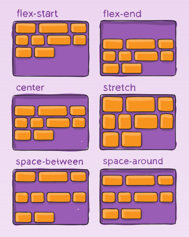

# 整理问题

2. 除了 flex 居中，其他垂直水平居中方式。尽量说全面
3. 宽度固定，高度不定的元素在整个页面水平垂直居中
   - 盒子内部有一些文字，如何让这些文字在容器内水平垂直居中。

2. 有哪些页面布局
   - 响应式布局、流式布局、rem 布局 ...
3. CSS 动画
4. CSS 实现三角形
5. `animation` 和 `transition`
   - 常见的动画属性
6. css 旋转
7. css 不会继承的属性


第一代排版技术：

1. 清除浮动
2. 盒模型、CSS3模型
   - padding 和 margin 的区别
3. position、display 有哪些属性，各自的区别


CSS 选择器：

1. `.a.b`  `.a .b`     `.a+.b`
2. CSS 选择器有哪些
   - 伪类、伪元素是什么？
   - 优先级


## 1. CSS 单位怎么区分

###  1.1 `px`、`em`、`rem` 的区别

1. `px`：固定的像素，一旦设置了就无法因为适应页面大小而改变。
2. `em` ：相对其父元素来设置字体大小。
3. `rem`：相对于 `<html>` 根元素来设置字体大小。
4. `30%`：如果要设置多列布局，使用 百分号是更好的选择。但是 `%` 的计算非常困难。

#### `em`：

- 子元素字体大小的 `em`，是相对于 **父元素** 字体大小 `font-size`；
- 元素的 `width`/`height`/`padding`/`margin`的 `em`，是相对于 **该元素** 的字体大小 `font-size`；

#### `rem`：

- **全部的长度都相对于根元素**。

- 通常做法是给 `html` 元素设置一个字体大小，然后其他元素的长度单位就为 `rem`。

结论：`em` 的计算值是基于父元素的，不同元素的参照物不一样（都是该元素父元素），所以在计算的时候不方便，相比之下 `rem` 就只有一个参照物（html元素），这样计算起来更清晰。


### 1.2 `vw` / `vh` 和 `%` 的区别

CSS3 的新特性，与视图窗口有关

- `vw`、`vh`： 相对于视图窗口的宽度，相对于视图窗口高度。
- `%`：大部分相对于祖先元素，也有相对于自身的情况比如（border-radius、translate等)，计算复杂。

| 单位 | 含义                                 |
| ---- | ------------------------------------ |
| vw   | 相对于视窗的宽度，视窗宽度是 `100vw` |
| vh   | 相对于视窗的高度，视窗高度是 `100vh` |
| vmin | vw和vh中的较小值                     |
| vmax | vw和vh中的较大值                     |

`px` 如何转化为 `vw`：

- `1px = （1/375）*100 vw`，假设使用 iPhone X 的 `375px` 作为视口宽度。


### 2. px 和视口

#### 1 像素

| 像素     | 区别                                                         |
| -------- | ------------------------------------------------------------ |
| css像素  | 逻辑分辨率 `px`，为web开发者提供，在css和html中使用的一个抽象单位。<br />移动设备分辨率的不同，会有 Dpr2，Dpr3 等等几倍屏，会放大像素点，获得更清晰效果。 |
| 物理像素 | 物理分辨率，只与设备的硬件密度有关，任何设备的物理像素都是固定的。 |

#### 2 视口

浏览器显示内容的屏幕区域。

布局视口（layout viewport）：网页内容的实际尺寸；

视觉视口（visual viewport）：浏览器可展示页面的尺寸；

- 在PC 端可以改变浏览器尺寸，而在移动端视觉视口就是其设备屏幕的大小。

所以最佳情况下，要把布局视口和视觉视口的宽度 `1:1` 匹配。电脑的布局视口默认为：980px

下面是我在 Flower Library 项目中的划分：

```css
/* 对屏幕在 0~768px, 768~992px, 992~1140px 分辨率设置自己的css。 */
@media (min-width:768px) {
    .form-cell_title { margin: 2.5rem;}
}
@media (min-width:992px) {
    .form-cell_title { margin: 3.2rem;}
}

@media (min-width:1140px) {
    .form-cell_title { margin: 3.2rem;}
}
```

典型设备的尺寸：

- iPhone 5：`320px`、iPhone X：`375px`
- iPad：`768px`、iPad Pro：`1024px`
- 电脑：`1024px`

所以最佳的划分：

- `768px` 以下是移动手机端；
- `768px` ~ `1024px` 是平板；
- `1024px` 以上是笔记本，`1440px` 是更大尺寸的笔记本。


移动端的视口适配：

```html
<meta name="viewport" content="
  width=device-width; 
  initial-scale=1; 
  maximum-scale=1; 
  minimum-scale=1; 
  user-scalable=no;
">
```


总结：

1. `vm vh` 在 IE 和 Opera 的兼容性存在问题。但搭配 flex 效果更好。


## 2. 响应式布局的方式有哪些

一共有 5 个手段，可以配合使用：

1. 使用 CSS3 的媒体查询 `@media`：
   - 优点：根据不同显示设备宽度，设定不同的页面样式，非常方便直观。比如可以通过 @media 设置不同尺寸的图片。
   - 缺点：通常一个屏幕宽度，就需要配套一个 @media 样式。如果页面构成复杂，则**需要改变的样式太多**，那么多套样式代码会很繁琐。
2. 使用 `%` 百分比，来做栅格系统。
   - 优点：不用像 @media 一样设置多套样式；
   - 缺点：计算起来复杂。如果只计算 width 和 height 还行，他们是父元素的宽高百分比；而其他如果 padding、margin、border-redius 等等属性，百分比的参考值是完全不同的。
3. 使用 CSS3 的视口单位 `vm/vh`。
   - 优点：设计原理与百分比布局类似，也是栅格系统。视口宽度和高度都是 100 个单位，解决了计算复杂的问题。
   - 缺点：对 IE 和 Opera 可能存在兼容性问题。
4. 使用 `em`。
   - 缺点：`em` 是相对于父元素的字体大小 font-size，存在不易察觉的继承问题。
5. 使用 `rem` 改进 `em`。
   - 优点：`rem` 是相对于根元素 `html` 的字体大小 font-size，解决了 `em` 的计算复杂问题。
   - 缺点：我觉得 `rem` 配合媒体查询，是挺好用的 …可能存在 JS 代码对 `rem` 动态计算转换为 `px` 有点绕。但是现在也有对应的自动转换工具。


## 3. flex 布局的属性有哪些

#### 概述：

主轴（4）：

- `flex-flow`  ==  `flex-direction + flex-wrap`；
- `justify-content`、`align-content`；

交叉轴（1）+ 间隙（3）：

- `align-items`；
- `gap`  ==  `row-gap` + `column-gap`；

flex item（6）：

- `flex` == `flex-grow` + `flex-shrink` + `flex-basis`；
- `align-self`， `order`


#### 1 主轴布局

- `flex-direction`：主轴方向。
  - row、row-reverse、column、column-reverse。主轴方向向右、向左、向下、向上。
- `flex-wrap`：是否换行。
  - nowrap、wrap、wrap-reverse。不换行、换行、反方向换行（如果默认交叉轴向下，则会向上换行）
- `flex-flow`：`主轴方向 + 换行` 的简写。
  -  `<flex-direction> || <flex-wrap>`
- `justify-content`：主轴方向上，各 item 的布局方式。解决主轴方向的 item 剩余空间。
  - flex-start、flex-end、center、space-between、space-around、space-evenly。
  - 主轴起点开始、终点开始、居中、两端对齐、平均分布在 item 两边、空隙全部平均分布。

 

- `align-content`：当 item 在容器中出现折行时，如何解决在交叉轴方向的容器内剩余空间。

 

#### 2 交叉轴布局

- `align-items`：交叉轴方向，各 iitem 的布局方式。解决交叉轴方向的 item 剩余空间。

 

#### 3 item 属性

- `flex-grow`、`flex-shrink`：设置 item 的拉伸 / 收缩比例。`number`，defalue 1

 

- `flex-basis`：兼容性差，分配剩余空间之前的默认尺寸。
  - `auto`：参考我的宽高属性。或者是 `% 、rem` 等等
- `flex`：`flex-grow + flex-shrink + flex-basis` 的集合。
- `align-self`：改变单个 flex item 的排版行为：auto | flex-start | flex-end | center | baseline | stretch。

 

- `order`：对单个 item 进行排序。

 

#### 4. 间隙

- `row-gap`, `column-gap`：flex item 之间的空隙，在计算剩余空间之前应用。
- `gap` ：是 上面两个的简写。

 


## 4. 有哪些常见的 CSS 页面布局

三代排版技术：

- 基于正常流的布局：
  - `display` 属性（文档流布局） + `position` 属性（定位布局） + `float`属性（浮动布局）。
  - table 表格布局、float 浮动布局
  - 涉及到了 IFC BFC 的知识。
- Flex 布局；
- 网格布局；
- CSS `Houdini`。


响应式布局：`@media` + `rem` 首选、使用 `vh/vm` 也可以，但是CSS3新特性兼容性不好；

流式布局：典型网站是 pinterest.com 用 `flex` 最方便

两栏布局：

三栏布局（圣杯布局）：左右固定，中间自适应。

- 左边：宽度固定，设置左浮动；右边宽度固定，设置右浮动；中间宽度 ：`width:100%`设置左浮动。

双飞翼布局：


实现水平、垂直居中的方式：

1.  `text-align:center` 仅行内元素有效
2. `vertical-align`
3. 将行内元素的 `line-height` 和 `height` 设置为相同（水平居中）
4. 绝对定位。父元素设置 `position:reletive`。子元素设置 `position:absolute`，然后使用 `top:50%;left:50%`，把左上角对齐父容器的一半，最后使用 `margin-top` 和 `margin-left` 为子元素的一半 ，实现居中对齐。
5. `transform: translateX(-50%) translateY(-50%);`上面的绝对定位方法只要将 `margin` 改为 `transform` 就可以实现 **宽度和高度未知** 的居中，兼容性不好。


## 5. CSS 中与文字 / 排版相关的属性有哪些？

#### CSS2.2（尽量按重要性排序）:

**具体每个属性的用法，再看一下书中勾画的部分**

line-height：文字的行高 / 行间距。

vertical-align：设置文字垂直对齐方式。

text-indent：字符的缩进（可以设置隐藏文字）。

text-align：对齐元素（左对齐、右对齐、左右散开对齐）。

letter-spacing：设置单个字符之间的间距。

word-spacing：设置单词之间的间距（约等于增 / 减空格的宽度）。

word-break：换行时机。

word-wrap：换行时机（CSS3 改名为 overflow-wrap）。

white-spoace：处理空白字符的方式（比如多个遇到多个连续空格，最后只显示一个）。

text-decoration：content area 文字内容区域四周的边框（可以定义一个下划线）。

text-transform：字符全部大写 / 小写。

-   应用1：身份证输入，末尾字母 X，用户虽然输入了小写，用该属性转换为大写；
-   应用2：验证码输入，网站的验证码不区分大小写，用户输入了小写，用该属性转换为大写。

伪元素 / 伪类

`::first-letter` 选择器：选中段落的首字符

`:first-line` 选择器：选中段落的首字符


#### font 系列

@font-face：CSS的一种变量。利用 font-family和src属性，可以自定义 / 替换原本的字体，也可以引入多种格式的字体。

font：是 font 系列的综合。

color：字体颜色

font-family：字体系列。

font-weight：字重。文字的粗细程度。

font-style：斜体风格。normal, italic, oblique。

font-variant：小体形大写字母


### CSS 的颜色

#### color

rgba(255, 255, 255, .7)

hsla(240, 100%, 50%, .7)

#### background

background-color：插入背景颜色

background-position：背景的位置的偏移值

background-repeat：背景图像的重复。默认在水平和垂直方向上重复。

background-attachement：背景图像的位置是在视口内固定，或者随着包含它的区块滚动。

background-image：设置一个或者多个背景图像。

background-size：背景图片大小。

background-clip：裁剪背景图片。元素背景（背景图片或颜色）是否延伸到边框、内边距盒子、内容盒子下面。


## 7 居中对齐

### 7.1 垂直居中 - 第一代排版技术 正常流

**(1) 单行内容的近似垂直居中。**

把 height 和 line-height 设置为相同的尺寸，就可以实现单行文字 + 图片的近似垂直居中的效果：

```html
<div>
  	我在这里近似垂直居中了
</div>
<style>
  div {
    height: 100px;
    width: 200px;
    line-height: 100px;
    background-color: pink;
  }
</style>
```

 

如果文字长度一旦过多，出现了折行，此时因行间距 line-height 的影响，就会溢出粉色盒子。


**(2) 多行近似垂直居中对齐**

```html
<div>
  <span>我居中了吗？我居中了吗？我居中了吗？我居中了吗？我居中了吗？我居中了吗？我居中了吗？我居中了吗？我居中了吗？我居中了吗？我居中了吗？
  </span>
</div>
<style>
  div {
    line-height: 200px;
    background-color: pink;
  }

  span {
    display: inline-block;
    line-height: 30px;
    vertical-align: middle;
  }
</style>
```

 

1.   span 设置为 inline-block，已确保内部可以拥有自己的行间距。同时设置自己的行间距为 30px。
2.   div 行间距设置为 200px，利用宽度为 0 的strut 支撑节点，把 div 的高度撑起来的同时，此时 “文字的中线” 也在盒子的近似中间水平。
     -   **明确一点：** div 作为一个 block 是不需要行高的，它设置 line-height 就是为了子内联元素的继承。最直接的，宽度为 0 的strut 支撑节点继承了这一属性。
3.   span 此时设置上下居中对齐，也就是 `vertical-align: middle;` 那么它就会寻找所在父元素的 “文字的中线” 去对齐。最终效果就是水平近似居中对齐。


**(3) 图片 + 文字的垂直居中**

```html
<div>
  
</div>
<style>
  div {
    height: 400px;
    line-height: 400px;
    background-color: pink;
  }

  img {
    vertical-align: middle;
  }
</style>
```

**`vertical-align` : 文字和图片等内联元素的居中，是参考 “文字的中线”，而不是盒子实际尺寸的中线。**

如果上面的 `div` 只设置了尺寸高度 `height`， 而没有设置文字行高 `line-height`，就无法达到垂直居中的效果。

 


## 末尾. font-size、line-height、vertical-align 之间的关系

### 6.1 引入

#### strut 支撑节点

>   Each line box starts with a zero-width inline box with the elememt's font and line height properties. We call that imaginary box a "strut".

在每一个 line box 的前面，都会有一个支撑节点。这个节点的 width 宽度为 0、拥有 line box 的字体和行高属性。


#### 行模型


IFC 的每一行，就是一个 line box。在行模型中，具有以下几个注意点：

line-top / line-bottom：行高之间的区域。在 inline boxes 中，无法通过 height 定义盒子的高度，而通常是用 line-height 去定义。

text-top / text-bottom：字体大小的区域，是文字区域的顶部和底部所围成的区域，可以理解为当我们在页面中按住左键选中文字后，变色的区域。这个区域由 font-size 决定。


line-height：line-top 和 line-bottom 之间的高度，通常就是 line-height 即，行高。

-   两条基线之间的距离，也是 line-height。

x-height：在英文字母中，小写 x 的高度，就被定义为 x-height。

base-line：在英文字母中，小写 x 的下边缘，就被定义为 base-line 基线。基线通常在中文最底端靠上一点的位置。

-   如果是替换元素（通常是图片），baseline 则是该元素的下边缘位置。


半行间距：半行间距分为上下两部分。源自于当 line-height 的高度大于 font-size 时，多出来的部分会平均分为两份，分别作为 上行间距、下行间距。

-   所以如果 line-height 的高度小于 font-size时，半行间距就会变成负数，此时上下两行文字就会部分被重叠。


文字的中线：文字的中线不是上下水平居中的一条线，而是小写字母 x 上下水平居中的一条线。可以看成是 x 中心交叉点所在的水平线。

-   文字的中线是比，文字真正水平居中的中心线要略低的。

-   所以关于文字的基线 / 中线，都是参考 x 字母来定义的。


文字的近似居中对齐：

-   先说说我们要达到的居中对齐效果：在一个父元素中，包裹着几个文字和一个图片。我们要使这些文字 / 图片相对于父元素内部，水平居中对齐。参考线是父元素内部的中线。
-   再说说实际发生的效果：在上面的语境中，父元素一定是一个 block box。那么其内部的几个文字和图片，组成起来就是一个 line box，即一个行盒。上文提到过，文字的中线是围绕字母 x 来定义的。所以这些文字会对齐到父元素内部环境中的文字中线。也就是所有文字 / 图片都会对齐到 “文字的中线”，而不是盒子的中线，图片也会参考 “文字的中线” 去对齐。
    -   最终效果是，图片自身的水平中心线与 “文字的中线”对齐。而文字的中线比真正的水平中心线略低。这最终导致了文字和图片的不是真正的居中，而是比真正居中略低的 “近似居中对齐”


上图可以看到，父元素框的真正水平中心线是白色的、代表图片的绿色框真正水平中心线是黄色的。它们都对齐到 “文字的中线”，即x的中心交叉点。所以，文字和替换元素最终垂直对齐的是近似居中效果。


### 6.2 line-height	

line-height 就是文字间的行间距，也称为行高。它能影响文字之间的间距，vertical-align 也会影响到文字的上下间距。

#### 属性值

默认值：normal。

-   line-height 的默认值不是固定的，而是根据 font-size 和文字种类动态定义。默认 font-size 为16px，line-height 为18px

数值：`line-height: 1.5`。行高计算值为 **当前环境** font-size * 1.5。其子元素继承的数值，是属性值 `1.5`，子元素拿到属性之后重新计算。

百分比值：`line-height: 150%`。行高计算值为 **当前环境** font-size * 150%。其子元素继承的数值，是计算值`font-size * 150%`，子元素直接拿到最终的计算值。此时子元素的 line-height 和子元素的 font-size 没有任何关系。

长度值：

-   `line-height: 20px`。子元素继承拿到最终的计算值（也是属性值）。此时子元素的 line-height 和子元素的 font-size 没有任何关系。
-   `line-height: 1.5em`。行高计算值为 **当前环境** font-size * 1.5。其子元素继承的数值，是计算值`font-size * 150%`，子元素直接拿到最终的计算值。此时子元素的 line-height 和子元素的 font-size 没有任何关系。


所以，通常使用数值来定义 line-height，避免子元素重新定义字体大小后，出现行间距过大/过小的情况。

通常的 line-height 设置在 1.6～1.8 之间。浏览器默认宋体的间距在 1.32。


#### 大值特性

-   在一个 line box中，出现多个 line-height 属性值不同，最终该 line box 会应用 line-height 的最大属性值，作为整行的行间距值。

-   所以，对一个内部是 IFC 环境的 div，设置一个 line-height，没有应用在 div 自身，而是其子内联子元素上。因为 div 本身是一个 block 不会包裹任何文字，所以 line-hieght 对它是无效的。真正应用的是 div 内部的子内联元素（匿名内联盒、内联盒等），尤其是内部 **宽度为0的strut 支撑节点**。


### 6.3 vartical-align

垂直对齐方式，决定文本的垂直对齐高度基于哪一条线。所以， vartical-align 主要应用在内联元素。（还支持 table-cell 等）

#### 属性值

线类：baseline（默认）、top、middle、bottom

文本类：text-top、text- bottom

上/下标类：sub、super

数值类：根据最终的计算值，文本会基于 baseline 上下偏移。和坐标轴 y 轴一样，正值向上偏移、负值向下便宜。

-   数值：20px

-   百分比值：20%

-   长度值：2em


垂直对齐方式的值：

baseline：默认是基于基线对齐。所有文本的基线就是字母 x 的下边缘。所有替换元素（如 img）的基线，就是元素本身的下边缘。

midde：就是上文所述的，“文字的中线”，也就是近似垂直居中。所以，当一个图片和几个文字利用 `vartical-align: middle` 去垂直居中对齐是，文字会明显的偏下一点（因为图片的 middle 是真正的垂直居中、“文字的中线” 比真正的居中要靠下，图片自然下移）

top / bottom：这里文字的顶端 / 底端 和 替换元素的 顶端 / 底端 没有歧义。所以可以自然的对齐。

text-top / text-bottom：和父容器内容区的顶部 / 底部 对齐，用的少。

百分比值：基于 line-height 计算。用的少。


### 关于 height 和 line-height

对一个 block box 设置 height：改变了该盒子的高度尺寸。

对一个 block box 设置 line-height：改变了该盒子内部 “strut 支撑节点” 以及子 inline boxes 的行间距。如果这个 box 内部的内联元素重新定义了 line-height，就会覆盖 block box 的 line-height 的值。

结合以上，要牢记这个原则：**height 影响的是盒子的高度、line-height 影响的是文字的行间距，这两者本就不是一个事物。**


  **1.浏览器中默认文字大小 font-size 为16px;
  2.浏览器中默认文字行间距 line-height 为18px；**


**两者间的配合 1：实现单行内容的近似垂直居中。**

把 height 和 line-height 设置为相同的尺寸，就可以实现单行文字 + 图片的近似垂直居中的效果：

```html
<div>
  	我在这里近似垂直居中了
</div>
<style>
  div {
    height: 100px;
    width: 200px;
    line-height: 100px;
    background-color: pink;
  }
</style>
```

 

如果文字长度一旦过多，出现了折行，此时因行间距 line-height 的影响，就会溢出粉色盒子。


**两者间的配合 2: 实现多行近似垂直居中对齐**

```html
<div>
  <span>我居中了吗？我居中了吗？我居中了吗？我居中了吗？我居中了吗？我居中了吗？我居中了吗？我居中了吗？我居中了吗？我居中了吗？我居中了吗？
  </span>
</div>
<style>
  div {
    line-height: 200px;
    background-color: pink;
  }

  span {
    display: inline-block;
    line-height: 30px;
    vertical-align: middle;
  }
</style>
```

 

1.   span 设置为 inline-block，已确保内部可以拥有自己的行间距。同时设置自己的行间距为 30px。
2.   div 行间距设置为 200px，利用宽度为 0 的strut 支撑节点，把 div 的高度撑起来的同时，此时 “文字的中线” 也在盒子的近似中间水平。
     -   **明确一点：** div 作为一个 block 是不需要行高的，它设置 line-height 就是为了子内联元素的继承。最直接的，宽度为 0 的strut 支撑节点继承了这一属性。
3.   span 此时设置上下居中对齐，也就是 `vertical-align: middle;` 那么它就会寻找所在父元素的 “文字的中线” 去对齐。最终效果就是水平近似居中对齐。


问题1：span 为什么要设置为 inline-block？

如果不设置 inline-block，而是默认的内联元素，就会发生下图左这样的情况。span 的 `line-height: 30px` 似乎没有正确被应用，而是使用了父元素 div 的 200px 行间距。实际上，此时的，span 作为内联元素，确实是应用了 30px 的行间距。但是 span 作为内联元素，也会参与到 div 创建的 IFC 环境中，在每一行都会形成一个 行盒 line box。这个行盒的 line-hegiht 是遵循当前行盒中，所有内联元素 line-hieght 最大的那个元素，也就是匿名内联盒 **（通常没有任何文字，那就是宽度为 0 的strut 支撑节点）**，它继承了 div 设置的行间距 200px。所以 span 最终虽然应用了自己的 30px 行间距，但参与 IFC 时 line box 会应用最大的 200px，最终出现了下图左的效果。

-   如果设置 inline-block，则 span 外部作为一个整体，依然会参与 IFC 中，但是内部却创建了一个新的 BFC（其内部只有文字，所以是一个 IFC）。可以看到 div 环境中的 匿名内联盒行高依然是 200px，span 其内部也自己形成了一个 IFC 正常流，提前发生了折行。内部行间距也正确应用为了 30px。可以看到，span 外部的行间距已然是 200px。

                       

 ```html
<div>
    --这里是匿名内联盒--
    <span>
      滚滚长江东逝水，浪花淘尽英雄。是非成败转头空。
    	青山依旧在，几度夕阳红。白发渔樵江渚上，惯看秋月春风。
    	一壶浊酒喜相逢。古今多少事，都付笑谈中。
    </span>
</div>
<style>
  	div {
    	line-height: 100px;
    	background-color: pink;
  	}
	  span {
  	  /* display: inline-block; */
    	line-height: 20px;
	  }
</style>
 ```


问题 2：div 为什么不能用属性 `height:200px` 来设置盒子的尺寸？

如果此处不用属性` line-height: 200px;`，而是用属性 `height:200px`。则该 div 行间距是默认的 18px，也就是说，盒子虽然尺寸被撑起来了，但是 “文字的中线” 却不在盒子水平居中附近的位置，而是很靠上的地方（line-height 为 18px，所以一定在上方 小于 18px）


**两者间的配合 3：`vertical-align:middle` 失效**

有些情况下，会遇到这种问题，`vertical-align:middle`设置后，没有实现居中效果。

```html
<div>
  
</div>
<style>
  div {
    height: 400px;
    background-color: pink;
  }

  img {
    vertical-align: middle;
  }
</style>
```

 

本质原因不是在于 vertical-align，而是设置了 height 的值，只改变了粉色盒的尺寸，而没有改变粉色盒的行间距 line-height。之前提到过，文字和图片等内联元素的居中，是参考 “文字的中线”，而不是盒子的实际上下中线。所以上面的例子中，粉色盒子的 font-size 和  line-height 是都默认尺寸。

-   解决：粉色盒子的 `line-height` = `height`，即达到近似水平居中。上文中，div 添加属性 `line-height: 400px;` 即可。

 

### 文字容器的最终高度

上文提到过，文字的高度依赖于 line-height，但这不是绝对的。文字容器的最终高度，是 font-size、line-height 和 vertical-align 共同作用的结果。

案例1 ：

```html
<div>
  	x<span>文字x</span>
</div>
<style>
    div { line-height: 32px; }
    span { font-size: 24px; }
</style>
```

在 div 容器中默认的字体大小是 16px，行高为32px；div 内部的 span 标签设置字体大小得我 24px。最终，div 内部的行高设置为 34 px。下面来解释这里的原因：

1.   设置：div 内部的匿名内联盒、宽度为0的strut 支撑节点，行高都是 32px，字号为 16px；
2.   设置：span 的内部行高继承自 div 也是 32px，字号为 24px；
3.   可以看到下图效果，虽然 div 内部存在两种字体，但是他们看起来依然在一条直线上，这条直线就是 baseline。这是由于 vertical-align 垂直排列方式默认为 baseline 的作用结果。
4.   字号越大，相对基线的位置就会越靠下，见下右图 字号16px 的文字基线明显高于 字号 32px的文字基线。这就导致字号大的字体会向上移动才能基线对齐。而此时大号文字向上移动后，因字号过大，会超出 line-height 高度。所以纵向上看，顶部会被大号字体 “撑开”。
5.   最终效果来看，顶部被大号字体撑高了 2px，最终行高是 34px。

            


tips：如何解决顶部被撑开？

按照原理，只要字号 font-size 小于 line-height 就不会被撑开。改变 vertical-align 的垂直对齐方式，可以设置为 bottm、top 等，就可以避免撑开。


案例 2:

```html
    <div>
        我是字符x 
    </div>
    <style>
        div {
            line-height: 32px;
            background-color: pink;
        }
    </style>
```

可以看到，当出现文字 + 图片的时候，就会有下图左边这样，底部多出一条边的效果；只有图片（下图右边）也会出现这样的效果。

这是因为上文提到默认基线对齐的结果。文字的基线是 x 字母的下边缘，替换元素的基线是整个元素的下边缘。所以这里图片对齐到了文字的基线处。如果 div 没有文字（右边的图），依然会有一个 **宽度为0的strut 支撑节点** 来提供 div 内部 IFC的行高和基线等基本参考线。

解决方案：

1.   更改图片的 vertical-align。图片不按照基线对齐，而是与文字的底部 bottom、顶部 top 对齐等方式，就不会有空隙了。
2.   让图片变成 block，这里便不是一个 IFC，不会遵循文字排版的垂直对齐规则了。
     -   但这种方法的只适合下图右，没文字的情况。否则图片会因是一个 block 而按照 BFC 排版，直接折行到下一排。
3.   div 内部的 line-height 足够小。常用：`line-height: 0`上文提到过，一旦 line-height 尺寸小于 font-size，则不存在半行间距。下面的空隙也就不存在了。
     -   但这种方法的只适合下图右，没文字的情况。否则文字会因 line-height 尺寸过小而溢出 div 盒子。

                  


### 总结：height、line-height、font-size 三者的关系

`line-height` 与 `font-size`：

-   行高 > 字号，则字符上下有半行距的空隙；
-   行高 = 字号，则字符正好占满行高；
-   行高 < 字号，则多行字符会上下 “挤” 再一起。


`height` 与 `line-height`：

-   height > line-height，则容器尺寸大，行间距小，默认情况下字会像写文章一样顺次往下排布。
-   height = line-height，则容器和行间距一样，达到近似居中的效果。
-   height < line-height，则容器尺寸小，行间距大，字会挤到盒子的外面。

|                | 定义                    | 百分比值（50% 为例）                           |      |
| -------------- | ----------------------- | ---------------------------------------------- | ---- |
| height         | 盒子的高度              | 父容器实际高度 x 50%                           |      |
| line-height    | 行间距，文字的高度      | 父容器实际高度 x 50%                           |      |
| vertical-align | 垂直对齐的方式          | 当前 line-height x 50%                         |      |
| width          |                         | 父容器实际宽度 x 50%                           |      |
| padding        | 内联元素的padding会断行 | 不论上下左右，都是：<br />父容器实际宽度 x 50% |      |
| margin         | 可以为负值              |                                                |      |


