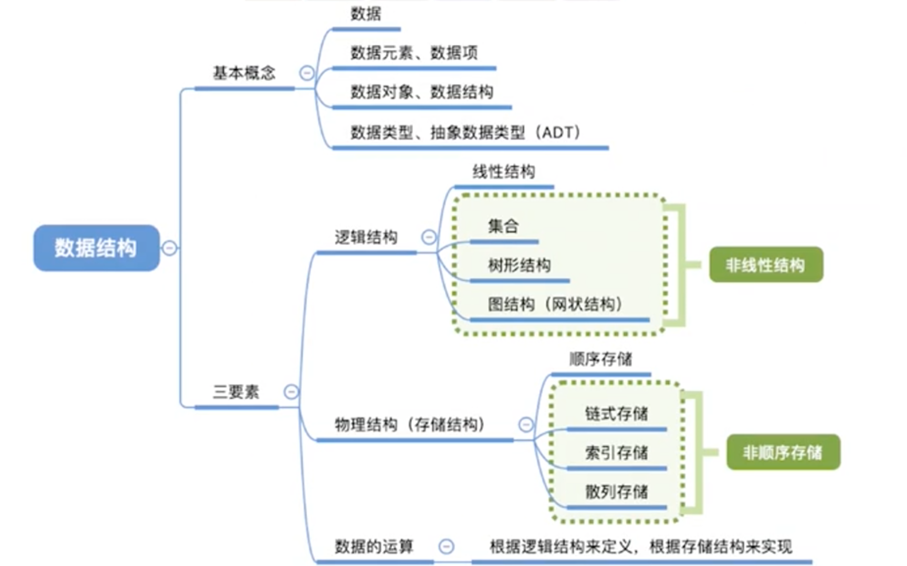

# 绪论

## 1.基本概念

### 1.1 数据

数据元素 (元素)：数据的基本单位，通常作为一个整体进行考虑和处理。

数据项：一个数据元素可由若干数据项组成，数据项是构成数据元素的最小单位，不可分割。

### 1.2 结构

数据结构：强调各个数据元素之间有相互关系，是多个数据元素的集合。

数据对象：具有相同性质的数据元素的集合。数据的一个子集。

### 举例：

#### 海底捞排队等号系统：

**数据元素**：每一个用户账号：用户1，用户2，用户3 ...

**数据项**：每个账号中的选项：ID、姓名、生日、性别、昵称 ...

**数据结构**：每个用户在排队，形成一个前后顺序：3号顾客、4号顾客、5号顾客，数据元素之间存在某种关系，组成了一个数据结构。

**数据对象**：A门店中的顾客、B门店中店顾客，都是性质相同的顾客，但他们之间没有直接关系，算有门店的排队顾客，可以看成一个数据对象。

### 1.3 类型

#### 1.3.1数据类型

一个值的集合、定义在此组合上的一组操作。

- 原子类型：不可再分的数据类型（int、bool、double ...）
- 结构类型：可以分解为多个成分的数据类型（class、function、

### 1.3.2 抽象数据类型

Abstract Data Type，ADT。是抽象数据组织以及与之相关的操作。也就是说，不讨论物理结构，只考虑逻辑结构和数据运算。不考虑具体实现。

## 2 数据结构三要素

逻辑结构、物理结构、数据运算

### 2.1 逻辑结构

集合：各个数据元素之间没有关系

线性结构：各个数据元素之间是一对一关系，有一个前后顺序。（每个元素，都有一个唯一的前驱、唯一的后继）

树形结构：数据元素之间是一对多的关系。

图结构：元素之间是一对多的关系。

### 2.2 物理结构(存储结构)

顺序存储：逻辑上相邻的元素，存储在物理位置上也相邻。

链式存储：逻辑上相邻的元素，物理位置上可以不相邻，用指针来表示元素的前后关系。

索引存储：添加索引表（关键字，地址）来标明元素的位置。

散列存储：根据元素关键字直接计算出该元素的存储地址，又称哈希（hash）存储。

**排列方式排序**：

- 顺序存储：物理上位置连续。

- 非顺序存储：链式存储、索引存储、散列存储。

**数据存储结构的影响**：

- 物理空间上连续 /离散
- 存储空间分配的方便程度
- 数据运算的速度

### 2.3 数据运算

施加在数据上的运算：包括定义和实现。

- 数据的定义：逻辑结构，指出运算的功能。
- 数据的实现：存储结构，运算的具体操作步骤。

## 3. 算法

### 3.1 定义

程序 = 数据结构 + 算法

- 数据结构：如何把现实世界的问题信息化，将信息存进计算机。同时还要实现对数据结构的基本操作。
- 算法：如何处理这类信息，以解决实际问题。

