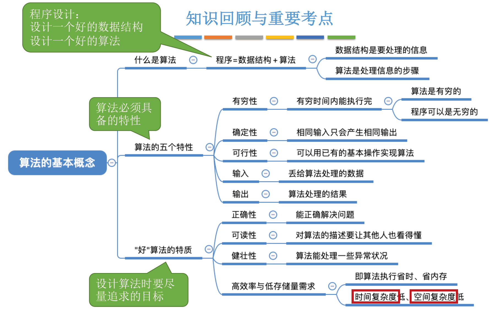
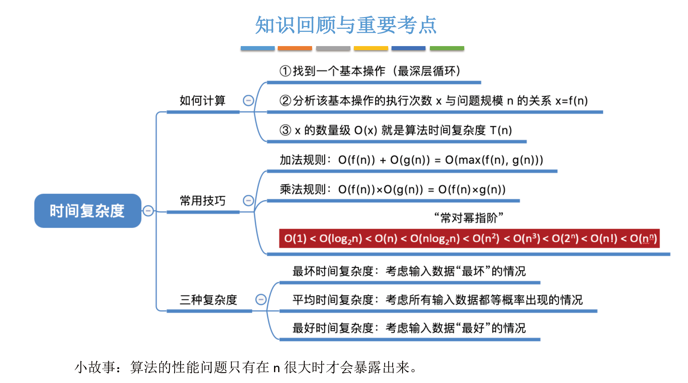
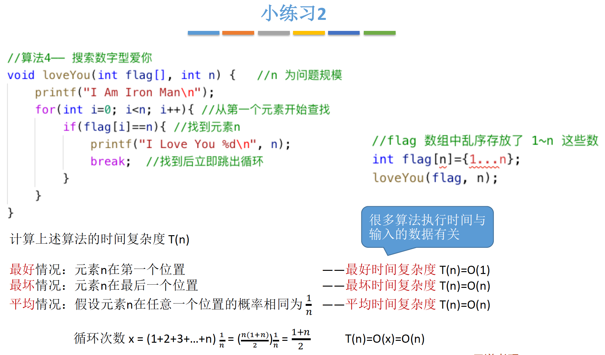
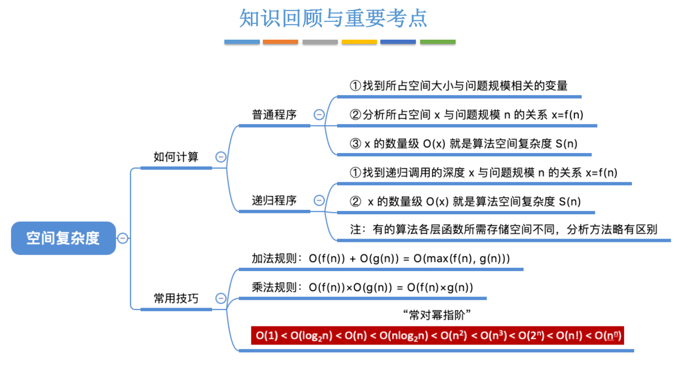

# 绪论


## 1.基本概念

### 1.1 数据

数据元素 (元素)：数据的基本单位，通常作为一个整体进行考虑和处理。

数据项：一个数据元素可由若干数据项组成，数据项是构成数据元素的最小单位，不可分割。


### 1.2 结构

数据结构：强调各个数据元素之间有相互关系，是多个数据元素的集合。

数据对象：具有相同性质的数据元素的集合。数据的一个子集。


### 举例：


#### 海底捞排队等号系统：

**数据元素**：每一个用户账号：用户1，用户2，用户3 ...

**数据项**：每个账号中的选项：ID、姓名、生日、性别、昵称 ...

**数据结构**：每个用户在排队，形成一个前后顺序：3号顾客、4号顾客、5号顾客，数据元素之间存在某种关系，组成了一个数据结构。

**数据对象**：A门店中的顾客、B门店中店顾客，都是性质相同的顾客，但他们之间没有直接关系，算有门店的排队顾客，可以看成一个数据对象。


### 1.3 类型

#### 1.3.1数据类型

一个值的集合、定义在此组合上的一组操作。

- 原子类型：不可再分的数据类型（int、bool、double ...）
- 结构类型：可以分解为多个成分的数据类型（class、function、


### 1.3.2 抽象数据类型

Abstract Data Type，ADT。是抽象数据组织以及与之相关的操作。也就是说，不讨论物理结构，只考虑逻辑结构和数据运算。不考虑具体实现。


## 2 数据结构三要素

逻辑结构、物理结构、数据运算

### 2.1 逻辑结构


集合：各个数据元素之间没有关系

线性结构：各个数据元素之间是一对一关系，有一个前后顺序。（每个元素，都有一个唯一的前驱、唯一的后继）

树形结构：数据元素之间是一对多的关系。

图结构：元素之间是一对多的关系。


### 2.2 物理结构(存储结构)

顺序存储：逻辑上相邻的元素，存储在物理位置上也相邻。

链式存储：逻辑上相邻的元素，物理位置上可以不相邻，用指针来表示元素的前后关系。

索引存储：添加索引表（关键字，地址）来标明元素的位置。

散列存储：根据元素关键字直接计算出该元素的存储地址，又称哈希（hash）存储。


**排列方式排序**：

- 顺序存储：物理上位置连续。

- 非顺序存储：链式存储、索引存储、散列存储。


**数据存储结构的影响**：

- 物理空间上连续 /离散
- 存储空间分配的方便程度
- 数据运算的速度


### 2.3 数据运算

施加在数据上的运算：包括定义和实现。

- 数据的定义：逻辑结构，指出运算的功能。
- 数据的实现：存储结构，运算的具体操作步骤。


## 3. 算法



### 3.1 定义

程序 = 数据结构 + 算法

- 数据结构：如何把现实世界的问题信息化，将信息存进计算机。同时还要实现对数据结构的基本操作。
- 算法：如何处理这类信息，以解决实际问题。


### 3.2 算法的特性

- 有穷性：一个算法必须在有限的时间、有穷的步骤内完成。
- 确定性：相同的输入，得到的输出结果也相同。
- 可行性： 算法可以用基本运算实现。
- 输入
- 输出


### 3.3 算法的评价标准

1. 正确性：正确的解决问题。
2. 可读性：可以易于理解。可以用伪代码、文字表示，但是关键无歧义。
3. 健壮性：输入非法数据，算法可以检测和处理，避免输出结果错误。
4. 高效率、低存储量需求：时间复杂度低、空间复杂度低。


## 4 算法的时间复杂度



#### 在事件发生前，就**预估**出算法的运行时间。是时间开销 T(n) 与 问题规模 n 之间的关系。


**T(n) ----> O(n)**

加法规则：只保留阶数最高的项。

乘法规则：相乘的各项，都保留。

**“常对幂指阶”**，计算时间复杂度必须要背下来的，越靠右越大，时间复杂度更高，算法更差。


结论1：顺序执行的代码忽略，它只影响常数项；

结论2：分析时，只需要挑选最深层循环中的一个基本操作，分析它的执行次数。

结论3：分析上一个基本操作的执行次数和问题规模 n，之间的关系，得出 O(n)




平均情况：如果n=1，循环1次，如果n=2，循环2次... 以此类推：1+2+3+...+n。然后再乘每个情况的概率 1/n。每个结果的加权平均值，最终结果就是平均时间复杂度。


## 5. 算法的空间复杂度



#### 空间开销（内存开销）与问题规模 n 之间的关系。

随着问题规模 n，的不断增加，该算法在运行时，占用的内存空间是否变化。


**原地工作**：算法所需的内存空间固定不变，不会随着问题规模 n 的不断增加而增加内存。也就是说空间复杂度 S(n) = O(1) 


**S(n) ----> O(n)**     s = space

加法规则：只保留阶数最高的项。

乘法规则：相乘的各项，都保留。

**“常对幂指阶”**，计算时间复杂度必须要背下来的，越靠右越大，时间复杂度更高，算法更差。

```jsx
// 可以原地工作的时间复杂度：S(n)=O(1)
function func0(n) {
	let x = n
  ....
}

// 一维数组的时间复杂度：S(n)=O(n)
function func1(n) {
  let str[n]
  ....
}

// 二维数组的时间复杂度：S(n)=O(n^2)
function func2(n) {
  let str[n][n]
  ....
}

// 二维+一纬数组的时间复杂度：S(n)=O(n^2)+O(n)+O(1)=O(n^2)
function func2(n) {
  let str[n][n]
  let str2[n]
  let i
  ....
}
```


递归调用的空间复杂度：**通常**是递归调用的深度。也就是说，递归了几次，就是调用了几次，复杂度为O(n)。


