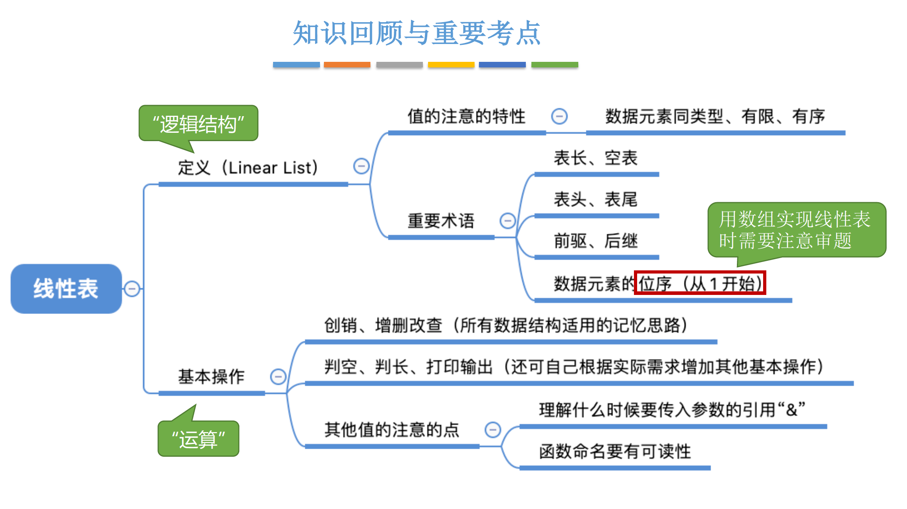
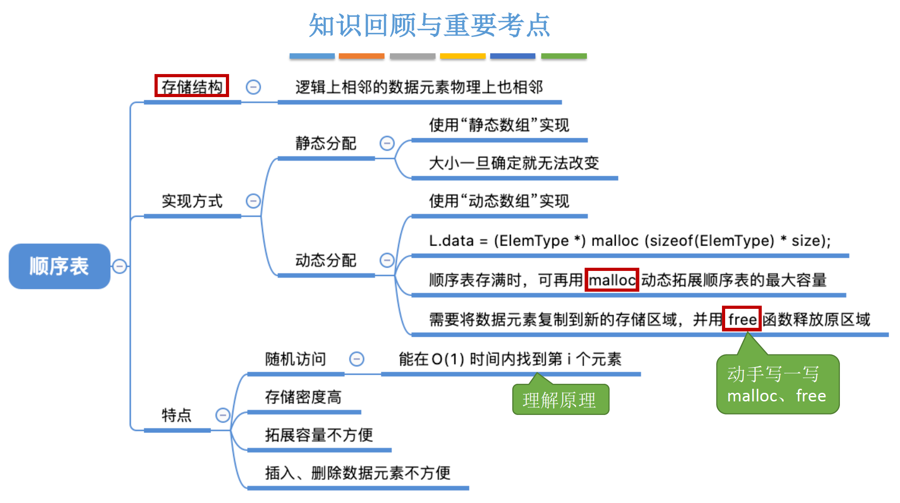
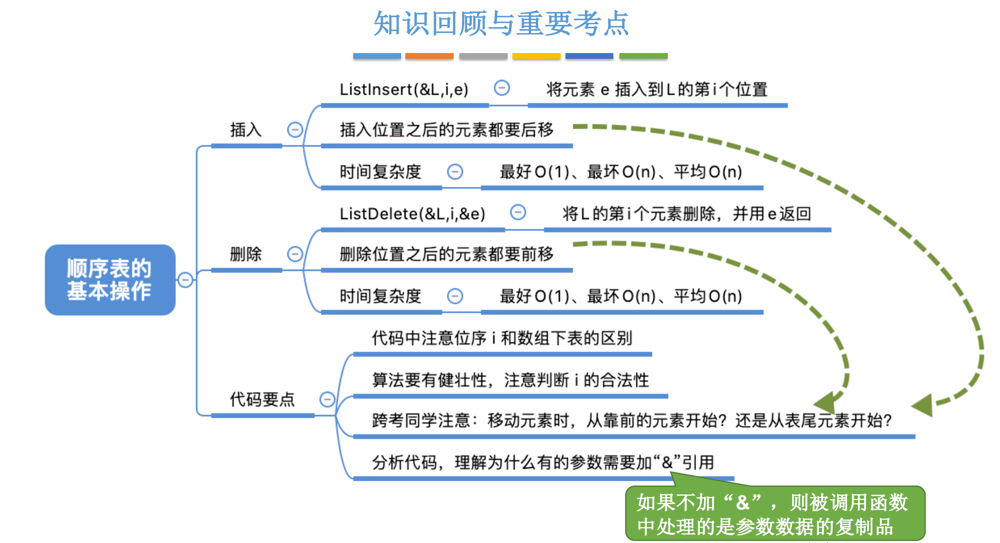

**tips：用JavaScript的class，实现各个算法**

- 顺序表的定义（静态、动态）、插入、删除、..

# 2 线性表

## 2.1 线性表的定义和基本操作

### 定义

线性表：具有相同数据类型的、n个数据元素的有限序列。

- 每个数据元素所占空间一样大。

- 数据元素的数量是有限的。

### 基本操作

- 初始化、销毁。

- 插入、删除。
- 按值查找、按位查找。

- 求表长、输出操作、判空操作

## 2.2 顺序表

### 2.2.1 顺序表的定义

- 顺序表——用顺序存储的方式，实现线性表

#### 顺序表的特点：

- 支持随机访问。可以在 O(1)时间内找到要查找的元素。
- 存储密度高，每个节点只存储数据元素，不需要像链式存储一样，要存储指针。
- 扩展容量不方便。只能采用动态分配方式，重新开辟一块空间，然后把原来的数据复制过去。
- 插入、删除操作不方便。类似扩展容量一样，需要移动大量元素。

### 2.2.2 顺序表的插入、删除

