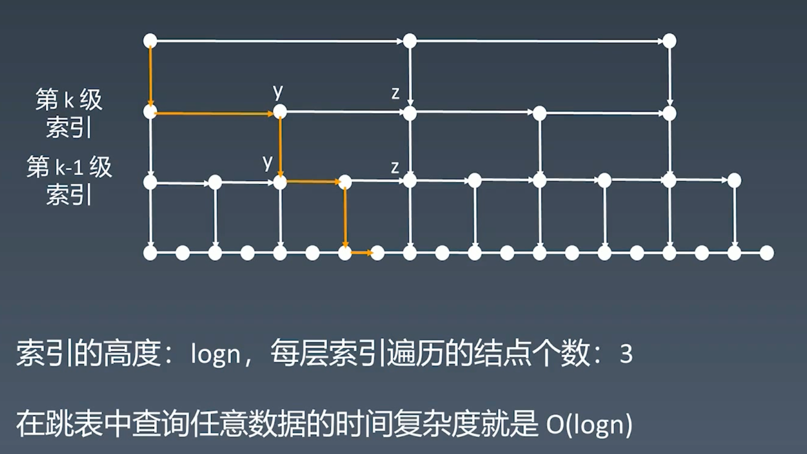

# 3 数组、链表、跳表

|                | Array List | Linked List | Skip List |
| -------------- | ---------- | ----------- | --------- |
| Prepend 头增删 | O(1)       | O(1)        |           |
| Append 尾增删  | O(1)       | O(1)        |           |
| Lookup 查找    | O(1)       | O(n)        | O(log(n)) |
| Insert 插入    | O(n)       | O(1)        |           |
| Delete 删除    | O(n)       | O(1)        |           |
| 空间复杂度     | O(n)       | O(n)        | O(n)      |


## 301 基本实现和特性

### Array List 数组

Java,  C++:  `int a [100];`

Python:  `list = []`

JavaScript: `let x = [1, 2, 3]`

- 每当申请一个数组，内存管理器会开辟一个连续的地址
- 优点：访问任何地址的时间复杂度（常数级 O(1)）是一样的，随机访问很快
- 缺点：插入、删除操作需要拖动较多元素，时间复杂度较高（O(n)）。
  - 扩容：如果数组空间不足，就会扩容new 一个新数组。扩容后的大小：`Math.max(current * 2, minCapacity)`，是当前空间的二倍，或者是当前操作（插入元素后）所需要的内存空间中的更大值。

#### Array 插入元素

O(n) 的时间复杂度，在中间位置插入一个元素，需要把后面的元素全部位移，访问到了后面每一个元素。

#### Array 删除元素

O(n)的时间复杂度，在中间位置插入一个元素，需要把这个元素删除，把后面的元素全部位移，访问到了后面每一个元素。


### Linked List 链表

`class node` 自定义一个node链表类。

- 单链表：后继节点、直接后继
- 双链表：前驱结点和后继结点、直接后继和直接前驱
- 循环链表：末尾的最后一个 Tail指针，指向 Head 开头。


- 优点：频繁的插入、删除操作比数组更优，时间复杂度更低O(1)。

- 缺点：不支持随机访问，访问任意位置需要从头节点一步一步查找，时间复杂度O(n)。

Linked List的最简单实现：

```c++
class LinkedList {
  	Node head;  // head of list
  
  // Linked list Nost
  	class Node {
    		int data;
      	Node next;
      
      	Node(int d) { data = d;}
  	}
}
```

#### Linked List 插入节点

只需要修改插入位置的前驱节点、后继节点即可。时间复杂度是 O(1)。

#### Linked List 删除节点


目标节点的前一个节点中，后继节点替换为下一个节点即可。时间复杂度O(1)。


## Skip List 跳表

Redis中常用。理解工作原理为主，不需要会编写。

跳表的出现，是为了解决链表的 lookup随机访问是 O(n)而诞生的 。

**算法的中心思想：升维。用空间换时间。**

优点：优化了链表查找速度，时间复杂度O(log(n))

缺点：进行插入、删除操作后，需要频繁更新维护跳表。


### 跳表的改进原理：

#### 添加第一级索引

增加一级索引，可以让速度提高一倍，及速度x2


#### 添加第二级索引

增加二级索引，可以让查找速度 x4


#### 以此类推


#### 分析：跳表的时间复杂度

- 原始链表节数树为 n、一级索引节点数为 n/2、二级 n/4、三级 n/8 = n/(2^3)
  -  第 k 级索引的节点数是： n/(2^k)
- 假设索引有 k 级，最高级索引的节点数为 2。 => 2 =  n/(2^k) ，则求得：k = log2(n) - 1
- 建立了以 索引高度 k 和 原始链表节点数 n 的关系。



- 查询时，可以看到在每层索引遍历的节点的个数，一定不会超过2。则时间复杂度的数量级等于索引的数量级，时间复杂度：O(log(n))

#### 现实中的跳表形态


由于有插入、删除节点的问题，所以现实中的跳表形态可能是这样不规则的。所以，跳表在现实中，存在维护不方便的问题。每当对跳表进行插入、删除节点，就需要对跳表进行更新。时间复杂度：O(log(n))

#### 空间复杂度分析


因为这个数列最终收敛，占用空间连 2n 也没超过。空间复杂度的数量级也是 n。

#### 应用

LRU Cache - Linked List 。缓存机制 —— 力扣

Redis - Skip List。


## 302 实战：移动零


## 303 实战：盛水最多的容器、爬楼梯


## 304 实战：3树之和、环形链表


# 4 栈、队列、优先队列、双端队列

